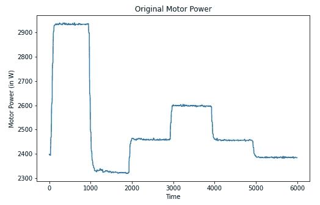
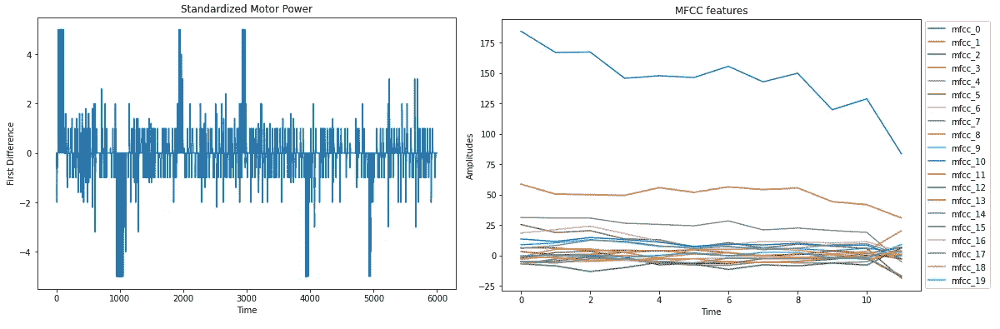
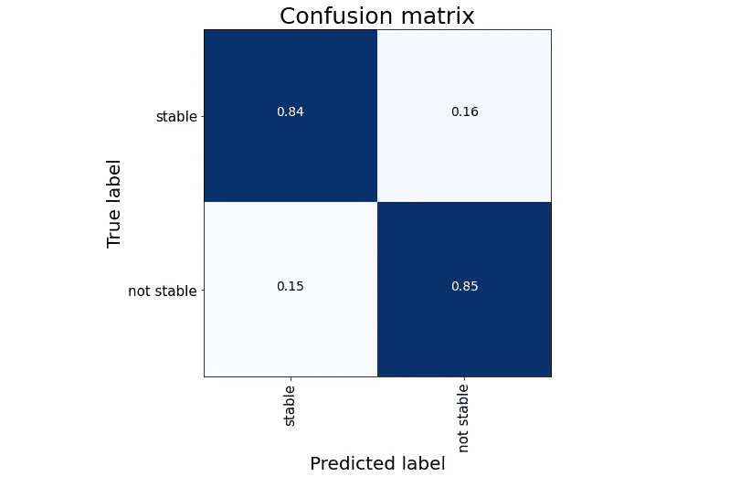

# 使用 ResNet 进行预测性维护

> 原文：<https://towardsdatascience.com/predictive-maintenance-with-resnet-ebb4f4a0be3d?source=collection_archive---------43----------------------->

## 利用深度学习检测高频传感器的故障


在 [Unsplash](https://unsplash.com?utm_source=medium&utm_medium=referral) 上由 [Lasse Nystedt](https://unsplash.com/@lassenystedtfoto?utm_source=medium&utm_medium=referral) 拍摄的照片

迟早，所有的机器都会出故障。确定设备状况或计划何时进行维护，是影响成本和生产率的极具战略性的决策。

机器学习方法已经作为一种有前途的工具出现在预测性维护应用中，以防止生产线中的故障。然而，这些解决方案的性能取决于适当的数据分析和正确分析方法的选择。

在这篇文章中，我们面临着一个类似于以前其他相关文章中的预测性维护任务: [**使用 CNN**](/predictive-maintenance-detect-faults-from-sensors-with-cnn-6c6172613371) 的预测性维护和 [**使用 CRNN**](/predictive-maintenance-detect-faults-from-sensors-with-crnn-and-spectrograms-e1e4f8c2385d) **的预测性维护。**这里的特殊性在于，我们只使用一个**单高频信号源**到产生我们最终的预测。基于 Mel 频率倒谱系数(MFCCs)的特定变换的应用是从信号中提取特征的基础。这一步使我们能够采用一个**残差卷积神经网络**结构，它学习我们数据的正确隐藏结构。

# 数据

我们的任务是研究压力条件下的液压管道。数据由 UCI 资料库收集。在[液压系统状态监控中](https://archive.ics.uci.edu/ml/datasets/Condition+monitoring+of+hydraulic+systems#)跟踪各种系统部件的活动状态。

> 该数据集是用液压试验台通过实验获得的。该试验台由通过油箱连接的一次工作回路和二次冷却过滤回路组成。当四个液压部件(冷却器、阀门、泵和蓄能器)的状态定量变化时，系统周期性地重复恒定负载循环(持续时间 60 秒)并测量过程值，如压力、体积流量和温度。

更准确地说，我们重点监控整个系统的状态(用*稳定标志*标识为*稳定*或*不稳定*)分析电机功率。该 KPI 由单个传感器监控，该传感器以 100 Hz 的采样率记录信号。

我们尝试分类的时间序列切片的形状与下图相似。



使用一阶差分对原始信号进行标准化，并对其进行限幅以限制疯狂值。标准化信号以这种方式用于产生 MFCCs。



MFCCs 通常按如下方式得出:

*   从原始信号的窗口摘录中进行傅立叶变换；
*   将上面获得的光谱功率映射到 mel 标度上；
*   对梅尔对数幂进行离散余弦变换；
*   MFCCs 是最终频谱的幅度。

它们在音频分析中的应用很常见，但我们在这里利用它们处理高频数据的能力。

# 模型

如前所述，我们使用基于卷积的网络来预测液压管道的系统状态。我们使用剩余跳跃连接在卷积块中添加一些 bost。

更深的网络更难优化。向网络中添加额外的层会增加训练过程的难度。我们的优化算法变得更难最小化损失。剩余结构试图通过增加跳跃连接来解决这个问题。跳跃连接增加了从网络中的一个初始点到前向点的映射。如果网络没有更多可以学习的东西，则网络的权重保持不变，否则，如果记录了改进(在损失或度量优化中)，则网络权重随之改变。

下面是一个残余块的例子，我们可以很容易地在我们的网络架构中使用。此外，根据问题需要，层的数量、激活函数或内核大小的不同变化是可能的。使用这种块时，唯一必须保持不变的是它内部的维度。在我们的例子中，我们注意在卷积运算中操作填充，并使初始维度等于最后的卷积层，以操作最终的连接。

```
def residual_block(init, hidden_dim):

    init = Conv1D(hidden_dim, 3, 
                  activation=’relu’, padding=”same”)(init)

    x = Conv1D(hidden_dim, 3, 
               activation=’relu’, padding=”same”)(init)
    x = Conv1D(hidden_dim, 3, 
               activation=’relu’, padding=”same”)(x)
    x = Conv1D(hidden_dim, 3, 
               activation=’relu’, padding=”same”)(x)

    skip = Add()([x, init])

    return skip
```

我们将我们的方法与虚拟基线进行比较，虚拟基线包括将我们的测试样本分类为测试数据中的大多数类别(*稳定条件*)。我们的网络在看不见的测试数据上达到了 87%的准确率。这是一个很好的结果，相对于我们的基线(66%的准确率)是一个很大的进步。



# 摘要

在本文中，我们执行了一项预测性维护任务。更详细地说，我们预测了仅考虑电机功率的液压试验台的一般情况。所考虑的信号具有高频率的特征，这使得不可避免地对我们的数据进行一些初步处理。我们通过基于 MFCC 的特征提取过程创造了有价值的信息。生成的新信号被用于输入基于剩余连接的深度学习模型，以产生最终预测。

**如果你对题目感兴趣，我建议:**

*   [**预测性维护:用 CNN**T5 检测传感器故障](/predictive-maintenance-detect-faultsfrom-sensors-with-cnn-6c6172613371)
*   [**预测性维护与 LSTM 暹罗网络**](/predictive-maintenance-with-lstm-siamese-network-51ee7df29767)
*   [**预测维护:用 CRNN 和频谱图检测传感器故障**](/predictive-maintenance-detect-faults-from-sensors-with-crnn-and-spectrograms-e1e4f8c2385d)

[**查看我的 GITHUB 回购**](https://github.com/cerlymarco/MEDIUM_NoteBook)

保持联系: [Linkedin](https://www.linkedin.com/in/marco-cerliani-b0bba714b/)