# 预测建模者为初学者选择最佳回归模型指南

> 原文：<https://towardsdatascience.com/predictive-modellers-guide-to-choosing-the-best-fit-regression-model-707120e502b4?source=collection_archive---------7----------------------->

## 如何选择最适合的回归模型

在寻找预测的最佳拟合模型时，**找到正确的算法一直被证明是整个项目成败的关键。**对于像我和其他机器学习专家一样的机器学习新手来说，找到最适合的模型可能非常令人困惑，这通常不仅是因为低水平的编码能力，而且主要是因为对概念的理解和应用较差，并且容易陷入错误的度量标准。

在这篇文章中，我将通过*的 3 个主要步骤*来一步步介绍构建最佳拟合模型的概念和指南，以解决任何回归问题。假设您至少知道这些模型的概念，所以我将更多地关注它们的应用。我们将比较以下机器学习算法的性能:

*线性回归*

*K-最近邻(KNN)回归变量*

*决策树回归器*

*随机森林回归器*

*Adaboost 回归器*

*XGBoost 回归器，和*

*支持向量机(SVM)回归器*

**指标**:首先，让我们从指标开始，因为选择用来评估模型的指标非常重要。R 平方(R)、调整后的 R 平方(Adj R)、均方误差(MSE)和均方根误差(RMSE)是回归变量非常流行的度量标准。

r 回归得分或决定因素系数是一种直观的统计尺度，用于测量回归模型中由自变量解释的因变量的变化比例。无论输入要素如何，总是预测 y 的期望值的常数模型将获得 0 的 R 值，而完美拟合模型的 R 值为 1.0。对于表现任意差的模型，r 值可以是负的。通常，R 是模型的相对拟合的度量。然而，这一指标有一个值得注意的缺陷，因为 R 分数往往总是随着附加功能的增加而增加，而不一定会提高模型的拟合度。为了克服这个缺点，另一个度量标准，调整后的 R，被解释为由所有独立变量组成的模型所解释的总方差的比例，是优选的。调整后的 R 考虑了自由度。当向模型中添加更多的特征提高了模型的拟合度时，它会增加，否则会减少。

**均方误差(MSE)** 是回归线与一组点的接近程度的度量。它测量从点到**回归线**的距离，称为误差或残差方差，并对其求平方，以消除任何负号。**均方根误差(RMSE)** 取 MSE 的平方根，表示模型与数据的绝对拟合度——观察数据点与模型预测值的接近程度。RMSE 相对更容易解释，因为它与响应变量是同一个单位。较低的 RMSE 值意味着回归线接近数据点，表明拟合较好。RMSE 可以很好地衡量模型预测响应的准确程度，如果模型的主要目的是预测，则它是最重要的拟合标准。

建立了基本的概念之后，让我们开始动手实践吧。我选择了隐藏警告，以避免它们出现在输出中，使输出变得混乱。隐藏所有警告时要注意的是，您必须确保代码没有错误。

为了让代码看起来更专业，我发现在一个地方导入所有需要的库是一个不错的开始。

1.**设置目录并导入相关库**

**导入数据，探索，预处理，为建模做准备**。

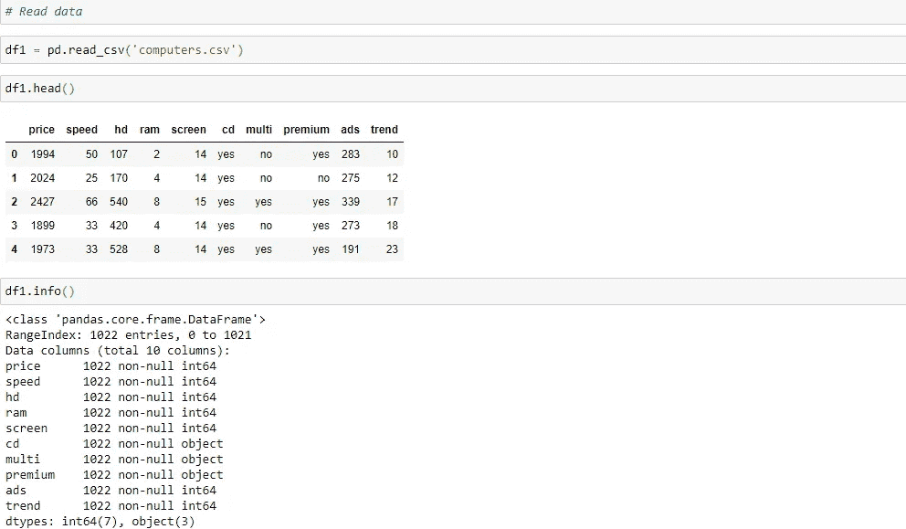

**2。探索和准备数据**

浏览数据以了解其维度、数据类型、基本统计数据等。根据数据集的不同，可能需要处理分类变量和缺失值。在本例中，如上所示，没有空值，但是我必须对 *cd、multi* 和 *ads* 中的分类值进行编码。

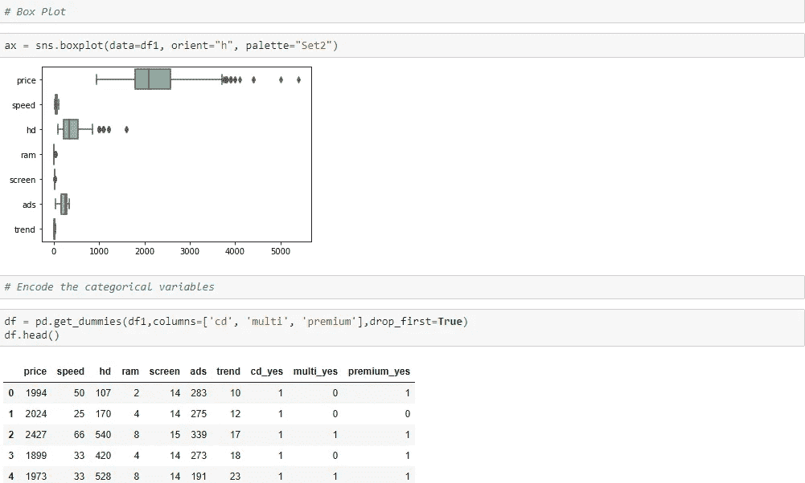

另一件需要检查的重要事情是异常值。准备带有异常值的数据集进行建模的方式与准备不带异常值的数据集的方式不同，您将在后面的缩放中看到这一点。在这里，你可以看到上图中*价格*和*高清*的异常值。虽然价格异常值不是问题，因为它是目标特征，但在这种情况下，像 *hd* 、这样的预测值中异常值的存在会影响模型的性能。检测异常值并选择适当的缩放方法来最小化它们的影响最终会提高性能。你可以在我的 Github 库[这里](https://github.com/frex1/Regression-Model)找到完整的代码和数据集。

因为我们在处理回归问题，所以了解预测值和目标变量之间的相关性是很重要的。这可以通过使用如下所示的关联热图和矩阵来实现。

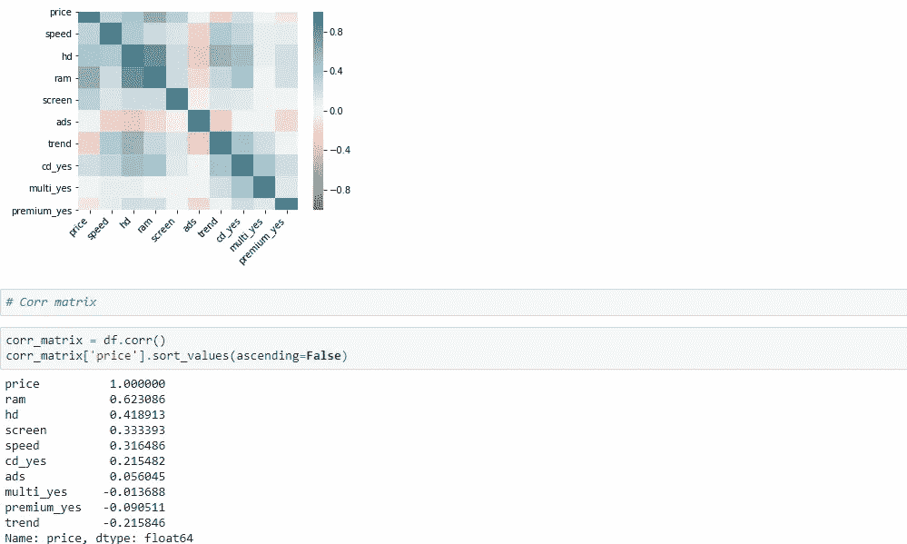

从相关矩阵中，我们可以看到自变量与目标的相关程度不同。较低的相关性意味着弱的线性关系，但是可能存在强的非线性关系，因此，我们不能在这个水平上通过任何判断，让算法为我们工作。

谈到缩放，sklearn 中有各种各样的缩放器，包括 MinMaxScaler、StandardScaler、RobustScaler、minmax_scale、MaxAbsScaler、Normalizer、QuantileTransformer 和 PowerTransformer。我对比了一下本文常用的，找到最合适的。可以随意添加，也可以根据自己的要求选择。下面的程序在缩放和三个选择的类型之前可视化。

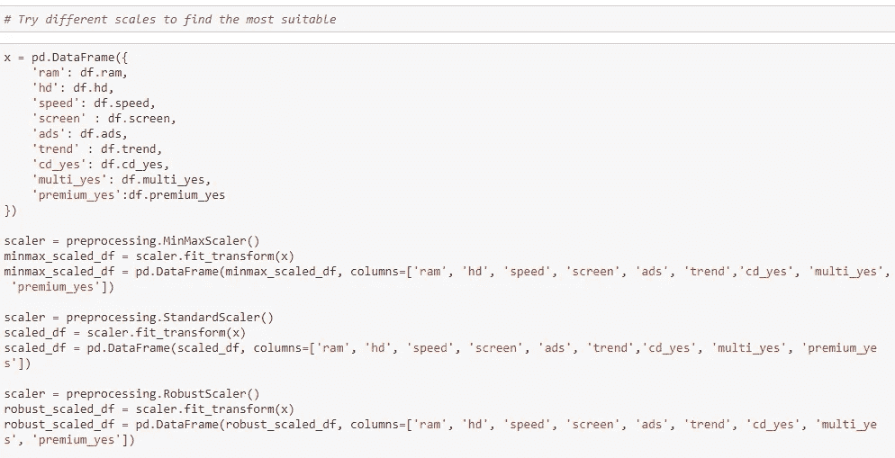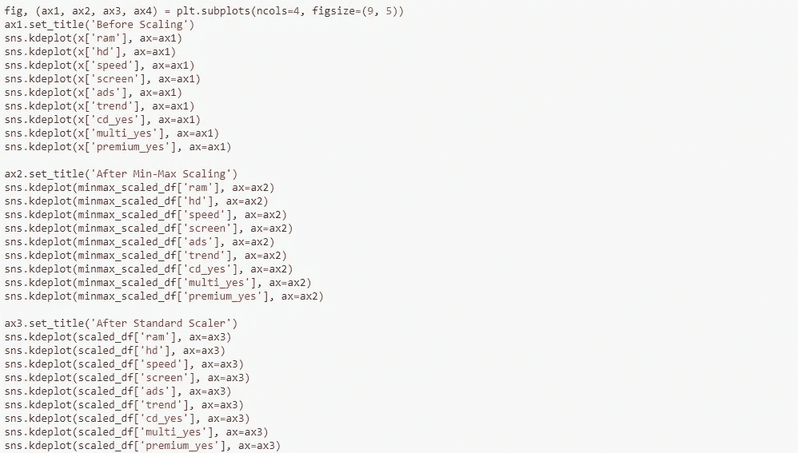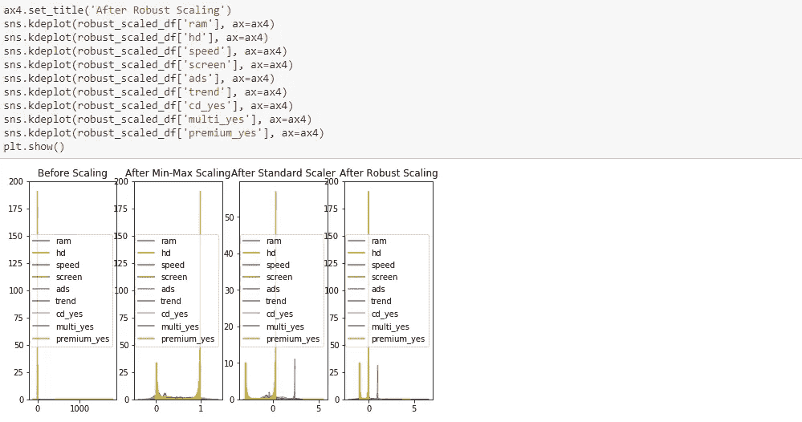

正如你从上面的第二张图中看到的，它重新缩放了范围[0，1]中的所有特征值。然而，它对异常值的存在非常敏感。

StandardScaler:此缩放器忽略平均值，并将数据缩放到单位方差。然而，异常值会影响均值和标准差。因此，像 MinMax scaler 这样的 StandardScaler 在存在异常值的情况下不能保证平衡的特征比例。

RobustScaler:与前两个不同，RobustScaler 基于百分位数，因此不容易受到离群值的影响。

PowerTransformer:对每个要素应用幂变换，使数据更像高斯分布。

MaxAbScaler:类似于 MinMaxScaler，但用于只有正值的数据，也存在大的异常值。

QuantileTransformer:匹配高斯分布而不是均匀分布，并为极值引入饱和伪影。

最终的选择取决于数据集的领域知识或试错法。从上图可以看出，只有 RobustScaler 返回了一个很好的分布，其异常值超出了分布的大部分，因此，它是实现最佳性能所需的显而易见的选择。

3.**训练模型并进行预测**

现在让我们分割数据集并导入适当的建模库。

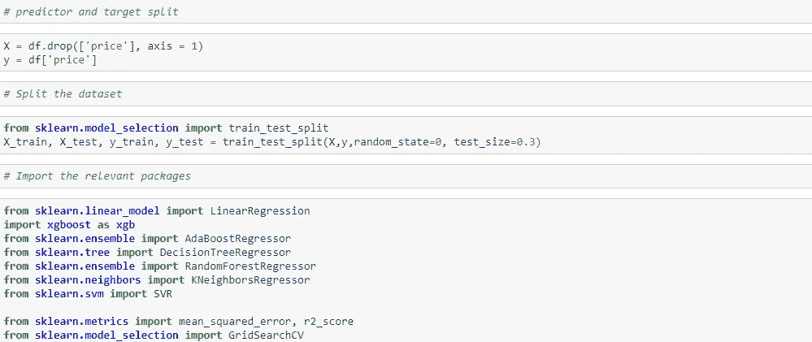

在构建模型之前，我希望每个模型都发挥出最佳性能，因此为线性回归选择特征并调整 XGBoost、AdaBoost、决策树、随机森林、KNN 和 SVM 的超参数以找到模型中使用的最佳参数非常重要。

**线性回归**:当建立一个线性回归模型时，没有必要包含那些对目标变量的变化没有合理贡献的不必要的特征。使用向后排除法，您可以取消选择 p_values >为 0.05 的要素，这被解释为无法解释目标的变化，而非偶然变化。以下代码仅返回 p_values <为 0.05 的选定要素。

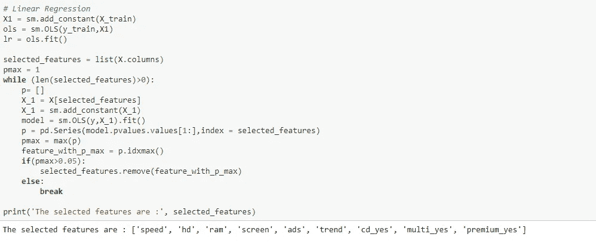

查看所选要素的 p 值:

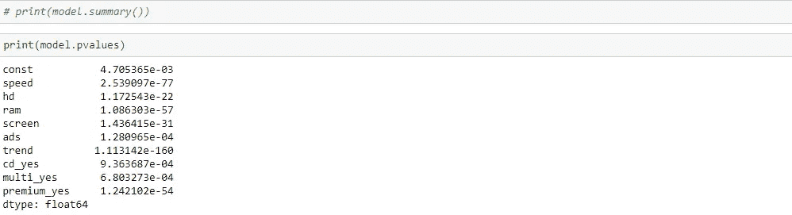

调整超参数是优化超参数模型性能的一个关键方法，如下所示。

**XGBoost:** 这里要调优的常用超参数包括:学习率、最大深度和 n 估计量。

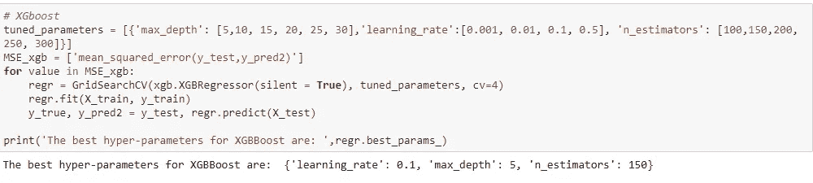

**AdaBoost:** 学习率和 n 估计量

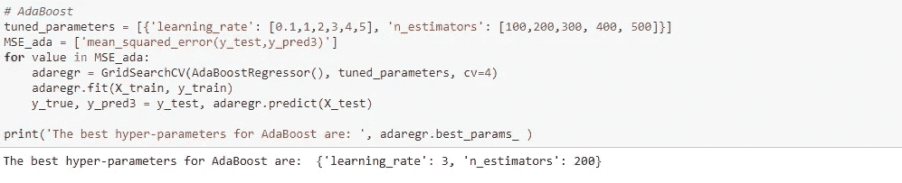

**决策树:** max_depth

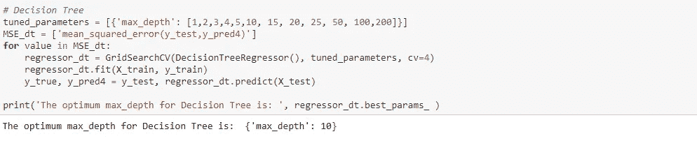

**随机森林:**最大深度和 n 估计量

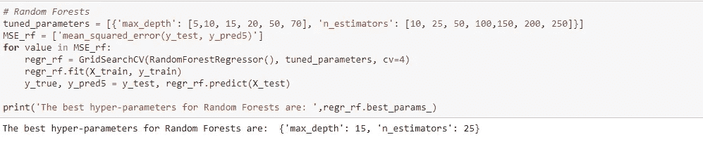

**KNN:** 当我们的要素具有不同尺度的值时，将它们标准化到相同的范围非常重要，这样无论值的单位是什么，算法都不会对较大值、较高值进行加权，并将较小值视为较低值。这对于 KNN 等基于距离的算法至关重要。我们之前发现 RobustScaler 是最适合该数据集的缩放器，因此我们将在这里使用它进行缩放。

这里要调优的常见超参数是 n_neighbors 和 p。

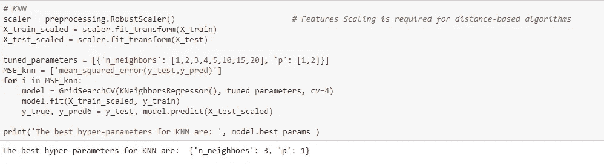

**SVM:** 同样，规模化对 SVM 来说也很重要。这里要调整的超参数是 gamma、C 和 kernel。

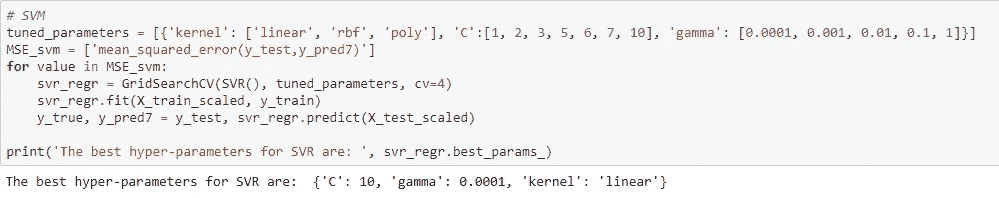

选择了最佳特性并调整了超参数后，就该使用这些参数构建优化模型了。这可确保每个模型在数据集上发挥最佳性能。下面是我们发现的值的使用演示。

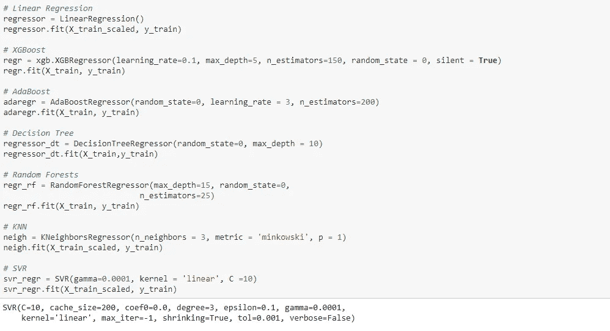

现在我们来预测一下

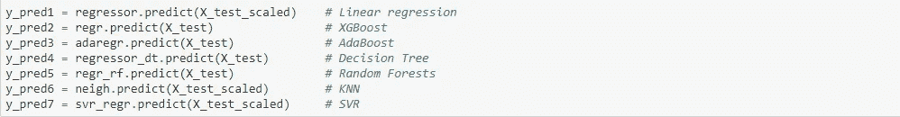

肮脏的工作做完了，现在让我们看看结果。

*R 分数:*

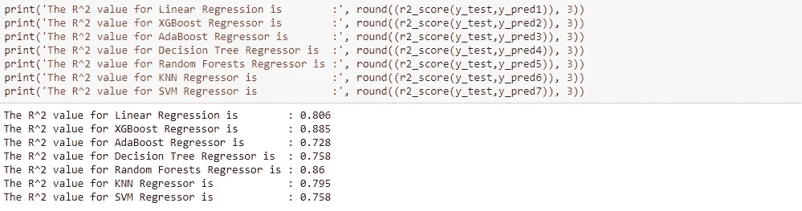

*调整后的 R*

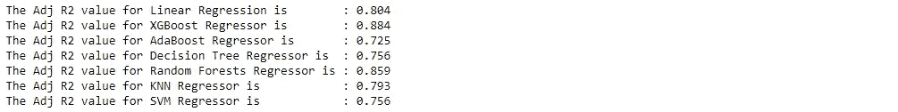

*RMSE 值:*

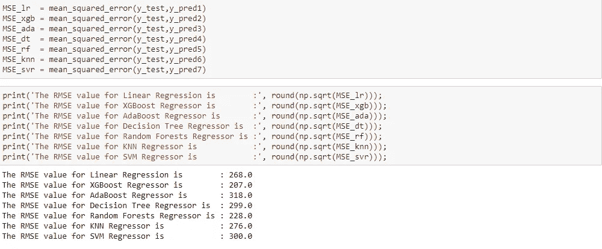

正如预期的那样，调整后的 R 分数略低于每个模型的 R 分数，如果我们基于此指标进行评估，最佳拟合模型将是调整后 R 分数最高的 XGBoost，最差模型将是 R 分数最低的 AdaBoost。但是，请记住，这一指标只是对健康的相对测量，因此我们必须查看 RMSE 值。在这种情况下，XGBoost 和 AdaBoost 分别具有最低和最高的 RMSE 值，其余模型的顺序与其调整后的 R 值完全相同。这进一步证实了该数据集的最佳拟合模型是 XGBoost，最差拟合模型是 AdaBoost。注意，这并不总是发生，所以要小心。一般来说，当你有一个模型与最高调整的 R 和高 RMSE，你会更好地与一个有适度调整的 R 和低 RMSE，因为后者是绝对适合的措施。

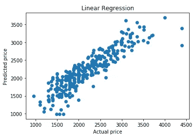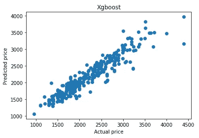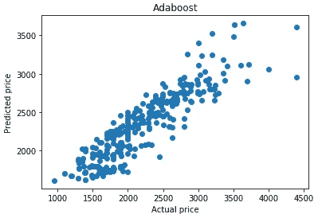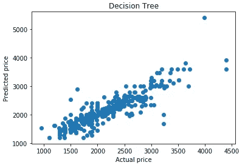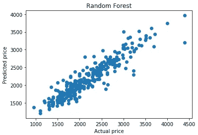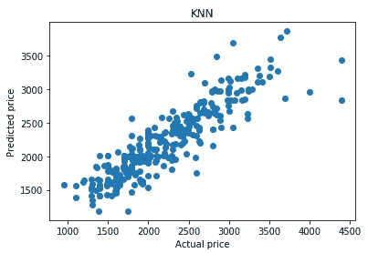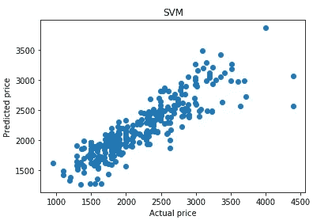

查看预测价格与实际价格的曲线图，还可以看到 XGBoost 中的数据点彼此更接近，而 AdaBoost 中的数据点则相距更远。

感谢您的来访，我希望您喜欢这篇文章，并发现它很有帮助。你可以在 GitHub [这里](https://github.com/frex1/Regression-Model)找到完整的代码和数据集。

Linkedin 简介:https://www.linkedin.com/in/freemangoja