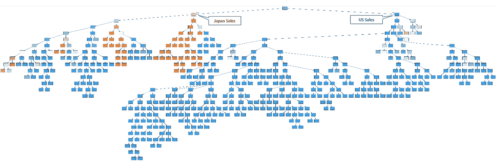

# 预测分析与解释分析

> 原文：<https://towardsdatascience.com/predictive-vs-interpretative-analytics-9f2d85ac1106?source=collection_archive---------32----------------------->

## 蝴蝶效应和如何成为百万富翁

您是否注意到如今“分析”一词经常与“预测”一词联系在一起？“预测分析”已经成为 IT 界的热门词汇。

事实上，“预测”这个词似乎比“解释”更有吸引力，因为对我们这些懒惰的人来说，我们认为工作会更少。“解释性的”或“解释性的”(不是“不言自明的”)意味着你仍然需要理解，而“预测性的”意味着你只是知道会发生什么。人类总是着迷于预测未来的概念，就像童话中的水晶球一样。

诚然，预测可能会告诉你将会发生什么，但不知道为什么会发生。在某些情况下，你可能还是要理解这一点。

由 [Ayanna Johnson](https://unsplash.com/@bigjumper429?utm_source=unsplash&utm_medium=referral&utm_content=creditCopyText) 在 [Unsplash](https://unsplash.com/s/photos/glass-ball?utm_source=unsplash&utm_medium=referral&utm_content=creditCopyText) 上拍摄的照片

# 只有当一个人不能轻易做出预测，或者当结果不能轻易改变时，预测才有用。

一个很好的例子就是天气，你自己无法预测，也无法改变。对于预测性人工智能(AI)来说也是一样，它通常会被设计成告诉你将会-可能-发生什么，但不会告诉你为什么会发生。这就是“黑箱”效应或“可解释性问题”。

那么，你什么时候还需要这种预测人工智能呢？其实只有两种情况:

*   **当人工智能在预测方面比你更好——或更快——时**，这并不容易，因为人类一直在做这种事，而且是惊人的预测机器。请记住，你可以在一眨眼的时间内，通过闻到附近的空气，以惊人的准确度预测出某种食物会让你生病(但你也缺乏内置的大气压力传感器，无法准确预测天气)。
*   **当你无法改变结果**时，因而你无论如何也不需要理解。你可能需要知道是否会下雨，但你不需要了解天气是如何工作的，除非你非常好奇，或者你想成为一名气象学家。

# 如果你能理解和改变结果，你应该关联和理解，而不是预测。

我们来问这个问题:你会成为百万富翁吗？你是希望得到一个预测，一个简单的“是”、“否”，甚至是基于历史数据的“何时”，还是希望得到一个详细的解释，说明你所做的事情有什么帮助，什么没有帮助？

这就是蝴蝶效应的切入点。作为一个人，你无时无刻不在做决定，其中很多决定将会对你的未来产生影响。有些决定可能看起来无关紧要，但仍然会产生巨大的影响，例如，你是否会遇到你一生的挚爱。

因此，假设你是一个聪明的人，一个努力工作的人，你有一个关于你应该做什么才能成功的好主意，然后你得到一个预测(例如，从一个水晶球)，你肯定会在大约三年内成为一个百万富翁。然后，你开始变懒，并决定你更喜欢诗歌而不是大数据，因为你将成为百万富翁，你认为这没问题。

嗯，那个关于你会成为百万富翁的预言现在已经应验了。因为这是现实世界，不是童话，你的诗也没那么好。

如果你稍微想一想，你会发现你最好了解如何成为百万富翁，而不是仅仅得到一个你是否会成功的预测。因为你所做的所有决定都会对结果产生影响，因此你在得到预测后所做的任何事情都会使预测出错，比如，决定成为一个懒惰的诗人。你需要理解“如何”和“为什么”。

让我们再举一个例子，这次你是公元 136 年左右的一个暴躁的 60 岁的罗马皇帝。你已经病得很重了，经常流鼻血和水肿，预言(古罗马没有水晶球)说你会在 62 岁时死于心脏病发作。在这种情况下，在这些时候，清楚地了解人们为什么会心脏病发作，从而有助于防止他们，可能会比预言家的预测容易得多。顺便说一下，这是一个有趣的故事(除了占卜者，那是我)，尝试谷歌一下。

现在，当你从一家公司的角度看问题时:首席执行官更喜欢对下一年财务收入的预测，还是清楚地了解过去几年导致收入增加或减少的原因？

公司可以获得大量数据(内生的或外生的)，这些数据可以与收入的增加或减少相关联。一旦你明白了这些相关性，你就可以开始寻找因果联系和根本原因，然后进行改进。那么在预测收益之前，我们是不是应该先试着了解如何增加收益呢？

# 数据是我们信息系统内部真实世界的“反映”,但是它可能有很多，而且不是不言自明的。

财务收入或任何其他与其直接相关的指标通常是一个结果(抱歉),会受到公司每个人(从一线员工到首席执行官)做出的运营或战略决策的影响。

因此，在我们将所有资金和精力投入预测分析之前，我们应该利用先进的分析技术和技能来帮助我们发现模式、相关性和因果联系，以便更快、更好地理解为什么我们会得到这种特定的结果，以及我们如何采取行动来改变它，使之对我们有利。如果数据可用，**人工智能、现代分析和数据科学可以通过帮助解释事物的“为什么”、为什么有些事情可行以及为什么其他事情不可行来提供巨大的商业价值**。**我说的是** **人工智能，旨在解释或帮助解释事物**，而不是“可解释的预测性人工智能”，它会做出预测，并解释如何或为什么。

我们举个实际的例子:销售。销售转化为作为“对象”的数据，这个“数据对象”(可能是数据库中的一行或一组行)具有属性(可能是数据库中的列)，例如:

*   国家
*   城市
*   积范畴
*   产品
*   量
*   客户类别
*   日期
*   等等。

销售的所有这些业务“属性”通常都可以在信息系统的数据中获得，可能有数百万行销售数据。

你可以开始手动分析，使用传统的商业智能工具(或 Excel…)，你可能会发现在美国的销售情况很好，而在日本却很差。但这并不能告诉你太多。所以，你继续分析，你可能会发现在日本某个产品类别的销售非常糟糕。您继续分析，您可能会发现特定产品类别中的一些产品表现不如其他产品，其中一些产品总体表现不佳，而在一些客户类别中表现良好，在其他一些客户类别中表现不佳。这个过程会一直持续下去，直到你有一个完整的“场景”来调查，然后你会开始寻找要解决的根本原因。

现在想象一下，你给我原始数据，我给你最有影响的属性列表+最糟糕的场景列表(属性的组合)，以及它们相对于结果的“权重”(糟糕的销售)。

其中一个场景可能是这样的:

> *【国家 02】；[产品类别 A]；【产品 A08】；[客户类别 X]；【2019 年】；[Q1 时期]；【等。] =* ***5%的不良销售***

现在，您可以开始分析不是一次一个属性，而是完整的场景，并清楚地知道从哪里开始。你马上就会知道，在某个特定时期，该产品在某个特定城市的客户类别中销售不佳，这占了“不良销售”的 5%。因此，您可以从现在开始，调查根本原因，进行补救和改进。

您有一个可以研究的场景的完整列表，它们都是相关的，值得研究，因为它们是由算法基于特定标准(通过属性影响和场景相对于结果的权重)选择的。它可以是一个列表，或者看起来像这样，不好的场景用橙色表示，好的用蓝色表示:

有了这种可视化，您可以立即看到日本销售存在问题，并且可以深入每个分支机构，通过分析详细的场景来了解原因。

现在，您可以要求数据和分析团队设计一个算法来预测明年的销售额。这种算法可能会告诉你，日本的销售仍然会很糟糕，这不会帮助你理解为什么以及如何补救。

# 我们现在需要对每个关键绩效指标进行解释性分析。

我并不是说预测分析毫无用处，但对于许多公司来说，这种“解释性”或“解释性”分析比预测分析要多得多。这里没有深度学习或超级复杂的东西，只有统计数据，没有那么简单，但也不是科幻小说。

我们监控许多指标，对于这些指标，清楚地了解什么导致好的或坏的结果将比简单地预测结果带来更多的商业价值。因为当你清楚地了解不同的变量及其对结果的影响时，你就可以对这些变量采取行动，以优化和改善结果。

**总之，在投资新的预测算法之前，先问这两个问题:**

*   **如果你有时间，你能自己做这个预测吗？**
*   你能采取纠正措施使预测出错吗？

如果两个答案都是“是”，那么重新考虑，把注意力放在理解而不是预测上。这样你不仅能适应，还能提高。

通常，如果你曾经因为一种预测算法而感到沮丧，这种算法无助于解释为什么一个特定的结果被预测，那可能是因为你需要理解，而不是预测。

感谢您的阅读，请让我知道您的想法，并毫不犹豫地分享。