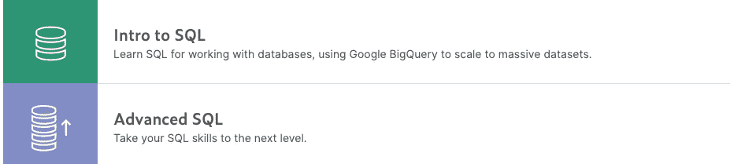

# 数据科学面试准备指南

> 原文：<https://towardsdatascience.com/preparation-guide-for-data-science-interviews-69932d30c7c4?source=collection_archive---------4----------------------->

## 为合适的工作从合适的资源中获得合适的技能

这是前所未有的时代，我们中的许多人都在寻找转换或找到工作。面试准备成了焦点。面试对每个人来说都很重要。

不确定性、随机性和人为错误让面试变得非常可怕。肾上腺素在你的血管里涌动，你正处于把一切都搞砸的边缘。

做好准备是在面试中减少损失的唯一办法。**正如本杰明·富兰克林所说:**

> 没有做好准备，你就是在为失败做准备。

我上周的一篇帖子是关于[建立有效的数据科学投资组合](/how-to-build-an-effective-data-science-portfolio-56d19b885aa8?source=---------3------------------)的，在那里我分享了一个全面可行的建立投资组合的指南。

一个好的投资组合在大多数时候会帮助你接到第一个电话，如果你真的了解自己的事情，你差不多有 90%的把握。剩下的 10%是由本文第一行提到的三种特质所占。

因此，这篇文章旨在为您提供可行的技巧和资源，为您的下一次数据科学面试做好准备。

# 为自己确定合适的角色！

数据科学也是一个非常多样化的领域。在你开始建立投资组合之前，你需要做的第一件事就是确定哪一部分技能与你的专长/兴趣相匹配。

为了帮助您，这里列出了当今数据科学中四种常见的角色类型，

1.  **数据分析师—** 在这四种角色中，大多数人都是数据分析师。常见任务包括从 SQL/NoSQL 数据库和其他存储库中提取数据，执行[探索性数据分析](/hitchhikers-guide-to-exploratory-data-analysis-6e8d896d3f7e?source=---------27------------------)，分析 A/B 测试结果，处理谷歌分析，或掌握工具 Excel、Tableau。

研究一份好的分析师职位描述会告诉你需要掌握和准备什么，这里有一个例子:

**2。数据工程师—** 这些人专门为经历大量流量的数据驱动型公司设计和开发数据基础设施。常见任务本质上是核心技术，如设计数据模型、管理 SQL 和 NoSQL 数据库、使用 Hadoop、Spark、Airflow 等构建数据处理系统。

**3。ML/AI 工程师—** 像这样的职位更加注重研究，需要你了解机器/深度学习算法的来龙去脉。常见的任务包括设计、开发、部署 ML 模型/基础设施，构建支持大型应用程序的库和框架。

**4。数据科学家(全栈)——**没有“全栈数据科学家”的头衔，但每家数据支持公司(尤其是初创公司和中型公司)都梦想拥有他们。他们几乎涵盖了上述角色中提到的所有技能，并在解决复杂的技术和算法问题方面拥有丰富的经验。一个不断学习和使用机器/深度学习的数据分析师会在 3-4 年内称自己为数据科学家。

**注:**了解公司的需求因为有时候光有技能是不够的，还有几个因素，比如某个特定部门的特定需求、领域专长、解决某类特定问题的经验等等。

# 面试准备课程

一旦你发现哪个角色适合你的兴趣，接下来的工作就是做一个作品集，如果你已经准备好了，你就应该开始准备面试了。

我将课程分为两类:

1.  **一般话题(技能)**——每个有志之士都应该努力掌握和练习这些技能的资源。
2.  **特定角色主题** —针对上述特定角色的强制性主题以及掌握这些主题的资源。

# 一般主题

你必须具备的四项主要技能如下:

## 1.编程；编排

每个职位描述都在他们的资格标准中提到良好的编程技能，因为没有一个数据科学工作是完整的，除非你能够操作数据。几乎每个技术面试都是从一个需要解决的编程问题开始的。

你可以选择任何你觉得舒服的编程语言。在[数据科学中两种广泛使用的语言是 Python 和 R](https://medium.com/@harshit_tyagi/and-the-best-programming-language-for-data-science-goes-to-f80b9a5b439c?source=---------7------------------) 。我推荐你学习 Python，因为它的多功能性。

**练习编程的资源:**

*   **leet code—****掌握编程技巧的最佳去处。庞大的社区，每个话题都有好的问题，大公司面试时常见的问题。**

****

*   **[**Hackerran**](https://www.hackerrank.com/)**k、**[**code forces**](http://codeforces.com/)**、** [**编码忍者**](https://www.codingninjas.com/courses/online-python-course) 也是你可以一头扎进去的顶级平台之一。**
*   **如果你是一个完全的初学者并且想学习 Python，从这里开始[https://www.learnpython.org/](https://www.learnpython.org/)。**
*   **你也可以使用我的 YouTube 播放列表上的[编程基础](https://www.youtube.com/playlist?list=PLIkXejH7XPT_y00hj-mB-zTzePsMu2gRb)或者我的博客上的[数据科学 Python 基础](/python-fundamentals-for-data-science-6c7f9901e1c8?source=---------12------------------)开始学习 Python(针对初学者)。**

** [## 数据科学的 Python 基础

### 数据科学入门基础 python 编程精要。

towardsdatascience.com](/python-fundamentals-for-data-science-6c7f9901e1c8) 

## 2.概率与统计

统计学在数据科学家的职业生涯中起着至关重要的作用。没有多少数据科学家和分析师接受过正式的统计培训，你应该从数据科学的角度切入主题。为探索性分析、抽样、实验设计等奠定基础。即使你正在使用 Excel 或 Tableau，理解基础统计学也是非常重要的。

**资源刷量统计:**

*   实用统计学书籍**——**这将从数据科学的角度教你统计学。你应该至少读这本书的前三章。

*   [**统计与概率|可汗学院**](https://www.khanacademy.org/math/statistics-probability)**——**本课程将为你在面试中所有统计与概率相关的问题做好充分的准备。一个免费的课程，有很好的视频讲座和练习题的汇编。

*   [**赤裸裸的统计—**](https://wwnorton.com/books/Naked-Statistics/) 对于惧怕数学、更喜欢理解实际例子的人来说，这是一本令人惊叹的书，解释了统计学如何在现实生活场景中应用。

## **3。使用 SQL/NoSQL/熊猫的数据争论**

从关系或非关系数据库中提取数据是每个分析师都需要知道的事情。一些分析师的工作描述明确要求编写复杂的 SQL 查询来收集数据的专业知识。

然后，一个人应该精通 Python 包，如 pandas、NumPy、scipy、statsmodel，以便能够处理数据集。

**使用 Python 提高数据分析技能的资源:**

*   **Kaggle Learn —** 你应该看看 [Kaggle 的系列课程](https://www.kaggle.com/learn/overview)，这里涵盖了 SQL、熊猫、数据可视化等等。

*   **Data camp Data Analyst Python Track—**该课程还将帮助您快速掌握作为分析师所需的技能，尤其是在数据操作和可视化方面。他们针对上述每一种工具提供交互式动手练习。

*   [**使用 Python 进行数据分析**](https://www.coursera.org/learn/data-analysis-with-python) **—** 本课程涵盖了数据分析师的所有重要技能。
*   [**练习题—**](https://www.springboard.com/blog/data-analyst-interview-questions-answers/) 一旦你有了很好的理解，通读几个博客和职业网站上的例题比如[跳板](https://www.springboard.com/blog/data-analyst-interview-questions-answers/)。(如果你想让我准备一份问题清单，请回复这个帖子)

## **4。机器学习算法**

一些初级角色可能不需要这样做，但如果你能展示你对开发 ML 模型的理解，这将是一个很好的例子。我建议每个人都熟悉基础知识，包括 ML 问题的类型，线性回归，决策树，逻辑回归，以及如何使用数据训练和测试它们。

**学习和实践机器学习的资源**

*   [**用 Scikit-Learn、Keras 和 Tensorflow 进行机器实践学习，第二版**](https://learning.oreilly.com/library/view/hands-on-machine-learning/9781492032632/)

对于初学者来说，这将是理解机器学习的圣经。这是任何想尝试 ML 的人的必读之作。这本书涵盖了所有的基本算法以及数学解释和实践问题。

这本书的第二部分深入研究了深度学习，这是 ML/AI 工程师应该彻底了解的东西。

*   [**百页机器学习书**](http://themlbook.com/wiki/doku.php)

这本书会让你跟上机器学习的速度。安德烈写得很好的一本书，他试图将基本算法、构建模块和问题浓缩到这本书里。

*   [**机器学习教程由安德鲁 N**T3**G**](https://www.coursera.org/learn/machine-learning)

谈到机器学习，没有 Andrew NG 关于 ML 的课程，推荐是不完整的。理解 ML 和统计模式识别的必看。它涵盖了监督/非监督学习以及最佳实践。它还涵盖了许多应用 ML 解决现实世界问题的案例研究和应用。** 

# ****角色特定主题****

**除了预演你的项目陈述，你应该复习将在技术面试和课后作业中测试的主题。这些都是特定角色的话题，取决于工作要求，所以研究工作描述是非常重要的。**

## **1.数据分析师:**

**作为一名合格的数据分析师，您应该重点准备以下主题:**

*   **数据清理/争论—转换数据并从中获得洞察力。**
*   **统计学基础——概率、统计和线性代数的基础。**
*   **Python/SQL 复习工具**
*   **[谷歌分析](https://analytics.google.com/analytics/academy/)(基于职位描述)**
*   **Excel 和 Tableau 为那些对商业智能分析师和市场分析师感兴趣的人提供复习资料**

## **2.数据工程师**

**你们更注重技术，不需要太多的数学和统计数据。牢固掌握编程并理解数据管理工具是至关重要的。这些工程师是数据科学的开发人员。**

*   **胜任的编程/开发技能，web 框架、REST APIs 等知识。**
*   **大数据工具— spark、Hadoop、airflow(DevOps)。学习开发分布式系统。**
*   **开发 ETL 管道。**
*   **云服务提供商(Google Cloud 或基于 JD 的 AWS)**

## **3.ML/AI 工程师**

**人工智能工程师应该对最大似然算法有深刻的理解，他们应该知道驱动那些算法到优化状态的数学。以下是你应该掌握的基本概念:**

*   **出于显而易见的原因，良好的编程技能。**
*   **研究不同的损失函数、成本函数、训练算法、正则化方法、神经网络优化器等。动手操作的书将非常方便准备这些。**
*   **很好地掌握算法的数学和统计基础——至少是线性代数、多元微积分、随机分析。**
*   **利用庞大的数据集和最佳实践来实现批量学习和在线学习。**
*   **熟悉数据工程工具—您可能需要自己部署模型，或者帮助工程团队集成您的深度模型，以便在生产服务器上按预期工作。**

## **4.数据科学家**

**大多数公司都希望多面手加入他们的数据科学家团队。该职位要求你设计和执行 A/B 测试实验，对数据样本进行统计分析，有时重构生产代码并可视化数据。**

**因此，您应该准备的主题是:**

*   **良好的编程技能(Python，R，Matlab)。**
*   **对数学和统计概念有深刻的理解，能够设计和进行研究实验，并评估它们对观察结果的重要性。**
*   **应该学过分类和回归问题，学会处理有监督和无监督学习。**
*   **证明有能力解决复杂的问题，如图像分类，语音识别，自然语言处理。学会使用预先训练好的模型；使用 TensorFlow、PyTorch 等库的经验。**
*   **领域专长——这完全取决于你的研究领域和公司所属的行业。例如，对冲基金的研究科学家需要对金融和经济有深刻的理解。**
*   **熟悉数据工程工具——他们还应该对如何建立数据基础设施以及他们的代码如何进入生产服务器有一个简单的了解。**

# **摘要**

**如果我必须给你一个简单的步骤来总结整个过程，你可以用这个工作流程来制定你自己的策略:**

1.  **确定你擅长的角色。**
2.  **研究所有大中型公司的职位描述，寻找他们想要的特质、领域专长和技术能力。**
3.  **准备一份投资组合，展示广泛的研究和解决公司同一领域内复杂问题的能力。根据公司的不同，域名可能无关紧要，但对几乎所有的大人物来说都很重要。**
4.  **重温这些主题。**
5.  **排练你对所有关键主题和项目的陈述和解释。**
6.  **请一位朋友或导师对你进行模拟面试。越多越好。如果你在找导师，你应该去看看 [Codementor.io](https://www.codementor.io/?partner=harshittyagi) 。使用[这个链接](https://www.codementor.io/?partner=harshittyagi)可以让你获得 10 美元的积分，帮助你安排第一次会议，因为我是他们的会员合作伙伴。**
7.  **保持冷静，扼杀面试！**

# **[数据科学与哈什特](https://www.youtube.com/c/DataSciencewithHarshit?sub_confirmation=1)**

**通过这个渠道，我计划推出几个覆盖整个数据科学领域的[系列](/hitchhikers-guide-to-learning-data-science-2cc3d963b1a2?source=---------8------------------)。以下是你应该订阅[频道](https://www.youtube.com/channel/UCH-xwLTKQaABNs2QmGxK2bQ)的原因:**

*   **这些系列将涵盖每个主题和子主题的所有必需/要求的高质量教程，如[数据科学的 Python 基础](/python-fundamentals-for-data-science-6c7f9901e1c8?source=---------5------------------)。**
*   **解释了为什么我们在 ML 和深度学习中这样做的数学和推导。**
*   **[与谷歌、微软、亚马逊等公司的数据科学家和工程师](https://www.youtube.com/watch?v=a2pkZCleJwM&t=2s)以及大数据驱动型公司的首席执行官的播客。**
*   **[项目和说明](/building-covid-19-analysis-dashboard-using-python-and-voila-ee091f65dcbb?source=---------2------------------)实施到目前为止所学的主题。**