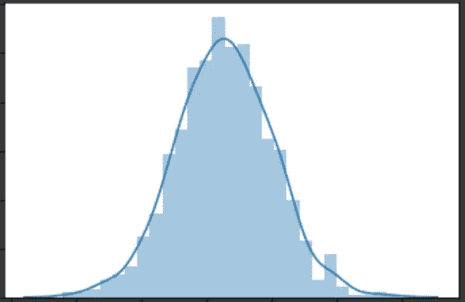
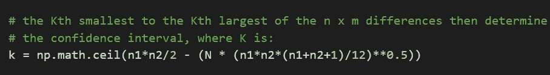

# 通过计算非参数统计测试的置信区间来做晚餐和挽回局面

> 原文：<https://towardsdatascience.com/prepare-dinner-save-the-day-by-calculating-confidence-interval-of-non-parametric-statistical-29d031d079d0?source=collection_archive---------29----------------------->

## 完整的 python 代码，带有用于[曼恩-惠特尼 U 检验](https://en.wikipedia.org/wiki/Mann%E2%80%93Whitney_U_test)和[威尔科森符号秩检验](https://en.wikipedia.org/wiki/Wilcoxon_signed-rank_test)的工作示例。

照片由[戴加·埃拉比](https://unsplash.com/@daiga_ellaby?utm_source=medium&utm_medium=referral)在 [Unsplash](https://unsplash.com?utm_source=medium&utm_medium=referral) 上拍摄

“我想我需要去看医生”，睡眼惺忪的 Janhvi 说。

“为什么？”，我问道，仍然半睡半醒，享受着慵懒的早晨氛围。

“这几天感觉很累，没胃口。我最好去确诊一下”，她一边回答，一边拉开我的毯子，半踢着我下床。这是我做好准备开车送她去看医生的暗示——我美好的早晨就这样过去了！

“啊！但是你穿那条白裙子看起来很迷人。我相信你几个小时后就会好的”——我想，涂黄油总是有帮助的。她看着我时的眼神足以让这个*表情符号为它的钱而战，所以我减少了损失，站了起来。是时候去拜访我们信任的医生了。*

# *你该选择什么——爱情还是金钱？*

*我们的血浆数量下降了一点。工作压力大，饮食不合理，你是 Janhvi 吗？”“医生叔叔”骂道。*

*“我可以给你开你常用药物的处方，过两三个星期就应该好了。然而，在过去的 6 个月里，这个新品牌似乎在我试用过的病人身上取得了更好的效果。我觉得你应该试试。一周之内效果就很明显了。”*

*“一样的价格？”我问道，尽管有点太急切了，但我必须承认。*

*“我以为询问任何新的副作用会是第一个问题。但是，是的，它花费更多一点。那是哪一个？”博士叔叔干巴巴地打趣说，没有从 Janhvi 转移他的眼睛。*

*那是当时最贵的一家。在接下来的 10 分钟里，我绞尽脑汁想出一个冗长的借口来挽回面子。在开车回家的路上，我心中的数据科学家开始发挥作用。“你知道，统计学家有一大堆测试来比较两类或两种治疗方法。他们只是不会凭直觉说一个比另一个好。由于患者如此之少，很难概括不同方法之间的差异。”*

*哈维:“嗯……嗯”*

*我:“我想在这种情况下，我们可以很好地记录在我们的医生手下接受治疗的每个患者的血浆计数，根据他们接受的治疗将其分为两组，然后使用统计测试来检查是否真的有任何差异。”*

*哈维:“嗯……嗯”*

*我:“我们测量的是你的血浆数，不是吗？我认为这不符合正态分布。曼-惠特尼测试应该会给我们答案。”*

*Janhvi:“说什么？！我的血浆不正常？你是这个意思吗？”*

*我:“没有，没有！我说它不遵循正态*分布*。看到那座远山了吗？想象一下，就在 2D。中间的一个峰值，向左右逐渐变小。我们在宇宙中测量的大多数事物都倾向于遵循[正态分布](https://www.mathsisfun.com/data/standard-normal-distribution.html)——比如身高、血压、考试成绩或智商。在不涉及数学的情况下，如果我数一数这个星球上所有的人，或者至少是很多人，身高在 6 英寸到 20 英尺之间，并以如下方式记在一个表格中——数最左边的最矮的人→数右边高 1 英寸的人→数右边高 1 英寸的人→以此类推，直到数最高的人是最右边的人，那么我会看到一个有趣的模式，在我们周围经历的许多事情中都观察到了。”*

**

*高度和数量*

*Janhvi:“哪个是？”她的兴趣增加了。*

*我:“一座山，一条*钟形曲线*。如果我去我们的花园，开始堆砌砖块，为我在表格中输入的每个条目创建一个新列(每个新列刚好竖立在前一列的右侧)，砖块列的高度等于我在表格中输入的计数，那么您将拥有一个山形结构。”*

**

*正态分布*

*Janhvi:“有意思。不要在我们的花园里这样做。”*

*我:“好吧。”*

> *“我认为这是我们能够与这个世界上的其他人产生共鸣的原因之一。我们大多数人在某个时候都会经历同样的事情。*
> 
> *我们分享很多。"*
> 
> *她看着远处的地平线，轻声说道。*

*我笑了。我从来没有那样想过。我想她是对的。*

*"血浆数量不符合正态分布吗？"。她回到这个世界就像她离开这个世界一样快。*

*我:“不。不是所有的事情都是这样，我认为人与人之间的血浆计数不是这样。但我们可以稍后向医生确认。”*

*Janhvi:“那么这有什么关系呢？”*

*我:“简单来说，要用的统计检验类型取决于你处理的数据类型。在我们的病例中，我们根据输出数据比较了两类治疗，血浆计数是连续的数据，但不正常。[曼-惠特尼 *U* 检验](https://en.wikipedia.org/wiki/Mann%E2%80%93Whitney_U_test)用于这种情况。”*

*Janhvi:“你会向医生解释这一点，请他做这个对比测试，然后就能确定新的治疗方法是否比旧的好？”*

*我:“嗯……我可以自信地说出来。我将能够做出一个听起来像这样的声明——我们可以 95%地确信，治疗之间的平均血浆计数的差异在 *x* 和 *y* 之间的范围内。由于这个范围看起来不太大，这两种治疗方法对患者的效果很有可能是一样的。或者说，它们可能是不同的。”*

*“这么多工作为了**T5 那 的声明！”，她大声说道。***

*“为你做任何事，亲爱的！我绝不会让你服用一种新药，除非你对它有足够的信心”，我说，希望在我的声音中传达出一丝自豪和关心。“你可能现在还没有意识到，但这种测试对制药或金融领域的研究至关重要。”*

*Janhvi:“是的，没错。我想你很幸运在过去的一周里有机会研究了这些测试，并发现它们很有趣？”*

*我:“是啊！找出其中一些测试(称为非参数测试)的置信区间并不容易，也没有标准的编程包，至少在 python 中没有。所以我做了一些调查，并为它们创建了自定义函数。我计划很快就此写一篇文章。你怎么知道的？”*

*珍妮薇:“我太了解你了，我最亲爱的。我们快到家了。告诉你，我觉得我需要睡到很晚，当我起床的时候我会很饿。你在接下来的几个小时里安静地完成你的文章，然后给我做一顿丰盛的晚餐，这样我就完全忘记你问医生叔叔的那个问题了，怎么样？”*

*“听起来很公平”，我说，不好意思地笑着。*

# *用代码弄脏我们的手*

*所以在这里，分步代码。*

*代码背后的方法已引用自英国医学杂志，第 296 卷，1988 年 5 月 21 日:M . J .坎贝尔&M . J .加德纳的“计算某些非参数分析的置信区间[”。](https://www.ncbi.nlm.nih.gov/pmc/articles/PMC2545906/pdf/bmj00286-0037.pdf)*

> *你可以从 [Colab](https://colab.research.google.com/drive/1E_l4-Z6132DGZoVRqpecn6I3Ny62Nksj) 或者 [GitHub](https://github.com/HCGrit/MachineLearning-iamJustAStudent/tree/master/Non-parametric%20Confidence%20Interval) 下载我的完整代码。*

## *对于不成对的样本*

*non_param_unpaired_CI python 函数*

*让我们看一下论文中列出的例子，这样我们可以比较结果:*

**

*不成对数据集*

*n =第 1 组或样本 1 数量= 10*

*m =第 2 组或样本 2 大小= 10*

*对两个样本的值进行排序，并将它们分别作为列标题和行索引输出。我们需要计算样本 1 中的每个观察值与样本 2 中的每个观察值的差异，给出我们***n****x****m***的差异。它看起来是这样的:***

****

**n x m 差异**

**在我们的 python 函数***non _ param _ unpaired _ CI()***中，这是通过下面一行代码实现的:**

****

**python 中的 n x m 差异**

**人口中位数或平均数的差的估计现在由这些差的中位数给出。从表中的 100 个差异中，第 50 个*最小差异为-6 g/l，第 51 个*第*最小差异为-5 g/l，因此中值差异估计为(-6+(-5))/2= -5.5 g/l。这可以通过 python 计算得出:***

****

**差异的中位数**

**我们需要第 K 个*最小的*和第 K 个*最大的*中值差值来找到区间范围。k 由下式给出:**

****

**k 代表不成对样本**

****

**在这里，这个术语就是给定置信度下的百分位数。如果我们的置信水平是 0.95，那么 alpha 就是(1–0.95)= 0.05。我们可以用 python 中的这个来计算 **N** 为:**

****

**n 已计算**

**因此 **K** 为:**

****

**k 计算值**

**这出来就是 **24** 。第 24 个*和第 24 个*的最小差值为-10 g/l，第 24 个*和第 24 个*的最大差值为+ 1 g/l。因此，群体中位数差值的 95%置信区间为从 **-10 g/l 到+1 g/l** 。**

## **对于成对样本**

**这可用于 [Wilcoxon 带符号等级测试](https://en.wikipedia.org/wiki/Wilcoxon_signed-rank_test)的情况。**

**non_param_paired_CI python 函数**

****

**工作示例—成对样本**

**请注意，这里的第一步是计算每个样本的观察值差异(*之后-之前*)。**

**n =每个样本的大小= 11**

**现在让我们计算我们的 **N** 和 **K** ，置信水平为 0.95，alpha =(1–0.95)= 0.05:**

****

**n 已计算**

****

**k 公式**

****

**k 计算值**

**k 出来就是 **11** 。**

**我们现在将创建一个包含所有差异平均值的***n***x***n***表格。因为列标题和行索引是相同的，所以我们只需要 n(n+1)/2 个值:**

****

**差异的平均值**

**在 python 中:**

****

**python 中的平均差异**

**第 11 个最小的和第 11 个最大的平均值是 **11.9** 和 **25.1** ，因此是我们的区间。**

****

**照片由[拉娜·阿比](https://unsplash.com/@shotbylana?utm_source=medium&utm_medium=referral)在 [Unsplash](https://unsplash.com?utm_source=medium&utm_medium=referral) 上拍摄**

**劈！时间刚刚好！希望这能帮助到外面的人。如果是的话，一定要让我知道。现在我要走了，去做一顿丰盛的晚餐:)**

**对分享想法、提问或简单讨论想法感兴趣？在 [LinkedIn](https://www.linkedin.com/in/himanshu-chandra-33512811/) 、 [YouTube](https://www.youtube.com/channel/UChNybQwpqrX9SOc1D4K_x5Q) 、 [GitHub](https://github.com/HCGrit/MachineLearning-iamJustAStudent) 上与我联系或者通过我的网站:[我只是一个学生](http://iamjustastudent.com/about)。**

**回头见&学习愉快！**

** [## Himanshu Chandra -业务主管-ML

www.linkedin.com](https://www.linkedin.com/in/himanshu-chandra-33512811/)** 

***代码下载链接* : [Colab](https://colab.research.google.com/drive/1E_l4-Z6132DGZoVRqpecn6I3Ny62Nksj) ， [GitHub](https://github.com/HCGrit/MachineLearning-iamJustAStudent/tree/master/Non-parametric%20Confidence%20Interval) 。**

***演职员表&参考资料*:**

**M J .坎贝尔的《起点的统计数据》**

**[杰森·布朗利的博客——机器学习大师](https://machinelearningmastery.com/nonparametric-statistical-significance-tests-in-python/)**

**[“计算某些非参数分析的置信区间”，作者 M . J .坎贝尔&M . J .加德纳](https://www.ncbi.nlm.nih.gov/pmc/articles/PMC2545906/pdf/bmj00286-0037.pdf)**