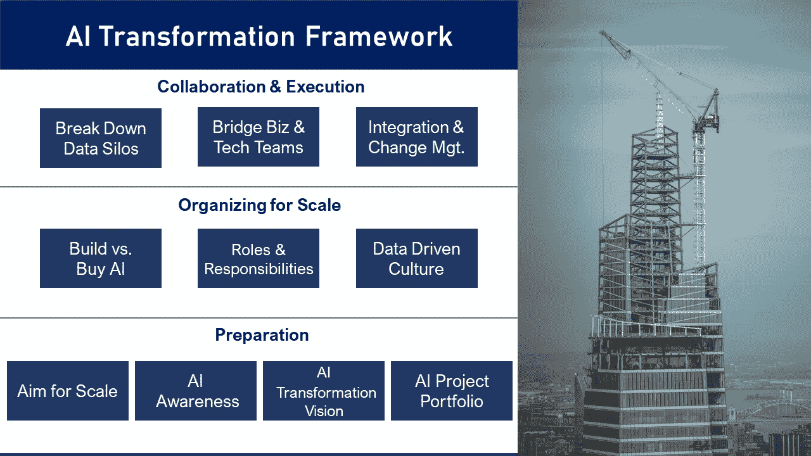
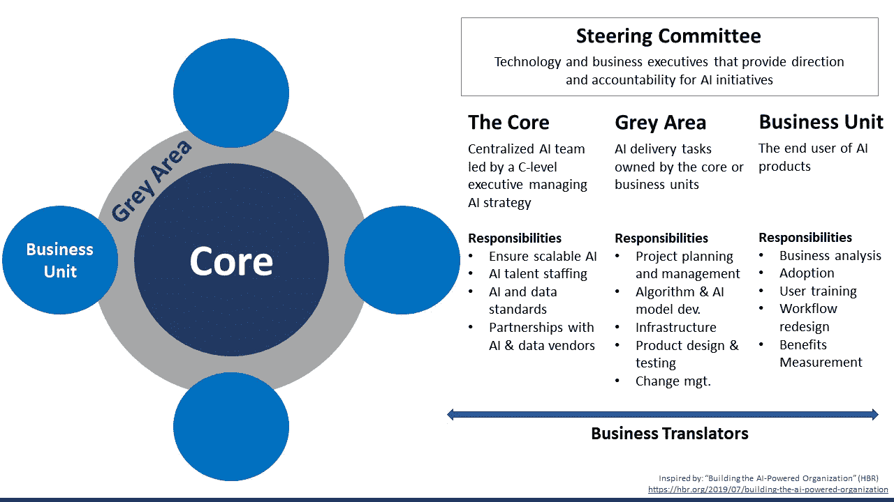

# 为企业采用人工智能做准备

> 原文：<https://towardsdatascience.com/preparing-corporations-for-artificial-intelligence-adoption-e67603a22037?source=collection_archive---------51----------------------->

## 创建促进人工智能转型的文化的执行指南

肖恩·波洛克在 [Unsplash](https://unsplash.com/s/photos/corporation?utm_source=unsplash&utm_medium=referral&utm_content=creditCopyText) 上的照片

# 行动纲要

大多数公司未能扩大其人工智能试点项目的规模。大多数人工智能项目的预算都被削减了，因为它们没有足够快地交付结果。

问题不在技术，也不在人才。罪魁祸首往往是为前人工智能时代设计的企业文化和组织结构。为了大规模部署人工智能，高管们必须建立一种文化，让业务和技术团队能够无缝协作。

**以下是一个由 10 部分组成的框架，帮助高管们为公司大规模实施人工智能做好准备。**这不是一个让公司前进的顺序列表。大多数公司都会精通这个框架的一个或多个部分。

相反，本执行指南描述了成功人工智能实施文化的必要条件。企业领导人可以使用这个框架来诊断他们公司在这些领域的熟练程度。

然后，他们可以建造。

# 人工智能转型框架

面向高管的人工智能转型框架。作者制图，照片由 [Laurenz Heymann](https://unsplash.com/@einfachlaurenz?utm_source=unsplash&utm_medium=referral&utm_content=creditCopyText) 在 [Unsplash](https://unsplash.com/s/photos/skyscraper-construction?utm_source=unsplash&utm_medium=referral&utm_content=creditCopyText) 上提供

几乎每个 CEO 都说他们在‘做 AI’，就像你的朋友告诉你他在‘打健身房’一样。

这两个人很可能都得不到自己希望的结果。许多公司不会超越人工智能试点项目，你的朋友会告诉你，他太忙了，没有时间锻炼。

2019 年 Gartner CIO 调查[声称](https://www.gartner.com/en/newsroom/press-releases/2019-01-21-gartner-survey-shows-37-percent-of-organizations-have)3000 家被调查公司中有 37%已经部署了人工智能。可以肯定的是，剩下的 63%中的许多人在他们的人工智能之旅中遇到了一两个障碍。

光有技术和人才是不够的。企业必须打破文化障碍，重新思考组织结构，以便跨部门和地域部署人工智能。

企业 AI 部署没有单一的蓝图。企业如何实现人工智能取决于它们的规模、人才库和人工智能成熟度。

**然而，高管可以使用这个由 10 部分组成的框架来指导他们的人工智能转型之旅:**

1.  旨在大规模部署人工智能
2.  在整个公司建立人工智能意识
3.  在高管层致力于“人工智能转型愿景”
4.  规划人工智能项目的投资组合
5.  建立内部人工智能团队，并与人工智能供应商合作
6.  在公司内分配人工智能人才并分配职责
7.  在整个公司中采用数据驱动的决策
8.  打破数据孤岛
9.  弥合业务和技术团队之间的差距
10.  整合和变革管理预算

# 一、以大规模部署人工智能为目标

人工智能使企业能够对数据进行分类，找到模式，预测结果，并大规模地重复决策。

规模很重要。对于银行来说，部署用于客户细分的机器学习工具来帮助交叉销售和向上销售相对容易。部署一套人工智能解决方案来优化从入职到持续关系管理的整个客户旅程，更具挑战性，也更有回报。

企业如何构建和部署可扩展的人工智能解决方案组合？归结为组织结构和文化。公司必须促进业务和技术团队之间的合作，以便人工智能解决方案能够适应不断发展的业务需求。组织结构也必须足够灵活，以允许人工智能人才被部署到最需要的地方。

# 二。在整个公司建立人工智能意识

企业必须提高整个组织的人工智能意识。从 C-Suite 到个人贡献者的每个人都必须知道人工智能如何解决业务问题，以及他们如何使用人工智能工具。

AI 教育可以是内部的也可以是外部的。AI 成熟度高的公司会设立内部 AI 学院和在职培训项目。其他公司可以在课堂和研讨会上使用外部培训师和顾问。

## 高级管理人员

高管和高级经理将已经对他们公司的业务需求、目标和挑战有了深刻的理解。因此，他们必须建立人工智能意识，以便能够:

*   获得对人工智能技术如何工作的高级理解(例如，机器学习、机器视觉、自然语言处理)
*   确定其行业和公司内的高价值人工智能用例
*   认识他们公司可以用来实现业务需求的特定人工智能工具和技术
*   学会优先考虑人工智能计划
*   了解采用的障碍、对人员角色的影响以及所需的文化变革

## 技术职工

企业必须投资于数据科学家、人工智能工程师和人工智能工具开发者的技术培训。根据他们的角色，他们的培训可以包括:

*   数据最佳实践(例如，收集、清理、治理、修正偏差)
*   对机器学习和深度学习的技术理解
*   了解用于构建和培训人工智能和数据模型的开源和第三方工具(例如 Python、PyTorch、TensorFlow)
*   了解行业标准和新兴人工智能技术

## 商务翻译

也被称为分析翻译，这一新兴角色将在业务和技术团队之间架起桥梁，以确保人工智能产品满足业务需求。业务翻译也可以管理构建人工智能工具的技术人员，并负责人工智能项目的实施和采用。

业务翻译通常来自业务部门(如项目经理、业务分析师、主题专家、业务部门经理)。他们已经对业务有了很好的理解，也可能擅长项目管理、人员管理或战略规划。

商务翻译需要基本的技术培训和人工智能意识，以便:

*   用技术术语向构建人工智能工具的数据科学家和工程师传达业务需求和要求
*   将分析方法和人工智能工具应用于商业问题
*   详细开发人工智能用例
*   了解部署人工智能工具将如何改变工作流程

## 商业用户

这些是人工智能工具在营销、财务、销售或其他功能方面的最终用户。这些员工需要接受如何在日常工作中使用人工智能工具的培训。他们还需要克服对人工智能的恐惧。

大多数人害怕 AI 和自动化会抢走他们的工作。如果高管们把机器看得比自己人的技能和经验更重要，经理们可能会感到被冒犯。高管必须让员工相信，人工智能将帮助他们实现更多的目标。他们必须讲述一个令人信服的故事，说明为什么人工智能至关重要，以及它将如何惠及公司及其员工。

至关重要的是，高管必须让员工相信，人类永远是等式中最重要的部分。虽然人工智能可以产生数据驱动的见解并自动化流程，但只有人类拥有常识和功能知识来*应用*这些见解。把 AI 想象成*增强的*智能，而不是*人工的*智能。

实际上，自动化会导致一些失业。涉及常规和重复性任务的工作风险最大。然而，关于自动化将如何导致三分之一的工作岗位流失的头条新闻并没有讲述事情的全部。人工智能自动化了任务，而不是整个工作。真实的故事是关于员工的人工智能增强，而不是大规模的人工智能替代。

员工应该欢迎人工智能增强。一旦日常任务实现自动化，员工就可以将更多的时间投入到有影响力和令人满意的工作中。雇主也希望如此。德勤(Deloitte)对 1900 名人工智能采用者的企业调查显示，人工智能的一个主要好处是它[解放了员工，使他们更具创造力](https://www2.deloitte.com/us/en/insights/focus/cognitive-technologies/ai-adoption-in-the-workforce.html)。

如果员工认为人工智能对增长(或生存)至关重要，他们更有可能接受人工智能。零售业高管只需要指出亚马逊和电子商务带来的生存威胁。解释人工智能如何让零售商变得更高效、反应更灵敏，这很有说服力。强调员工发挥的关键作用并描绘未来成功的蓝图将会让员工完全参与进来。

# 三。致力于首席执行官级别的人工智能转型愿景

当一家公司的高管能够解释他们的人工智能转型愿景时，该公司人工智能成功的几率就会增加。转型愿景不是关于单个用例。这是为了在市场上大获全胜。

具体来说，最高管理层应该对四个问题有详细的回答:

1.  人工智能可以帮助我们应对哪些商业挑战？
2.  人工智能将如何在 3-5 年内使我们从竞争中脱颖而出？
3.  我们将如何使用人工智能来增长和占领市场份额？
4.  在数据可用性、人才和创新文化方面，我们今天必须采取哪些措施？

假设一家暖通空调公司在办公楼中安装供暖、通风和空调设备。他们看到了一个将传感器与机器学习结合起来的机会，以根据人类活动管理整个建筑的温度。这使得暖通空调公司的客户能够最大限度地减少能源使用。在这种情况下，*采用人工智能节省的能源将使公司与众不同，并帮助它获得市场份额。*

这是暖通空调公司 AI 转型愿景的开始。接下来，他们应该问自己*如何通过利用他们的数据、人才和文化*取得胜利。

人工智能转型愿景应该为公司的人工智能战略和项目组合提供信息。这也应该有助于公司优先考虑人工智能项目。

## 考虑长远，寻求试点项目的短期知识

一个长期的人工智能转型愿景将帮助高管们致力于一个多阶段的人工智能之旅。高管们会意识到真正的收益需要时间。如果没有长远的眼光，高管们可能会在看不到结果的时候撒手不管。

即使是成功的人工智能项目也可能需要时间来产生投资回报。试点项目可能根本不会产生财务投资回报。尽管如此，如果试点项目告诉公司应该如何改革数据基础设施，以实现大规模人工智能的采用，这是一个有价值的快速胜利。

试点项目花费不多，但可以给公司提供宝贵的见解，以构建可扩展的人工智能解决方案。它们可以揭示应该以更高的数量或更详细的方式收集什么类型的数据，并确定当前的数据缺口在哪里。例如，这些知识将帮助公司开发与数据收集和治理相关的核心能力。

致力于长期转型愿景的高管更有可能激励和鼓励创新文化，在这种文化中，财务 ROI 不是衡量成功的唯一标准。这种心态为更大的长期财务投资回报率打开了大门。

# 四。规划人工智能项目的投资组合

成功的人工智能转型是由不同时间跨度的项目组合驱动的。

更大、更雄心勃勃的人工智能计划带来的可衡量的好处可能需要数年时间，同时在短期内产生巨大的成本。单独投资大型多年项目会造成预算压力和管理层的不耐烦。

公司应该计划不同时间范围的人工智能项目组合。这使得公司能够从短期项目中获得稳定的收益，从而说服高管继续支持他们。一个结构良好的人工智能项目组合包括:

*   小型试点项目教授如何扩展人工智能的宝贵经验
*   在 6-12 个月内有可观回报的短期项目
*   处理越来越有价值的用例并在 12-24 个月内产生投资回报的中期项目
*   在整个企业中应用可扩展人工智能的长期项目

假设一家银行的人工智能转型愿景是“通过用人工智能简化整个客户旅程来获得更大的市场份额。”然后，项目应该使客户更容易注册，帮助银行提供方便和定制的客户服务，这反过来又说服更多的人注册。

**试点项目**主要是学习和概念验证。他们的价值来自于向公司展示他们现在所处的位置，以及他们在数据、人才和基础设施方面的需求，以便成功部署人工智能。

**短期项目**专注于从单一用例中产生“速赢”。银行可能会启动一个项目，在客户入职期间自动执行“了解您的客户”( KYC)流程。人工智能支持的自动化工具随时可用，KYC 流程也实现了标准化，这使得该项目成为帮助银行削减成本和提高效率的短期项目。

**中期项目**可以关注更高价值的用例，这些用例需要更多的时间来产生回报。在自动化 KYC 之后，我们的银行可能会开展一个项目，使用无监督的机器学习来构建一个客户细分工具。该工具将根据行为和特征将客户分类，使银行能够更有效地进行交叉销售并增加收入。

**长期项目**为公司及其客户提供真正的价值。这些可以是独立的项目，也可以是将较小的项目实现组合成一个连贯的解决方案的计划。我们的银行希望简化整个客户旅程，可以创建一个应用程序或网络平台来处理客户入职事宜，提供量身定制的产品推荐，并提供客户服务。

一个结构良好的投资组合可以分阶段提供投资回报。除了来自早期阶段的知识和见解，在阶段中产生 ROI 的项目可以资助(并验证)未来的阶段。

# 动词 （verb 的缩写）建立一个内部人工智能团队，并与人工智能供应商合作

从长远来看，公司应该致力于在内部构建人工智能。从短期来看(对于特定的用例来说)，从供应商那里购买人工智能工具可以产生立竿见影的回报。

**收购人工智能的理由。**与人工智能供应商合作可能会加快一次性人工智能项目的速度，特别是如果该公司处于人工智能之旅的早期。一个人工智能供应商可能有一个用例的完美工具，这节省了公司的时间。供应商的专业知识也可以缩短新的内部人工智能团队的人工智能学习曲线。

**人工智能建筑案例。**内部构建的人工智能工具更有可能满足业务需求，并与数据和工作流相结合。从长远来看，依赖供应商产品来实现多个人工智能计划是不可行的。供应商不熟悉公司的业务需求、流程和数据。现成的供应商工具可能无法与公司的数据和业务流程集成。公司也不能让供应商接触敏感数据。至关重要的是，在内部构建人工智能工具使公司能够发展其人工智能能力并扩大规模。

**混合方法。在迫切需要定制解决方案的情况下，与人工智能供应商合作构建定制的人工智能工具是一种选择。当内部员工可以准确地告诉供应商该工具应该做什么时，该工具更有可能与公司的流程和数据集成。例如，汇丰银行[与人工智能供应商 ayas di](https://emerj.com/ai-sector-overviews/artificial-intelligence-at-hsbc/)合作开发了一款人工智能反洗钱工具。尽管汇丰无疑有内部人工智能团队，但他们利用供应商的专业知识来更快地获得结果。**

除了供应商合作伙伴关系，一个良好的人工智能转型愿景需要一个帮助整个公司的[集中式人工智能团队](https://landing.ai/ai-transformation-playbook/)。这个团队将包括数据科学家、数据工程师、机器学习工程师和 AI 产品经理。根据公司的组织结构，团队可能向 CTO、CIO、首席数据官甚至首席 AI 官报告。

内部人工智能团队的职责包括:

*   人工智能策略和问题识别
*   人工智能标准和流程
*   规划和执行人工智能项目组合
*   数据和治理标准

# 不及物动词在公司内分配人工智能人才并分配职责

为人工智能的可扩展性而组织。图片作者。

哪种组织模式最适合大规模部署人工智能？人工智能人才应该居住在公司的什么地方？《哈佛商业评论》关于人工智能驱动的组织的专题讨论了扩展人工智能的三种组织模式:

1.  **集中化**:将人工智能人才集中到一个中央核心(“枢纽”)，比如总部或地区办公室
2.  **去中心化**:将人工智能人才嵌入各个业务部门(“辐条”)
3.  **混合**:将人工智能人才&的职责分配给核心和业务部门

与人工智能战略、项目和采用相关的任务可以由三个组织层中的任何一个拥有:核心、各种业务单元，或者跨核心和业务单元工作的“灰色区域”。

## 核心

**核心负责人工智能&数据战略、招募、治理以及与人工智能&数据供应商**合作。

核心创建人工智能标准、流程和最佳实践，帮助在整个组织中扩展人工智能。这确保了业务部门不会重复工作，并且人工智能部署是无缝的，符合公司标准。

核心应该负责数据计划，如数据清理、标记和集成。这些计划应该与人工智能项目一起逐步实施。在确定业务需求和人工智能用例之前，没有必要花费数百万美元进行公司范围的数据收集和清理——如果管理层意识到它们不适合人工智能项目需求，这些数据计划可能会被放弃。

## 业务部门

业务单位负责与采用相关的活动，因为他们是人工智能系统的最终用户。**这些任务包括业务分析、鼓励采用、培训用户、重新设计工作流程和衡量效益**。

业务部门必须最终对人工智能产品的成功负责。由于人工智能工具是为解决业务需求而设计的，业务部门的领导，如区域经理，应该对人工智能产品的成功负责。

## 灰色地带

落入灰色区域的任务可以由核心或单个业务单元拥有。这些任务包括 **项目管理、算法开发、产品设计&测试、IT 基础设施和变更管理。**

选择由核心部门还是业务部门负责这些任务取决于三个因素:

*   **人工智能成熟度**:公司以前部署人工智能的经验
*   人工智能的紧迫性:人工智能计划的速度和复杂性
*   **商业模式:**参与人工智能采用的部门、职能或地理位置的数量

如果企业的人工智能成熟度低、紧迫性高、商业模式简单，它们应该将人工智能人才和运营集中在核心。相反的情况要求将人工智能人才分散到各个业务部门。

**AI 成熟。**一家开始人工智能之旅的公司可能会将其数据&分析高管、数据科学家、人工智能工程师和支持人员集中在核心。这使得标准化工具、数据流程、存储库和基础设施的开发更快。当然，这些人员可以根据需要部署到业务部门。

**艾尿急。**需要快速部署 AI 项目的公司，可能会选择将其 AI 人才集中在核心。这允许更好地监控行业技术趋势，并在构建人工智能产品时更容易协调。

**商业模式。**人工智能工具有时必须支持大量的业务单位、地理位置或功能。在这种情况下，该公司复杂的商业模式可能会说服高管将人工智能人才整合到核心部门，并根据需要将他们分配到组织的其他部门。

归根结底，这与其说是一门科学，不如说是一门艺术。一家必须紧急部署人工智能解决方案并拥有复杂商业模式(建议人工智能人才集中化)的公司可能具有较高的人工智能成熟度(建议分散人工智能人才)。在这种情况下，高管应该考虑这三个因素的相对重要性，并确定人工智能人才在核心部门还是在业务部门最有用。

假设银行投资组合中的一个人工智能项目涉及为某个国家构建一个 KYC 自动化工具。如果该国的客户关系团队之前已经为客户入职部署了人工智能工具，该团队可以接管通常由核心处理的活动，如业务案例分析和项目实施。

# 七。在所有级别接受数据驱动的决策

人工智能应该通过赋予人们数据洞察力来改善日常运营。因为运营是由人来执行的，所以公司必须采用一种从最高管理层到基层的数据驱动的决策文化。

当人工智能被正确采用时，员工可以通过算法建议来增强他们的技能和判断力，以实现比人类或机器单独更好的结果。

这只有在员工能够信任人工智能工具并感到被授权做出决策的情况下才会发生。信任是通过 AI 感知建立的(如上所述)。当企业放弃传统的自上而下的方法时，决策权就产生了。

以一家全国连锁超市为例。关于优化占地面积和产品布局的决策通常由区域经理根据历史数据做出。对于拥有数百家商店的连锁超市来说，这种自上而下的决策可能不会给单个商店带来最好的结果。在数据驱动的决策文化中，使用人工智能工具跟踪实时店内客户行为的当地经理能够更好地决定商店如何展示产品。

# 八。打破数据孤岛

人工智能需要来自组织许多部门的大量数据。许多公司部门将数据存储在孤岛中——这些系统相互之间没有接口，只能由特定的团队访问。这是人工智能采用的一个障碍，但却是可以克服的。

大型保险公司因其数据孤岛而臭名昭著。保险公司往往有几十个独立的遗留(即旧的)系统，这些系统相互之间没有连接，也没有连接到新的数字和云平台。这种[不利于人工智能](https://www.canadianunderwriter.ca/technology/the-impact-of-legacy-systems-on-ai-implementation-1004160422/)和该行业正在着手的数字化举措。

像大多数数据密集型行业一样，保险公司也在投资对遗留系统进行现代化改造，或将数据迁移到数字系统、数据湖和数据仓库。数据湖和数据仓库都存储大数据。数据湖是一个巨大的原始数据池，没有结构或标签。数据仓库存储用于特定目的的结构化、带标签的数据。

打破数据孤岛不是一蹴而就的。在实施 AI 之前投资昂贵的大规模数据转换通常是一个坏主意。最好是两者一起做，以便根据您的人工智能计划的需要来完成数据转换。

人工智能试点项目在这里很有帮助——它们揭示了当前的数据差距在哪里。有了这些知识，公司可以开始智能地打破数据孤岛。

# 九。弥合业务和技术团队之间的差距

**业务翻译者**，前面介绍过，确保 AI 和数据科学解决方案的设计考虑到了业务需求。

业务和技术团队并不总是说同一种语言。区域销售经理可能确切知道他们想要从人工智能驱动的客户细分工具中获得什么——它应该将客户分成代表他们对哪些产品感兴趣的桶。然而，销售经理可能无法用*技术*术语将这些需求传达给实际构建工具的数据科学家或机器学习工程师。

这不是企业界的新问题。部署内部 IT 系统或面向客户的移动应用的公司将这些项目的所有权交给专注于 IT 的项目经理和业务分析师。例如，IT 项目经理理解新 IT 系统的业务目标。他们还将对技术有一个基本的了解，并能监督构建系统的技术人员。

当涉及到人工智能计划时，这些业务翻译可以是项目经理、业务分析师，甚至是内部顾问。他们需要对人工智能方法和能力有广泛的认识，这样他们才能理解技术团队在做什么，并给他们指明方向。

商业翻译可以利用他们对商业和人工智能的认识来识别人工智能采用的障碍。在项目早期，他们可以调查最终用户，研究工作流，与业务和技术领域的关键利益相关者交谈。这使他们能够诊断和解决问题，如缺乏员工认同或最终用户的不合理期望。

确定具有商务翻译能力的员工至关重要。这个角色很快就会大受欢迎——而且没有太多的人同时拥有人工智能意识和商业知识。德勤人工智能在 2019 年的企业调查中发现，商业人才几乎与人工智能人才一样受重视，在公司实施了 20 多个人工智能系统后，甚至更受重视。

# X.整合和变革管理预算

整个公司的人工智能意识加上员工对人工智能计划的认同为人工智能的采用奠定了基础。然而，仅仅这些还不足以确保 AI 与业务流程的顺利集成。公司必须至少为采用活动和开发活动做同样多的预算。

集成人工智能工具涉及工作流重新设计、培训和变更管理。这些支持活动应该在部署 AI 解决方案之前就开始。它帮助员工准备好使用人工智能工具，并避免不愉快的意外。它还确保员工了解、参与和支持人工智能之旅。

尽早开始可以让业务翻译人员和最终用户在实施之前发现潜在的采用问题。也许人工智能工具需要重新设计一些工作流程，这样会带来更多的麻烦而不是好处。在部署之前认识到这一点允许技术团队修改 AI 工具。

# 外卖食品

AI 不容易。投资回报需要时间。一家公司的人工智能之旅是由其独特的需求和情况决定的——将会有未知的领域需要跨越。

高管们可以通过推广一种为人工智能转型量身定制的文化，让他们的公司为这一旅程做好准备。上面描述的 10 部分人工智能转型框架可以帮助高管诊断组织需要如何改变，以便大规模部署人工智能。

扩大人工智能需要时间，知道该做什么只是第一步。强大的文化、人工智能意识和各级员工的认同将是关键。