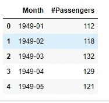
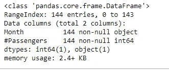
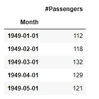
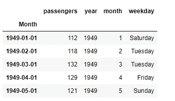
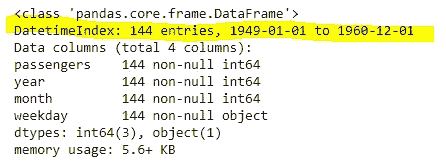

# 为时间序列分析准备数据

> 原文：<https://towardsdatascience.com/preparing-data-for-time-series-analysis-cd6f080e6836?source=collection_archive---------22----------------------->

## 一些简单的技巧和窍门来获得分析就绪的数据


在 [Unsplash](https://unsplash.com?utm_source=medium&utm_medium=referral) 上 [NeONBRAND](https://unsplash.com/@neonbrand?utm_source=medium&utm_medium=referral) 拍摄的照片

每个单独的时间序列(TS)数据都装载有信息；时间序列分析(TSA)就是解开所有这些的过程。然而，为了释放这种潜力，数据需要在通过分析管道之前进行适当的准备和格式化。

TS 可能看起来像一个简单的数据对象，很容易处理，但事实是，对于一个新人来说，在真正有趣的事情开始之前准备数据集可能是一项艰巨的任务。

因此，在本文中，我们将讨论一些简单的技巧和诀窍，以获得可供分析的数据，从而潜在地节省大量的生产时间。

# 查找数据

如果你用你自己的数据集做分析，你就有了。但是，刚刚学习 TSA 的人，找到正确的数据集可能会很麻烦。

数据来源其实不少。机器学习库附带的一些数据集——众所周知的玩具数据——已经存在很长时间了。这些“玩具”数据很好玩，尤其是对初学者来说。但这是一种瘾，每个人都需要尽快戒掉，投入到现实世界中去。

下面是一些在不同领域的一系列主题上查找数据的来源——一些是经过策划的，一些需要清理。你一定能从这个列表中找到你最喜欢的。

> 我建议你从整理过的数据集开始，这样你就不必揪着头发去解决数据问题，对真正有趣的东西失去兴趣。但是一旦你学会了基本原理，发现数据越乱越好，这将迫使你经历整个分析过程。

好了，这里有一些玩具数据集——干净、有条理、可供分析——经常在机器学习教程中使用:

*   1949 年至 1960 年间每月报道的[航空旅客人数](https://www.kaggle.com/chirag19/air-passengers)
*   美国某些州的客户每小时消耗的[电能](https://www.kaggle.com/robikscube/hourly-energy-consumption)
*   [股票市场数据](https://www.kaggle.com/camnugent/sandp500)不同公司的开盘价、最高价、最低价和收盘价以及交易量
*   一个关于[洗发水销售的超小型数据集](https://raw.githubusercontent.com/jbrownlee/Datasets/master/shampoo.csv)
*   [1981-1990 年间的日最低气温](https://raw.githubusercontent.com/jbrownlee/Datasets/master/daily-min-temperatures.csv)数据(不知道代表哪个国家/城市，不过那不重要)
*   每日记录的[空气质量数据](https://www.kaggle.com/rohanrao/air-quality-data-in-india)(一氧化碳、二氧化硫、臭氧等。)针对印度的不同城市

对于真实世界的数据集，有一些非常棒的存储库。老实说，我认为您不需要超越这些存储库来学习高级 TS 分析和建模。

1)美国[人口普查局](https://www.census.gov/econ/currentdata/dbsearch?program=RESSALES&startYear=1963&endYear=2020&categories=ASOLD&dataType=TOTAL&geoLevel=US&adjusted=1&notAdjusted=0&errorData=0)拥有大量美国商业活动的时间序列数据

2 ) [美联储经济数据(FRED)](https://fred.stlouisfed.org/tags/series) 是关于美国经济指标的一个很好的数据源

3 ) [世界发展指标(WDI)](https://databank.worldbank.org/source/world-development-indicators) 是一个由世界银行维护的关于世界各国社会、经济和环境问题的巨大资料库。

# 数据准备

> 首先，人们总是倾向于像对待任何其他数据集一样对待时间序列。然后操之过急。但是 TS 观测和我们熟悉的横截面观测是不一样的。

时间序列数据已经存在很长时间了，许多人致力于让其他人的生活更轻松(想到了 R 编程语言中的 [Rob Hyndman](https://robjhyndman.com/) 和 Python 世界中的 [Jason Brownlee](https://machinelearningmastery.com/) )。

有很多非常好的库是专门用来处理 TS 数据的。通过转换数据，您让库认识到它是一个特殊的 TS 对象。

假设您已经完成了所需的预处理，例如重命名列、处理缺失值等。—以下是如何通过几个步骤准备数据。

在这个练习中，我使用了一个在机器学习中被过度使用的玩具数据——[航空乘客数据集](https://www.kaggle.com/chirag19/air-passengers)——并用 Python 执行代码。

```
# import a couple of libraries
import pandas as pd
import numpy as np# import data
df = pd.read_csv("../DataFolder/file.csv")# look at the head
df.head()
```



数据集的前几行

从前面几行我们可以看到，数据集有两列，第一列表示“yyyy — mm”格式的日期列，另一列表示实际观测值。

记住，我们还不知道它是否是一个时间序列对象，我们只知道它是一个有两列的数据帧。

```
df.info()
```



数据帧信息

因此，在其他信息中，这个摘要确认了它是一个有两列的`pandas`数据帧。第一列是对象，第二列是整数。

它不显示任何时间维度，这是因为月列存储为字符串。所以我们需要将其转换成日期时间格式。

```
df_air["Month"] = pd.to_datetime(df_air["Month"])
```

接下来，让它成为索引。这样做的好处是，您可以以任何方式过滤/切片数据:按年、月、日、工作日、周末、特定的日/月/年范围等等。

```
df_air = df_air.set_index("Month")
df_air.head()
```



将月份更改为日期时间并设置为索引后的数据帧

最后一个好的实践是从日期时间索引中提取年、月和工作日，并将它们存储在单独的列中。如果需要的话，这为根据年/月等对数据进行“分组”提供了一些额外的灵活性。

```
df_air['year'] = df_air.index.year
df_air['month'] = df_air.index.month
df_air['weekday'] = df_air.index.weekday_name
```

这就是我们的最终数据集。只需对比与原始数据的差异。此外，正如下面用黄色墨水突出显示的，它现在确认它不只是任何数据帧，而是一个时间序列对象。

```
df.head()
```



总之，我们做了一些事情来将我们的数据转换成时间序列对象:

1)将月份列从字符串转换为日期时间；

2)将转换后的日期时间列设置为索引；

3)从索引中提取年、月和工作日，并存储在新列中

# 现在怎么办？

现在您已经有了可供分析的数据，下一步是什么？你现在可以用它进行所有你想要的有趣的分析了，我会在以后的文章中介绍。与此同时，如果你想阅读一些先进的运输安全管理局分析，我写了几篇，看看下面。

*   [时间序列数据挖掘技术及应用](/time-series-data-mining-techniques-and-applications-5159b8ad26ec)
*   [时间序列数据分析中的六个关键点](/six-essential-plots-for-time-series-data-analysis-477bd7e778ac)
*   [多元时间序列预测](/multivariate-time-series-forecasting-653372b3db36)

祝你 TSA 之旅好运！

*联系提问或者只是关注:* [*推特*](https://twitter.com/DataEnthus) *。*