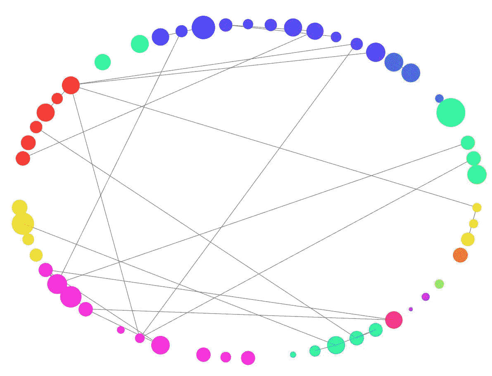
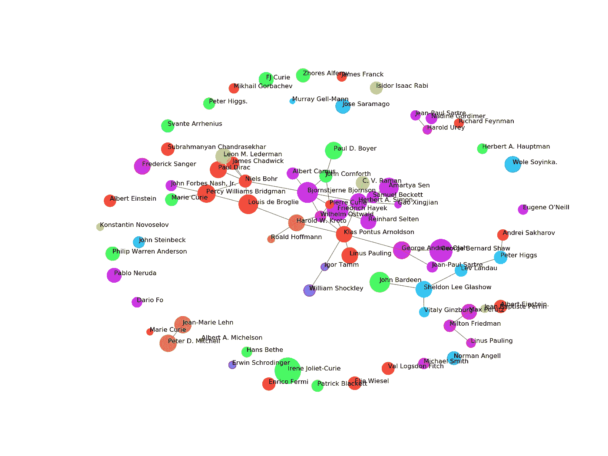
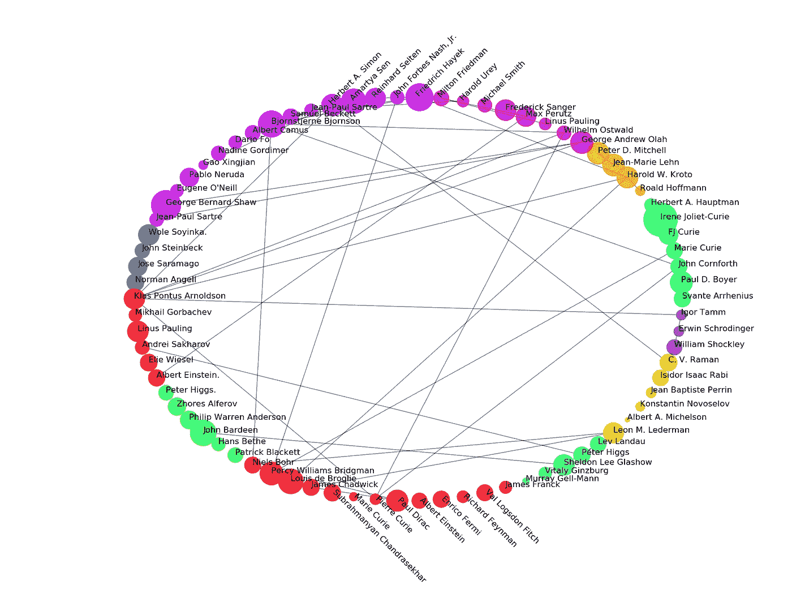
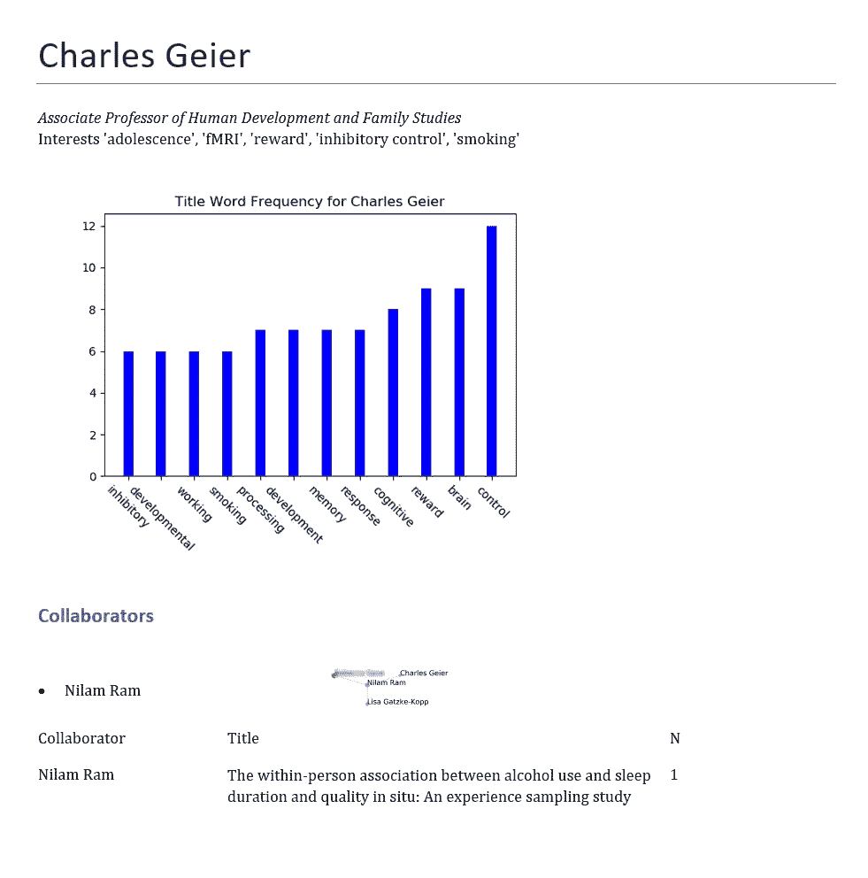

# 用网络分析准备研究生院面试

> 原文：<https://towardsdatascience.com/preparing-for-graduate-school-interviews-with-network-analysis-84df6354659b?source=collection_archive---------39----------------------->

## 利用数据科学发现跨机构教师之间的联系。



图一。不同机构的教职员工的图表(彩色),由他们的出版历史联系起来。

*本文是正在进行的关于在研究生院面试过程中利用数据科学的系列文章的第一部分。查看下一期* [*专题造型*](/topic-modelling-for-graduate-school-interviews-e6331721c6e0) *，敬请期待更多。*

美国的研究生院面试季正在火热进行中，这意味着你会遇到很多在某个特定领域可能相互认识的重要人物。当你准备的时候，你会开始意识到世界是多么的小，全国和全世界的教师是如何通过合作和相互尊重来建立他们的职业生涯的。为了帮助理解这些关系，我花了几周时间思考如何最好地收集、处理和呈现这些数据，以便在采访中有效地使用。我刚从我的第一轮面试中回来，并与我的同事分享了我的一些结果，他们的兴趣促使我写了这篇简短的走查，所以任何有兴趣为自己做同样事情的人都可以。

我们将主要使用 Python，包括以下模块:

*   学术，通过谷歌学术收集数据。
*   熊猫和 Numpy，进行基础数据角力和操作。
*   Networkx 和 Matplotlib，用于绘图和数据表示。
*   Python-docx，用于自动化文档构造。

其中一些可能包含在 Python 的典型安装中，也可能不包含在其中，因此我建议您参考它们各自的网站/文档以获得专门的帮助。

**第 0 部分:数据收集准备**

根据我的理解和知识，并没有一个确切的谷歌学术 API 可以被接口来直接获取数据，因此实现了**学术**。这带来了一些优点和缺点，其中一些有时会由于高容量使用而被阻塞。出于这个原因，我们想在安装后对它的脚本做一些小的修改。请在 Python 下的 lib/site-packages/文件夹中，或者在您决定维护该模块的任何地方找到 scholastic . py 文件。这里我们将添加一个简单的随机用户代理生成器:这里是[这里是](/5-strategies-to-write-unblock-able-web-scrapers-in-python-5e40c147bdaf)。在 scholastic . py 中，您可以找到 web-scrapers 标题的定义，如下所示:

```
_HEADERS = {
 ‘accept-language’: ‘en-US,en’,
 ‘User-Agent’: ‘Mozilla/5.0 (Macintosh; Intel Mac OS X 10_11_6) AppleWebKit/537.36 (KHTML, like Gecko) Chrome/56.0.2924.87 Safari/537.36’,
 ‘accept’: ‘text/html,application/xhtml+xml,application/xml’
 }
```

这对于简单的运行来说已经足够好了，然而，根据你感兴趣的教师数量，这可能是不够的。因此，在脚本的开始，我们将从前面的超链接文章中添加随机用户代理生成器，我们的 scholarly.py 脚本的开始应该是这样的:

```
def get_random_ua():
    random_ua = ''
    ua_file = 'C:/Users/Masters-PC/Documents/ua_file.txt'
    try:
        with open(ua_file) as f:
            lines = f.readlines()
        if len(lines) > 0:
            prng = np.random.RandomState()
            index = prng.permutation(len(lines) - 1)
            idx = np.asarray(index, dtype=np.integer)[0]
            random_proxy = lines[int(idx)]
    except Exception as ex:
        print('Exception in random_ua')
        print(str(ex))
    finally:
        return random_ua_GOOGLEID = hashlib.md5(str(random.random()).encode('utf-8')).hexdigest()[:16]
_COOKIES = {'GSP': 'ID={0}:CF=4'.format(_GOOGLEID)}
_HEADERS = {
    'accept-language': 'en-US,en',
    'User-Agent': get_random_ua(),
    'accept': 'text/html,application/xhtml+xml,application/xml'
    }
```

这应该让我们为我们的应用程序做好了准备，尽管您可以随意浏览带超链接的文章的其余部分，并实现他们的其余建议。

**第一部分:数据收集**

取决于你离面试日期有多近，你可能会也可能不会有你将会见的教员名单。这是我们将使用谷歌学术获得他们数据的广度的地方。首先，导入相应的模块并定义这个作者列表。

```
authorlist = """Wilhelm Ostwald
Linus Pauling
Max Perutz
Frederick Sanger
Michael Smith
Harold Urey
Milton Friedman
Friedrich Hayek"""
```

我只包括了 7 个随机的诺贝尔奖获得者，但是这个想法是你应该能够同时包括你感兴趣的所有教师。我的名单上有超过 40 人，分布在 10 多个机构，我还包括了我以前的导师，以防那里有任何以前未被发现的联系。有了这个，我们就可以利用学术并把输出写到一个. csv 文件中，我们可以继续检查错误。

```
import scholarly
import csv
authors = authorlist.split('\n')
table = [['Name','ID','Affiliation','Domain','First Year Cited','Citations','Citations (5 Years)','cites_per_year','coauthors','hindex','hindex5y','i10index','i10index5y','interests','publications']]for i in range(len(authors)):
    print(i)
    query = authors[i]
    try:
        search_query = scholarly.search_author(query)
        author = next(search_query).fill()
        data = [author.name, 
                author.id, 
                author.affiliation, 
                author.email, 
                'first cited year',
                author.citedby, 
                author.citedby5y, 
                author.cites_per_year, 
                ['coauthors'], 
                author.hindex,
                author.hindex5y,
                author.i10index,
                author.i10index5y,
                author.interests,
                ['publications']]
        coauthors = []
        for j in author.coauthors:
            coauthors += [[j.name,j.affiliation]]
        data[8] = coauthors
        publications = []
        for j in author.publications:
            publications += [j.bib['title']]
        data[-1] = publications
    except:
        print(query + ' is not available')
        data = ['']*15
        data[0] = query
    table += [data]with open('FoIScholardata.csv', 'w', newline='', encoding='utf-16') as myfile:
     wr = csv.writer(myfile, quoting=csv.QUOTE_ALL)
     for i in table:
         wr.writerow(i)
```

运行后，您现在应该在当前工作目录中有一个 FoIScholardata.csv 文件，可以在 Microsoft Excel、Google Sheets 或任何其他电子表格编辑器中打开该文件来检查数据。

**第 1a 条。证明、清理和扩充数据。**

你应该做的第一件事是仔细检查你是否获得了正确的教授数据，因为那些有相同或相似名字的人可能会混淆。如果是这种情况，您可能希望在搜索查询中包括他们的机构名称/缩写以消除歧义，例如:

```
authorlist = "...
Linus Pauling CalTech
..."
```

你可能注意到的下一个问题是一些教授的数据不可用。如果这不是你的情况，你可以继续第 1b 部分。最可能的原因是他们没有创建自己的谷歌学术个人资料。为了解决这个问题，我们可以用其他网站来增加我们的数据，包括他们的机构网页或其他网站，如 ResearchGate。如果您感兴趣，可以随意创建新的数据列。一旦你这样做了，如果你还需要获得他们的出版物列表，你可以使用学术以及下面的代码片段。将“用户”列表替换为谷歌学术网站上作者出版物中的缩写名称列表。

```
import scholarly
import pandas as pd
import time
import random
table = pd.read_csv("FoIScholardata.csv", encoding='utf-16') 
users = ['W Ostwald', 'MF Perutz']
names = list(table.Name)
surnames = []
for i in names:
    surnames += [i.split(' ')[-1]]
for user in users:
    print(user)
    try:
        srch=scholarly.search_pubs_query(user)
    except:
        print('Holding for an hour.')
        time.sleep(3600)
    pubs = []
    noerror = True
    while noerror:
        time.sleep(0.5+random.random())
        try:
            pub = next(srch)
            if user in pub.bib['author']:
                pubs += [pub.bib['title']]
                print(len(pubs))
        except:
            noerror = False

    titles = []
    for i in pubs:
        titles += [i.bib['title']] n = surnames.index(user.split(' ')[-1])
    table.publications[n] = titles
    export_csv = table.to_csv (r'fillins.csv', index = None, header=True) #Don't forget to add '.csv' at the end of the path
    print('Holding for about a minute')
    time.sleep(45+random.random()*30)
```

根据您的兴趣修改导出的文件名，并将您的结果添加回原始 FOIScholardata.csv 文件。睡眠时间包括在内是为了方便逃避被封锁，但你可以随时删除/修改它们。

**第 1b 节:确定作者之间的合作关系。**

谷歌学术确实包括了一个共同作者的列表，这得到了概要持有者的认可，但这似乎是一个相对较新的特性。因此，它可能是在用户更新了他们的简档，或者他们的合作者创建了他们的简档等之后引入的。，可能不包括所有实际的合著者。因此，我们将基于共享同名出版物来手动添加这些协作。

```
import pandas as pd 
import numpy as np
table = pd.read_csv("FoIScholardata.csv")
matrix = [[0]*len(table)]*len(table)
matrix = np.array(matrix)
newcol = []
for i in range(len(table)):
    print(i)
    author = table.Name[i]
    pubs = []
    collaborators = []
    if type(table.coauthors[i])==str:
        pubs = eval(table.publications[i])
    for j in range(len(table)):
        if i == j:
            continue
        if type(table.coauthors[j])==str:
            coms = list(set(eval(table.publications[j])) & set(pubs))
            matrix[i][j] = len(coms)
            if matrix[i][j]>0:
                collaborators += [table.Name[j]]
    newcol += [collaborators]
table['collaborators'] = newcol
export_csv = table.to_csv (r'FoIScholardata.csv', index = None, header=True) #Don't forget to add '.csv' at the end of the path
```

第 2 部分:生成主要合作者图表。

现在，我们的主要活动，虽然我们肯定有很多事情要做，我希望你留下来。有了适当组织的数据，我们将不会利用 Networkx 来构建和显示我们的图表。

```
import math
import pandas as pd
import numpy as np
import networkx as nx
from matplotlib import cm
import matplotlib.pyplot as plt
table = pd.read_csv("FoIScholardata.csv")
G=nx.Graph()
for i in range(len(table)):
    G.add_node(table.Name[i])
for i in range(len(table)):
    for j in eval(table.collaborators[i]):
        G.add_edge(table.Name[i],j)
domains = np.unique(table.Domain);
#see [https://matplotlib.org/tutorials/colors/colormaps.html](https://matplotlib.org/tutorials/colors/colormaps.html)
viridis = cm.get_cmap('hsv', len(domains))
from matplotlib.pyplot import figure
figure(num=None, figsize=(16, 12), dpi=100, facecolor='w', edgecolor='k')
pos = nx.spring_layout(G, k = 0.25)  # positions for all nodes
labels = { i : table.Name[i] for i in range(0, len(table.Name) ) }
options = {"alpha": 0.8}
for i in range(len(G.nodes())):
    nx.draw_networkx_nodes(G, pos, nodelist=[table.Name[i]],node_size=table.hindex[i]*19,node_color=viridis(list(domains).index(table.Domain[i])), **options)
for i in pos:
    angle = 0
    plt.text(pos[i][0],pos[i][1],s=i,fontsize=12,rotation=angle, rotation_mode='anchor')
plt.axis('off')
plt.savefig("CollaboratorSpringGraphColor.png") # save as png
plt.close()
```

幸运的话，您的结果应该看起来有点像这样:



**图二。**共同发表科学家的 Spring (Force-directed)图。*注:这些科学家之间的联系事实上是不正确的。*

如果您遇到颜色格式的问题，您可能需要手动修改数据中的“域”变量。在这种格式中，您可以很容易地识别该图中可能出现的子网和其他模式。其他格式也是可用的，即我们名义上的图像，圆形图。为此，我们应该分三部分稍微修改我们的代码:

1.  修改位置声明:

```
pos = nx.circular_layout(G)
```

2.旋转名称标签，使它们不重叠:

```
for j in range(len(pos)):
    i = list(pos.keys())[j]
    angle = 0
    if ((math.atan2(pos[i][1],pos[i][0])*180/math.pi) > (70)) & ((math.atan2(pos[i][1],pos[i][0])*180/math.pi) < (110)):
        angle = 45
    elif ((math.atan2(pos[i][1],pos[i][0])*180/math.pi) > (-110)) & ((math.atan2(pos[i][1],pos[i][0])*180/math.pi) < (-70)):
        angle = -45
```

3.更改输出文件名:

```
plt.savefig("CollaboratorCircleGraphColor.png")
```

生成的图像应该如下所示:



**图三。**标注的圆形图展示了所选院系之间的相互联系。*注:这些科学家之间的联系事实上并不正确。*

**第 3 节:得出每位研究人员的额外个性化数据。**

现在，这个图表对于一幅大图来说是很好的。然而，当你接近被邀请的日期时，为了考虑到每一位教授，你可能会想把它大大地分解一下。首先，我们将建立在谷歌学者的“兴趣”概念上。正如我们已经习惯的那样，该特征可以由轮廓支架来完成，也可以不由轮廓支架来完成。然而，我们可以通过再次查看出版物标题来构建一个替代品。我们要做的是提取所有出版物的词频，并查看哪些出现在顶部。如果没有安装，您可能还需要安装 get_stop_words 模块。

```
import pandas as pd
import matplotlib.pyplot as plt 
from stop_words import get_stop_wordsexcs = get_stop_words('en')
table = pd.read_csv("FoIScholarData.csv") 
def valuef(x):
        return worddict[x]
newcol = []
for i in range(len(table)):
    pubs = eval(table.publications[i])
    worddict = {}
    for j in pubs:
        words = j.lower().split(' ')
        for k in words:
            if k in worddict.keys():
                worddict[k] += 1
            else:
                worddict[k] = 1
    values = []
    topics = []
    for j in worddict:
        if worddict[j] > 5:
            if not (j in excs):
                values += [worddict[j]]
                topics += [j]
    width = 0.3
    topics.sort(key=valuef)
    values.sort()
    newcol += [topics]            
    plt.bar(topics[-15:], values[-15:], width, color='b')
    plt.xticks(rotation = -45)
    plt.gcf().subplots_adjust(bottom=0.22)
    plt.title('Title Word Frequency for ' + str(table.Name[i]))
    plt.savefig(str(table.Name[i]) + "_WF.png") # save as png
    plt.close() # displaytable['topics'] = newcol
export_csv = table.to_csv (r'C:\Users\Masters-PC\Desktop\ProfNetworks\FoIScholardata.csv', index = None, header=True) #Don't forget to add '.csv' at the end of the path
```

除了在我们的数据电子表格中为我们提供一个新列之外，这还将为每位教授生成一个可视化效果，如下所示:


**图 3。宾夕法尼亚州立大学 Charles Geier 博士的出版物标题词频直方图。**

这张图表立即提供了信息，因为我们可以确定研究人员对抑制控制和一般认知发展的兴趣。也许，更深入的分析，包括主题建模，以获得研究人员之间更深层次的联系是可能的，尽管这超出了本文的范围。

*更新:我决定贯彻这个承诺，并且有效地执行了一个* [*主题建模方法*](/topic-modelling-for-graduate-school-interviews-e6331721c6e0) *来连接这些部分。请随意查看！*

**第 4 部分:对每位研究人员的图表进行近距离观察。**

我们创建的大图表可能不适合每个研究人员的个性化报告。因此，我们可能只对提取子网络感兴趣，类似于力定向图中的可视化。为此，我们将考察他们的一阶合作者(直接)，和二阶合作者(合作者的合作者)。

```
import math
import pandas as pd
import numpy as np
import networkx as nx
from matplotlib import cm
import matplotlib.pyplot as plt
table = pd.read_csv("FoIScholardata.csv")def f(n, c2, c1):
    m = (c2-c1)/4
    b = c2 - m*5
    return m*n+bfor qt in range(len(table.Name)):
            G=nx.Graph()    
            # adding just one node:
            G.add_node(table.Name[qt])
            for j in eval(table.collaborators[qt]):
                G.add_node(j)
                G.add_edge(table.Name[qt],j)
                if len(eval(table.collaborators[list(table.Name).index(j)]))>0:
                    for k in eval(table.collaborators[list(table.Name).index(j)]):
                        G.add_node(k)
                        G.add_edge(j,k)
            N = len(eval(table.collaborators[qt]))
            domains = np.unique(table.Domain);
            #see [https://matplotlib.org/tutorials/colors/colormaps.html](https://matplotlib.org/tutorials/colors/colormaps.html)
            viridis = cm.get_cmap('hsv', len(domains))
            from matplotlib.pyplot import figure
            figure(num=None, figsize=(16, f(N, 12, 4)), dpi=100, facecolor='w', edgecolor='k')
            #pos = nx.spring_layout(G, 1/(len(G.nodes)))  # positions for all nodes
            #pos = nx.circular_layout(G)  # positions for all nodes
            pos = nx.kamada_kawai_layout(G)  # positions for all nodes

            labels = { i : list(G.nodes())[i] for i in range(0, len(G.nodes())) }    
            #nx.draw(G)
            #options = {'node_size': 500, "alpha": 0.8}
            options = {"alpha": 0.8}
            for i in range(len(G.nodes())):
                nx.draw_networkx_nodes(G, pos, nodelist=[list(G.nodes())[i]],node_size=table.hindex[list(table.Name).index(list(G.nodes())[i])]*19,node_color=viridis(list(domains).index(table.Domain[list(table.Name).index(list(G.nodes())[i])])), **options)
            nx.draw_networkx_edges(G, pos, width=1.0, alpha=0.5)
            for i in pos:
                surname = i.split(' ')[-1]
                plt.text(pos[i][0],pos[i][1],s=i,fontsize=f(N, 36, 48))
            plt.axis('off')
            xlims1 = plt.xlim()
            plt.xlim(xlims1[0],f(N, 2, 2.5))
            #plt.ylim(-3, 3)
            plt.savefig(table.Name[qt]+ "CollaboratorSpringGraphColor.png") # save as png
            plt.close() # display
```

我想这个自定义的 f 函数值得讨论一下。并非所有的研究人员都有相同数量的合作者，因此，我对每个条目的 f 函数进行了线性校准，我认为应该根据创建的图像进行适当的缩放，这样当我们进入下一部分，即生成我们的报告时，它将是美观的。这些数字可能有点武断，所以请随意调整它们以满足您的要求。

**第 5 部分:执行每位研究者的个性化报告。**

所有这些数据都已可视化并准备就绪，我们现在可以开始最终完成我们的总结报告。为此，我们将使用 Python-docx。

```
from docx import Document
from docx.shared import Inches
from docx.enum.table import WD_ALIGN_VERTICAL
import pandas as pd
import numpy as np
import networkx as nx
from matplotlib import cm
import matplotlib.pyplot as plt 
def f(n, c2, c1):
    m = (c2-c1)/4
    b = c2 - m*5
    return m*n+btable = pd.read_csv("FoIScholardata.csv", encoding='utf-16')for qt in range(len(table.Name)):
    print(qt)
    document = Document()
    try:
        if type(table.Affiliation[qt])==float:
            continue
        document.add_heading(table.Name[qt], 0)

        p = document.add_paragraph('')
        p.add_run(table.Affiliation[qt]).italic = True
        p.add_run('\n'+'Interests '+str(table.interests[qt])[1:-1])
        document.add_picture(table.Name[qt]+"_WF.png", width=Inches(5))
        if len(eval(table.collaborators[qt]))>0:
            document.add_heading('Collaborators', level=1)
            coltable = document.add_table(rows=1, cols=2)
            coltable.cell(0, 0).vertical_alignment = WD_ALIGN_VERTICAL.CENTER            
            for j in eval(table.collaborators[qt]):
                pol = coltable.rows[0].cells[0].add_paragraph(
                j, style='List Bullet')

            co = coltable.rows[0].cells[1].add_paragraph()
            bo = co.add_run()
            bo.add_picture(table.Name[qt]+"CollaboratorSpringGraphColor.png", width=Inches(f(N, 4.9, 4)))
            cols = []
            ncols = []
            bestcol = []
            for j in eval(table.collaborators[qt]):
                k = list(table.Name).index(j)
                collabs = list(set(eval(table.publications[qt])) & set(eval(table.publications[k])))
                cols += [table.Name[k]]
                ncols += [len(collabs)]
                bestcol += [collabs[0]]

            ntable = document.add_table(rows=1, cols=3)
            hdr_cells = ntable.rows[0].cells
            hdr_cells[0].text = 'Collaborator'
            hdr_cells[1].text = 'Title'
            hdr_cells[2].text = 'N'
            for k in range(len(cols)):
                row_cells = ntable.add_row().cells
                row_cells[0].text = cols[k]
                row_cells[0].width = Inches(1)
                row_cells[1].text = bestcol[k]
                row_cells[1].width = Inches(5)
                row_cells[2].text = str(ncols[k])
                row_cells[2].width = Inches(0.5)

        margin = Inches(0.5)
        sections = document.sections
        for section in sections:
            section.top_margin = margin
            section.bottom_margin = margin
            section.left_margin = margin
            section.right_margin = margin

        document.add_page_break()

        document.save('ScholarSheets/'+table.Name[qt]+'.docx')
    except:
        print(str(qt) + 'not')
```

这将为我们留下一个最终的 Word 文档，看起来有点像这样:



**图 4。**Charles Geier 博士的示例输出文档。

有了这份文件，我们现在有了关于我们教授的数据的简明摘要，并可以开始编辑笔记和执行更有针对性的文献搜索，以选择作为面试过程中您的审查的一部分。我们可以通过阅读教授之间的共享论文，制定潜在的问题，并记下笔记来一举两得。如果你能走到这一步，谢谢你的支持，我希望你这个赛季表现最好！如果您想更深入地了解，请不要忘记查看第 2 部分的[主题建模](/topic-modelling-for-graduate-school-interviews-e6331721c6e0)。