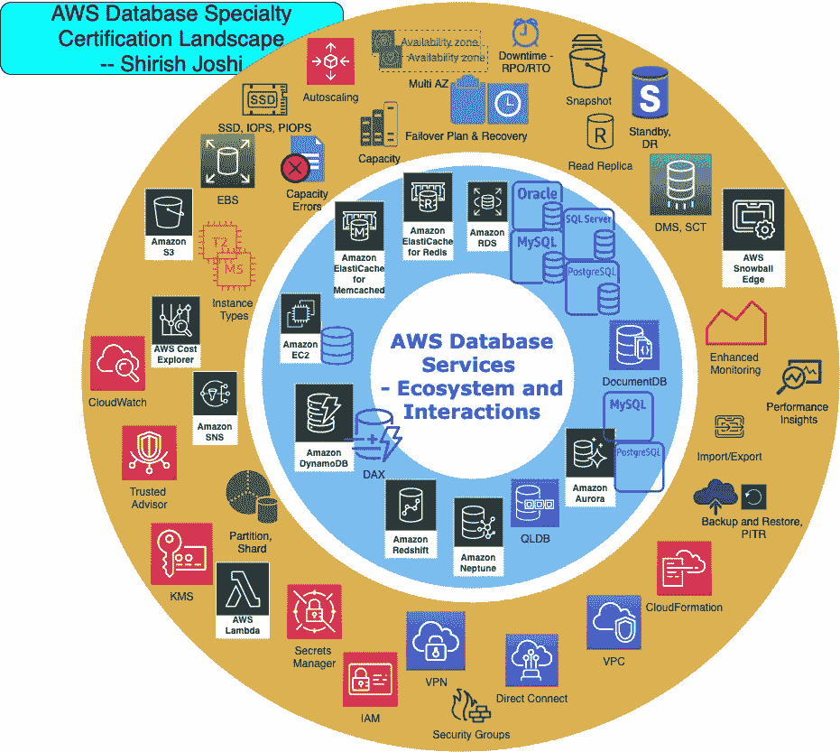

# 准备 AWS 数据库专业认证— 7 个步骤

> 原文：<https://towardsdatascience.com/preparing-for-the-aws-database-specialty-certification-7-steps-2b43aeda2e4e?source=collection_archive---------29----------------------->

# 带有视觉主题风景地图的指南

当我通过认证考试时，LinkedIn 认证组的一些社区成员问我的准备情况，并指出 Safari Books Online、Packt Publishing 或 Udemy 没有课程。

在这里，我详细介绍了建议的准备步骤，并分享了我创建的帮助我准备考试的技术主题景观图。

# 了解知识领域

了解认证的 5 个方面。这是第 0 步。

*   特定于工作负载的数据库设计
*   部署和迁移
*   管理和运营
*   监控和故障排除(包括性能)
*   数据库安全

最初不要太在意权重，对所有的都同等重要。

RDS 和 Aurora 总是最常见的话题，但这仅仅是因为它们有大量的风格和版本。

AWS 上的数据库是一个非常庞大的主题，涉及 AWS 架构知识和数据库知识的交叉。虽然解决方案体系结构助理或解决方案架构师专业认证不是强制性的，但了解这些主题非常重要。

# 参加考试准备培训—第一关

在 **AWS 培训和认证**站点进行的**考试准备:AWS 认证数据库-专业**培训应该是您的第一步。但是，我建议您在第一次通过时，以快节奏的方式进行培训，并浏览主题。

这个想法是将你自己的经验与认证考试的要求对应起来。可能有些领域你有很深的知识，很好地符合考试要求，而有些领域你可能不会在日常工作中遇到，需要一些关注。

# 阅读架构良好的白皮书

这是准备工作的第 2 步，理解数据库作为整个 AWS 架构的一部分的重要性。

数据库部分是最重要的。

# AWS 数据库专业主题前景

完成这些步骤后，转到步骤 3。重点是我创建的主题风景图。用这个来发展你自己的覆盖范围和准备地图。

我在这里用神奇的绘图工具 [draw.io](https://app.diagrams.net/) 重新创建了我的学习地图。

**下面是你阅读和使用它的方法**:对于每一个内圈的项目，从外圈里挑选一个项目，阅读或思考它。通过实践经验或从视频和最佳实践文档中使用的知识，了解组合(内圈+外圈)，如何最好地使用它，它如何影响您的架构/设计，以及如何最好地处理它。

以下是预期的范围和深度(根据我的经验):

*   希望对 Neptune、QLDB、DocumentDB、CloudFormation 和 elastic cache(memcached)有基本的了解。
*   对红移、弹性缓存(Redis)、网络、安全、成本和 Lambda 有中等水平的了解
*   关于 Dynamo、RDS(各种风格)、Aurora (MySQL 和 PostgreSQL)、迁移和 HA 的详细知识水平。

# 阅读 AWS 文档中的最佳实践部分

这是第 4 步，您将逐步导航到 AWS 文档中的每个产品，并专门查看每个产品的“最佳实践”部分。

吸收知识，反思建议。

# AWS 回复:发明视频

准备的第五步应该是在 YouTube 上看 AWS re:Invent 2017 视频(DAT3xx 和 DAT4xx)。2017 年的所有视频(以及 2016 年的一些视频)都有适当的深度，有助于准备工作。

re:Invent 2018/2019 中的一些新功能有助于实现新功能。

给出了一些链接

[AWS re:Invent 2017:新发布！亚马逊 Neptune 概述和客户用例(DAT319)](https://www.youtube.com/watch?v=9pmQXua9LWA)

[AWS re:Invent 2017:新发布！亚马逊海王星上的深潜(DAT318)](https://www.youtube.com/watch?v=6o1Ezf6NZ_E)

[AWS re:invent 2017:迁移到 Amazon Au (DAT315)并在其上运行的实践者指南](https://www.youtube.com/watch?v=vAmKg1y0nyM)

[AWS re:invent 2017:从 Oracle 和 SQL Server 迁移到亚魔卓的最佳实践(DAT309)](https://www.youtube.com/watch?v=_YO1A09Wr1g)

[AWS re:invent 2017:在 AWS 上运行 PostgreSQL 的最佳实践(DAT314)](https://www.youtube.com/watch?v=dIbei0Ewtic)

[AWS re:invent 2017:深入探索亚马逊关系数据库服务(RDS) (DAT302)](https://www.youtube.com/watch?v=TJxC-B9Q9tQ)

[AWS re:invent 2017:深入了解亚马逊 Aurora MySQL 兼容版(DAT301)](https://www.youtube.com/watch?v=rPmKo2g9znA)

[AWS re:invent 2017:深入了解亚马逊 Aurora PostgreSQL 兼容版(DAT402)](https://www.youtube.com/watch?v=nd_BT_H-vsM)

[AWS re:invent 2017:elastic cache 深度挖掘:最佳实践和使用模式(DAT305)](https://www.youtube.com/watch?v=_YYBdsuUq2M)

[AWS re:invent 2017:将数据库和数据仓库迁移到云:获取 St (DAT317)](https://www.youtube.com/watch?v=Y33TviLMBFY)

[AWS re:invent 2017:将您的 SQL Server 数据库迁移到 Amazon RDS (DAT312)](https://www.youtube.com/watch?v=CfPN2liETHU)

[AWS re:invent 2017:在亚马逊 RDS 上运行 Oracle 数据库(DAT313)](https://www.youtube.com/watch?v=GMVKBjXjp20)

[AWS re:invent 2017:~重复~什么时候用哪个数据库？](https://www.youtube.com/watch?v=KWOSGVtHWqA)

[AWS re:invent 2017:~ REPEAT ~ Amazon dynamo db(dat 403-R)的高级设计模式](https://www.youtube.com/watch?v=jzeKPKpucS0)

# 参加考试准备培训—第二遍

我建议再参加一次考试准备培训，这是第二次，现在重点更加突出。

此外，这也是浏览培训中列出的所有链接的时间。

# 参加模拟考试

此时，您应该已经准备好参加认证考试了。

参加模拟考试可能会有帮助，如果只是为了评估难度水平，以及最后一分钟的检查，以确保你对主题有体面的覆盖面。

不要因为模拟考试只有 20 道题，权重和覆盖面计算无法和真题匹配，就去关注分数。

# 结论

这份 AWS 数据库专业认证考试准备指南和可视化主题景观图应该对数据库从业者和数据架构师有用。