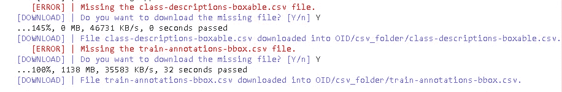
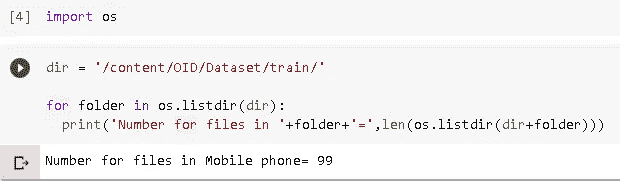
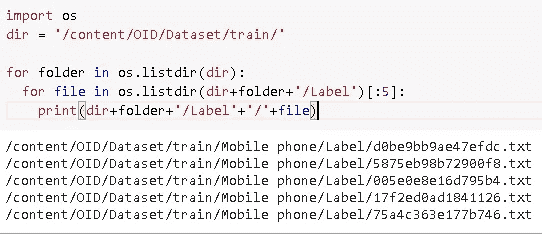

# 为 TensorFlow 对象检测准备开放图像数据集

> 原文：<https://towardsdatascience.com/preparing-open-images-dataset-for-tensorflow-object-detection-c3da6e688eb5?source=collection_archive---------23----------------------->

## 使用开放图像创建张量流对象检测数据集的指南

图片由[安德鲁·尼尔](https://unsplash.com/@andrewtneel)在 [Unsplash](https://unsplash.com) 上拍摄

> 数据是建立深度学习模型时要考虑的最强支柱之一。数据越精确，模型越有经验。为了训练深度学习模型，你需要大量的数据，你可能想要创建自己的数据，或者你可以使用互联网上的公共数据集，如[可可女士](http://cocodataset.org)、 [ImageNet](http://www.image-net.org) 、[开放图像](https://storage.googleapis.com/openimages/web/index.html)等。

有时，这些数据集遵循不同的格式，而您想要定型的模型遵循另一种格式。当数据非常大时，使数据可供模型使用变得很麻烦。这是我在创建自己的物体探测器时偶然打开的。

目标检测是计算机视觉的一个分支，它可以定位图像中的特定目标。我使用了 [Tensorflow 对象检测 API](https://github.com/tensorflow/models/tree/master/research/object_detection) 来创建我的自定义对象检测器。为了创建我的探测器，我从[开放图像 V4 数据集创建了我的数据。](https://storage.googleapis.com/openimages/web/download_v4.html)数据集包含 600 个类和总共约 170 万幅图像，分为训练集、验证集和测试集。它已经更新到 V6，但我决定用 V4，因为有两个工具我们很快就会看到。

> **为了训练一个 Tensorflow 物体检测模型，你需要创建**[**TF records**](https://www.tensorflow.org/api_guides/python/python_io#tfrecords_format_details)**，它使用了以下:**
> 
> **1。图像**
> 
> **2。图像注释**

“打开图像”既有图像，也有它们的注释。但是，所有的注释都放在一个文件中，当您需要特定类的数据时，这个文件会变得很笨拙。为了处理这个问题，我决定将数据转换成 PASCAL VOC 格式。现在，你可能会问什么是 PASCAL VOC？简而言之，PASCAL VOC 格式为每个图像创建一个 XML 文件，该文件包含图像中每个对象的边界框的坐标。很有条理，对吧？[如果你想了解更多关于 PASCAL VOC 的知识，这里的](/coco-data-format-for-object-detection-a4c5eaf518c5#:~:text=Pascal%20VOC%20is%20an%20XML,for%20training%2C%20testing%20and%20validation.)是一个很棒的参考。

现在说得够多了，让我们看看实际情况吧！

但是但是但是！在我们开始之前，你可能想和我一起走，所以这是我的 github 回购的[笔记本](https://github.com/horizons-ml/OIDv4_annotation_tool/blob/master/OIDv4_Dataset_Download_Processing.ipynb)。我们开始吧！

> 我建议使用 google colab，因为这些工具可能需要的一些文件很大，可能对未来的用例没有用处。

1.  这个[工具](https://github.com/EscVM/OIDv4_ToolKi)让我们可以下载特定类别和特定数量的图像。通过克隆 repo 下载该工具。
2.  下载完成后，您会发现一个 *classes.txt* 文件。这里您需要提到您想要收集其数据的类名。你可以在这里找到课程列表[。例如，我将采取类'手机'和 98 个图像相同。](https://storage.googleapis.com/openimages/2018_04/bbox_labels_600_hierarchy_visualizer/circle.html)
3.  粘贴以下代码:

> 当您第一次运行脚本时，该工具可能会要求您下载一些文件，允许它。下面是提示符的样子

开放图像数据集工具包的屏幕截图

该工具为每个分割创建目录，并为这些目录中的每个类创建子目录。

4.现在，让我们使用以下脚本来看看每个类的文件数量:

输出以查看手机目录中的文件

嗯（表示踌躇等）..但是我提到了 98 张图片，对吧？它会创建一个名为“Label”的文件夹，其中包含每个图像的注释。

让我们看看文件夹“标签”包含什么:

标签目录中的内容

我们为每个图像获取一个注释文件。但是，我们说完了吗？没有。注释不符合 PASCAL VOC 格式。因此，我们需要另一种工具，可以将这些注释转换成所需的格式。

这个工具为我们做最后的工作。克隆它。我稍微修改了这个工具，让名字中有一个以上单词的类可以在我的报告中找到[这里](https://github.com/horizons-ml/OIDv4_annotation_tool/blob/master/OIDv4_to_VOC.py)。

完成后，运行以下命令来转换注释文件:

这里， *sourcepath* 是每个类的“标签”文件夹的位置， *dest_path* 是存储 XML 注释的位置。

一旦创建了 XML 注释，我们就不再需要 txt 注释了。让我们删除它们:

这将删除所有类别目录中名为“Label”的所有文件夹。

现在您已经有了过滤后的数据集！😀

> **提示**:一旦数据集准备好，使用 [labelImg](https://github.com/tzutalin/labelImg) 验证注释。对象有时可能被错误地注释。

就是这样，伙计们！感谢您的阅读😊