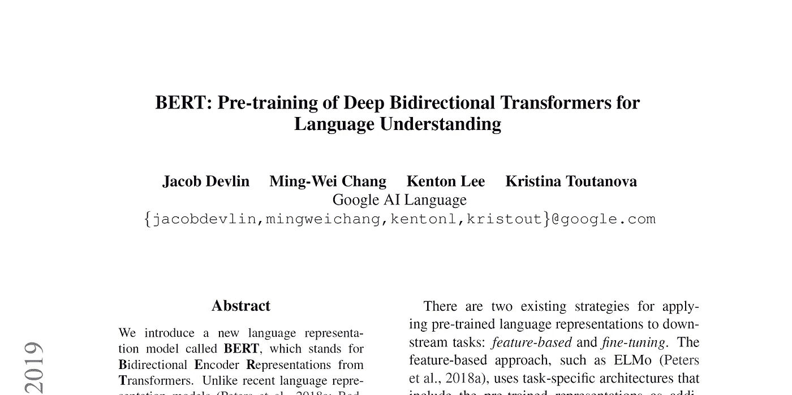

# 为变压器预培训准备数据—书面报告

> 原文：<https://towardsdatascience.com/preparing-the-data-for-transformer-pre-training-a-write-up-67a9dc0cae5a?source=collection_archive---------32----------------------->

## 为 Transformer (BERT、RoBERTa、XLM、XLNet 等)收集、连接、重排和标记所需的数据。)预培训



Devlin 等人的 [BERT 论文](https://arxiv.org/abs/1810.04805)的截图(2018)

仅在一年多前，瓦斯瓦尼等人(2017)推出的 Transformer 模型的最知名化身，Devlin 等人(2018)推出的**B**I 方向**E**n 编码器 **R** 表示来自**T**transformers(更好地称为 **BERT** )模型，此后在**自然语言处理(NLP)** 社区中变得非常受欢迎。这不仅是因为它在一系列 NLP 任务上的最先进的结果，也是因为它可以通过他们自己的库公开获得，还因为越来越受欢迎的 T21 变形金刚库。

伯特和其他变形金刚像**罗伯塔、和 XLNet** 都是在**多伦多图书语料库**数据集(朱等人，2015)和**英语维基百科**的串联上(以及其他)被预训练的。由于前者不再公开提供，而后者需要大量的预处理，这篇文章展示了**收集、连接、重排和标记**自己试验这些变压器模型所需的数据所涉及的一切(和代码)。

# 收集(和预处理)数据

## 多伦多图书语料库数据集

如前所述，朱等人(2015)的**多伦多图书语料库(TBC)** 数据集已不再公开。然而，数据集的来源仍然可用。因此，您可以按照我之前的这篇文章自己复制 TBC 数据集:

[](/replicating-the-toronto-bookcorpus-dataset-a-write-up-44ea7b87d091) [## 复制多伦多图书语料库数据集——一篇综述

### 复制不再公开的多伦多图书语料库数据集，从其…

towardsdatascience.com](/replicating-the-toronto-bookcorpus-dataset-a-write-up-44ea7b87d091) 

## 英语维基百科

虽然 [**维基百科转储**](https://dumps.wikimedia.org/) 是免费提供的，但在准备用于变压器预训练之前，它们仍然需要被提取、清理和预处理。因此，类似于 TBC 数据集，您可以在我之前的另一篇文章之后这样做:

[](/pre-processing-a-wikipedia-dump-for-nlp-model-training-a-write-up-3b9176fdf67) [## 为 NLP 模型训练预处理 Wikipedia 转储—书面报告

### 下载、提取、清理和预处理 NLP 模型的维基百科转储(例如像 BERT 这样的变压器…

towardsdatascience.com](/pre-processing-a-wikipedia-dump-for-nlp-model-training-a-write-up-3b9176fdf67) 

# ➕🔀串联和混排数据

现在，您已经收集了多伦多图书语料库数据集和英语维基百科，我们可以继续连接和重组这两者。这可以在 Bash 或类似的软件中使用下面的代码很简单地完成:

```
cat tbc_replica.txt en_wiki.txt | shuf >> concat_shuffled.txt
```

# 💥将数据符号化

收集、连接和重组数据后，现在剩下的就是对数据进行标记。在理想情况下，我们会动态地对数据进行标记，但是出于性能原因，我们会对数据进行预标记。为此，我们使用最近发布的速度惊人的 [**标记器库**](https://github.com/huggingface/tokenizers) ，也是通过下面的代码由 HuggingFace 实现的:

要对数据进行令牌化，首先在这里下载 vocab 文件，然后在您的终端中运行下面的命令:`python3 tokenize_data.pyconcat_shuffled.txt bert-base-uncased-vocab.txt`

**就这样，大功告成！**现在，您可以使用您刚刚准备好的数据，自己开始试验这些 Transformer 模型。🤗

# 参考

[1] J. Devlin 等人， [Bert:用于语言理解的深度双向变换器的预训练](https://arxiv.org/abs/1810.04805) (2018)， *arXiv 预印本 arXiv:1810.04805* 。

[2]瓦斯瓦尼等人，[注意力是你所需要的全部](https://arxiv.org/abs/1706.03762) (2017)，*神经信息处理系统进展*(第 5998–6008 页)。

[3]朱等，【书与电影的对齐:通过看电影和看书走向故事化的视觉解释】 (2015)，*IEEE 计算机视觉国际会议论文集*(第 19–27 页)。