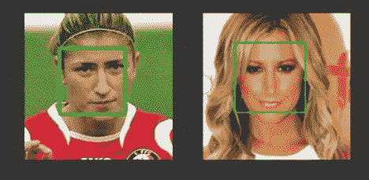
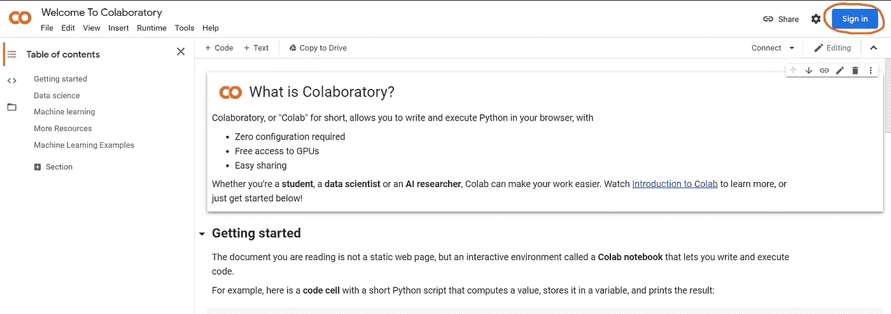
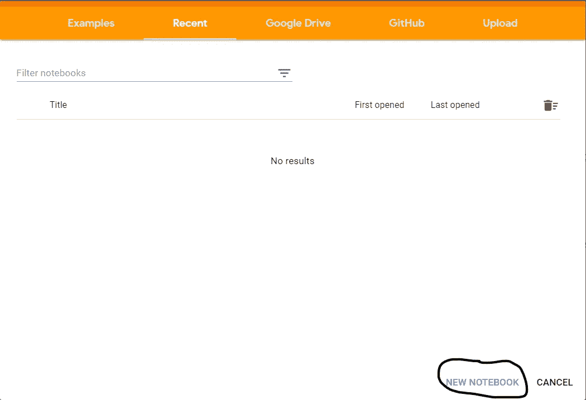
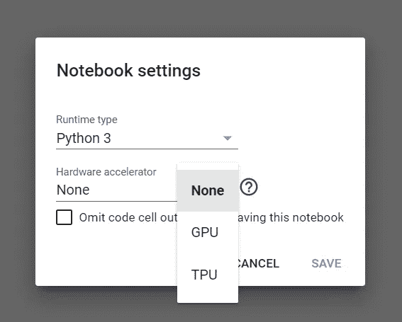
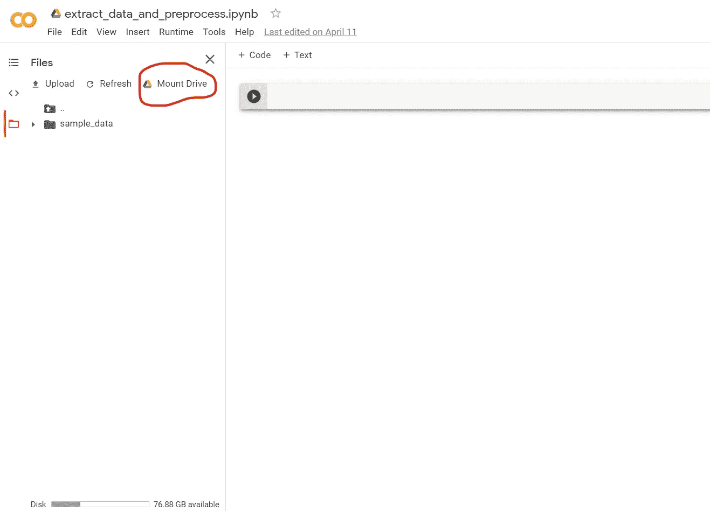

# 预处理和准备面部数据集，为 CNN 模型做好准备

> 原文：<https://towardsdatascience.com/preprocess-and-prepare-a-face-dataset-ready-for-cnn-models-885867907eb0?source=collection_archive---------20----------------------->

## 让我们使用 Google Colab、TensorFlow 和 Dlib 从 IMDB-WIKI 数据集中提取人脸，并以 CNN 友好的格式存储在 Google Drive 中。



来源:IMDB-WIKI 数据集

你好朋友们。在本文中，我将对 IMDB-WIKI 数据集进行预处理，从这些图像中提取人脸，并将它们与其他有用的信息(如姓名、年龄和性别)一起保存到 Google Drive。数据将作为对象本身存储在。泡菜格式。最棒的是，你不必在你的机器上运行一行代码，而是在 Google Colab 上运行。

在深入研究我们的代码之前，我将简要介绍一下 Google Colabs。你是否曾经担心过你的电脑处理能力不够或者你缺少一个 GPU，现在你不必再担心了，因为谷歌已经通过谷歌实验室提供了一个解决方案。通过你的浏览器在谷歌的服务器上使用 GPU 进行令人眼花缭乱的快速执行。
Google Colabs 为用户提供了一个 Jupyter 笔记本，用于交互式编码体验。它与 GitHub 无缝连接。您创建的所有笔记本都存储在您的 google drive 中。

由于我们将使用 Google Colabs，我建议您学习 Jupyter 笔记本的工作原理，因为它会让您对环境感到更加舒适。如果你想了解更多关于 Google Colab 的信息，你可以阅读这篇由 [fuat](https://medium.com/u/4b0ee587f4d1?source=post_page-----885867907eb0--------------------------------) 撰写的 [Google Colab 免费 GPU 教程](https://medium.com/deep-learning-turkey/google-colab-free-gpu-tutorial-e113627b9f5d)。

在我们开始编码之前，让我简单介绍一下我们将如何从这里开始。

*   我将在 Google Colab 上创建一个笔记本
*   我们将把 Google drive 安装到笔记本上。
*   我们将使用这个笔记本来提取和处理数据集，并将其保存在我们的 Google Drive 中。

在本文结束时，您将准备好使用 CNN 模型的数据集。

# 我们开始吧。

在本文中，我详细解释了预处理过程中需要的每个步骤。我还解释了每一行代码，这样你就不会感到困惑。

## 1)创建您的第一个笔记本

访问 [Google Colabs](https://colab.research.google.com/) 主页。您将看到一个欢迎笔记本。如果您还没有登录您的 Google 帐户，请登录。已经签到的可以跳过这一步。



图 1:显示 Colab 笔记本上的登录按钮

登录后，您将看到一个弹出框。点击右下角的“新建笔记本”按钮。



图 2:创建新笔记本

将创建一个新笔记本，您将被重定向到该笔记本。它也将被保存在你的硬盘中一个名为 Colab Notebooks 的文件夹中。

现在将你的笔记本重命名为“extract _ data _ and _ preprocess . ipynb”。

## 2)开始编码

打开您创建的“extract data _ and _ preprocess . ipynb”笔记本。

**将运行时类型改为 GPU:**

*   点击运行时选项，然后转到“更改运行时类型”。
*   选择硬件加速器选项，将其从无更改为 GPU 并保存。



图 4:将运行时改为 GPU

将你的谷歌硬盘安装到你的笔记本上。

```
**Note:** You will be able to mount your drive only after you have connected to a runtime. To connect to a runtime if not connected already click on the connect button on the top right corner.
```



图 5:安装 Google Drive

现在，我们必须导入我们将在整个数据预处理过程中使用的所有包。

代码块 1:导入所需的包。

在 Colab 中，可以在不同的单元格中编写代码，并以您喜欢的任何顺序逐一执行它们。现在，执行导入所有包的单元格。

我们将使用 dlib 的基于 CNN 的人脸识别模型来从我们的数据集中的图像中检测和提取人脸。基于 CNN 的模型比 dlib 中的 Hog 模型慢，但更精确。要了解更多关于他们的区别，请阅读由[阿伦·彭努萨米](https://medium.com/u/9af1b843339?source=post_page-----885867907eb0--------------------------------)撰写的文章[基于 CNN 的 dlib](/cnn-based-face-detector-from-dlib-c3696195e01c) 人脸检测器。

我们必须下载 CNN 模型运行所需的权重。因此，在一个新的单元格中，让我们编写代码来下载权重。

代码块 2:下载 Dlib 的 CNN 人脸识别模型的权重。

我来解释一下代码:

**第 2 行:**我已经使用 Keras 库中的 get_file 函数下载了权重。下载的文件将存储为“mmod _ human _ face _ detector . dat . bz2”

**第 3 行:**‘cache _ subdir’—此处必须给出下载文件的存储路径。

**第 4 行:**‘origin’—待下载文件的下载网址

**第 6–10 行:**在这些行中，使用 bz2 包打开下载的压缩文件，以二进制格式读取内容并存储在“mmod_human_face_detector.dat”文件中。该文件稍后将被 CNN 模型使用。

接下来让我们下载数据集。IMDB-WIKI 数据集拥有超过 45 万张图片。处理这么多的图像并从中提取数据将花费很多时间，所以我将只使用维基数据集中的那些图像。那些希望使用 IMDB-WIKI 的人可以在下面的代码中替换“dataset_url”，将“data_key”值更改为“IMDB ”,将“mat_file”值更改为“imdb.mat”。

代码块 3:下载和提取数据集。

**第 1–2 行:**数据集的下载 URL 和将从文件中提取的文件夹名称。文件夹名称与提取无关，稍后我们的代码中将会用到它。

**第 4–7 行:**使用与之前相同的功能，并给它一个不同的下载 URL。我们将“extract”参数设置为 True，这样函数将自己提取数据集。之前我们没有使用相同的函数提取，因为 bz2 文件格式不支持提取。

**第 9 行:**‘wiki’是所有图像元数据存在的密钥。当您加载。mat 文件并查看它。

**第十行:**的名字。包含图像元数据的 mat 文件。

现在已经下载并提取了数据集。让我们加载。解压缩的文件夹中存在 mat 文件。由于文件是 MatLab 格式，我们必须将其转换为 Python 数据类型。

代码块 4:加载。mat 文件和初始化所需变量

第 1 行:我们正在加载。使用 scipy 包处理数据格式转换的 mat 文件。

**第 2 行:**加载的文件为字典格式。它有一个关键的“维基”，其中有其余的数据。为了更好地理解加载文件中的所有数据，您可以打印字典或访问 [IMDB_WIKI](https://data.vision.ee.ethz.ch/cvl/rrothe/imdb-wiki/) 网站。

**第 3 行:**我们将所有图像的路径加载到 route 变量中。文件中的数据不是一种非常容易访问的格式，所以不要与我使用的多维数组访问相混淆。

**第 4–9 行:**初始化所有基本变量。

准备数据集的所有要求现在都已完成。在我们开始处理它之前，让我们编写代码来看看我们从数据集得到了什么，我们是如何处理它的，以及我们将要存储什么。

代码块 5:查看我们将要存储哪种图像的代码

**第 1 行:**创建 dlib 的基于 CNN 的人脸检测模型的对象。的。作为参数传递的 dat 文件是我们首先下载并提取的文件。

**第 6 行:**选择一个随机索引，从该路径加载图像并显示。

第 7 行:让这一行保持原样，我将在下一步简要解释。

**第 8 行:**从给定路径加载图像

**第 9 行:**由于 OpenCV 使用 BRG 格式，我们正在将图像转换为标准的 RGB 格式。

**第 10 行:**查找给定图像的面部坐标。它将返回图像中人脸的坐标列表。

**第 11–22 行:**使用 dlib 模型提供的人脸坐标，我们在人脸周围画一个方框。然后，我们使用 TensorFlow 提供的 crop_to_bounding_box 函数裁剪出该区域。然后我们显示两幅图像。裁剪后的人脸图像是每幅图像将要拍摄和存储的内容。

当您执行上面的单元时，您将看到来自您的数据集中的两个随机图像，这将向您显示图像将如何被处理。


图 6:显示提取的人脸样本。(来源:IMDB-WIKI 数据集)

终于到了处理整个数据集并从中提取我们需要的数据的时候了。

代码块 6:处理图像并提取人脸和其他所需数据。

**第 4 行:**对数据集中的所有图像运行一个循环，“I”是我们用来从 route 变量中的列表获取第 I 个路径的索引。然后，我们在该路径获取图像。这样，我们可以读取数据集中的所有图像。

**第 7 行:**使用 try-except 块，不要让一些错误的图像阻止我们的进程。

**第 8–9 行:**我正在访问的数据是创建该数据集的人对图像集的面部评分。所以我们忽略了所有没有人脸的图片。这将加快提取速度。我们还检查我们试图访问的图像的性别数据是否也可用。这将有助于我们忽略数据集中存在的所有破损图像。

**第 10–14 行:**如前所述，读取图像并检测其中的人脸。

**第 15 行:**我们只考虑一个只有一张脸的图像。

**第 18 行:**取 CNN 模型返回的人脸坐标。有时，当人脸出现在图像的角落时，模型往往会给出图像外部的坐标，使用 max 函数，我们可以确保坐标在图像内部。

**第 19–22 行:**获取脸部的高度和宽度。该模型返回“左上”和“右下”坐标。在下一行中，我们确保坐标在图像中。

**第 24 行:**使用 TensorFlow 的 image 类提供的函数从图像中裁剪人脸。

**第 28 行:**将图像大小调整为 32x32，因为图像大小对于任何 CNN 模型的训练都无关紧要，所以，我们可以减少图像所消耗的空间。

**第 31 行:**将提取的、调整大小的面部图像附加到图像列表。

**第 32 行:**出生日期以序数日期格式给出。因此，使用 datetime 类，我们将序数日期转换为 datetime 类对象，从中我们可以单独提取年份。

**第 33–35 行:**将各个数据添加到各自的数组中。

**第 37–51 行:**处理上述过程中发生的异常。所有阵列中数据的一致性非常重要。因此，当错误发生时，我们从列表中弹出图像数据和其他元数据。

现在我们已经完成了数据集的处理，是时候将数据存储到我们的驱动器中了。

代码块 7:保存包含所有已处理数据的字典。

**第 1–7 行:**用我们提取的数据创建字典。

**第 8–9 行:**检查我们将要存储数据的目录是否存在，如果不存在，我们就创建它。

**第 10–12 行:**我们在追加二进制模式下创建一个文件，并将我们的字典转储到其中。

```
**Note:** While dumping a huge object to Google Drive, it is advisable to break the data into parts and store it. The session may crash and the runtime will restart if a large file is being stored in the drive.
```

我附上了我的“extract _ data _ and _ preprocess . ipynb”笔记本的链接供你参考[https://colab . research . Google . com/drive/1 u5 or-riuleztsmo 7 en _ h85 _ HqgIPEVlN](https://colab.research.google.com/drive/1U5Or-riULEZTsmO7En_h85_HqgIPEVlN)。

希望这篇文章值得你阅读。

如有任何疑问，请随时联系我。

Instagram: [nachijr4](https://www.instagram.com/nachijr4/)

电子邮件:nachi2muthu13@gmail.com

中等:[纳赤木图](https://medium.com/@nachi2muthu13)

领英:[纳奇穆图](https://www.linkedin.com/in/nachi-muthu-4351a5112/)