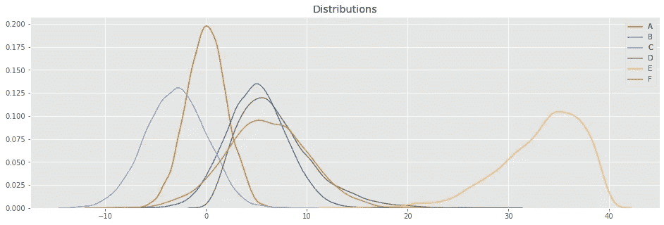

# 预处理数据:特征缩放

> 原文：<https://towardsdatascience.com/preprocessing-data-feature-scaling-cc28c508e8af?source=collection_archive---------37----------------------->

## sklearn 的一些重要特征缩放技术

照片由来自[佩克斯](https://www.pexels.com/photo/assorted-type-and-size-utility-cutters-on-clear-and-green-olfa-measuring-tool-near-adhesive-tape-rolls-1409216/?utm_content=attributionCopyText&utm_medium=referral&utm_source=pexels)的[阿多尼·加博尔](https://www.pexels.com/@adonyi-gabor-604571?utm_content=attributionCopyText&utm_medium=referral&utm_source=pexels)拍摄

一般来说，在更新每个机器学习模型的特征时，特征缩放是一个必要甚至是必不可少的步骤。*为什么这很重要？*很简单，因为我们用于预测或聚类的每个算法背后都隐藏着一些数学公式。这些数学公式几乎没有意识到每个要素之间的数值范围的变化，当涉及到梯度下降时，这一点是显而易见的！

事实上，未经缩放的数据会导致可视化困难，更重要的是，它们会降低许多机器学习算法的预测性能。这种类型的数据也可以减缓许多基于梯度的估计量的收敛，或者完全阻止它。

事实上，许多估计量是在假设所有特征在可比尺度上变化的情况下设计的。特别是，基于梯度的估计器通常假设训练数据已经标准化(具有单位方差的中心特征)。一个显著的例外是基于决策树的估计器，它对数据的任意缩放都是鲁棒的。

让我们举一个例子:假设你正在进行房价预测，你将拥有以下类型的特征:价格、表面、房间数量等。当然，这个数据框架的价值尺度根据特征是完全不同的。但是，您必须使用相同的算法来处理它们。这就是特性缩放的必要性所在！您的算法确实需要混合[0… 100，000]美元的价格、[10… 500]平方米的面积、从[1..10]房间。因此，缩放包括将这些数据放在同一级别。

> 如果您没有明智地应用特征缩放，您将会观察到缓慢的学习和降低的性能。

幸运的是， [**Scikit-Learn**](https://scikit-learn.org/stable/) 将帮助我们再次完成这项工作，但是在使用任何技术之前，我们必须了解每种技术是如何工作的。

基本上，**Scikit-Learn**([sk Learn .预处理](https://scikit-learn.org/stable/modules/classes.html#module-sklearn.preprocessing))提供了几种缩放技术，我们将回顾 4:

*   标准缩放器
*   最小最大缩放器
*   MaxAbsScaler
*   鲁棒定标器

首先，我们将创建随机数据集以及一些图形函数，这将有助于我们更好地理解上述不同技术的效果。

以下是 Python 代码:

在这段代码中，除了 trace 函数之外，我们还在一个 DataFrame (Pandas)中创建了 6 个数据集。

让我们看看我们的数据集是什么样的:

## 标准缩放器

我们将从风险可能最小的:StandardScaler()开始我们的缩放技术之旅。

这种技术假设数据是正态分布的。该函数将重新计算每个特征，以便数据以 0 和 1 为中心。

标准化公式统计

因此，标准化去除了平均值，并将数据缩放到单位方差。然而，当计算经验平均值和标准偏差时，异常值仍然有影响。

## 最小最大缩放器

这种技术通过在给定的范围(默认为[0，1])上调整来变换每个特征(x)。可以通过参数 feature_range = tuple (min，max)更改该范围。为了简单起见，下面是每个特征的变换公式:

如果这种技术可能是最广为人知的，那么它特别适用于分布不是高斯分布或者标准差很小的情况。但是，MinMaxScaler()对异常值非常敏感。在这种情况下，我们快速切换到最后一种技术:RobustScaler()。

## MaxAbsScaler

当值的分布很稀疏并且有很多整数时，这种缩放技术很有用。绝对值映射在范围[0，1]内。事实上，对于只有正值的数据，此缩放器的行为与 MinMaxScaler()类似，因此也存在较大的异常值。

## 鲁棒定标器

RobustScaler()技术使用与 MinMaxScaler()相同的缩放原理。但是，它使用四分位数范围而不是最小-最大值，这使得它在异常值方面更加可靠。以下是重新加工特征的公式:

*   Q1 (x):第一个分位数/ 25%
*   Q3 (x):第三个分位数/ 75%

与以前的缩放器不同，这个缩放器使用一些基于百分位数的居中和缩放统计数据。因此，它们不受非常大的边际异常值的影响。因此，变换后的特征值的结果范围比先前的定标器更大，更重要的是，大致相似。

# 结论

让我们总结一下我们刚刚遇到的特征缩放技术:

*   使用`[**MinMaxScaler**](https://scikit-learn.org/stable/modules/generated/sklearn.preprocessing.MinMaxScaler.html#sklearn.preprocessing.MinMaxScaler)`或`[**MaxAbsScaler**](https://scikit-learn.org/stable/modules/generated/sklearn.preprocessing.MaxAbsScaler.html#sklearn.preprocessing.MaxAbsScaler)`可以将特征缩放到一个范围，通常在零和一之间。
*   `[**MaxAbsScaler**](https://scikit-learn.org/stable/modules/generated/sklearn.preprocessing.MaxAbsScaler.html#sklearn.preprocessing.MaxAbsScaler)`是专门为缩放稀疏数据而设计的，`[**RobustScaler**](https://scikit-learn.org/stable/modules/generated/sklearn.preprocessing.RobustScaler.html#sklearn.preprocessing.RobustScaler)`不能适用于稀疏输入，但您可以对稀疏输入使用`transform`方法。
*   如果您的数据包含许多异常值，使用数据的平均值和方差进行缩放可能不会很好。在这种情况下，你需要用`[**RobustScaler**](https://scikit-learn.org/stable/modules/generated/sklearn.preprocessing.RobustScaler.html#sklearn.preprocessing.RobustScaler)`来代替。

这篇文章所基于的 Jupyter 笔记本可以在[这里](https://github.com/chouhbik/FeaturesScaling/blob/master/Feature%20Scaling.ipynb)找到。

# 参考

*   比较不同标量对有异常值的数据的影响。[https://sci kit-learn . org/stable/auto _ examples/preprocessing/plot _ all _ scaling . html](https://scikit-learn.org/stable/auto_examples/preprocessing/plot_all_scaling.html)
*   预处理数据。[https://scikit-learn.org/stable/modules/preprocessing.html](https://scikit-learn.org/stable/modules/preprocessing.html#)
*   我应该标准化数据吗？[http://www . FAQs . org/FAQs/ai-FAQ/neural-nets/part 2/section-16 . html](http://www.faqs.org/faqs/ai-faq/neural-nets/part2/section-16.html)