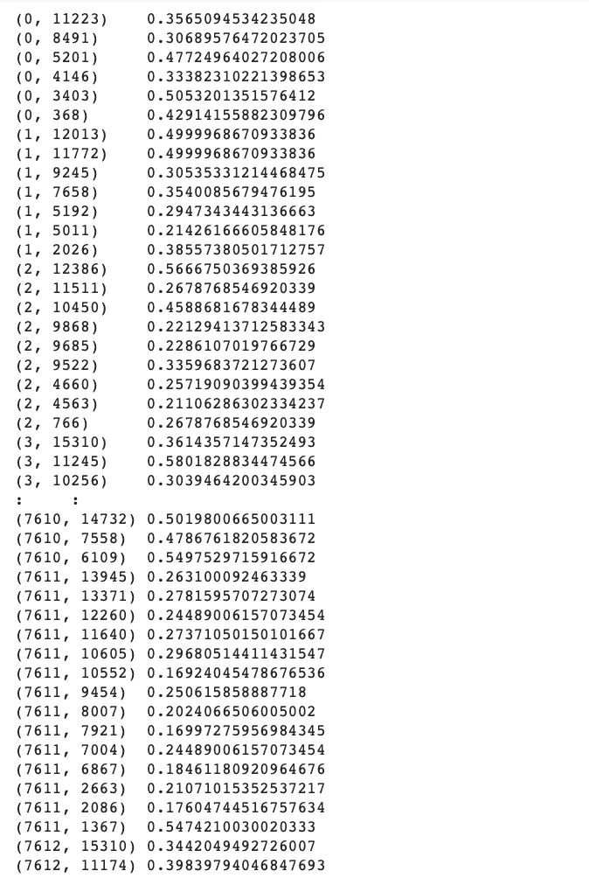

# 在 Python 中预处理文本数据:Kaggle 简介

> 原文：<https://towardsdatascience.com/preprocessing-text-data-in-python-an-introduction-via-kaggle-7d28ad9c9eb?source=collection_archive---------14----------------------->

作为一名数据科学家，您将不可避免地与文本数据打交道。处理文本数据(如推文、摘要或报纸文章)与处理传统的数字数据(如温度或金融数据)截然不同。

这种差异不比预处理期间大。虽然数字数据的预处理很大程度上依赖于数据(哪些列缺少大量数据？是否有任何列没有准备好进入模型？是否需要对任何列进行一次性编码？)，文本数据的预处理实际上是一个相当简单的过程，尽管理解每个步骤及其目的并不那么简单。

预处理文本数据的目的是将数据从原始的可读形式转换成计算机更容易处理的格式。大多数文本数据以及我们将在本文中使用的数据都是以文本字符串的形式出现的。预处理是获取原始输入数据并准备将其插入到模型中的所有工作。

这篇文章介绍了完成 [Kaggle 的灾难推文挑战](https://www.kaggle.com/c/nlp-getting-started)的整个过程。尽管本文包含了整个过程，但我们主要关注预处理步骤。本文描述了典型的文本数据预处理所涉及的各个阶段，并解释了每个阶段的基本原理和效果。有关其他步骤的更多信息，请参见每个部分中包含的链接。

这个 Kaggle 数据集由使用灾难相关语言的推文组成。目标是创建一个分类器，可以确定包含灾难相关语言的推文是否实际上是关于灾难的，或者是出于不同的非紧急目的使用相同的语言。

例如，推文“@bbcmtd 批发市场着火了【http://t.co/lHYXEOHY6C ”和“哭着要更多！“让我燃烧吧”都包含关键词“燃烧”，但其中只有一个是指灾难。对我们来说，很明显，前一条推文描述的是杂货店的火灾，而第二条推文指的不是真正的火灾或灾难——更有可能是一场音乐会。然而，如果一名数据科学家想从 Twitter 上搜集关于真实灾难的推文，以提醒医疗服务，他们将面临一个挑战:他们必须建立一个分类器，可以分辨出尽管两条推文都包含一个表示“着火”的单词，但其中只有一条描述的是真正的危险火灾。

事实证明，构建这样的分类器并不困难——我们将使用逻辑回归模型来完成。从我们阅读的 tweet 到我们的模型可以学习的数据的关键是预处理。

# 方法

对于本文，我们将基本上完成 Kaggle 挑战；即，为灾难推特数据集建立分类器。我们的大部分解释将集中在预处理部分，尽管我们将链接到每个其他步骤的有用文章。我们的方法包括数据导入、数据探索、预处理、模型训练和呈现结果。总的来说，这种方法相当简单，因为本文主要关注的是预处理。

首先当然要导入相关的包:

**数据导入**

接下来，我们导入数据。最简单的方法是首先从 Kaggle 下载数据，可以在这里找到[。然后，阅读 CSV 的使用熊猫。显然，路径取决于计算机上各自的文件位置。](https://www.kaggle.com/c/nlp-getting-started/data)

**数据探索**

首先，让我们看一下我们的数据:

灾难推文数据由四列组成:“关键词”、“位置”、“文本”和“目标”。“关键词”指的是推文中表示潜在灾难的特定单词。只有当 Twitter 用户在发送推文时标记了位置，才会存在“位置”数据。“文本”包含推文的文本。最后，“目标”是我们的因变量——如果推文指的是合法的灾难，则为 1；如果推文是误报，则为 0。

显然，在“关键字”和“位置”栏中有许多“不”字。但是有多少？这些列中的数据密度可能是一个问题。

“关键词”实际上有 99%的密度，但“位置”只有 67%的密度。我们会放弃它，因为它丢失了太多的数据。我们也将删除“关键字”,但原因不同。“关键字”是重复的，因为它只包含“文本”中的一个词。“keyword”将提供零洞察力来发现灾难性推文和非灾难性推文之间的区别，这两种推文都具有关键字“finding”。我们将删除这两列，只将“文本”作为独立变量。“文本”具有 100%的密度。

关于文本数据的探索性数据分析，我推荐[这篇文章](https://medium.com/@kamilmysiak/nlp-part-3-exploratory-data-analysis-of-text-data-1caa8ab3f79d)。

**预处理**

我们的预处理方法包括两个阶段:准备和矢量化。准备阶段包括清理数据和剔除多余内容的步骤。步骤是 1。删除 URL 和 Twitter 句柄，2。将所有文本变为小写，请按 3。删除号码，请按 4。删除标点，请按 5。标记化，6。删除停用字词，和 7。词汇化。停用词是通常不添加任何意义的词。例如，查看 [NLTK 停用词](https://gist.github.com/sebleier/554280)的列表。

标记化步骤获取一个文本字符串，并将其转换成一个标记列表(单词)。它通过解析字符串和用空格分隔来实现这一点。这意味着' hello world '变成了['hello '，' world']。在准备步骤之后执行此步骤非常重要，因为标记化会将标点符号作为单独的标记。

引理化步骤获取记号，并将每个记号分解成它的引理。一个引理本质上是一个词的基本形式，切断了变位和变位的途径。例如，“不同”会变成“不同”，“奔跑”会变成“奔跑”，“卡车”会变成“卡车”。词汇化甚至可以将“was”变成“be ”,因为 nltk 词汇化器利用了词汇表，而不是仅仅依赖于算法。

下面是准备步骤的代码。remove_urls()使用了我在 StackOverflow 上发现的一个棘手的正则表达式操作。其他函数都是不言自明的。

现在让我们将“text”列通过这个预处理管道。我们不必担心 NaNs，因为我们之前看到“text”列具有 100%的密度。

您可能已经注意到，预处理()函数有一个额外的行，它重新加入了标记列表。我们实际上更喜欢符号列表，但是我们的矢量器不接受符号列表作为输入，只接受字符串。

我们的数据现在看起来像这样:

在我们将训练数据放入矢量器之前，我们还需要准备测试数据。为了分别转换训练和测试数据，矢量器必须适合整个文本语料库(包括训练和测试数据集)。

对测试数据做同样的预处理。

现在，我们将训练和测试“pp_text”列合并到我们的文本语料库中。

现在我们已经为矢量化做好了准备。我们使用方便的 scikit-learn 工具 TfidfVectorizer。

该向量机已被应用于语料库。现在我们转换训练和测试数据。在本文中，我们将只使用 train_transform 数据。当我们在看不见的数据上测试我们的模型时，将使用 test_transform 数据。

我们现在有两个变量准备回归。y 列仍然是之前的“目标”列，通知我们这条推文是否是真正的灾难推文。x 列现在看起来像这样:

刚刚发生了什么？到目前为止，我们的所有步骤都有助于准备数据，但没有彻底改变它。现在我们的数据甚至无法识别。

根据 scikit-learn 的网站介绍， [TfidfVectorizer](https://scikit-learn.org/stable/modules/generated/sklearn.feature_extraction.text.TfidfVectorizer.html) 实际上是 [CountVectorizer](https://scikit-learn.org/stable/modules/generated/sklearn.feature_extraction.text.CountVectorizer.html#sklearn.feature_extraction.text.CountVectorizer) 后跟 [TfidfTransformer](https://scikit-learn.org/stable/modules/generated/sklearn.feature_extraction.text.TfidfTransformer.html#sklearn.feature_extraction.text.TfidfTransformer) 。CountVectorizer 首先获取我们的文本文档，并对它们进行标记，就像我们之前所做的那样(但是后来没有这样做，因为这个函数不接受标记化的数据作为输入)。一旦数据被标记化，CountVectorizer 就会收集一个由每个唯一标记组成的单词包，并为每个单词分配一个数字。最后，CountVectorizer 将标记化的文本数据表示为标记计数矩阵，如下所示:

此图像显示了 CountVectorizer 矩阵的前六行。这些行告诉我们，在文档 0 中，单词 368、3403、4146、5201、8491 和 11223 都出现了一次。我们对这些计数感兴趣，因为如果一个单词在一个文档中出现多次，这个单词可能非常重要。

TfidfTransformer 只是将这个令牌计数矩阵转换成一个词频-逆文档频率(tf-idf)表示。使用 tf-idf 很重要，因为简单地使用令牌计数可能会产生误导。以前，我们假设如果一个单词在一个文档中出现多次，那么它就是重要的。如果这个词在整个语料库中非常常见呢？那么它在我们当前文档中的高频率就不那么重要了，因为这个词在其他地方出现得如此频繁。

Tf-idf 通过将频率(基本上是计数)乘以逆文档频率(1/文档频率)来达到平衡。这意味着，如果单词 1 在文档 A 中出现一次，但在整个语料库中也出现一次，而单词 2 在文档 A 中出现四次，但在整个语料库中出现 16 次，则单词 1 将具有 1.0 的 tf-idf 分数，而单词 2 将仅获得 0.25 的分数。单词 2 在文档 A 中的重要性被其在语料库中的高频率所冲淡。(这是对[实际 tf-idf 方程](https://scikit-learn.org/stable/modules/generated/sklearn.feature_extraction.text.TfidfTransformer.html#sklearn.feature_extraction.text.TfidfTransformer)的简化解释，比较复杂。)

因此，我们得到了文档 0 的这种表示:

注意，在 CountVectorizer 表示中，文档 1 中的所有标记只出现了一次。现在，在 tf-idf 表示中，一些令牌比其他令牌具有更高的分数。Tf-idf 为我们的数据增加了一层细微差别。

我们的数据没有经过预处理，我们已经准备好进入建模阶段。

**型号**

现在是将我们的数据分成训练集和验证集的好时机。

现在，我们可以使用 scikit-learn 训练我们的模型，即逻辑回归。

# 结果

我们的模型已经被训练好了。现在让我们得到它对验证集的预测。

在我们的验证集上测试模型的结果呢？

这个结果明显好于抛硬币，这是一个好迹象。为了真正了解我们的模型是否表现良好，我们必须将其与 Kaggle 排行榜上其他人的表现进行比较。

我们在现实中表现如何？我使用本文中描述的模型对 Kaggle 给出的测试数据进行预测，然后将这些预测提交给 Kaggle。结果呢？准确度分数为 0.80572，略好于我们的验证集结果。这使我们在 3341 个提交的作品中排名第 1266 位(尽管前 428 个提交的作品都有超过 0.99 的分数——高得可疑)。干得好。

# 结论

预处理文本数据是一个漫长的过程，但实际上非常简单。尽管不同文本数据科学任务的预处理可能有所不同，但当您下次必须进行文本预处理时，了解一个文本预处理示例会非常有帮助。我希望这篇使用 Python 进行文本预处理的指南对您有所帮助。

如果您想要最终完成 Kaggle 提交，剩下的唯一步骤是使用我们训练的模型来预测 test_transform 数据，格式化和导出这些结果，并将它们提交给 Kaggle。这些步骤显示在我这篇文章的要点[这里](https://github.com/stgran/Coursework/blob/master/Practical%20Data%20Science/Preprocessing_Text_Data_in_Python.ipynb)。

# 资源

预处理的有用资源:

 [## 词干化和词汇化

### 下一步:更快发布列表交叉向上:确定以前的词汇:其他语言。的目录索引

nlp.stanford.edu](https://nlp.stanford.edu/IR-book/html/htmledition/stemming-and-lemmatization-1.html)  [## sk learn . feature _ extraction . text . tfidf vectorizer-sci kit-learn 0 . 22 . 2 文档

### class sk learn . feature _ extraction . text . tfidf vectorizer(input = ' content '，encoding='utf-8 '，decode _ error = ' strict '……

scikit-learn.org](https://scikit-learn.org/stable/modules/generated/sklearn.feature_extraction.text.TfidfVectorizer.html)  [## sk learn . feature _ extraction . text . count vectorizer-sci kit-learn 0 . 22 . 2 文档

### class sk learn . feature _ extraction . text . count vectorizer(input = ' content '，encoding='utf-8 '，decode_error='strict'…

scikit-learn.org](https://scikit-learn.org/stable/modules/generated/sklearn.feature_extraction.text.CountVectorizer.html#sklearn.feature_extraction.text.CountVectorizer)  [## sk learn . feature _ extraction . text . tfidftransformer-sci kit-learn 0 . 22 . 2 文档

### 将计数矩阵转换为归一化的 tf 或 tf-idf 表示，tf 表示词频，而 tf-idf 表示…

scikit-learn.org](https://scikit-learn.org/stable/modules/generated/sklearn.feature_extraction.text.TfidfTransformer.html#sklearn.feature_extraction.text.TfidfTransformer) 

延伸阅读:

 [## NLP 第 3 部分|文本数据的探索性数据分析

### 让我们更好地理解我们新清理的数据集

medium.com](https://medium.com/@kamilmysiak/nlp-part-3-exploratory-data-analysis-of-text-data-1caa8ab3f79d)  [## sklearn.linear_model。逻辑回归-sci kit-学习 0.22.2 文档

### 逻辑回归(又名 logit，MaxEnt)分类器。在多类的情况下，训练算法使用一对其余…

scikit-learn.org](https://scikit-learn.org/stable/modules/generated/sklearn.linear_model.LogisticRegression.html)