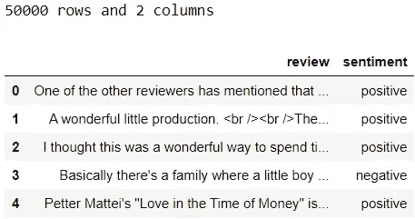
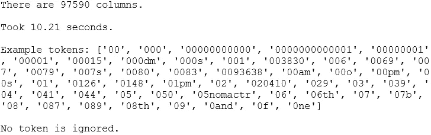
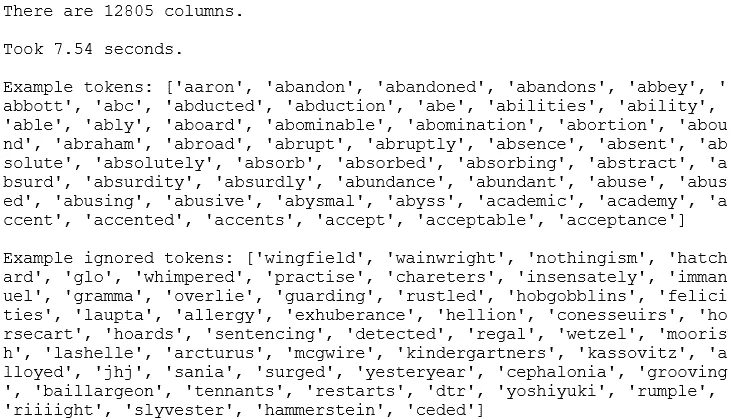
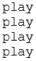
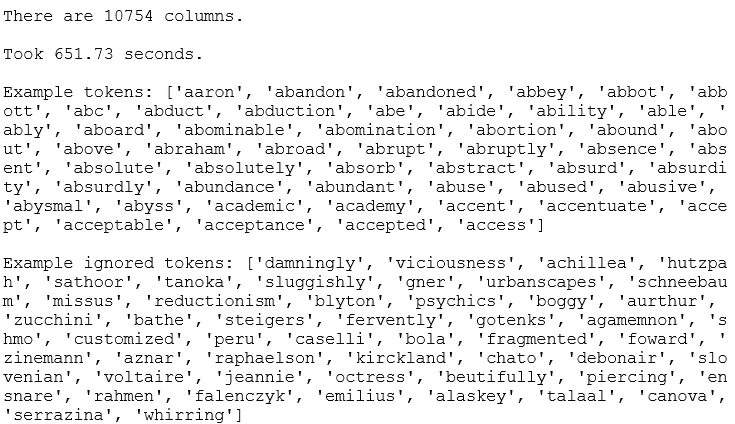
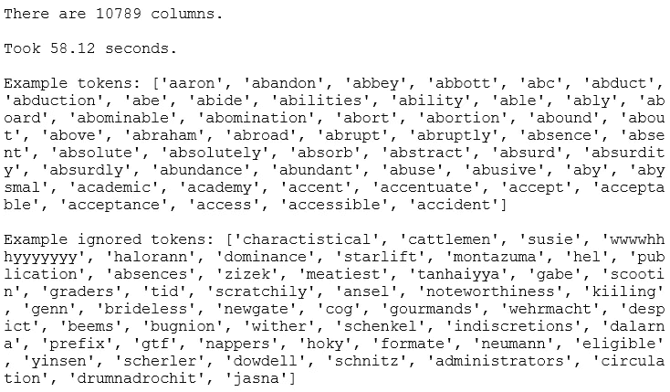
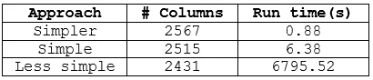

# 在 Python 中预处理文本

> 原文：<https://towardsdatascience.com/preprocessing-text-in-python-923828c4114f?source=collection_archive---------20----------------------->

## 建立情感分类器的一步

这篇文章是关于建立情感分类器的三篇连续文章中的第二篇。在第一篇文章的[中我们进行了探索性的文本分析之后，是时候对我们的文本数据进行预处理了。简单地说，预处理文本数据就是做一系列的操作，将文本转换成表格形式的数值数据。在本帖中，我们将探讨三种不同复杂度的方法来预处理文本到 *tf-idf* 矩阵，为模型做准备。如果你不确定什么是 tf-idf，](/exploratory-text-analysis-in-python-8cf42b758d9e)[这篇文章](/introduction-to-nlp-part-3-tf-idf-explained-cedb1fc1f7dc)用一个简单的例子来解释。


照片由 [Domenico Loia](https://unsplash.com/@domenicoloia?utm_source=medium&utm_medium=referral) 在 [Unsplash](https://unsplash.com?utm_source=medium&utm_medium=referral) 上拍摄

在我们开始之前，让我们后退一步，快速地看一下更大的画面。 [CRISP-DM](https://www.datasciencecentral.com/profiles/blogs/crisp-dm-a-standard-methodology-to-ensure-a-good-outcome) 方法概述了成功的数据科学项目的流程。*数据预处理*是**数据准备**阶段的关键任务之一。


CRISP-DM 工艺流程摘录

# 0.Python 设置

这篇文章假设读者(👀是的，你！)可以访问并熟悉 Python，包括安装包、定义函数和其他基本任务。如果你是 Python 的新手，[这个](https://www.python.org/about/gettingstarted/)是一个很好的起点。

我在 Jupyter 笔记本里测试过 Python 3.7.1 的脚本。

让我们在开始之前确保您已经安装了以下库:
◼️ **数据操作/分析:** *numpy，pandas* ◼️ **数据分区:***sk learn* ◼️**文本预处理/分析:** *nltk* ◼️ **拼写检查器:** *拼写检查器(pyspellchecker* 安装时

一旦你安装了 *nltk* ，请确保你已经从 *nltk* 下载了*【停用词】*和*【wordnet】*语料库，脚本如下:

```
import nltk
nltk.download('stopwords') 
nltk.download('wordnet')
```

如果你已经下载了，运行这个会通知你。

现在，我们准备导入所有的包:

```
# Setting random seed
seed = 123# Measuring run time
from time import time# Data manipulation/analysis
import numpy as np
import pandas as pd# Data partitioning
from sklearn.model_selection import train_test_split# Text preprocessing/analysis
import re, random
from nltk import word_tokenize, sent_tokenize, pos_tag
from nltk.util import ngrams
from nltk.corpus import stopwords
from nltk.stem import WordNetLemmatizer
from nltk.tokenize import RegexpTokenizer
from sklearn.feature_extraction.text import TfidfVectorizer
from spellchecker import SpellChecker
```

# 1.数据📦

我们将使用 IMDB 电影评论数据集。您可以在这里下载数据集[，并将其保存在您的工作目录中。保存后，让我们将其导入 Python:](https://www.kaggle.com/lakshmi25npathi/imdb-dataset-of-50k-movie-reviews)

```
sample = pd.read_csv('IMDB Dataset.csv')
print(f"{sample.shape[0]} rows and {sample.shape[1]} columns")
sample.head()
```



让我们来看看情绪之间的分歧:

```
sample['sentiment'].value_counts()
```


在样本数据中，情感是平均分配的。我们先把数据分成两组:*训练*和*测试*。我们将留出 5000 箱进行测试:

```
# Split data into train & test
X_train, X_test, y_train, y_test = train_test_split(sample['review'], sample['sentiment'], test_size=5000, random_state=seed, 
                                                    stratify=sample['sentiment'])# Append sentiment back using indices
train = pd.concat([X_train, y_train], axis=1)
test = pd.concat([X_test, y_test], axis=1)# Check dimensions
print(f"Train: {train.shape[0]} rows and {train.shape[1]} columns")
print(f"{train['sentiment'].value_counts()}\n")print(f"Test: {test.shape[0]} rows and {test.shape[1]} columns")
print(test['sentiment'].value_counts())
```


在这篇文章中，我们将使用*序列*进行预处理实验。只有当我们需要评估最终模型时，我们才会预处理*测试*。让我们检查一下训练数据集的头部:

```
train.head()
```


好了，我们开始预处理吧！✨

# 2.预处理文本

根据我们的处理方式，我们可以得到不同的 tf-idf 矩阵。在构建模型时，尝试不同的预处理方法是很好的。我们将研究以下 3 种方法:

1.  *更简单的方法*
2.  *简单方法*
3.  *不太简单的方法*

虽然在这篇文章中我们只讨论了将文本预处理成 tf-idf 矩阵，但是您可能还想探索其他的方法。

对于每一种方法，我们一定会衡量运行时性能，因为这是一个重要的考虑因素，特别是如果模型将被生产。我们将在下一篇文章中测试哪种方法更适合这个模型。在我们开始之前，为了使事情变得简单，让我们定义一个函数来帮助我们检查不同的方法:

```
def inspect(vectoriser, X):
    # Fit and transform
    start = time()
    print(f"There are {vectoriser.fit_transform(X).shape[1]} columns.\n")
    end = time()
    print(f"Took {round((end-start),2)} seconds.\n")

    # Inspect tokens
    tokens = list(vectoriser.vocabulary_.keys())
    tokens.sort()
    print(f"Example tokens: {tokens[:50]}\n")

    # Inspect ignored tokens
    ignored = vectoriser.stop_words_
    if len(ignored)==0:
        print("No token is ignored.")
    elif len(ignored)>50:
        print(f"Example ignored tokens: {random.sample(ignored, 50)}")
    else:
        print(f"Example ignored tokens: {ignored}")
```

## 2.1.更简单的方法 1️⃣

让我们从三个中最简单的开始。在这种方法中，我们将让 *sklearn 的 TfidfVectorizer* 做所有的预处理，而不使用任何额外的定制函数。让我们使用默认参数来感受一下我们将获得多少列:

```
vectoriser = TfidfVectorizer()
inspect(vectoriser, X_train)
```



相当快。输出超过 97，000 列，前 50 个标记大部分是数字。现在，让我们调整一些参数来进一步清理标记，并更好地控制预处理:

```
# Simpler approach
vectoriser = TfidfVectorizer(token_pattern=r'[a-z]+', stop_words='english', min_df=30, max_df=.7)
inspect(vectoriser, X_train)
```



虽然上述两个版本花费的时间差不多，但后者的列数要少 7-8 倍。在这里，我们要求 *TfidfVectorizer* 做一些事情:
◼ `token_pattern=r'[a-z]+'`:标记成字母标记——这意味着我们丢弃数字和标点符号。如果您不熟悉[正则表达式](https://docs.python.org/3/library/re.html) , `[a-z]+`意味着令牌必须只由字母组成。
◼ `stop_words='english’`:去掉停止字。
◼ `min_df=30`:移除稀有令牌。当一个令牌出现在少于 30 条评论中时，我们认为它是稀有的。这将大大减少令牌的数量。尝试在没有该参数的情况下运行脚本，并查看令牌的数量。
◼ `max_df=.7`:删除超过 70%文档中的令牌。这意味着如果一个令牌包含在超过 31.5K 个评论中，那么我们将忽略它们。实际上并没有很多单词因为这个而被排除在外。因此，我们甚至可以保留这个特性的默认值。

`max_df`和`min_df`有助于令牌选择。换句话说，在这两者的帮助下，我们可以丢弃那些或者**太频繁**可能对情感分类没有用处或者**太罕见**可能导致过度拟合的令牌。

**📍这里有一个提示:**如果我们这样定义参数:

```
TfidfVectorizer(token_pattern=r'[a-z]+', max_df=.5)
```

在匹配矢量器之后，您可以通过运行`vectoriser.stop_words_`来找出哪些令牌由于`max_df=.5`条件而被排除。当我们调用`inspect`函数时，输出的'*示例被忽略的标记'*部分显示了那些被排除的单词的片段。现在，我鼓励你运行上面的脚本并检查`vectoriser.stop_words_`。你看到了什么？你看到的大多是停用词吗？尝试将这些值更改为. 5、. 6、. 8 或. 9，然后重新运行以观察被排除的单词如何变化。这有助于理解调整某些参数如何影响预处理。现在，如果你热衷于添加`stop_words='english’`或`min_df=30`(不要同时添加两个，一次添加一个以了解单个参数)，并检查这次排除了哪些令牌。我们将在下一篇文章中构建模型时进一步调整这些参数。

🔗*如果您热衷于了解更多关于参数的信息，这里有* [*文档*](https://scikit-learn.org/stable/modules/generated/sklearn.feature_extraction.text.TfidfVectorizer.html) *。*

这种方法是一种🍰，是不是？我喜欢这种方法，尤其是因为它做一些基本的事情真的又好又快。在我看来，从简单开始总是好的，只有在提高性能的情况下才增加复杂性。

## 2.2.简单方法 2️⃣

总有改进的余地。例如，在以前的方法中，单词“播放”、“播放”、“正在播放”和“已播放”被认为是 4 种不同的标记。如果我们去掉这些屈折变化的词尾，使这些符号正常化为一个唯一的符号“play”，这不是很好吗？这就是我们在这部分要做的事情！

为了使屈折词尾正常化，我们将使用一种叫做引理满足的技术。另一种选择是词干。如果你想了解这两者的区别，我在这里简单解释了一下区别[。](/introduction-to-nlp-part-2-difference-between-lemmatisation-and-stemming-3789be1c55bc)

词条释义有助于将单词转换成词典形式。以我们之前的例子为例，让我们将它们进行比较，看看输出是什么样的:

```
lemmatiser = WordNetLemmatizer()
for word in ['play', 'plays', 'playing', 'played']:
    print(lemmatiser.lemmatize(word, 'v'))
```



酷，所有的单词现在都转换成‘玩’了。注意我们如何在`lemmatize`方法中传递 v 作为第二个参数？‘v’是一个*词性标签*。事实上，准确的词汇匹配依赖于我们随单词一起提供给词汇匹配器的词性(POS)标签。为了演示这一点，让我们重新运行前面的脚本，做一点小小的改动，将“v”变成“n”:

```
lemmatiser = WordNetLemmatizer()
for word in ['plays', 'playing', 'played']:
    print(lemmatiser.lemmatize(word, 'n'))
```


这一次，并不是所有的词都转换成了玩。这个简单的例子展示了词性标签如何影响引理满足的有效性。那么到底什么是词性标签呢？简单地说，它指的是这个词的语法范畴。单词“movie”是一个名词，而“watch”根据上下文可以是动词也可以是名词。名词和动词都是词类的例子。在第一次运行中，我们告诉 lemmatiser 提供的单词是动词(因此是‘v’)，在第二次运行中是名词(因此是‘n’)。使用 *nltk 的* *词性标注器:* `pos_tag()`，我们可以用词性来标注每个单词。

我们将很快创建一个自定义函数，根据标签进行词性标注和词汇匹配。我们将这个函数传递给`TdidfVectoriser()` *的`analyzer`参数。*当我们这样做时，以前使用的一些参数如`token_pattern, stop_words`将不再受支持。因此，我们还必须在自定义函数中包含一个标记化步骤:

```
def preprocess_text(text):
    # 1\. Tokenise to alphabetic tokens
    tokeniser = RegexpTokenizer(r'[A-Za-z]+')
    tokens = tokeniser.tokenize(text)

    # 2\. POS tagging
    pos_map = {'J': 'a', 'N': 'n', 'R': 'r', 'V': 'v'}
    pos_tags = pos_tag(tokens)

    # 3\. Lowercase and lemmatise 
    lemmatiser = WordNetLemmatizer()
    tokens = [lemmatiser.lemmatize(t.lower(), pos=pos_map.get(p[0], 'v')) for t, p in pos_tags]return tokens
```

这里需要注意的一点是，`pos_tag()`和`lemmatiser.lemmatize()`对词性标签使用不同的命名约定，所以我们必须将由 *nltk 标签器*生成的词性映射到 lemmatiser 能够理解的名称。这就是我们有`pos_map`的原因。现在，让我们预处理数据并评估:

```
vectoriser = TfidfVectorizer(analyzer=preprocess_text, min_df=30, max_df=.7)
inspect(vectoriser, X_train)
```



它将列数减少到 10，754。与*更简单的方法*中的 12，805 列相比，列数减少了约 16%。在我的电脑上花了大约 11 分钟，比这慢了 85 倍。如果我们仔细想想，词条满足不会改变评论中的每一个词。就拿“这部电影太棒了”来说吧。句子为例。唯一受益于引理满足的词是“was”。所以记住这一点，如果你需要更快地完成词条满足，有时对所有单词使用默认的词性是很好的。在这种情况下，我们的自定义函数简化为:

```
# Simple approach
def preprocess_text(text):
    # 1\. Tokenise to alphabetic tokens
    tokeniser = RegexpTokenizer(r'[A-Za-z]+')
    tokens = tokeniser.tokenize(text)

    # 2\. Lowercase and lemmatise 
    lemmatiser = WordNetLemmatizer()
    tokens = [lemmatiser.lemmatize(t.lower(), pos='v') for t in tokens]return tokensvectoriser = TfidfVectorizer(analyzer=preprocess_text, min_df=30, max_df=.7)
inspect(vectoriser, X_train)
```



列数与我们使用的词性标注器非常接近，但只花了大约一分钟。因此，在这两个版本之间，我更喜欢对这个文本数据集使用默认的词性标签。值得注意的是，如果我们不给`pos`参数提供值，lemmatiser 默认为‘n’。一般来说，我通常喜欢使用' v '作为默认，因为我发现它在一般情况下规范化更多的单词。但是，更合适的默认`pos`将取决于数据。

## 2.3.不那么简单的方法 3️⃣

在这种方法中，我们将进一步清理数据。基于从探索性数据分析中获得的知识和一般预处理思想，我们将做以下工作:

◼纠正错别字:*【chr acter】*到*【character】*
◼将英式拼法转换为美式拼法:*【realize】*到*【realize】*
◼去掉停用词

```
def convert_to_american(token):
    # Copied from [here](https://scikit-learn.org/stable/modules/feature_extraction.html)
    token = re.sub(r"(...)our$", r"\1or", token)
    token = re.sub(r"([bt])re$", r"\1er", token)
    token = re.sub(r"([iy])s(e$|ing|ation)", r"\1z\2", token)
    token = re.sub(r"ogue$", "og", token)
    return tokendef correct_typo(tokens):
    spell = SpellChecker()
    return [spell.correction(t) if len(spell.unknown([t]))>0 else t for t in tokens]

def preprocess_text(text):
    # 1\. Tokenise to alphabetic tokens
    tokeniser = RegexpTokenizer(r'[A-Za-z]+')
    tokens = tokeniser.tokenize(text)

    # 2\. Lowercase and lemmatise
    lemmatiser = WordNetLemmatizer()
    tokens = [lemmatiser.lemmatize(t.lower(), pos='v') for t in tokens]# 3\. Correct spelling (this won't convert 100% )
    tokens = correct_typo(tokens)

    # 4\. Convert British spelling to American spelling (this won't convert 100%)
    tokens = [convert_to_american(t) for t in tokens]# 5\. Remove stopwords
    stop_words = stopwords.words('english')
    stop_words.extend(['cannot', 'could', 'done', 'let', 'may' 'mayn',  'might',  'must', 'need', 'ought', 'oughtn', 
                       'shall', 'would', 'br'])
    tokens = [t for t in tokens if t not in stop_words]

    return tokens
```

除了这些，我们可以继续添加其他层来纠正和清理。但是，每个额外的步骤都会增加复杂性和运行时间，而不能保证模型性能的提高。在预处理文本时，通常可以尝试以下一些方法，这些方法在我们的例子中不是特别有用，但在其他例子中可能有用:

◼清理垃圾，如 html 标签、电子邮件地址、网址
◼将数字转换成文字，而不是丢弃它们
◼将表情符号或表情符号转换成文字

好了，让我们预处理并检查输出:

```
vectoriser = TfidfVectorizer(analyzer=preprocess_text, min_df=30, max_df=.7)
inspect(vectoriser, X_train)
```

在我开始运行这段代码的几个小时后，它仍然在运行。因为我认为它花费的时间太长，所以我不得不中断内核来停止查询。为了了解这种方法比前两种方法慢多少，我使用下面的脚本将数据集的大小减少到其大小的 1/9:

```
train = train.sample(5000, random_state=seed)
```

我在这个更小的数据子集上运行了所有三种方法。下面是三种方法的比较:



*不太简单的方法*比其他两种方法更标准化代币，但成本非常高。与其他方法相比，预处理至少要花费 1000 倍的时间。当数据集增长时，这个比率可能会变得更糟。因此，进一步追求*不那么简单的方法*是不实际的，除非它被优化为运行更快。

👂如果你有一台比我更好的计算机，这个运行时间问题可能不一定会成为你的一个限制，在这种情况下，你可以自由地继续追求。


[和](https://unsplash.com/@andyoneru?utm_source=medium&utm_medium=referral)在 [Unsplash](https://unsplash.com?utm_source=medium&utm_medium=referral) 上的合影

*您想访问更多这样的内容吗？媒体会员可以无限制地访问媒体上的任何文章。如果您使用* [*我的推荐链接*](https://zluvsand.medium.com/membership)*成为会员，您的一部分会费将直接用于支持我。*

谢谢你看我的帖子。希望您已经学会了一些不同的预处理文本的实用方法，可以应用到您的下一个 NLP 项目中。在下一篇文章中，我们将构建一个情感分类器。以下是该系列另外两篇文章的链接:◼️[python 中的探索性文本分析](/exploratory-text-analysis-in-python-8cf42b758d9e)
◼️[python 中的情感分类](/sentiment-classification-in-python-da31833da01b)

以下是我的其他 NLP 相关帖子的链接:
◼️[Python 中的简单 word cloud](/simple-wordcloud-in-python-2ae54a9f58e5)
*(下面列出了一系列关于 NLP 介绍的帖子)*
◼️ [第一部分:Python 中的预处理文本](/introduction-to-nlp-part-1-preprocessing-text-in-python-8f007d44ca96)
◼️ [第二部分:词条满足和词干的区别](https://medium.com/@zluvsand/introduction-to-nlp-part-2-difference-between-lemmatisation-and-stemming-3789be1c55bc)
◼️ [第三部分:TF-IDF 解释](https://medium.com/@zluvsand/introduction-to-nlp-part-3-tf-idf-explained-cedb1fc1f7dc)
◼️ [第四部分:python 中的监督文本分类模型](https://medium.com/@zluvsand/introduction-to-nlp-part-4-supervised-text-classification-model-in-python-96e9709b4267)

再见🏃💨