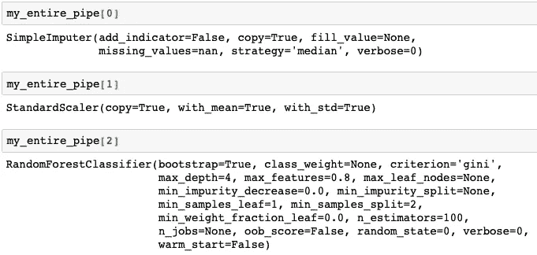
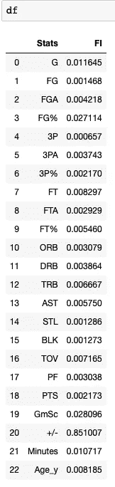
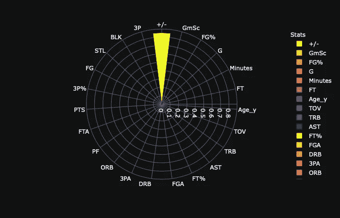
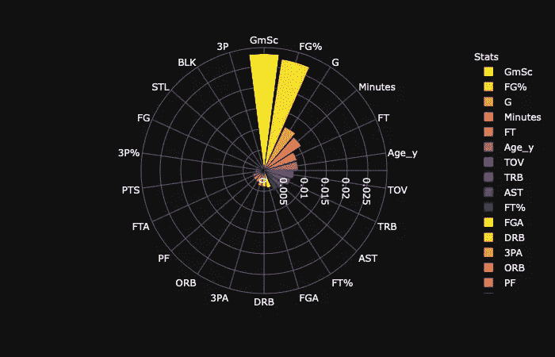

# 呈现随机森林分类器的特征重要性

> 原文：<https://towardsdatascience.com/present-the-feature-importance-of-the-random-forest-classifier-99bb042be4cc?source=collection_archive---------17----------------------->

## 机器学习

## 如何建立一个随机森林分类器，提取特征重要性，并漂亮地呈现出来。


Sebastian Unrau 在 [Unsplash](https://unsplash.com?utm_source=medium&utm_medium=referral) 上的照片

W 当报告我的机器学习模型的结果时，我总是试图呈现出比*更多的东西“我达到了高达 91%的准确率。”*因为这一句话无法体现我在建模过程中所做的这么多工作。

尽管有监督的机器学习模型旨在获得尽可能高的准确性，但您总是可以展示一些副产品，以使您的结果对应用领域有所启发。展示特性的重要性是一个好主意。

在这篇文章中，我将以 ***随机森林分类器*** 为例，展示如何*生成*，*提取*，*呈现*特征重要性。

数据的*收集*、*清理、*和*拆分*同样重要，但与这里的主题没有那么大的关联，所以有兴趣的可以在这里参考我以前的一篇文章:

[](/end-to-end-project-of-game-prediction-based-on-lebrons-stats-using-three-machine-learning-models-38c20f49af5f) [## 使用三种机器学习模型基于勒布朗数据的端到端游戏预测方案

### 综合指导一个二元分类问题使用三个不同的分类器，包括逻辑…

towardsdatascience.com](/end-to-end-project-of-game-prediction-based-on-lebrons-stats-using-three-machine-learning-models-38c20f49af5f) 

## 建一条管道。


塞缪尔·西亚尼帕尔在 [Unsplash](https://unsplash.com?utm_source=medium&utm_medium=referral) 上拍摄的照片

首先，导入我们需要的所有模块如下:

```
import pandas as pd
import numpy as np
from sklearn.model_selection import train_test_split
from sklearn.model_selection import StratifiedKFold
from sklearn.impute import SimpleImputer
from sklearn.preprocessing import StandardScaler
from sklearn.pipeline import Pipeline
from sklearn.linear_model import LogisticRegression
from sklearn.ensemble import RandomForestClassifier
from sklearn.model_selection import GridSearchCV
import plotly.express as px
```

第二，建立超参数训练功能。

```
def train_hyper_tune(X,y):
    # create the pre-processing component
    my_scaler = StandardScaler()
    my_imputer = SimpleImputer(strategy="median")

    # define classifiers
    ## Classifier : Random Forest Classifier
    clf_RF = RandomForestClassifier(random_state=0)

    # define pipeline 
    ## clf_RF
    pipe = Pipeline([('imputer', my_imputer), ('scaler', my_scaler), ('rf_model',clf_RF)])

    # create hyperparameter space 
    ## clf_RF
    param_grid = {
        'rf_model__n_estimators' : [50,100],
        'rf_model__max_features' : [0.8,"auto"],
        'rf_model__max_depth' : [4,5]
    }

    # set GridSearch via 5-fold cross-validation
    ## clf_RF
    grid = GridSearchCV(pipe2, cv=5, param_grid=param_grid)

    # run the hyperparameter tunning
    grid.fit(X,y)

    # return results of the tunning process
    return grid,pipe
```

在上面的函数中，我使用 sklearn 中强大的 [***管道模块对数据进行预处理，并在管道中建模。函数***](https://scikit-learn.org/stable/modules/generated/sklearn.pipeline.Pipeline.html)***[***GridSearchCV***](https://scikit-learn.org/stable/modules/generated/sklearn.model_selection.GridSearchCV.html)用于在定义为 ***param_grid 的超参数空间中寻找最佳超参数。******

## 训练模型。


布鲁斯·马斯在 [Unsplash](https://unsplash.com?utm_source=medium&utm_medium=referral) 上的照片

通过执行如下超参数训练过程:

```
my_grid,my_pipe= train_hyper_tune(X_train, y_train)
```

网格搜索的每次迭代的结果都存储在 *my_grid* 中。

然后，我将最佳超参数传递给我的训练函数，如下所示:

```
def train_on_entire(X,y,pipe,grid_res):
    # fit pipeline
    pipe.set_params(**grid_res.best_params_).fit(X, y)
    # return the newly trained pipeline
    return pipemy_entire_pipe = train_on_entire(X_train,y_train,my_pipe,my_grid)
```

完成了。 ***my_entire_pipe*** 是我最终训练好的模型。

我可以在 ***从未接触过的*** 测试数据集上检查我的最终模型的性能。

```
my_entire_pipe.score(X_test, y_test)
```

这给了我高达 0.901 的精度！

## 提取特征重要性。


威尔·斯图尔特在 [Unsplash](https://unsplash.com?utm_source=medium&utm_medium=referral) 上拍摄的照片

我之所以说 sklearn 中的 [***管道模块强大，是因为它可以让你追溯到你管道中每一个经过训练的组件。***](https://scikit-learn.org/stable/modules/generated/sklearn.pipeline.Pipeline.html)



提取被训练管道的部件([裕丰](https://medium.com/@jianan.jay.lin))

*随机森林分类器*的特征重要性保存在模型本身中，所以我需要做的就是提取它并将其与原始特征名称相结合。

```
d = {'Stats':X.columns,'FI':my_entire_pipe[2].feature_importances_}
df = pd.DataFrame(d)
```

要素重要性数据框如下所示:



特征重要性([裕丰](https://medium.com/@jianan.jay.lin))

到目前为止，我已经有了做以下可视化所需的一切。

## 在统计图中展示特征的重要性。

实际上，有很多方法可以呈现特性的重要性，比如*柱状图*，或者*箱线图*，如果你已经为一个健壮的度量做了 N 次建模的话。

我本人对 ***花花公子排行榜*** 情有独钟，原因可以在我之前的一篇帖子中找到，如下:

[](https://medium.com/@jianan.jay.lin/is-one-line-of-command-worth-200-dollars-6f43884aa21f) [## 一行命令值 200 美元吗？

### 我的真实故事。生成统计图的命令行花费了一个博客作者 200 美元。

medium.com](https://medium.com/@jianan.jay.lin/is-one-line-of-command-worth-200-dollars-6f43884aa21f) 

在制作图之前，我只是将特征重要性按升序排序。

```
df = df.sort_values(by='FI', ascending=0)
```

然后，生成如下的统计图:

```
fig = px.bar_polar(df, r="FI", theta="Stats",
                   color="Stats", template="plotly_dark",
                   color_discrete_sequence= px.colors.sequential.Plasma_r)
fig.show()
```



鸡冠图 1 由[俞峰](https://medium.com/@jianan.jay.lin)

哎呦！为什么看起来这么丑？

在再次检查特征重要性数据框后，我发现名为“ ***+/-*** ”(代表篮球中的加/减，估计一个篮球运动员对球队的贡献)的特征已经主导了特征空间。

这个结果表明这个特征对我们的预测模型是最重要的。既然我建立的模型是基于 ***勒布朗詹姆斯的*** 统计来预测比赛结果，那么用 ***+/-*** 来评估他的表现比其他基础统计更有预测力也是合理的。

然而，我们总是可以通过放大图形来检查所有其他特征的重要性。

```
df_drop = df[df.Stats != '+/-']
fig = px.bar_polar(df_drop, r="FI", theta="Stats",
                   color="Stats", template="plotly_dark",
                   color_discrete_sequence= px.colors.sequential.Plasma_r)
fig.show()
```



鸡冠图二由[俞峰](https://medium.com/@jianan.jay.lin)

现在我们看到几个其他的特性出现在前面，比如[比赛分数( ***GmSC*** )](https://captaincalculator.com/sports/basketball/game-score-calculator/) ，以及投篮命中率(***【FG %】***)。

我也很惊讶，这个名为***【G】***的特性，排名竟然比很多我认为应该重要的其他特性都要靠前，比如辅助( ***AST*** )。

***【G】***实际上是一个赛季的比赛指数， ***1*** 表示一个赛季的第一场比赛， ***82*** 表示一个赛季的最后一场比赛。这个特征表现出重要性的事实表明 ***勒布朗詹姆斯*** 可以沿着整个赛季的进程调整自己对比赛的影响。

就是这样。随机森林分类器中特征重要性的表示。

**如果你喜欢读这篇文章，请关注我的** [**中型**](https://medium.com/@jianan.jay.lin) **以下是我的一些其他帖子:**

[](/a-practical-suggestion-in-linear-regression-cb639fd5ccdb) [## 线性回归中的一个实用建议

### 从弹性网开始，记得调好定义 l1 范数之比的超参数。

towardsdatascience.com](/a-practical-suggestion-in-linear-regression-cb639fd5ccdb) [](/hands-on-guidance-of-data-visualization-in-r-package-ggplot2-of-nba-players-stats-d812ed272d66) [## NBA 球员统计数据 R 包“ggplot2”中数据可视化的实践指导

### 应用于 NBA 数据的 R 数据可视化工具“ggplot2”的 6 分钟之旅。

towardsdatascience.com](/hands-on-guidance-of-data-visualization-in-r-package-ggplot2-of-nba-players-stats-d812ed272d66) 

照片由[阿里·帕扎尼](https://unsplash.com/@alipzn?utm_source=medium&utm_medium=referral)在 [Unsplash](https://unsplash.com?utm_source=medium&utm_medium=referral) 上拍摄