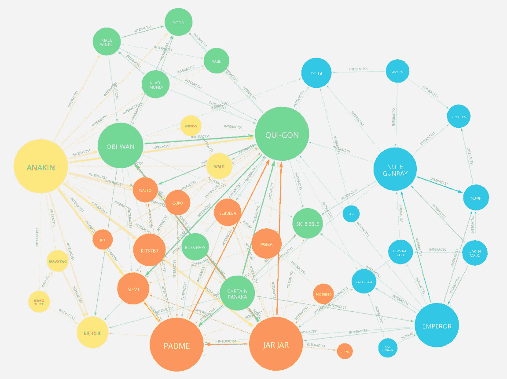
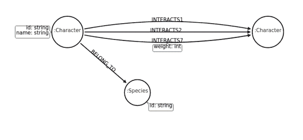

# 在《星球大战》宇宙中呈现 Neo4j 图形数据科学的多节点标签支持和图形可变性特征

> 原文：<https://towardsdatascience.com/presenting-multiple-node-label-support-and-graph-mutability-features-of-the-neo4j-graph-data-a0b0ea744884?source=collection_archive---------22----------------------->

## 浏览 Neo4j 图形数据科学库中的算法执行和图形可变性功能的节点过滤器，并使用星球大战网络

*文章于 2022 年 4 月 30 日更新，以遵循新的 GDS 2.0 语法*



我决定暂时停止观看我强烈推荐的鲍勃·罗斯的[绘画之乐，并检查 Neo4j 图形数据科学 2.0 版中的一些新语法。](https://en.wikipedia.org/wiki/The_Joy_of_Painting)

对我来说，一个非常酷的 GDS 功能是在执行图形算法时能够通过标签过滤节点。类似于关系，我们可以用 *relationshipTypes* 参数选择哪些应该被图算法考虑，我们可以用新的 *nodeLabels* 参数过滤哪些节点应该被使用。我们还将看看投影图的可变性特性。

我喜欢寻找新的社交网络，以免我的博客文章变得无聊和重复。在这里，我们将深入研究星球大战世界。由于 Evelina Gabasova 的帮助，人物之间的互动在 GitHub 上[可用。我们将把它与 Florent Georges 提供的数据集](https://github.com/evelinag/StarWars-social-network/tree/master/networks)[结合起来，Florent Georges 抓取了](https://github.com/fgeorges/star-wars-dataset/)[星球大战 API](https://swapi.dev/) 并添加了来自维基百科的描述。

# 图表模式和导入



星球大战图表模式

我们的图表由与其他角色有**交互**关系的角色组成。 **X** 的值指示交互发生在哪一集，例如**交互 1** 指示第一集的交互。每个角色也属于一个物种，该物种被表示为与物种节点的关系。

我们将从导入交互社交网络开始。数据集有点棘手，因为角色在每集中都没有唯一的 id。相反，在每一集中，一个新的 id 被确定为 JSON 文件的“nodes”元素中的字符的从零开始的索引。为了缓解这个问题，我们使用`apoc.cypher.runMany`过程为每一集运行两个事务。首先，我们存储节点，并根据从零开始的索引为它们赋值。在第二个事务中，我们使用该值存储字符之间的链接。每集都重复这一过程。

```
UNWIND range(1,7) as episode 
CALL apoc.load.json('https://raw.githubusercontent.com/evelinag/StarWars-social-network/master/networks/starwars-episode-' + toString(episode) + '-interactions.json')
YIELD value as data 
CALL apoc.cypher.runMany("
    WITH $data.nodes as nodes 
    UNWIND range(0,size(nodes)-1) as value 
    MERGE (c:Character{id:nodes[value].name}) 
    SET c.value = value RETURN distinct 'done'
    ;
    WITH $data as data, $episode as episode 
    UNWIND data.links as link 
    MERGE (source:Character{value:link.source}) 
    MERGE (target:Character{value:link.target}) 
    WITH source, target, link.value as weight, episode 
    CALL apoc.create.relationship(source,'INTERACTS' + episode, {weight:weight}, target) YIELD rel 
    RETURN distinct 'done'", {data:data, episode:episode},{statistics:true,timeout:10}) 
    YIELD result RETURN result
```

我们将继续用该物种的信息丰富我们的图表。不幸的是，两个数据集之间的字符名称并不完全匹配。我们可以使用几种方法来找到与角色名字最接近的匹配。APOC 图书馆有一整块区域致力于[文本相似程序](https://neo4j-contrib.github.io/neo4j-apoc-procedures/3.5/utilities/text-functions/#_text_similarity_functions)。我决定使用[全文搜索索引](https://neo4j.com/docs/cypher-manual/current/administration/indexes-for-full-text-search/)来匹配角色的名字。我们首先在字符的 id 属性上定义全文搜索索引。

```
CALL db.index.fulltext.createNodeIndex(
    "names",["Character"],["id"])
```

每个全文搜索查询可能会返回多个结果，但是我们将只查看顶部的结果。如果顶部结果的分数高于任意阈值，在我们的例子中是 0.85，我们将假设它是相同的字符。我们可以看一些例子:

```
CALL apoc.load.json('https://raw.githubusercontent.com/fgeorges/star-wars-dataset/master/data/enriched.json') YIELD value UNWIND value.people as person
CALL db.index.fulltext.queryNodes("names", 
    replace(person.name,'é','e')) 
YIELD node,score
RETURN person.name as species_dataset_name,
       collect(node)[0].id as interactions_dataset_name
LIMIT 5
```

结果

或多或少，物种数据集包含全名，而交互数据集只包含角色的名。因为全文搜索匹配看起来很好，所以让我们继续将附加信息存储到图中。

```
CALL apoc.load.json('https://raw.githubusercontent.com/fgeorges/star-wars-dataset/master/data/enriched.json')
YIELD value
UNWIND value.people as person
// search for characters
CALL db.index.fulltext.queryNodes("names", 
    replace(person.name,'é','e'))
YIELD node,score
// collect the top hit
WITH person, collect([node,score])[0] as top_hit
WITH person, top_hit[0] as node, top_hit[1] as score
// threshold
WHERE score > 0.85
// enrich characters
SET node += apoc.map.clean(person,
    ['films','vehicles','starships','species'],['n/a'])
WITH node, person.species as person_species
UNWIND person_species as species
MERGE (s:Species{id:species})
MERGE (node)-[:BELONG_TO]->(s)
```

我们还将导入关于该物种的额外元数据。

```
CALL apoc.load.json('https://raw.githubusercontent.com/fgeorges/star-wars-dataset/master/data/enriched.json')
YIELD value
UNWIND value.species as species
MATCH (s:Species{id:species.url})
SET s += apoc.map.clean(species, 
    ['films','homeworld','people','url'],['n/a','unknown'])
```

不幸的是，我们还没有给我们所有的角色分配物种。一些字符出现在第一个数据集中，而没有出现在第二个数据集中。由于这篇博文的重点不是展示如何有效地搜索互联网，所以我准备了一个 CSV 文件，我们可以用它来指定缺失物种的值。

```
LOAD CSV WITH HEADERS FROM 
"https://raw.githubusercontent.com/tomasonjo/blogs/master/Star_Wars/star_wars_species.csv" as row
MATCH (c:Character{id:row.name})
MERGE (s:Species{name:row.species})
MERGE (c)-[:BELONG_TO]->(s)
```

有些物种只有一两个成员，所以我决定把它们归为“其他”物种。这样，我们将使我们进一步的图形分析更加相关。

```
MATCH (s:Species)
WHERE size((s)<-[:BELONG_TO]-()) <= 2
MERGE (unknown:Species{name:'Other'})
WITH s, unknown
MATCH (s)<-[:BELONG_TO]-(character)
MERGE (unknown)<-[:BELONG_TO]-(character)
DETACH DELETE s
```

# 多节点标签支持

我们现在可以看看多节点标签投影，以及它如何允许我们在执行图形算法时过滤节点。因为我们将使用[原生投影](https://neo4j.com/docs/graph-data-science/current/management-ops/native-projection/)，我们必须根据他们的种族给角色分配二级标签。我们将使用`apoc.create.addLabels`程序来分配二级标签。

```
MATCH (c:Character)-[:BELONG_TO]->(species)
CALL apoc.create.addLabels([id(c)], [species.name]) YIELD node
RETURN distinct 'done'
```

如果你对 [GDS 图表目录](https://neo4j.com/docs/graph-data-science/current/management-ops/graph-catalog-ops/)的概念不熟悉，你可能想看看我以前的[博客帖子](/exploring-the-graph-catalog-feature-of-neo4j-graph-data-science-plugin-on-a-lord-of-the-rings-d2de0d0a023)。我们将使用 array 选项来描述我们想要投影的节点标签。属于所有五个物种的节点将被投影。交互网络中的所有关系也将被投影并被视为无向和加权的。由于给定的一对节点之间可能有不止一个关系，我们[投影一个多重图](/analyzing-multigraphs-in-neo4j-graph-data-science-library-35c9b6d20099)。

```
CALL gds.graph.project('starwars',
  ['Other','Human','Droid','Neimodian','Gungan'],
  {INTERACTS1:{type:'INTERACTS1', orientation:'UNDIRECTED', properties:['weight']},
   INTERACTS2:{type:'INTERACTS2', orientation:'UNDIRECTED', properties:['weight']},
   INTERACTS3:{type:'INTERACTS3', orientation:'UNDIRECTED', properties:['weight']},
   INTERACTS4:{type:'INTERACTS4', orientation:'UNDIRECTED', properties:['weight']},
   INTERACTS5:{type:'INTERACTS5', orientation:'UNDIRECTED', properties:['weight']},
   INTERACTS6:{type:'INTERACTS6', orientation:'UNDIRECTED', properties:['weight']}})
```

首先，让我们计算整个投影图上的加权 [PageRank](https://neo4j.com/docs/graph-data-science/current/algorithms/page-rank/) 。

```
CALL gds.pageRank.stream('starwars',
   {relationshipWeightProperty:'weight'})
YIELD nodeId, score
RETURN gds.util.asNode(nodeId).name as name, score
ORDER BY score DESC LIMIT 5
```

结果

结果并不令人惊讶，也许除了汉索罗似乎是银河系中最重要的人物。这是因为阿纳金·天行者和达斯·维德在我们的网络中被视为两个独立的实体，否则阿纳金可能会在上面。尽管如此，从 PageRank 评分来看，所有前五个角色的重要性都非常相似，没有人真正脱颖而出。

假设我们想找到冈根人社交网络中最重要的人物。在带有*节点标签*参数的算法中，我们可以只考虑冈根人。

```
CALL gds.pageRank.stream('starwars',{nodeLabels:['Gungan'], 
   relationshipWeightProperty:'weight'})
YIELD nodeId, score
RETURN gds.util.asNode(nodeId).id as name, score
ORDER BY score DESC LIMIT 5
```

正如你所料，传奇人物加·加最终胜出。

我们还可以结合节点和关系过滤器。我们将在第五集和第六集中根据人类和其他物种的互动网络来计算 PageRank。

```
CALL gds.pageRank.stream('starwars',{nodeLabels:['Other','Human'],
   relationshipTypes:['INTERACTS5','INTERACTS6'], 
   relationshipWeightProperty:'weight'})
YIELD nodeId, score
RETURN gds.util.asNode(nodeId).name as name, score
ORDER BY score DESC LIMIT 5
```

结果

看起来卢克和莱娅已经长大了。节点过滤特性的增加允许我们在描述我们想要考虑作为图算法的输入的投影图的子集时非常精确。完成分析后，我们可以从目录中删除投影图。

```
CALL gds.graph.drop('starwars')
```

# 图形可变性

有了图形可变性特性，图形算法在先前支持的**流**和**写**之上有了第三种模式**变异**。我们可以看看[官方文档](https://neo4j.com/docs/graph-data-science/current/common-usage/running-algos/#running-algos-mutate)来更好地了解它提供了什么:

> *`*mutate*`*模式与* `*write*` *模式非常相似，但不是将结果写入 Neo4j 数据库，而是在内存图形中提供。注意，* `*mutateProperty*` *必须事先不存在于内存图形中。这使得可以在同一个内存图形上运行多个算法，而无需在算法执行期间将结果写入 Neo4j。**

*基本上， **mutate** 模式与 **write** 模式几乎相同，只是它不直接将结果写入 Neo4j 存储的图形，而是将结果存储到同一个内存中的投影图形，该图形用作图形算法的输入。稍后，如果我们愿意，我们仍然可以使用`gds.graph.writeNodeProperties`过程将内存中图形的变异属性存储到 Neo4j 中。*

*我们将从投影一个新的内存图形开始。这次我们将使用 [cypher projection](https://tbgraph.wordpress.com/2020/03/17/how-to-use-cypher-projection-in-neo4j-graph-data-science-library-on-a-lord-of-the-rings-social-network/) 。在节点查询中，我们将只过滤第一集出现的字符。我们还提供了*标签*列，这将允许我们在执行算法时过滤节点。如果仔细观察， *labels* 列是数组的形式，这意味着单个节点可以有多个标签。同样，通过 cypher projection，我们可以提供一个虚拟标签，如查询所示。*

```
*CALL gds.graph.project.cypher('starwars_cypher',
  'MATCH (species)<-[:BELONG_TO]-(c:Character)
   // filter characters from first episode
   WHERE (c)-[:INTERACTS1]-() 
   RETURN id(c) as id, [species.name] as labels',
  'MATCH (c1:Character)-[r]-(c2:Character) 
   RETURN id(c1) as source, id(c2) as target, 
          type(r) as type, r.weight as weight',
   {validateRelationships:false})*
```

*Cypher Projection 的一个特性是 *validateRelationships* 参数。如果我们试图投影节点查询中没有描述的节点之间的关系，默认设置会抛出一个错误。因为我们在节点查询中只投射第一集的角色，但是试图在关系查询中投射所有角色之间的交互，所以我们会得到一个错误。我们可以在关系查询中添加一个过滤器，或者只是将 *validateRelationship* 参数设置为 false。这样，在图形投影期间，节点查询中未描述的节点之间的所有关系都将被忽略。*

*最后，我们可以尝试一下用于社区检测的[鲁文算法](https://neo4j.com/docs/graph-data-science/current/algorithms/louvain/)的变异模式。我们将在物种内部而不是在整个网络上调查第一集的社区结构。为了实现这一点，我们必须为每个物种分别运行算法，并且只考虑来自具有*节点标签*参数的给定物种的角色，并且只考虑来自具有*关系类型*参数的第一集的交互。为了定义用于将结果存储到内存图的指定属性，我们使用了 *mutateProperty* 参数。*

```
*MATCH (s:Species)
CALL gds.louvain.mutate('starwars_cypher', 
    {nodeLabels:[s.name], mutateProperty: s.name + '_1',
     relationshipTypes:['INTERACTS1']}) 
YIELD communityCount
RETURN s.name as species, communityCount*
```

*结果*

*我们现在可以使用第一集中角色社区的变异属性作为种子属性来计算第二集中的社区。通过给每个节点分配一个唯一的 id 来初始化 Louvain 算法。使用*seed property*参数，我们可以定义每个节点的初始唯一 id。如果你想了解更多关于种子属性和它的用例，我写了一篇关于它的博客文章。*

```
*MATCH (s:Species)
CALL gds.louvain.mutate('starwars_cypher',
  {nodeLabels:[s.name], mutateProperty: s.name + '_2',
  relationshipTypes:['INTERACTS2'], seedProperty: s.name + '_1'})
YIELD communityCount
RETURN s.name as species, communityCount
ORDER BY communityCount DESC*
```

*结果*

*我们可以观察到第二集中的社区数量略有减少。要将变异的属性写回 Neo4j 存储图，我们可以使用`gds.graph.writeNodeProperties`过程。*

```
*CALL gds.graph.writeNodeProperties('starwars_cypher',
  ['Human_1','Human_2'])*
```

*我们现在可以检查第一集里人类的社区结构。*

```
*MATCH (c:Human)
WHERE exists (c.Human_1)
RETURN c.Human_1 as community,
       count(*) as size, 
       collect(c.id) as members*
```

*结果*

*并在第二集中考察这些社区是如何进化的。*

```
*MATCH (c:Human)
WHERE exists (c.Human_2)
RETURN c.Human_2 as community,
       count(*) as size,
       collect(c.id) as members*
```

*结果*

# *结论*

*有了多节点标签支持，我们能够在内存中投影整个图，并非常具体地描述我们希望用作图算法输入的子图，因为我们现在可以过滤节点和关系。图形可变性允许我们链接各种图形算法，而不需要删除和重新创建具有新计算属性的投影图。在我看来，这是 [Neo4j 图形数据科学](https://github.com/neo4j/graph-data-science)库的一大特色。*

*如果你心中有任何很酷的数据集，你想让我分析，或者有任何关于你接下来想看到什么的反馈，请告诉我。与往常一样，代码可以在 [GitHub](https://github.com/tomasonjo/blogs/blob/master/Star_Wars/Star%20Wars.ipynb) 上获得。*