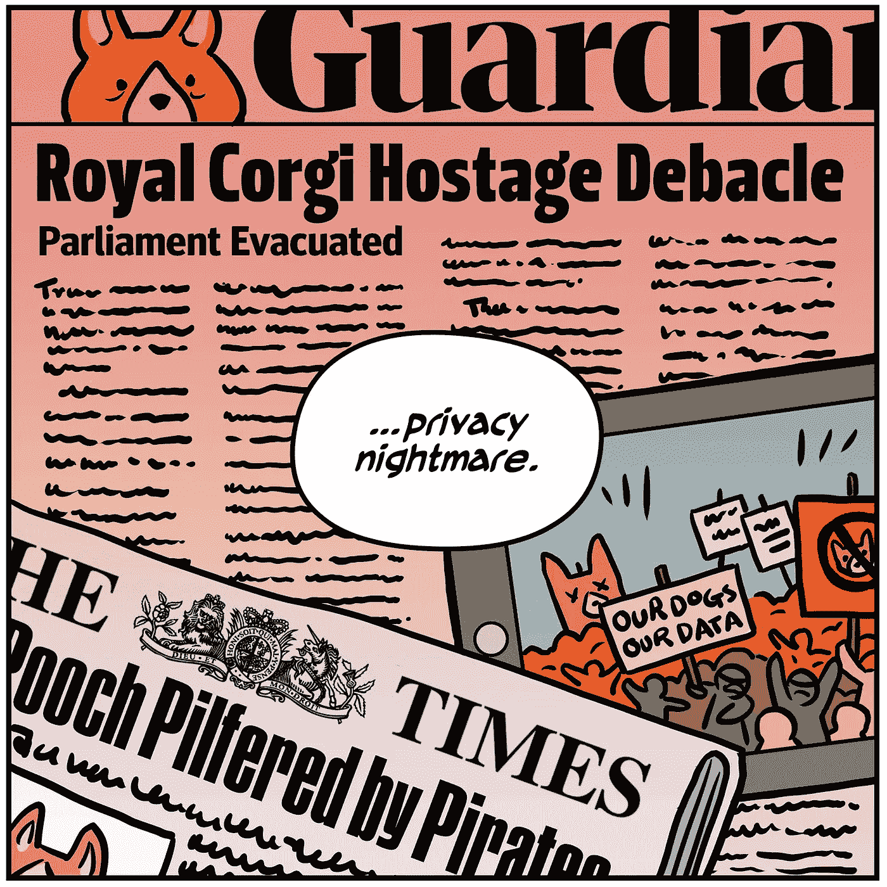
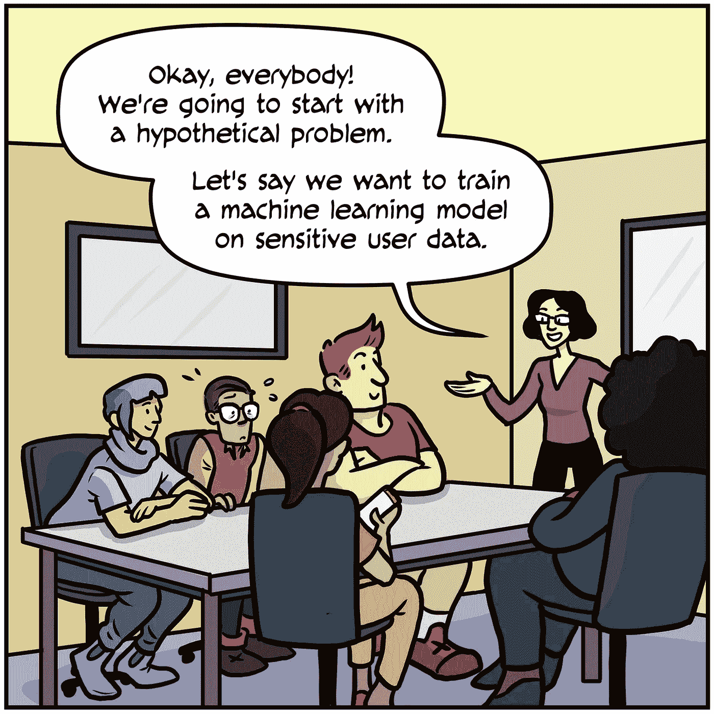
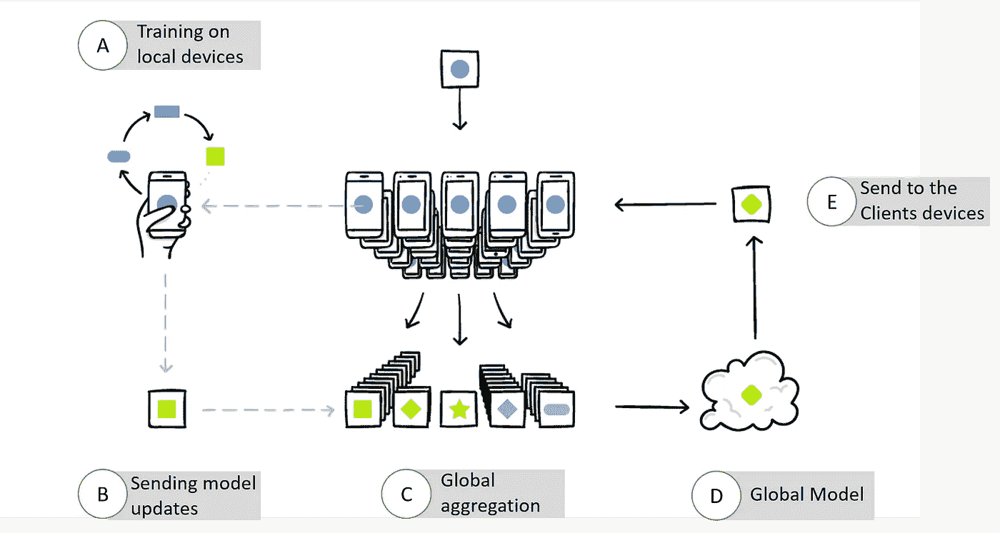
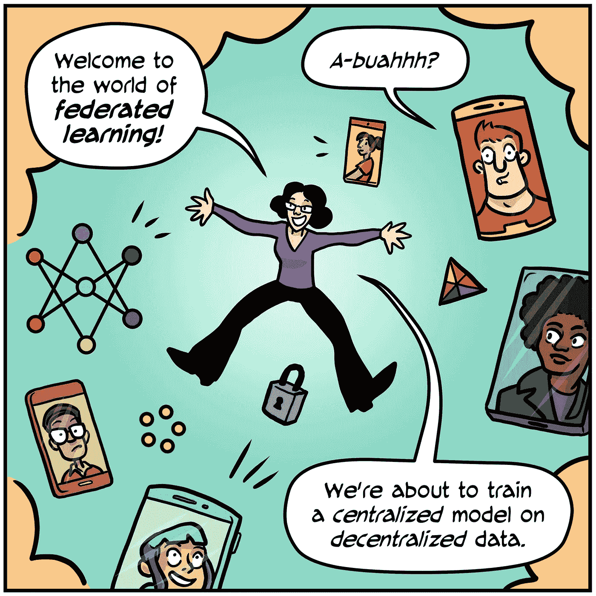
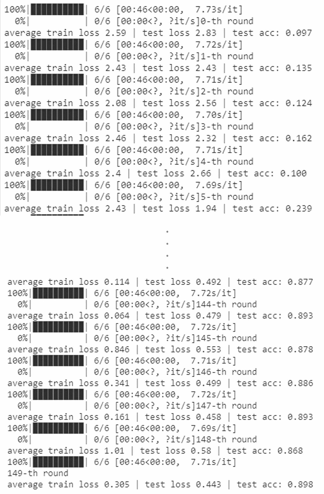

# 在深度学习中保护数据隐私|第 1 部分

> 原文：<https://towardsdatascience.com/preserving-data-privacy-in-deep-learning-part-1-a04894f78029?source=collection_archive---------11----------------------->

## 理解联邦学习的基础及其使用 PyTorch 的实现

链接到第二部分(将 CIFAR10 分发到真实世界/非 IID 数据集):
[https://towardsdatascience . com/preserving-data-privacy-in-deep-learning-part-2-6c2e 9494398 b](/preserving-data-privacy-in-deep-learning-part-2-6c2e9494398b)

链接第三部分(非 IID 数据集联合学习的实现):[https://towardsdatascience . com/preserving-data-privacy-in-deep-Learning-part-3-AE 2103 c 40 c 22](/preserving-data-privacy-in-deep-learning-part-3-ae2103c40c22)

照片由 [Harsh Yadav](https://www.instagram.com/p/CBelzJ4pifV/?utm_source=ig_web_copy_link) 拍摄

非常感谢著名数据科学家阿克谢·库尔卡尼先生对本教程的启发和指导。

在数据和数字化革命的世界中，越来越多的个人信息被共享和存储，这开辟了保护数据隐私的新领域。但是，什么是数据隐私，为什么需要保护它？

照片由[谷歌人工智能](https://federated.withgoogle.com/)

数据隐私定义了特定信息/数据应如何处理，或者谁有权根据其相对重要性进行访问。随着 AI(机器学习和深度学习)的引入，可以从这些模型中提取大量的个人信息，这对个人数据被暴露的人会造成不可挽回的损失。因此，在实现各种机器学习模型的同时，需要保留这些数据。

在这一系列教程中，主要关注的是保护深度学习模型中的数据隐私。您将探索不同的方法，如联合学习、差分隐私和同态加密。

在本教程中，您将发现如何在机器学习模型上使用联邦学习来保护数据隐私。完成本教程后，您将了解:

1.  联邦学习的基础
2.  在客户端之间划分数据(用于联合学习)
3.  模型架构
4.  全局权重中分散权重的聚合

# 介绍

F 深度学习，也称为协作学习，是一种深度学习技术，其中在多个分散的边缘设备(客户端)或服务器上对其个人数据进行训练，而不与其他客户端共享数据，从而保持数据的私密性。它旨在训练机器学习算法，例如，在具有本地数据集的多个设备(客户端)上的深度神经网络，而无需显式交换数据样本。

照片由[谷歌人工智能](https://federated.withgoogle.com/)拍摄

这种训练同时发生在其他设备上，成百上千的设备。在用不同的数据在不同的设备上训练相同的模型之后，它们的权重(训练的概要)被发送到全局服务器，在那里进行这些权重的聚合。使用不同的聚合技术来充分利用在客户端设备上学习的权重。在聚合之后，全局权重再次被发送到客户端，并且训练在客户端的设备上继续。在联合学习中，这整个过程被称为一轮通信，这是为了进一步提高模型的准确性而进行的通信次数。

Google AI 拍摄的照片

联邦学习使人工智能算法能够从位于不同地点的大量数据中获得经验。这种方法使几个组织能够协作开发模型，而不必彼此共享敏感数据。经过几轮沟通后，共享模型(全局模型)接触到的数据范围比任何单个客户端拥有的数据范围都要大得多，同时，它也了解了客户端特有的特性。

有两种类型的联合学习:

1.  **集中式联邦学习:**在这种设置中，中央服务器用于编排算法的不同步骤，并在学习过程中协调所有参与节点。服务器负责在训练过程开始时选择节点，并负责聚合接收到的模型更新(权重)。是系统的瓶颈。
2.  **分散联邦学习:**在这种类型中，节点能够协调自己以获得全局模型。此设置可防止单点故障，因为模型更新仅在互连节点之间交换。

现在我们已经清楚了什么是联合学习，让我们继续在 PyTorch 中从头构建一个，并在 CIFAR10 数据集上训练它。借助本教程，我们将了解联邦学习的基本流程。我们既不会详细讨论服务器-客户端通信在现实世界中是如何工作的，也不会讨论聚合技术，这将在接下来的教程中讨论。在本研究中，数据集被随机分为客户端，所有本地模型将在同一台机器上接受训练。我们走吧。

## 1.导入所有相关的包

导入相关模块

照片由[谷歌人工智能](https://federated.withgoogle.com/)

## 2.超参数

1.  **num_clients** :客户端总数，进一步用于将数据集划分为 num_clients，每个客户端具有相同数量的图像。
2.  **num_selected** :通信回合中从 num_clients 中随机选择的客户端数量。用于培训部分。通常，num_selected 大约是 num_clients 的 30%。
3.  **num_rounds** :通信轮次总数。在每轮通信中，随机选择 num_clients，在客户端设备上进行训练，然后将各个模型权重聚合到一个全局模型中。
4.  **时期**:每个选定客户端设备上的本地训练回合总数。
5.  **batch_size** :将数据分批加载到数据加载器中。

## 3.将 CIFAR 10 加载并划分到客户端

本教程中使用了 CIFAR10 数据集。它由 10 类 32×32 像素的 60，000 幅彩色图像组成。有 50，000 个训练图像和 10，000 个测试图像。在训练批次中，每个类有 5000 个图像，总共有 50000 个图像。在 PyTorch 中，CIFAR 10 可以在 torchvision 模块的帮助下使用。

在本教程中，图像被平均划分到客户端，从而代表了平衡(IID)的情况。

第 6–11 行定义了加载图像时要使用的训练数据的图像增强和归一化方法。第 14–15 行用给定的增量加载训练数据。进行 traindata_split，第 18 行，它将训练数据拆分成 num_clients，即在我们的例子中是 20 个。最后，使用 train_loader(第 21 行)将图像输入神经网络以训练模型。

第 24–27 行定义了测试图像的标准化方法。第 30–32 行定义了一个 test_loader，用于生成给定模型的测试结果。

## 4.构建神经网络(模型架构)

本教程中使用了 VGG19 (16 个卷积层，3 个全连接层，5 个 MaxPool 层和 1 个 SoftMax 层)。VGG 还有其他变体，如 VGG11、VGG13 和 VGG16。

## 5.用于联合训练的辅助函数

**client_update** 函数在私有客户端数据上训练客户端模型。这是在 num_selected 客户处进行的一轮本地培训，在我们的例子中是 6 个。

**server_aggregate** 函数聚集从每个客户端接收的模型权重，并用更新后的权重更新全局模型。在本教程中，取权重的平均值并聚合到全局权重中。

**测试函数**是标准函数，将全局模型和测试加载器作为输入，返回测试损失和准确度。

## 6.训练模型

一个全局模型和单独的 client_models 在 GPU 上用 VGG19 初始化。在本教程中，SGD 用作所有客户机模型的优化器。

也可以用 VGG11、VGG13 和 VGG16 代替 VGG19。其他优化器也是可用的，人们可以检查[链接](https://pytorch.org/docs/stable/optim.html)了解更多细节。

第 2–5 行创建了一个列表，用于跟踪训练和测试数据集的损失和准确性。个人客户培训从第 8 行开始，即沟通环节。最初，从 num_clients 中选择 num_selected 个客户端(第 10 行)，即从 20 个可用客户端中随机选择 6 个客户端。使用 client_update 函数为每个选定的客户端(第 12–14 行)进行培训。现在，权重的聚合使用上面定义的 server_aggregate(第 18 行)函数进行。这将更新全局模型，全局模型是用于预测的最终模型。在更新全局模型之后，在上面定义的测试函数的帮助下，这个全局模型被用于测试训练(第 20 行)。

这个过程持续 num_rounds，在我们的例子中是 150 次通信。这是联邦学习的最基本层次的例子，它可以进一步应用于一个真正的基于客户机的系统。

## 7.结果

对于 6 个选定的客户端，每个客户端在 150 轮通信的顶部运行 5 个本地时期，下面是截断的测试结果。

因此，在 150 轮沟通后，该模型使用联合学习达到了大约 89.8 %的准确率。但是它与在相同数据集上训练的标准 SGD 模型相比如何呢？为了进行比较研究，在没有联邦学习的情况下，使用标准 SGD 优化器对训练数据训练 VGG19 模型。为了确保一个平等的比赛场地，所有的超参数都是相同的，它被训练了 200 个纪元。

标准 SGD 模型在 200 个周期后给出大约 94%的测试准确度。因此，与原始模型相比，我们的联合学习表现良好，准确率约为 90%。

# 摘要

在本教程中，您发现了如何使用 PyTorch 的联邦学习来保护深度学习模型中的数据隐私。

具体来说，您学到了:

1.  什么是数据隐私，为什么需要保护数据隐私？
2.  联邦学习的基础及其在平衡的 CIFAR-10 数据集上的实现。可以为任何图像分类问题建立类似的模型。

下面是快速修改整个过程的流程图。

# 结论

联合学习是机器学习模型中保护数据隐私的最佳方法之一。通过仅发送模型的更新权重而不是数据，确保了客户端数据的安全性。同时，全球模型可以从客户特定的特征中学习。但是不要对这个模型过于兴奋，因为上述结果在现实世界中不太可能出现。客户端持有的真实联邦数据大多是非独立的，并且是同分布的(非 IID)。因此，为了解决真实世界/非 IID 数据集的问题，请继续关注本系列的下一部分。

在接下来的教程中，您不仅将了解如何在联邦学习中处理非 IID 数据集，还将了解联邦学习中的不同聚合技术、模型权重的同态加密、差分隐私及其与联邦学习的混合，以及更多有助于保护数据隐私的主题。

**链接到第二部分(将 CIFAR10 分发到真实世界/非 IID 数据集):**
[https://towards data science . com/preserving-data-privacy-in-deep-learning-part-2-6c2e 9494398 b](/preserving-data-privacy-in-deep-learning-part-2-6c2e9494398b)

**链接第三部分(非 IID 数据集联合学习的实现):**[https://towardsdatascience . com/preserving-data-privacy-in-deep-Learning-part-3-AE 2103 c 40c 22](/preserving-data-privacy-in-deep-learning-part-3-ae2103c40c22)

# 参考

[1] Felix Sattler，*来自非 IID 数据的健壮且通信高效的联邦学习，* [arXiv:1903.02891](https://arxiv.org/abs/1903.02891)

[2] H.Brendan McMahan， [*从分散数据中进行深度网络的通信高效学习*](https://arxiv.org/abs/1602.05629) *，*第 20 届人工智能与统计国际会议论文集(AISTATS) 2017。JMLR: W & CP 第 54 卷