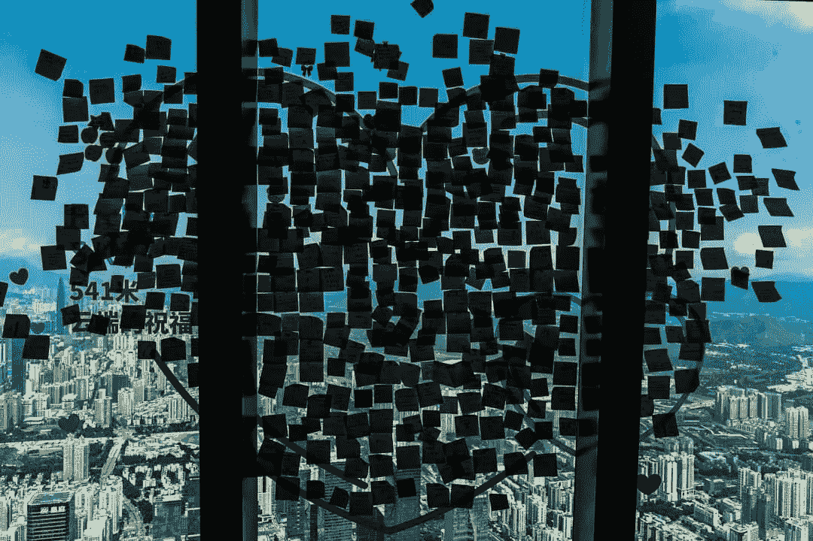
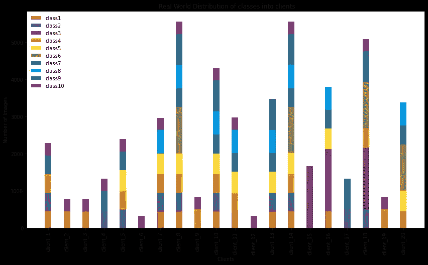
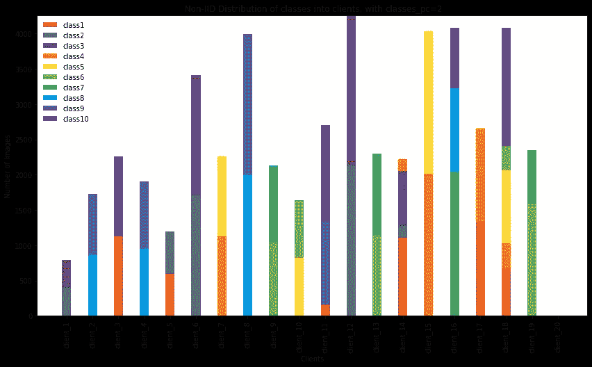
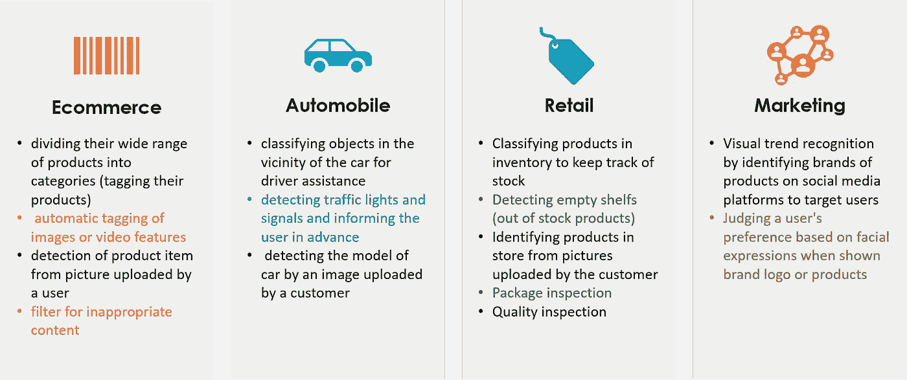
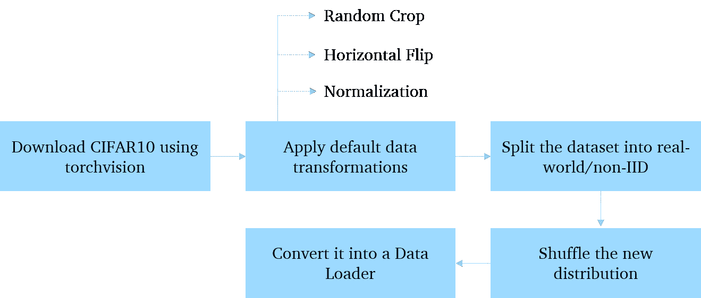

# 在深度学习中保护数据隐私|第 2 部分

> 原文：<https://towardsdatascience.com/preserving-data-privacy-in-deep-learning-part-2-6c2e9494398b?source=collection_archive---------16----------------------->

## 将一个平衡的数据集分布到一个非 IID/真实世界的数据集中，并进一步划分到用于联合学习的客户端中。

**链接到第一部分(联邦学习基础):**[https://towards data science . com/preserving-data-privacy-in-deep-Learning-part-1-a 04894 f 78029](/preserving-data-privacy-in-deep-learning-part-1-a04894f78029)

**链接第三部分(非 IID 数据集联合学习的实现):**[https://towardsdatascience . com/preserving-data-privacy-in-deep-Learning-part-3-AE 2103 c 40c 22](/preserving-data-privacy-in-deep-learning-part-3-ae2103c40c22)

照片由 [Harsh Yadav](https://www.instagram.com/yourviewfrommylens/) 拍摄

非常感谢著名数据科学家阿克谢·库尔卡尼先生对本教程的启发和指导。

上图类似于非 IID(独立同分布)数据集。如果每个随机变量(图像)具有与其他随机变量相似的概率分布，并且都是相互独立的，则随机变量(图像)的集合是**独立且同分布的**。在本系列的第 1 部分中，我们使用了 CIFAR10 数据集，这是一个 IID 类型的示例，但是对于真实世界的用例，需要有一个非 IID 数据集来表示真实世界的场景。那么，什么是非 IID 数据呢？要为联合学习积累非 IID 数据，需要对当前数据集(CIFAR10)进行哪些更改？

这些是本教程将回答的一些问题。本博客是在深度学习中保护数据隐私系列的第 2 部分，重点关注将 CIFAR10 分发到非 IID 数据集，并在客户端之间进一步划分。完成本教程后，您将了解:

1.  非 IID 数据集
2.  将平衡数据集转换为非 IID 数据集和真实数据集
3.  形成封装了该非 IID/真实世界数据集的一部分的客户端
4.  使用联合学习的图像分类用例

与非 IID 数据集相似。照片由 [Harsh Yadav](https://www.instagram.com/yourviewfrommylens/) 拍摄

现实生活中的数据(指对象、值、属性和其他方面)本质上是非独立且同分布的(非 IID)。相比之下，大多数现有的分析或机器学习方法都是基于 IID 数据的。因此，需要一种合适的方法来处理这种类型的真实数据集。本教程将介绍非 IID 数据集的基础，从而为实现各种联邦学习技术来处理从非 IID 数据中获得洞察力的问题打开舞台。非线性是一个常见的问题，导致深度学习模型的性能不稳定。在文献中，非 IID 图像分类问题在很大程度上研究不足。

[NICO](https://www.sciencedirect.com/science/article/abs/pii/S0031320320301862?via%3Dihub) (带有上下文的非 IID 图像数据集)就是这样一个基准数据集，可以进一步用于开发最先进的机器学习模型来处理非 IID 数据。

在这个系列中，CIFAR 10 被用作基准数据集，并且进一步被转换成非 IID 数据集。要了解更多关于联邦学习的基础知识，请阅读本系列的[第 1 部分](/preserving-data-privacy-in-deep-learning-part-1-a04894f78029)。在本教程中，我们将创建两种不同类型的数据集，一种是复制现实生活中的数据，即**现实世界数据集**，另一种是非 iid 数据集的极端示例。

**真实世界数据集:** CIFAR 10 被随机分成给定数量的客户端。因此，一个客户端可以有任意数量的类的图像，比如说，一个客户端只有 1 个类的图像，而另一个客户端有 5 个类的图像。这种类型的数据集复制了真实世界的场景，其中客户端可以有不同类型的图像。

图 1:真实数据集，其中 CIFAR10 被划分为 20 个客户端

**非 IID 数据集:**现实世界的数据集也属于这一类别。但是，在这种情况下，会进行不同类型的分发，其中 CIFAR10 数据集根据每个客户端的类参数进行划分。例如，如果每个客户端的类别=2，则所有客户端将具有从所有类别中随机选择的任意两个类别的图像。

图 2:非 IID 数据集，每个客户端的类=2

从上面的图像中，我们可以知道所有的客户端都有来自任意两个类的图像，但是存在一些异常值，其中一些客户端有来自两个以上类的图像，而一些客户端与其他客户端相比有非常少数量的图像(client_20)。这种异常值确保所有客户端都有一组唯一的图像。这是非 IID 数据集的一个极端例子。我们还可以将 CIFAR10 数据集划分为每个客户端的类= 1，其中所有客户端都将拥有来自一个类的图像，只有一些异常值。

让我们深入到编码部分，更详细地理解它。

## 1.导入库

## 2.超参数

1.  **classes_pc:** 每个客户端的类，用于通过在客户端之间创建类的不平衡表示，将平衡数据集划分为非 IID 数据集。例如，如果 classes_pc=1，则所有客户端将仅具有来自一个类别的图像，从而在客户端之间产生广泛的不平衡。(参考:图 2)
2.  **num_clients** :要分发图像的客户端总数。
3.  **batch_size:** 将数据分批加载到数据加载器中。
4.  **real_wd:** 我们正在创建两种类型的数据集，一种是真实世界数据集(图 1)，另一种是极端的非 IID 数据集(图 2)。如果 real_wd 为 **TRUE** ，则创建复制真实生活的数据集，即真实世界数据集(图 1)。如果 real_wd 为 **FALSE** (默认)，则创建极端非 IID 数据集。

## 3.创建发行版

**get_cifar10** 函数下载 cifar10 数据集并返回 x_train，y_train 用于训练，x_test，y_test 用于测试。第 5–6 行从 torchvision 下载数据集，第 8–9 行将其转换为 NumPy 数组。

**clients_rand** 函数为客户端创建一个随机分布，这样每个客户端都有任意数量的图像。它是将在接下来的代码片段中使用的助手函数之一。

**split _ image _ data _ realwd**函数将给定的图像分割成 n 个客户端。它返回一个分割，该分割进一步用于创建真实世界的数据集。这整个片段都有注释来解释按顺序发生的事情。要了解更多关于这个发行版的内容，请阅读本系列的第 2 部分。

现在，我们将为非 IID 数据集创建一个类似的分割，如上所述(使用图表)。要了解更多关于这个发行版的内容，请阅读本系列的第 2 部分。

**shuffle_list** 函数接受上述函数(split_image_data_realwd 或 split_image_data)的输入，分别对每个客户端的图像进行混洗。

下面的代码片段将拆分转换为数据加载器(在这一部分中完成了图像增强),以将其作为训练模型的输入。

**get_data_loader** 函数使用上述辅助函数，并将 CIFAR10 数据集转换为真实世界或非 IID 类型，视需要而定。

现在，我们已经准备好了创建真实世界或非 IID 数据集的所有函数，联邦学习可以进一步使用这些函数来开发最先进的模型。

现在，我们已经成功创建了这些数据集，让我们来探索对象分类的一些潜在用例，这些用例可以进一步用于联合学习，并确保个人数据安全。

插图由 [Harsh Yadav](https://www.linkedin.com/in/harsh-yadav-1bba69127/) 绘制

# 摘要

在本教程中，您了解了如何使用 PyTorch 为影像分类准备非 IID/真实世界数据集。

具体来说，您学到了:

1.  什么是非 IID(独立同分布)数据集。
2.  如何将平衡分布转换成非 IID/真实世界。
3.  对象分类的潜在用例。

下面是将 CIFAR10 数据集转换为客户端的整个过程的快速修订流程图，可进一步用于联合学习。

# 结论

非 IID 数据很难训练，联邦学习也是如此。真实世界/非 IID 数据集被划分成客户端(num_clients ),这些客户端可以被联邦学习进一步使用并保持数据隐私。

在本系列的下一部分中，我们将在联邦学习中使用这个数据集。请继续关注下一部分，它将探索在非 IID 数据集上的联邦学习中使用的新的聚合和通信技术。在接下来的教程中，您将了解联邦学习的不同聚合技术、模型权重的同态加密、差分隐私以及它与联邦学习的混合。

**链接第三部分(非 IID 数据集联合学习的实现):**[https://towardsdatascience . com/preserving-data-privacy-in-deep-Learning-part-3-AE 2103 c 40c 22](/preserving-data-privacy-in-deep-learning-part-3-ae2103c40c22)

# 参考

[1] Felix Sattler，*来自非 IID 数据的健壮且通信高效的联合学习，* [arXiv:1903.02891](https://arxiv.org/abs/1903.02891)

[2]岳鹤，*走向非独立影像分类:数据集与基线，* [Elsevier](https://www.sciencedirect.com/science/article/abs/pii/S0031320320301862?via%3Dihub)