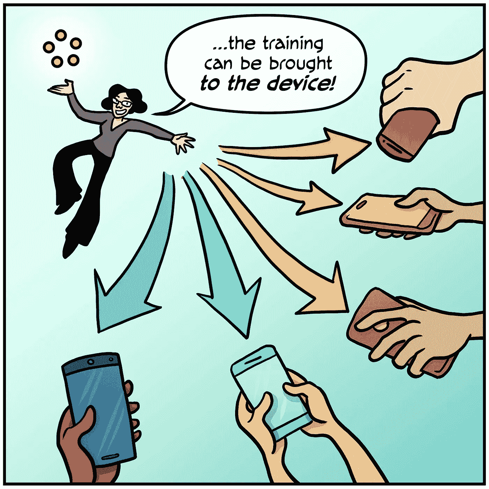
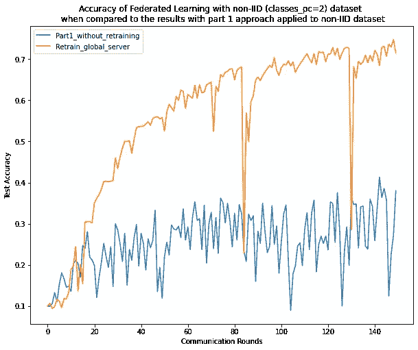
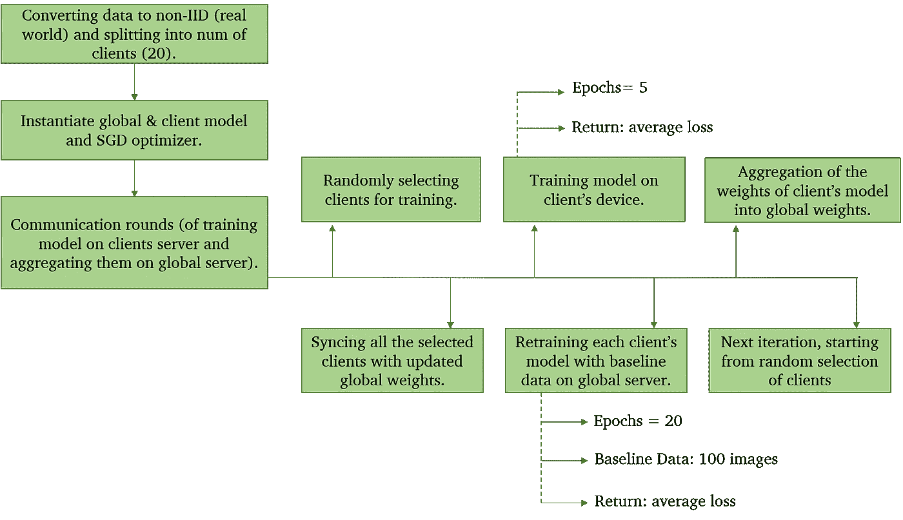

# 在深度学习中保护数据隐私|第 3 部分

> 原文：<https://towardsdatascience.com/preserving-data-privacy-in-deep-learning-part-3-ae2103c40c22?source=collection_archive---------25----------------------->

## 非独立同分布(非 IID)数据集上联邦学习的实现。

链接到第 1 部分(联合学习的基础):[https://towards data science . com/preserving-data-privacy-in-deep-Learning-part-1-a 04894 f 78029](/preserving-data-privacy-in-deep-learning-part-1-a04894f78029)

链接到第二部分(将 CIFAR10 分发到真实世界/非 IID 数据集):
[https://towardsdatascience . com/preserving-data-privacy-in-deep-learning-part-2-6c2e 9494398 b](/preserving-data-privacy-in-deep-learning-part-2-6c2e9494398b)

隐私是本世纪最重要的方面之一，无论是私人数据的物理隐私还是虚拟隐私。照片由 [Harsh Yadav](https://www.instagram.com/yourviewfrommylens/) 拍摄

非常感谢著名数据科学家阿克谢·库尔卡尼先生对本教程的启发和指导。

什么是联合学习？什么是非 IID 数据集？要在联邦学习中积累非 IID 数据，需要做哪些改变？这类深度学习方法有哪些用例？

这些就是你在这里的一些问题。本博客是在深度学习中保护数据隐私系列的第 3 部分，重点关注使用非 IID 数据集实现联合学习。在本系列的第 1 部分中，我们探索了联邦学习的底层架构及其使用 PyTorch 的基本实现。但是第 1 部分无法处理真实世界的数据集，在真实世界中，任何客户端都可以拥有任意数量的来自给定类的图像。为了解决这个问题，在[第 2 部分](/preserving-data-privacy-in-deep-learning-part-2-6c2e9494398b)中，我们将 CIFAR 10(平衡数据集)分发到非 IID/真实世界分发中，并进一步将其划分为客户端。现在，为了构建真实世界/非 IID 数据集的联合学习模型，我正在编写本教程。在本系列的这一部分中，我们将对非 IID 客户机(在第二部分中)使用联合学习的架构(在第一部分[中)。因此，它可以被认为是联合学习的一个真实世界的用例。](/preserving-data-privacy-in-deep-learning-part-1-a04894f78029)

完成本教程后，您将了解:

1.  联合学习
2.  非 IID 数据的联合学习架构
3.  联邦学习中的再培训和交流方法
4.  加权平均作为聚集技术

# 什么是联合学习？(快速回顾)

深度学习是一种隐私保护方法，旨在在拥有个人数据的多个设备(客户端)上训练人工智能模型，而无需显式交换或存储数据样本。全局模型(权重)被传送到这些设备，在这些设备中，实际的训练同时发生，合并了客户特定的特征，然后用在各个设备的训练期间学习的所有新特征来更新(聚集)全局模型。

Google keyboard 的下一个单词预测是联合学习的一个杰出例子。联邦学习处理设备历史(打字历史)来建议对 Gboard 的查询建议模型的下一次迭代的改进。

由 [Kiki Siepel](https://unsplash.com/@studiokiek?utm_source=unsplash&utm_medium=referral&utm_content=creditCopyText) 在 [Unsplash](https://unsplash.com/s/photos/flower?utm_source=unsplash&utm_medium=referral&utm_content=creditCopyText) 上拍摄的照片

联邦学习与花的学习非常相似。就像所有的花瓣(客户端)都由花梗(全局服务器)持有，每个花瓣都有不同的尺寸和模式，但与组成花的其他花瓣相似(非 IID 数据集)，以及所有的营养物质(模型的权重)如何由花梗同时转移到花瓣，花是联合学习的真实类比。

要深入了解使用 Pytorch 的联邦学习的基本实现，请阅读本系列的第 1 部分。

现在，我们可以开始本博客的下一个也是最激动人心的部分了，开始玩代码吧。本教程使用 PyTorch，通过将平衡的 CIFAR10 数据集转换为非 IID/真实世界的数据集，从头开始构建一个联合学习模型。有许多联合学习的聚合技术，但是这项研究实现了所有权重的加权平均值。

## 1.导入库

## 2.超参数

1.  **classes_pc:** 每个客户端的类，此外，这用于通过在客户端之间创建类的不平衡表示来将平衡数据集划分为非 IID 数据集。例如，如果 classes_pc=1，则所有客户端将仅具有来自一个类别的图像，从而在客户端之间产生广泛的不平衡。
2.  **num_clients** :要分发图像的客户端数量。
3.  **num_selected:** 在每轮通信开始时从 num_clients 中随机选择的客户端的数量。用于全球模型的培训阶段。通常，num_selected 约为 num_clients 的 30–40%。
4.  **num_rounds:** 全局模型训练的总通信轮数。在每一轮沟通中，对单个客户的培训同时进行。
5.  **时期:**每个客户端设备上的本地训练回合数。
6.  **batch_size:** 将数据批量加载到数据加载器中。
7.  **baseline_num:** 要保存在全局服务器上的基线图像的总数，用于在聚合之前重新训练客户端的模型。这种在全局服务器上重新训练所有模型的技术处理非 IID/真实世界的数据集。
8.  **retrain_epochs:** 从参与通信回合的所有客户端接收模型权重后，全局服务器上的再训练回合总数。

## 3.将平衡的 CIFAR10 转换并划分为非 IID 数据集。

CIFAR10 数据集被转换为极端非 IID 数据集(参见[第二部分](/preserving-data-privacy-in-deep-learning-part-2-6c2e9494398b))。CIFAR10 由 60，000 张 **32x32** 像素的彩色图像组成 **10** 类。训练集由 50，000 幅图像组成，剩余的 10，000 幅图像用于测试目的。

下面是代码，将在本系列的第 2 部分中详细解释。请前往[第 2 部分](/preserving-data-privacy-in-deep-learning-part-2-6c2e9494398b)以更详细地理解以下片段。

要更深入地了解上述函数，请阅读本系列的第 2 部分，其中详细解释了每一个函数。

## 4.构建神经网络(模型架构)

本教程中使用了 VGG19 (16 个卷积层，3 个全连接层，5 个 MaxPool 层和 1 个 SoftMax 层)。

## 5.联邦学习的辅助函数

**baseline_data** 函数为基线数据创建一个加载器，在全局服务器上聚集权重之前，客户端的模型在该加载器上被重新训练。“num”是在全局服务器上对客户端模型进行再训练的图像数量。第 9–10 行获取 CIFAR10 数据，并打乱训练集。第 12 行从这个混洗的数据集中选择 **num** 个图像，随后它被用于在第 14 行创建数据加载器。

**client_update** 函数根据给定的私有客户端数据训练客户端模型。这是为每个选定的客户端，即 num_sleected(在我们的例子中是 6)进行的本地培训回合。

**client_sync** 函数将客户端模型(训练前)与全局权重同步。在特定客户端没有参与先前的通信回合的情况下，它是有帮助的，因此它确保所有选择的客户端具有来自全局模型的先前训练的权重。

**server_aggregate** 函数聚集从每个客户端接收的模型权重，并用更新后的权重更新全局模型。在本教程中，将计算权重的**加权平均值**。在本系列的[第 1 部分](/preserving-data-privacy-in-deep-learning-part-1-a04894f78029)中，平均值被用作聚合方法，而不是加权平均值。

**测试**函数是使用测试数据集评估全局模型的标准函数。它返回测试损失和测试准确性，用于不同方法的比较研究。

现在，我们已经完成了数据的所有预处理和联邦学习的一些辅助函数。因此，让我们深入研究模型的训练，即使用非 IID 数据集的联合学习。

## 6.训练模型

照片由[谷歌人工智能](https://federated.withgoogle.com/)

全局模型，客户端的模型用 VGG19 初始化，训练在 GPU 上完成。第 6–11 行，在 GPU (Cuda)上用 VGG19 初始化模型。在第 14 行，优化器(SGD)和学习率一起被定义。我们还可以在优化器中添加动量项。在第 17 行，基线数据被添加到具有‘baseline _ num’图像的加载器，即，如上定义的 100 个图像。

使用上述函数将非 IID 数据装载到 train_loader 中，这确保了数据是非 IID 数据。**class _ PC = 2，num_clients=20，batch_size=32。**

第 1–4 行创建了一个列表，用于跟踪模型在训练和测试数据集上的损失和准确性。第 7 行开始在通信回合(num_rounds)中训练单个客户端。在每一轮通信中，首先，用全局权重更新选定的客户端。然后，在客户端设备上训练本地模型，之后在全局服务器上进行再训练。在重新训练客户端的模型之后，将进行权重的聚合。

第 9 行从 num_clients 中选择 num_selected 个客户端，即从总共 20 个客户端中随机选择 6 个客户端。使用 client_sync(第 15 行)完成客户端设备上的训练(第 13–17 行)，其中在训练之前使用全局权重更新本地模型，然后使用 client_update 函数(第 16 行)开始训练。一旦本地模型在设备本身上被训练，确保私有数据的隐私，它们就被发送到全局服务器。首先，使用基线数据对这些模型进行再训练(第 12-17 行)。接下来是将这些局部模型(权重)聚合(第 27 行)成一个全局模型。在更新全局模型之后，在上面定义的测试函数的帮助下，这个全局模型被用于测试训练(第 28 行)。

这个过程持续 num_rounds，在我们的例子中是 150 次通信。这是使用非 IID 数据集的联邦学习的例子，对于真实世界的数据集(在第 2 部分中定义)也可以做类似的事情，这可以进一步应用于一个真实的基于客户机的系统。

## 7.结果

对于 6 个选定的客户端，每个客户端运行 5 个本地时期，并在全局服务器上保留 20 个时期，在 150 轮通信的顶部，下面是截断的测试结果。

在全局服务器上重新训练的联合学习的准确性

相比之下，本教程中使用的方法给出了大约 **72%** 的准确度，而本系列第 1 部分中使用的方法在非 IID 数据集上应用时给出了大约 **35%** 的准确度。此外，当前的方法(**在全球服务器**上重新训练)与其他可用的方法相比要稳定得多。

在对这种方法(保留在具有加权平均值的全局服务器上)与第[部分第 1](/preserving-data-privacy-in-deep-learning-part-1-a04894f78029) 中使用的方法(即具有平均值的基本联合学习)的比较研究中，方法 2(在全局服务器上重新训练)远远优于第 1 部分中使用的方法。整个教程展示了在全局服务器上保留来处理数据集的非 IID 问题的重要性。因此，这项研究是处理非 IID 数据集问题的一个很好的方法，可以用于现实世界的用例中。

# 摘要

在本教程中，您发现了如何使用 PyTorch 的联邦学习来保护深度学习模型中的数据隐私，并且可以应用于现实世界的问题。

具体来说，您学到了:

1.  非 IID 数据集上联邦学习的实现
2.  加权平均值作为聚合技术(我们在第 1 部分中使用了权重的平均值)
3.  在用全局服务器上的基线数据训练和重新训练客户端的模型之前，用全局权重同步客户端。

下面是快速修改整个过程的流程图。

非 IID 数据集的联邦学习流程图，作者插图

# 结论

联合学习是机器学习模型中保护数据隐私的主要方法之一。通过仅发送模型的更新权重，而不是数据，确保了客户端数据的安全性。这种用基线数据重新训练每个客户模型的方法处理了非 IID 数据的问题。此外，每个客户端模型的**同步**与全局权重以及**加权平均值**作为技术的集合，有助于获得该模型的良好准确性。本教程处理非 IID 数据集的极端情况，但是当用于现实生活中的数据时，它比我们的结果表现得更好，这是因为**当前数据实际上比我们在现实生活场景**中处理的数据更加截断。

在接下来的教程中，您不仅将了解联合学习中的不同聚合技术，还将了解模型权重的同态加密、差分隐私及其与联合学习的混合，以及一些有助于保护数据隐私的更多主题。

# 参考

[1] Felix Sattler，*来自非 IID 数据的健壮且通信高效的联合学习，* [arXiv:1903.02891](https://arxiv.org/abs/1903.02891)

[2] H.Brendan McMahan， [*从分散数据中进行深度网络的通信高效学习*](https://arxiv.org/abs/1602.05629) *，*第 20 届人工智能与统计国际会议论文集(AISTATS) 2017。JMLR: W & CP 第 54 卷