# 根据 262，144 次模拟，杜达总统将坚定地再次当选

> 原文：<https://towardsdatascience.com/president-duda-heading-for-a-firm-re-election-according-to-262-144-simulations-3f5f6ceddb04?source=collection_archive---------24----------------------->

## 在总统决选前对趋势的详细分析给了 Trzaskowski 追赶现任的空间。

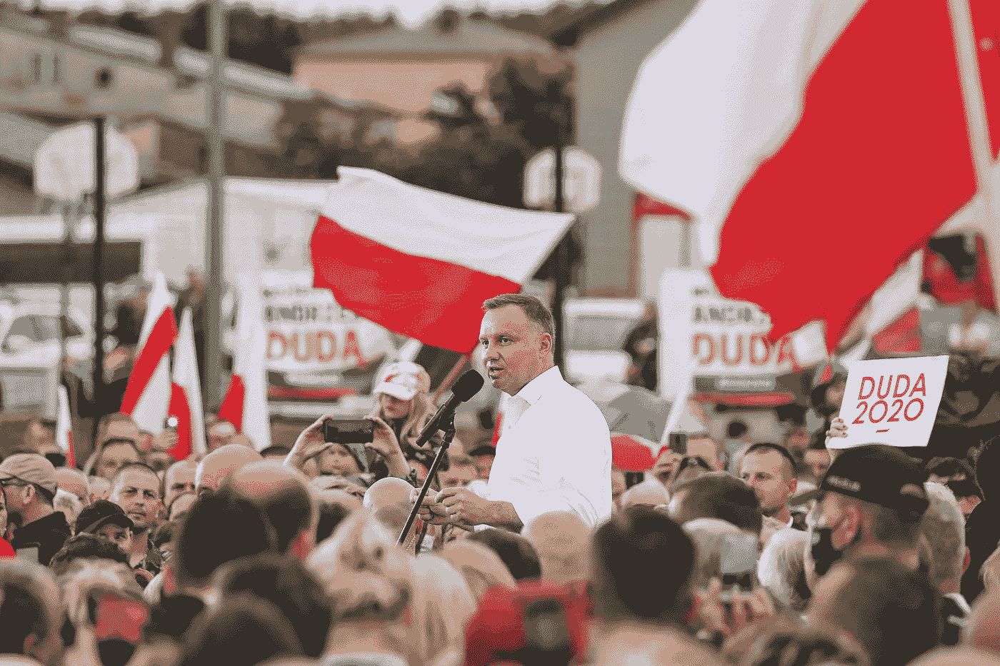

来源:安杰伊·杜达·脸书简介

免责声明:本文无意支持任何一位竞选波兰共和国总统的候选人。它只专注于提供以往总统选举的数据见解，并为本周日举行的决胜选举的可能结果建模。

由于波兰目前的政治平衡，今年的总统选举尤为激烈。

现任总统杜达正在努力争取连任，以维护执政党法律与正义党(PiS)目前的政治话语。

另一方面，反对派支持者试图通过选举公民纲领党副主席 rafatrzaskowski 来打破现政府的立法权。

这一选择很有分量，因为下一次议会选举将于 2023 年举行，Trzaskowski 的成功可能会引发提前大选。

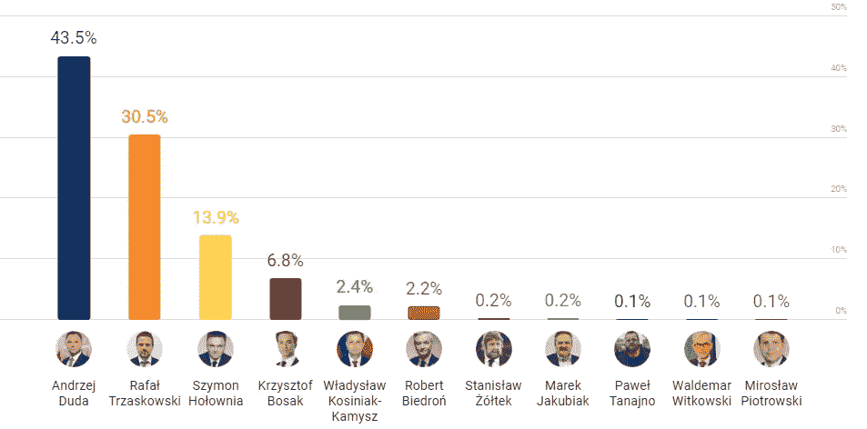

来源:tvn24.pl

在第一轮投票中，杜达总统获得了 43.50%的选票，这是自 1989 年以来的第二好成绩。

然而，他能否战胜 Trzaskowski 仍不确定。过去一周的民意调查显示，没有明显的热门人选。

虽然几乎四分之三的选民决定支持两个最大政党的候选人，但 Szymon hoownia 和 Krzysztof Bosak 的选民本周将有至关重要的发言权。

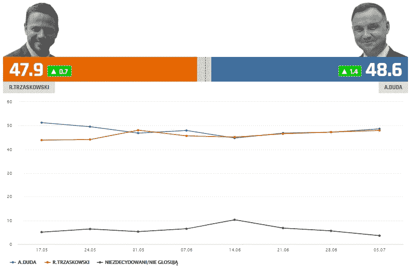

资料来源:ewybory.eu，截至 2020 年 7 月 6 日

在过去几个月里，hoownia 和 Bosak 的选民结构都发生了变化。此外，民意调查通常包括一部分坚定的未决选民，这可能会扭曲结果。

为此，我决定分析波兰 2005 年、2010 年和 2015 年的前三次总统选举。基于投票之间的趋势和相关性，我试图提取合理的参数，并模拟本周日可能的结果。

为什么我只分析最后三个？这是因为 2005 年是波兰政治平衡的转折点。自那以后，只有两个政党交替当选执政——法律与正义党(PiS)和公民纲领党(PO)。

我将在接下来的部分深入探讨这个问题，但是如果你觉得**对波兰的政治环境**感到舒服，**可以随意跳过它**！

# 政治背景

2005 年之前，总统府以及议会多数席位都掌握在民主左翼联盟(SLD)手中。

由于 2002 年末的腐败丑闻，也就是所谓的莱文事件，他们开始失去公众的支持。此后，三大政治力量开始出现，并形成新的力量平衡。

保守派的法律与正义党(PiS)、自由派的公民纲领党(PO)和波兰共和国的社会民主自卫党(SO)，重点关注农村事务。由于 SO 领导人 Andrzej Lepper 的古怪性格，它在与 PiS 和 PO 的竞选中失败了。

这两人本打算在 2005 年议会选举后创建一个联合政府。然而，在 PiS 在总统和大选中获胜后，联盟从未取得成果，PiS 和 PO 最终站在了政治光谱的对立两极。

自那以后，波兰政坛找到了平衡，两党的支持者在投票模式上基本保持一致。随着议会多数党的更迭——(2005-2007 年)PiS，(2007-2015 年)PO，(2015 年至今)PiS，没有一个外部政党能够获得足够的选票份额来破坏这一分裂。

在总统办公室也观察到类似的模式，分别由卡钦斯基(PiS)——2005 年，科莫洛夫斯基(PO)——2010 年，杜达(PiS)——2015 年获得。

由于投票习惯相对稳定，我决定将过去三次总统选举纳入我的分析。

在这篇文章中，我试图从历史数据中提取投票模式，并用它们来模拟本周日在……惊喜，惊喜——PiS 和 PO 候选人——安杰伊·杜达和 rafatrzaskowski 之间进行的决胜选举的潜在结果。

# 我们能从以前的选举中学到什么？

在接下来的两个部分中，我将展示过去总统选举的深刻见解以及它们对决胜选举最终结果的影响。

如果你对数学废话不感兴趣，**跳转**直接进入 ***谁领先*** 位！；)

我决定打破逐个县的投票模式，这使我能够调查当地的模式。

以下图中的每个点代表一个县。我还关注候选人相对于*合格选民总数*的投票份额，而不是总投票份额。这样，我们可以在我们的模型中考虑县投票率的变化。

总统选举中投票率的变化本身似乎并没有太大的不同。回归道岔的均方根误差(RMSE)保持在 2 个百分点的界限内。

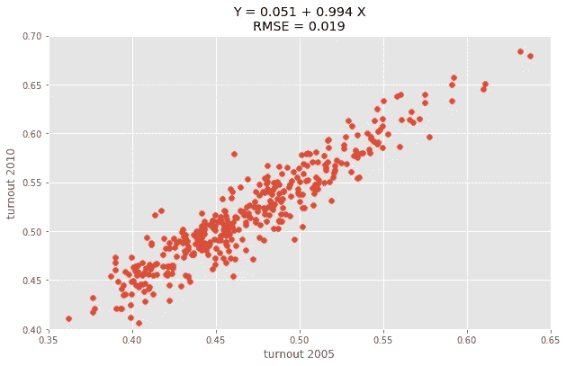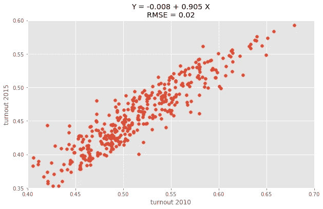

前一次选举中的第一次投票率与第一次投票率

类似地，投票偏好基本保持不变，因为人们支持他们在以前的选举中投票支持的同一政党的候选人。

这是意料之中的，因为历史上 PiS 在农村地区和小城市更受欢迎。另一方面，PO 一直在城市地区取得强劲的成绩。

今年，当前的支持度与 2015 年的支持度之间有着特别强的相关性。回归系数大于 1 表明 2015 年有强烈偏好的县更支持同一政党的候选人。

杜达总统也注意到了这种回归的一个相对较大的截距——0.079。这意味着他设法在全国范围内将他的选民基础统一提高了大约 8 个百分点。

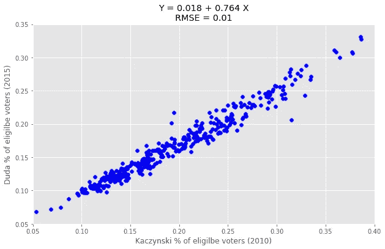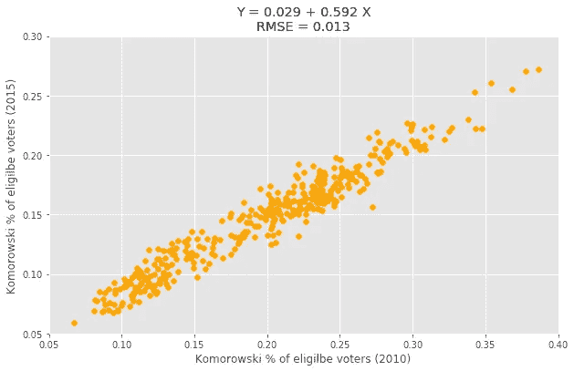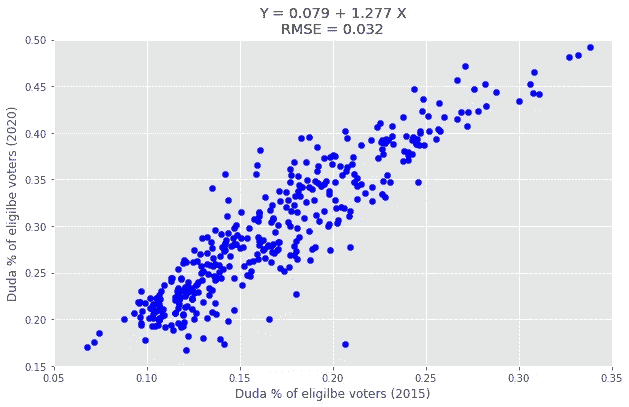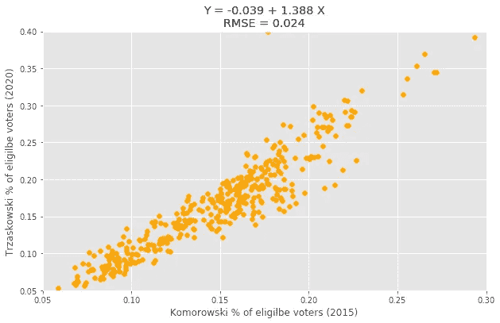

第一轮投票结果与上次选举的第一轮投票结果

这些结果表明，在过去的 5 年里，波兰政治舞台上的两极分化越来越严重，因为任何一方的选民都更加积极。

事实上，自 1990 年第一次民主选举以来，第三方候选人获得的选票份额(26.04%)位居第二。在 2010 年因斯摩棱斯克空难而举行的选举期间，这一数字只有所下降，斯摩棱斯克空难是波兰现代史上最具分裂性的事件之一。

为了确保在本周日获胜，这场比赛本质上归结为两个决定性因素——动员候选人自己的选民和说服大多数第三方选民。第三方选民在过去的总统选举中被证明是至关重要的。

让我们来看看 2005 年的总统选举，PiS 候选人莱赫·卡钦斯基在第一轮投票中以 33.10%的得票率位居第二，输给了他的 PO 对手唐纳德·图斯克，得票率为 36.33%。

虽然图斯克明显领先，但第三名的安杰伊·莱珀(15.11%)的选民显示出对卡钦斯基的强烈支持。最好的说明是回归莱珀在每个县关于卡钦斯基和图斯克在两次投票之间选民基础增加的结果。

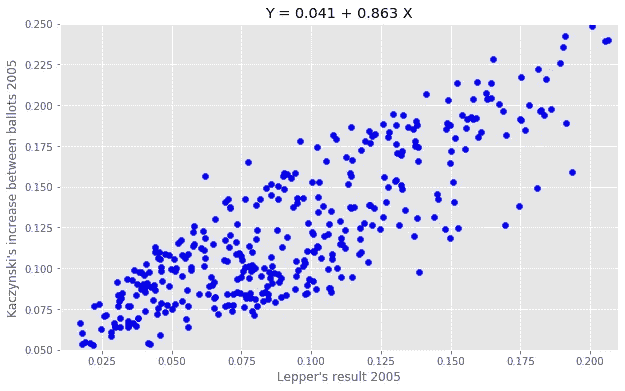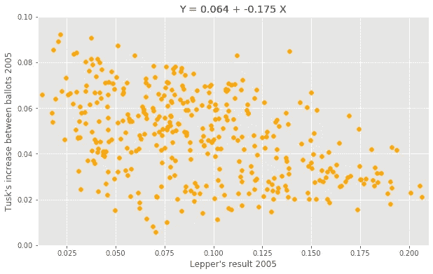

每个县的候选人相对于 Andrzej Lepper 结果有所增加。

可以观察到民主左翼联盟候选人第四马雷克·博罗夫斯基的相反趋势，但与莱珀相比，他的选民基础相对较小且分布更均匀，这并没有弥补卡钦斯基支持率的上升。

卡钦斯基凭借与莱珀相似的选民基础，以 54.04%的总票数赢得了选举。

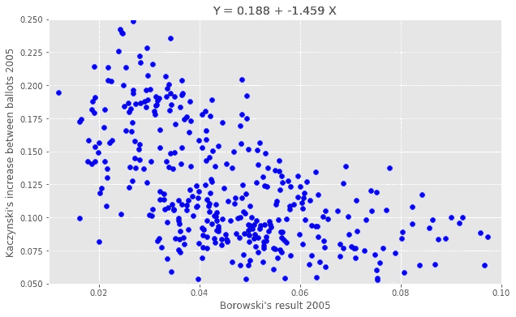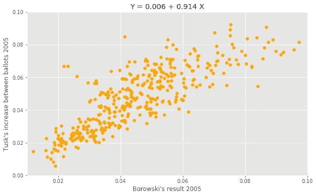

每个县的候选人相对于马雷克·博罗夫斯基结果的增加。

这是故事的一部分——第三方候选人对第二轮投票的结果有着重大(甚至是决定性)的影响。

然而，在第二轮投票之前动员自己的选民一直是两次投票之间为期两周的马拉松的重要组成部分。事实证明，并非偶然。

让我们来看看在第一轮决胜选举之前，每个候选人的选民基础的增长情况。

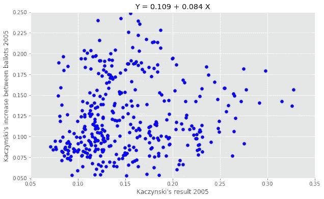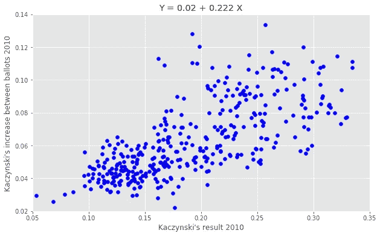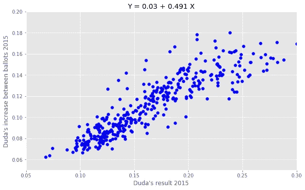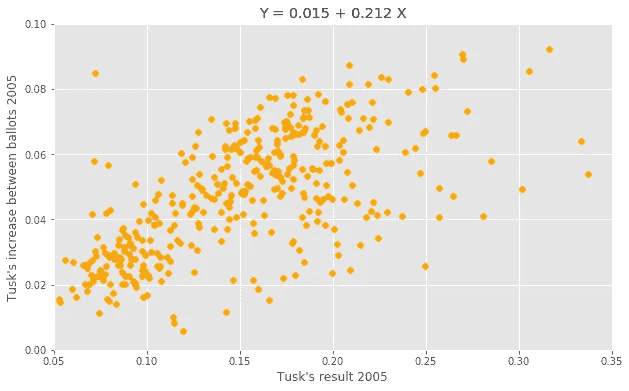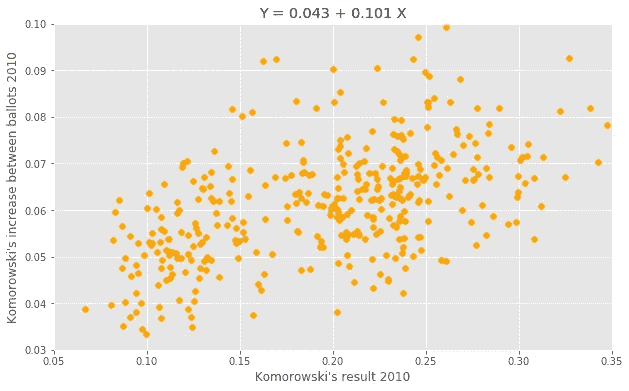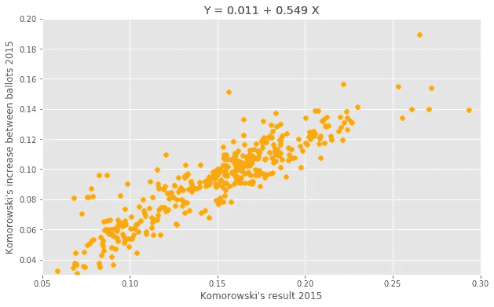

每个县的候选人相对于他们自己的结果有所增加。

特别是在 2010 年和 2015 年，两党候选人在每个县都取得了与其最初支持度成比例的收益。

这突出了一个事实，即许多主要政党的选民决定只在第二轮投票中投票，而最终决定必须在第二轮投票中做出。

科莫洛夫斯基的增长与他的初步结果特别相关，突出了 PO 的选民努力阻止杜达上任。

# 建模和假设

模拟选民基础的增加归结为候选人自己的结果，以及他们说服第三方选民的能力。

因此，我们可以拟合线性模型，根据候选人的投票结果和第三方选票的份额来预测候选人在每个县的增长。我故意不把对手的选票份额作为独立变量，因为它与候选人自己的结果负相关。最终模型是:

%增加= b0 + b1 x 候选人结果+ b2 x 第三方投票+ *误差*

对最近三次选举中的两党候选人运行该模型，得到以下模型:

```
# standard deviation of each coefficient is given in bracketsTusk, 2005 increase = -0.041(0.005) + OWN x 0.329(0.021) + OTHER x 0.238(0.019)Komorowski, 2010 increase = 0.02(0.007) + OWN x 0.092(0.013) + OTHER x 0.206(0.046)Komorowski, 2015 increase = 0.001(0.004) + OWN x 0.536(0.013) + OTHER x 0.084(0.032)Kaczynski, 2005 increase = -0.106(0.01) + OWN x 0.423(0.049) + OTHER x 0.994(0.026)Kaczynski, 2010 increase = -0.045(0.006) + OWN x 0.257(0.011) + OTHER x 0.481(0.044)Duda, 2015 increase = -0.006(0.008) + OWN x 0.474(0.009) + OTHER x 0.267(0.06)
```

一些有趣的细节立刻引起了我的注意。

首先，PiS 一贯更擅长在第三方势力强大的县增加选民基础。2010 年的情况也是如此，当时 napieraski 的结果与科莫洛夫斯基的结果高度相关，减少了 napieraski 对 b2 的影响。

第二，两党都严重依赖于在决胜选举期间前往投票站的不太活跃的选民的推动。

然而，每个缔约方的增长能力似乎有限。将 b1 系数与第一轮投票中获得的结果进行比较，表明在更高支持水平上动员的能力下降。

PO 候选结果与 b1:

30.46% — (0.500–0.700)?

33.77% — 0.536

36.33% — 0.329

41.54% — 0.092

PiS 候选结果与 b1:

33.10% — 0.423

34.76% — 0.474

36.46% — 0.257

43.50% — (0.150–0.300)?

第一轮投票结果较低表明动员能力较高，选民基础有机增长。因此，更高的级别限制了这种能力，因为许多选民已经在第一轮投票中参加了投票。

考虑到这一点，我选择了一个相对较宽的系数范围，我们可以根据历史趋势预期看到这些系数。这是:

**Trzaskowski B1:0.500–0.700**

**杜达 B1:0.150–0.300**

对 b2 进行类似的假设。随着每次连续的选举，PiS 拦截第三方选民的能力减弱。今年，这可能是一项特别困难的任务，因为 Szymon Hoł ownia 的选民往往与更自由的价值观联系在一起。

尽管如此，说服第三方选民对两位候选人来说都是一项具有挑战性的任务，因此我们可以预计 b2 系数的低值与 2015 年选举相似。

**Trzaskowski B2:0.150–0.300**

**杜达 B2:0.200–0.350**

最后，b0 截距表明所有县的支持度均有增加。在投票人数大幅增加的情况下，这些数字往往会特别高，比如在 2015 年。

平均而言，他们倾向于将分数正常化，因为在任何一个县，任何一位候选人都很少获得少于 7-8%的合格选票。从历史上看，这个截距稍微有利于 PO 候选人。

**Trzaskowski B0:(-0.040)—(-0.020)**

**杜达 B0:(-0.070)——(-0.040)**

为了建模，我假设这些参数是均匀分布的。将每个区间截断成 8 个均匀分布的值，并模拟这些值的每个组合，得到了 **262，144** 个选举模拟。

# 谁领先？

选票的中间份额使杜达总统以总票数的 **50.97%** 处于领先地位，紧随其后的是 Trzaskowski**49.03%**。

百分比分数的标准偏差为 1.91%，这使得 Trzaskowski 的获胜边界与平均值的标准偏差不到一个。

该模型显示杜达总统有 68.8%的机会赢得本周日的选举。

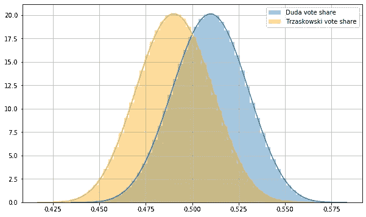

两名候选人的投票份额分配

这仍然是一个相对较小的差额，极大地依赖于参数假设的有效性。

仅仅依靠过去的三次选举，这些参数很难建模。它们只能从总体投票模式和当前的政治平衡中间接推断出来。

预计投票率将达到 65.49%，标准差为 2.51%。鉴于这些结果，杜达预计将获得 1008 万张选票，而 Trzaskowski 目前约有 970 万张选票。

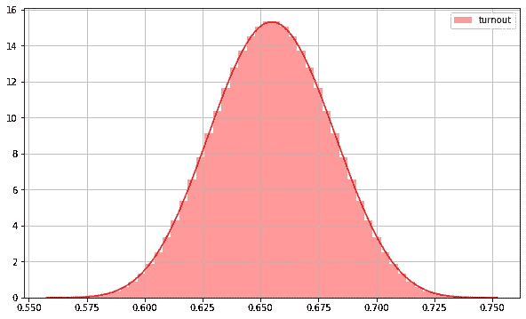

道岔分布

***Trzaskowski 怎么做才能缩小差距？***

由于高度的两极分化，动员他自己的选民似乎是一个特别有效的策略。

b1 达到 0.65 以上水平的模拟，使他与他的对手处于平等地位。Trzaskowski 目前的选民基础具有巨大的有机增长潜力，他的竞选团队应该努力利用这一事实。

# 你怎么想呢?

你认为这个分析遗漏了什么吗？

你认为我的假设是否正确？

也许你想更详细地谈谈这个模型？

**随时联系！**

[](https://www.linkedin.com/in/cezary-klimczuk-423522129/) [## Cezary Klimczuk -数据科学家|伦敦大学学院毕业生

www.linkedin.com](https://www.linkedin.com/in/cezary-klimczuk-423522129/) 

> 我在 Jupyter Notebook 中使用 Python 进行了所有分析。
> 
> 我下载并清理了 pkw.gov.pl 的选举数据。请随时访问我的 [**GitHub 页面**](https://github.com/CezaryKlimczuk/PresidentialElection2020) ，更深入地探索我的项目！