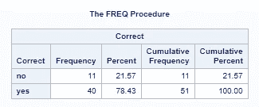
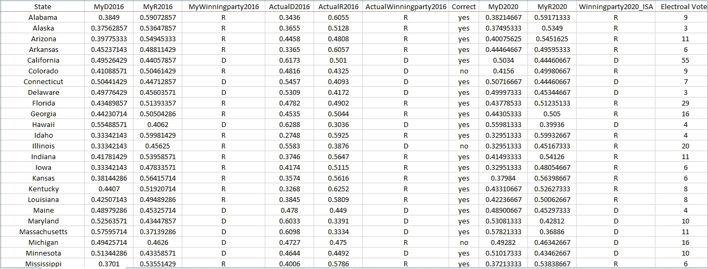
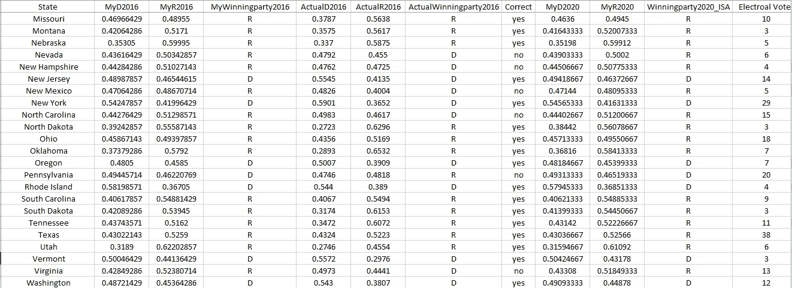
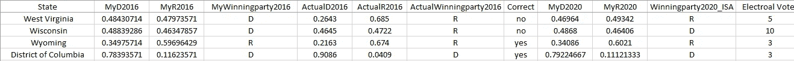
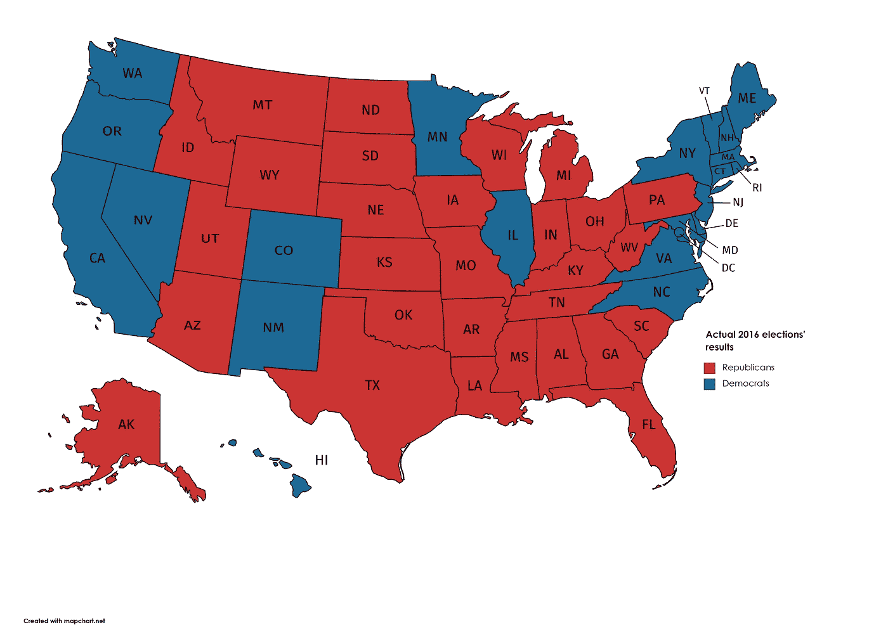
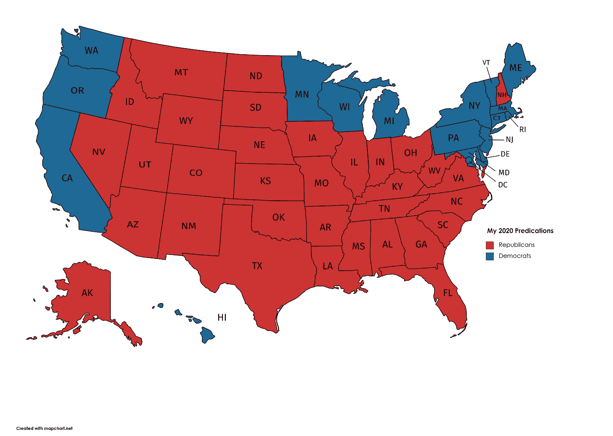

# 总统选举预测

> 原文：<https://towardsdatascience.com/presidential-elections-forecast-19d366ea7945?source=collection_archive---------3----------------------->

## 我的预测依赖于每个州的流行数据的历史数据

# 承认

感谢[阿斯玛·巴拉卡特](https://medium.com/u/5d8aa516b603?source=post_page-----19d366ea7945--------------------------------)帮助我收集这项研究所需的数据！

# 介绍

许多因素会影响选举结果，如新冠肺炎、弹劾、经济、失业率、自然灾害应对、气候变化、外交政策、人们对自己政党的忠诚度、辩论、总统身高以及许多其他因素。在本文中，我将只关注每个州普选的历史数据。

# 模型

建模和分析中使用的编程语言是 SAS 9.4。使用的模型是 PROC 单变量。

# 结果

为了测试我的模型，我预测了 2016 年的选举，并将结果与实际值进行了比较。总体而言，算法显示特朗普将在 2016 年获胜，这确实发生了。此外，它预测他将赢得 2020 年的选举。然而，通过检查状态的结果，我发现代码预测了 11 个错误的状态，进一步的细节如下。

## 我们应该收集历史上多长时间的数据？

这种模式完全依赖于人们对其政党的忠诚。它不包括任何其他因素。我们收集了自 1960 年以来每个政党的普选百分比。

选择 1960 年是暂定的。我认为大多数人不会改变他们的政党。因此，我搜索了美国的平均预期寿命，发现它大约是 78 岁，这意味着我应该回到 1940 年选举以来的数据。然而，通过一些反复试验，我发现 1960 年给出了最准确的结果。尽管如此，还需要进一步的实验来进行更准确的验证。

## 模型精度

我通过使用我的算法来预测 2016 年的选举，验证了这些实验。如图 1 所示，该算法正确预测了 39 个州和哥伦比亚特区，错过了 11 个州。然而，它预测共和党将以 311 张选举人票赢得 2016 年选举。民主党仅获得 224 票，接近共和党和民主党分别获得 304 票和 227 票的实际结果。

图 1:2016 年结果测得的模型精度

根据图 1，模型准确率为 78.43%。这个模型还有很大的改进空间，可以提高它的准确性。(请阅读文章末尾的更正)

二话没说，给你表:

表 1:结果

您可以从这里下载表 1 中列出的文件:

http://engyfoda.com/MYPREDICTIONSISA_2.xlsx

还可以下载以下文件:
民主党的 2020 年文件:[http://engyfoda.com/DEMOCRATSISA.xlsx](http://engyfoda.com/DEMOCRATSISA.xlsx)民主党的 2016 年文件:【http://engyfoda.com/DEMOCRATS2016.xlsx】T4共和党的 2020 年文件:[http://engyfoda.com/REPUBLICANISA.xlsx](http://engyfoda.com/REPUBLICANISA.xlsx)共和党的 2016 年文件:[http://engyfoda.com/REPUBLICAN2016.xlsx](http://engyfoda.com/REPUBLICAN2016.xlsx)

注意:在上述文件中，最后一个变量(L)是每个州的选举人票。

# 形象化

通过比较我对 2016 年选举的预测和 2016 年实际结果的两张地图，图 2 和图 3，这是模型错过的 11 个州:

1.科罗拉多州(实际胜出的候选人是:希拉里)
2。伊利诺伊州(实际胜出的候选人是:希拉里克林顿)
3。密歇根州(实际胜出的候选人是:唐纳德·特朗普)
4。内华达州(实际获胜的候选人是:希拉里克林顿)
5。新罕布什尔州(实际获胜的候选人是:希拉里克林顿)
6。新墨西哥州(实际胜出的候选人是:希拉里)
7。北卡罗来纳州(实际获胜的候选人是:希拉里克林顿)(这是错误的。请阅读文末更正)
8。宾夕法尼亚州(实际胜出的候选人是:唐纳德·特朗普)
9。弗吉尼亚州(实际获胜的候选人是:希拉里克林顿)
10。西弗吉尼亚州(实际获胜的候选人是:唐纳德·川普)
11。威斯康星州(实际获胜的候选人是:唐纳德·特朗普)

图 2:我对 2016 年选举的预测

图 3:2016 年选举的实际结果

下面是我对 2020 年预测的可视化，如图 4 所示。通过比较我对 2016 年和 2020 年的预测，图 2 和图 4，只有西弗吉尼亚州从民主党转向共和党，导致共和党的选举人票从我 2016 年预测的 307 张增加到 2020 年预测的 311 张。由于该算法在 2016 年的结果中已经错过了 11 个州，这种错过在 2020 年的预测中仍然存在。所以我可以断定，算法对 2020 年的预测是川普以 78.43%的概率获胜。

图 4:2020 年预测

# 模型缺陷

该模型源于人们对其政党的忠诚度，而在 2020 年选举中，人们的偏好可能会因其他因素而改变。例如，许多共和党人反对特朗普，许多民主党人不赞成在 LGBT 和堕胎的性自由中占据自由概念，这违反了他们的宗教信仰。

而且这种分析只依赖两方的结果，不考虑对方的结果。如果我们收集第三方的结果并将其注入到模型中，一些州的结果会有所提高。

此外，仅使用两位小数。向模型输入更精确的数据将会提高它的准确性。

# 原始数据

每个州的原始数据可以从这里下载:

[阿拉巴马](http://engyfoda.com/Alabama.xlsx)，[阿拉斯加](http://engyfoda.com/Alaska.xlsx)，[亚利桑那](http://engyfoda.com/Arizona.xlsx)，[阿肯色州](http://engyfoda.com/Arkansas.xlsx)，[加利福尼亚州](http://engyfoda.com/California.xlsx)，[科罗拉多州](http://engyfoda.com/Colorado.xlsx)，[康涅狄格州](http://engyfoda.com/Connecticut.xlsx)，[特拉华州](http://engyfoda.com/Delaware.xlsx)，[佛罗里达州](http://engyfoda.com/Florida.xlsx)，[佐治亚州](http://engyfoda.com/Georgia.xlsx)，[夏威夷](http://engyfoda.com/Hawaii.xlsx)，[爱达荷州](http://engyfoda.com/Idaho.xlsx)，[伊利诺伊州](http://engyfoda.com/Illinois.xlsx)，  [马萨诸塞州](http://engyfoda.com/Massachusetts.xlsx)，[密歇根州](http://engyfoda.com/Michigan.xlsx)，[明尼苏达州](http://engyfoda.com/Minnesota.xlsx)，[密西西比州](http://engyfoda.com/Mississippi.xlsx)，[密苏里州](http://engyfoda.com/Missouri.xlsx)，[蒙大拿州](http://engyfoda.com/Montana.xlsx)，[内布拉斯加州](http://engyfoda.com/Nebraska.xlsx)，[内华达州](http://engyfoda.com/Nevada.xlsx)，[新罕布什尔州](http://engyfoda.com/New_Hampshire.xlsx)，[新泽西州](http://engyfoda.com/NewJersey.xlsx)，[新墨西哥州](http://engyfoda.com/New%20Mexico.xlsx)，[纽约州](http://engyfoda.com/New%20York.xlsx)  [罗德岛](http://engyfoda.com/RhodeIsland.xlsx)，[南卡罗来纳州](http://engyfoda.com/SouthCarolina.xlsx)，[南达科他州](http://engyfoda.com/SouthDakota.xlsx)，[田纳西州](http://engyfoda.com/Tennessee.xlsx)，[得克萨斯州](http://engyfoda.com/Texas.xlsx)，[犹他州](http://engyfoda.com/Utah.xlsx)，[佛蒙特州](http://engyfoda.com/Vermont.xlsx)，[弗吉尼亚](http://engyfoda.com/Virginia.xlsx)，[华盛顿](http://engyfoda.com/Washington.xlsx)，[西弗吉尼亚](http://engyfoda.com/WestVirginia.xlsx)，[威斯康辛州](http://engyfoda.com/Wisconsin.xlsx)

# 结论

这种模式完全依赖于人们对其政党的忠诚。可以为以后的工作做几个步骤。首先，做进一步的实验来验证时间回到哪一年会让我们得到更准确的结果。其次，增加输入数据文件中的小数位数可能会影响模型的性能。第三，在模型中加入更多的因素，如各州对新冠肺炎的反应、失业率以及对自然灾害的反应。自然灾害的应对可以是一篇全新的文章来研究和比较他们与每一位总统的数据。自 2016 年以来，野火、飓风和洪水的数量有所增加。总之，本文仅仅是一个开始，还有提高模型准确性的空间。

无论你的政党是什么，请投票。

Engy Fouda，
作者，[*使用 SAS Studio*](https://amzn.to/3lh00JU) 学习数据科学

# 修正

我写道，该模型在 2016 年预测北卡罗来纳州是错误的，但它是正确的预测。唐纳德·特朗普在 2016 年赢得了北卡罗来纳州。我在输入两个实际投票时犯了一个错误；我把它们调换了。这一修正将模型准确率提高到 80.39%，因为它在 2016 年的选举中错过了 10 个州，而不是 11 个州。