# 压力脉动带来更好的浓缩咖啡

> 原文：<https://towardsdatascience.com/pressure-pulsing-for-better-espresso-62f09362211d?source=collection_archive---------12----------------------->

## 压力曲线的时髦方式

五年前，我爱上了杠杆咖啡机。他们能够像半自动机器一样进行压力分析，但是没有成本。主要警告:杠杆机器需要艺术性。随着时间的推移，我学会了如何制作美味的浓缩咖啡。我还买了一些杠杆机器，并失去了购买更昂贵的压力剖面机的欲望，因为压力剖面是杠杆机器的标准功能。我仍然在阅读这些新机器，我发现了一个有趣的想法:压力脉动。

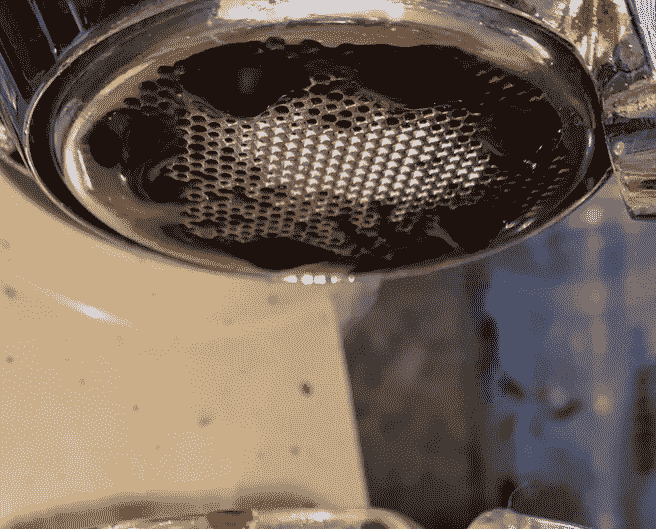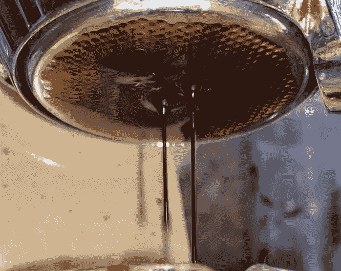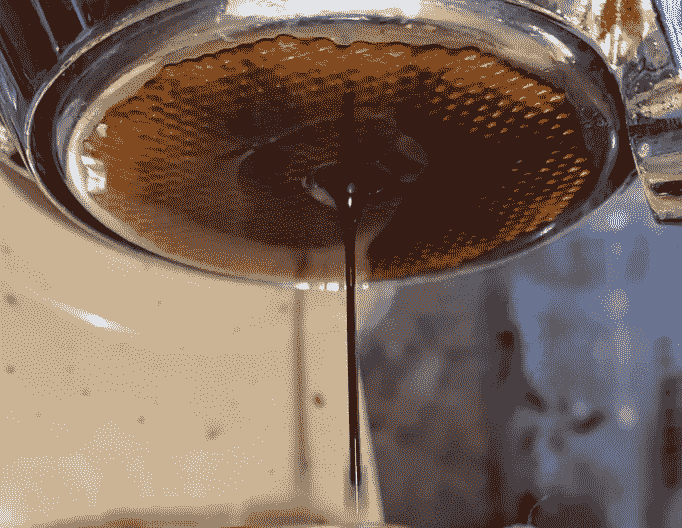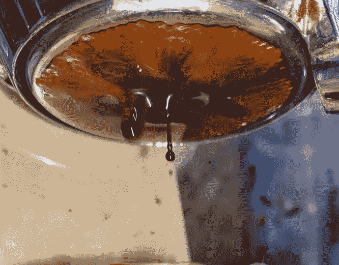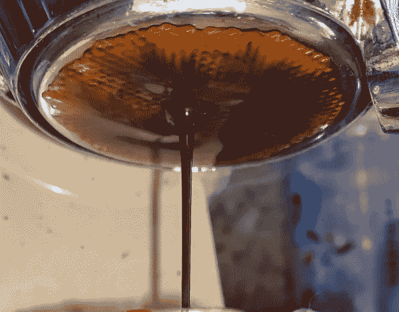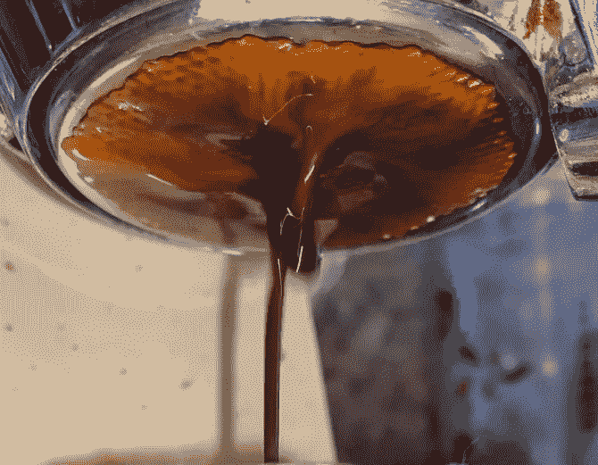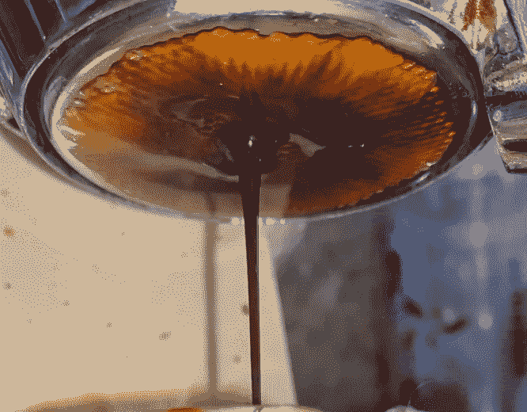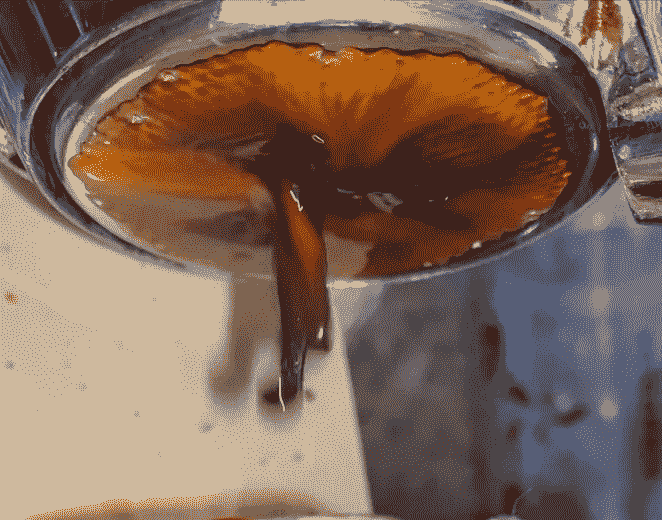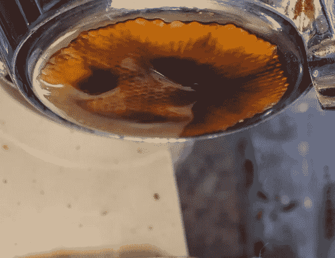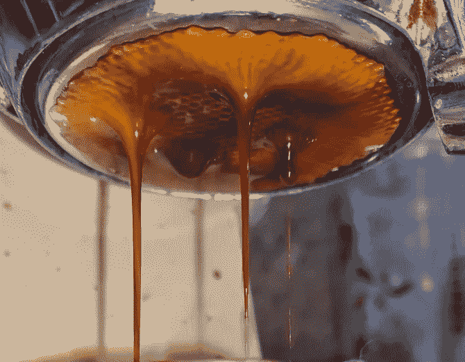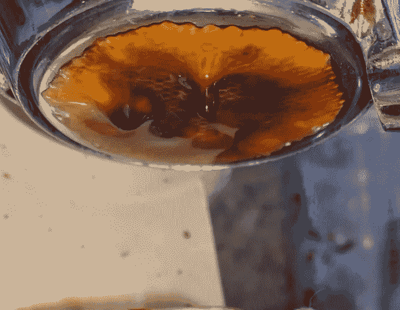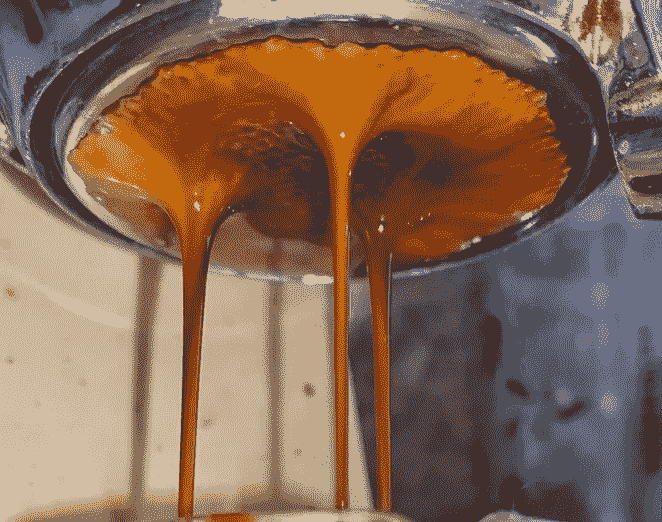

# 压力剖面

大多数咖啡店里的普通浓缩咖啡机对热水(理想温度为 90℃)施加恒定的压力(理想压力为 9 巴)来制作浓缩咖啡。更先进的机器给出一些调整压力的时间间隔。更好的是，你可以用类似于杠杆机器的非常低的压力进行预输注，这样，你就可以用压力进行注射。

压力剖面包括在整个发射过程中修改压力。你可以从低压开始，高压结束；你可以在高压下开始，在低压下结束。两者给了镜头不同的味道。

最近十年的进步已经使 PID 控制的温度和压力至少在咖啡店里为大众所接受。这些机器把所有的艺术性都简化成了一门科学，因为每次拍摄都可以根据水温、压力和体积进行复制。

# 压力脉动

最近看到[浓缩咖啡三期](https://www.perfectdailygrind.com/2019/07/pressure-profiles-pulsing-the-3-phases-of-espresso-extraction/?fbclid=IwAR1zdu56uEDS0MeEc50n-ToarNEwp72g8sgYZ1TEL5tqZp1eEqrkbogEAcs)，看到一个有趣的段子:“这成为了 Simonelli 集团脉冲喷射技术的基础，用在 Aurelia Wave 浓缩咖啡机上。对于浓缩咖啡萃取的三个阶段，咖啡师可以选择不同的流速通过圆盘。

所以我研究了奥雷利亚波，但是关于脉冲是如何工作的信息很少。保密可能是故意的，但我有一个聪明的想法:我可以尝试在手动机器上脉冲。

我用帕沃尼琴的次数更多了，所以我尝试了一次断奏。拉的时间比较长，但是结果很惊人。到目前为止，这是我一生中最好的一次拍摄。

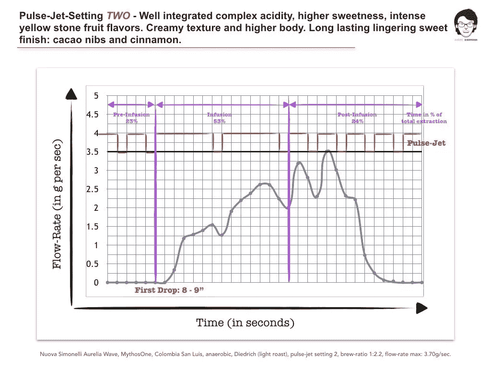

[https://www . LinkedIn . com/pulse/impact-pulse-jet-technology-my-espresso-extraction-andr % C3 % A9-eiermann](https://www.linkedin.com/pulse/impact-pulse-jet-technology-my-espresso-extraction-andr%C3%A9-eiermann)

André Eiermann 用 Aurelia Wave 做了一些[测试，他没有发现 TDS 差异，但他确实注意到了味道差异。我想知道](https://www.linkedin.com/pulse/impact-pulse-jet-technology-my-espresso-extraction-andr%C3%A9-eiermann)[在多点测量 TDS](/coffee-solubility-in-espresso-an-initial-study-88f78a432e2c)提取的体积是否会显示机器设置之间的更大差异。我认为他的实验没有达到应有的彻底程度，但这绝对是一个好的开始。他尝试测试了很多变量，对实验进行优先排序需要大量的试验、错误和直觉。

理论上，压力脉冲类似于在注射中间进行多次预输注。因此，基于对预灌输的了解，人们会期望在给定的输出体积中有相同或更高的提取。一般来说，使用预浸泡，浓缩咖啡比没有更高的提取率。Aurelia Wave 在预输注过程中确实会产生喷射脉冲，但我没有在手动杠杆机器上尝试过。

# 脉动过程

对于杠杆机器，我们有一系列的选择。这些说明假定类似于 la Pavoni 或 Kim Express 或 Flair:

1.  预输注 15 秒
2.  绽放 15 秒
3.  脉冲 15 到 45 秒，直到达到所需的重量输出。

脉冲频率和持续时间是主要变量。目前，让脉冲提供近乎稳定的咖啡流似乎很重要。我的很多脉动都是基于拍摄过程中的视觉，并使用脉动来获得暗咖啡。副作用更少。

# 实验

我的意图是尝试不同持续时间的不同脉冲方法。问题是，用杠杆机器，我拉了更多的工匠镜头，我是根据我用相机在底部看到的[进行调整的。像 DE1Pro 这样的像样的浓缩咖啡机本来可以帮助控制更多的变量，但我认为杠杆机器上的脉冲固有的一点是视觉上看到无底的 portafilter 和咖啡师进行实时调整之间的反馈。](https://medium.com/@rmckeon/espresso-machine-donuts-deeper-analysis-into-extraction-cd7e602468d)

为了[收集数据](/coffee-data-sheet-d95fd241e7f6)，我试着交替使用压力脉冲拍摄和常规压力拍摄。常规压力注射仍然具有预注入和起霜，因为仅在注入期间施加脉冲。我也把我的大部分镜头作为[断续浓缩咖啡](https://medium.com/overthinking-life/staccato-espresso-leveling-up-espresso-70b68144f94?source=post_page---------------------------)镜头，因为它们味道更好，提取率更高。随着时间的推移，我积累了大量数据，然后我从这些数据中提取了一组数据点，其中机器、咖啡豆和重量对于常规压力射击和压力脉冲射击是相同的。

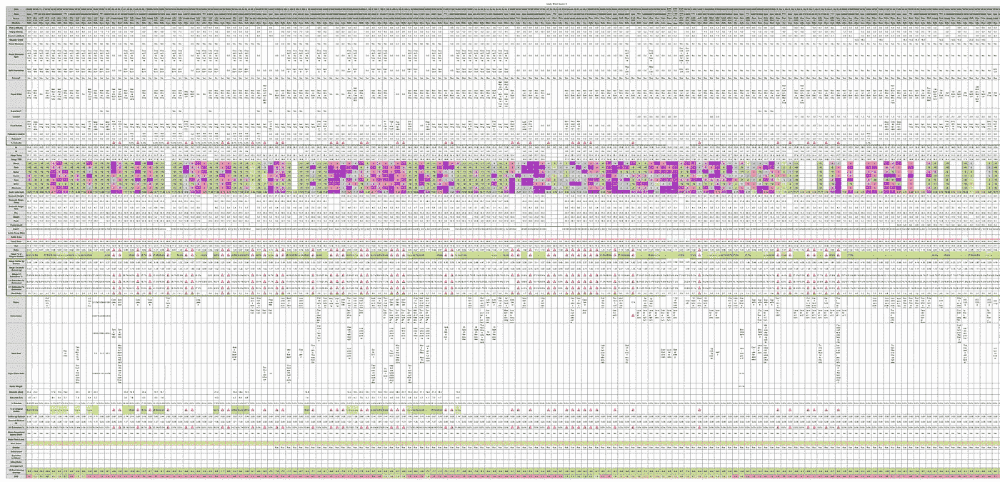

原始数据！

我最后得到了 17 个数据对，还不够统计意义。然而，它们很适合定性检查。建立一个足够大的统计数据集的困难意味着我必须拍摄 30 多对照片，这在我进行其他实验以及拨入新的咖啡烘焙时是很困难的。最重要的是，我发现压力脉冲改善了我的投篮，所以不这样做，我知道我没有尽我所能投出最好的球。话虽如此，我还是把我的数据归纳到下面这个。

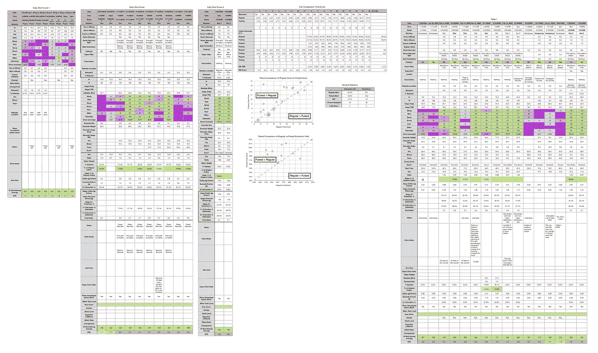

数据:整合和清理

我用来比较的两个主要指标是提取率和最终得分。提取率由从圆盘中提取到杯中的咖啡量决定，而[提取率由使用数字折射计(Atago)](/affordable-coffee-solubility-tools-tds-for-espresso-brix-vs-atago-f8367efb5aa4?source=your_stories_page---------------------------) 测量总溶解固体(TDS)来确定。所有 17 对都有最终得分指标，但只有 9 对数据有 TDS 指标，因为我在开始收集这些配对数据点后开始收集 TDS 测量值。

最终得分是 7 项指标(强烈、浓郁、糖浆、甜味、酸味、苦味和余味)的[记分卡的平均值。当然，这些分数是主观的，但它们符合我的口味，帮助我提高了我的拍摄水平。分数有一些变化。我的目标是保持每个指标的一致性，但有时粒度很难确定。](/coffee-data-sheet-d95fd241e7f6)

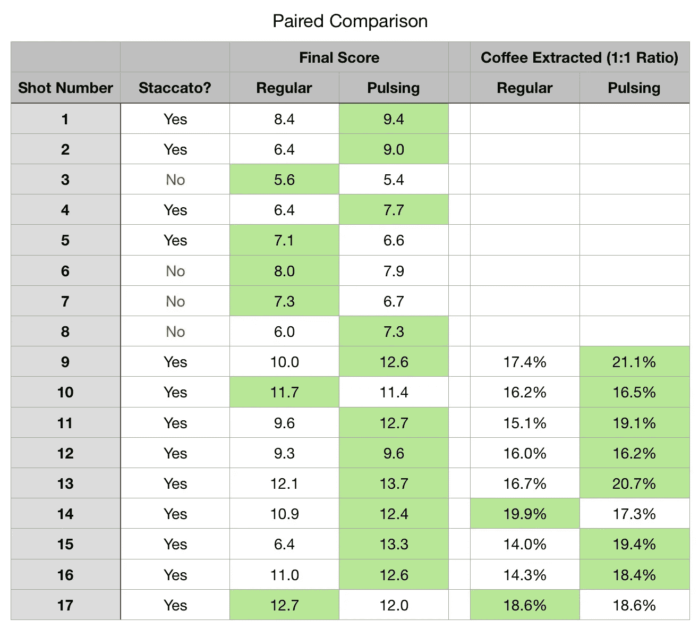

首先，从提取率来看，在大多数情况下，压力脉冲与常规注射相同或更好。该图在 x 轴上显示了常规压力提取，在 y 轴上显示了相应的压力脉冲提取。

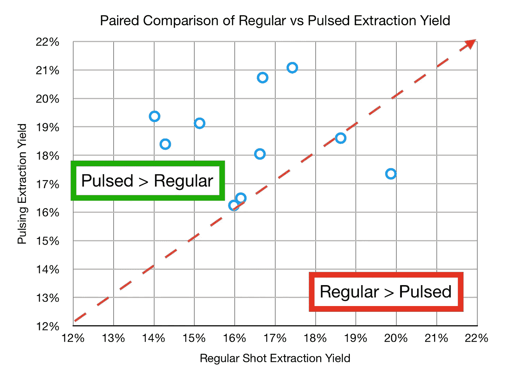

当看最终得分时，趋势是相似的，但是有更多的情况下脉冲没有帮助。然而，这又回到了一个论点，即脉冲将提供相同或更好的提取，而不是更差的提取，因为它与预灌输相似。

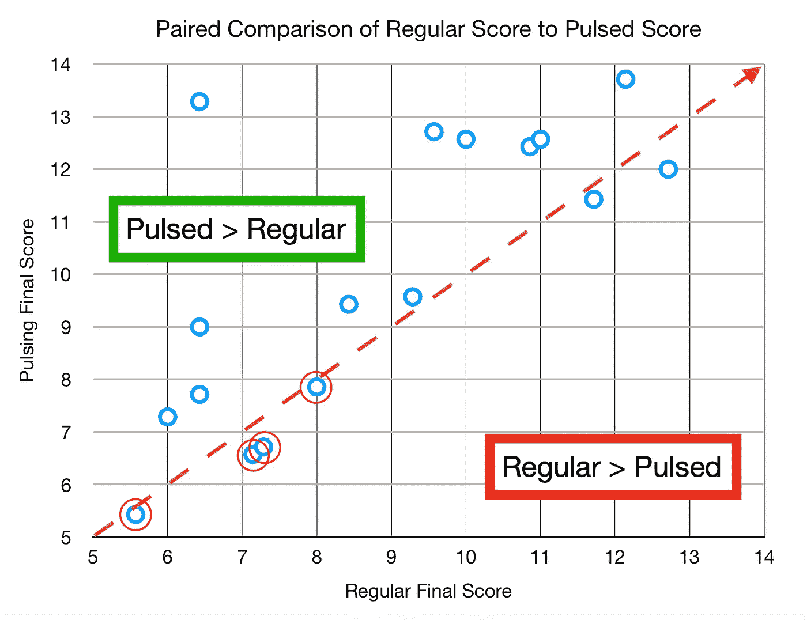

红色圈出的数据点是非断奏镜头。剩下的都是断断续续的镜头。

以下是一些平均值的总体总结。我不能说这些分布在统计学上是显著的，但是它们已经足够有趣了，以至于我在所有的照片中都使用了压力脉冲。我还应该注意到，因为我不经常拉非断奏的镜头，所以我不太确定它的影响。从我在有压力脉动和没有压力脉动的情况下拍摄的非断奏照片来看，我没有注意到味道上的巨大差异。我怀疑的是在拍摄开始时提取率更高，但我没有数据支持这一说法。最近我还使用了更长时间的预输注，这是一个额外的变量。

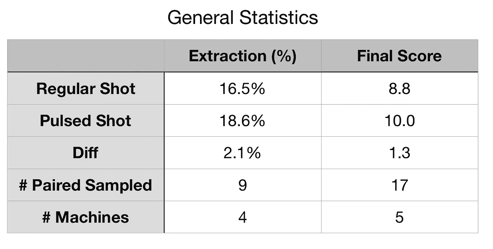

我还有一些其他想探索的东西。我目前已经在数据表中添加了脉冲数以及预输注、开花和输注的时间。希望这能让我对压力脉动有更深入的了解。显然，如果我有一个压力计或 DE1Pro，我可以更好地控制和测量脉冲以及每个脉冲的压力峰值。同时，下面是我在研究压力脉动时想到的一系列实验:

*   每脉冲峰值压力
*   [啁啾信号](https://en.m.wikipedia.org/wiki/Chirp) vs 开/关
*   射击时间内的脉冲长度
*   预输注和压力脉动

总之，目前的证据表明压力脉冲(包括喷射脉冲)比恒压更好。关于手动机器的压力脉动的最好的部分是，它是一种容易应用和适应自己使用的方法；它不需要额外的硬件。

对于 Aurelia 波，我希望有人检查 1:1 输入/输出比下喷射脉冲的性能差异，因为我的实验表明提取受脉冲影响很大。

如果你愿意，可以在 [Twitter](https://mobile.twitter.com/espressofun?source=post_page---------------------------) 和 [YouTube](https://m.youtube.com/channel/UClgcmAtBMTmVVGANjtntXTw?source=post_page---------------------------) 上关注我，我会在那里发布不同机器上的浓缩咖啡照片和浓缩咖啡相关的视频。你也可以在 [LinkedIn](https://www.linkedin.com/in/robert-mckeon-aloe-01581595?source=post_page---------------------------) 上找到我。

# 我的进一步阅读:

[断续浓缩咖啡:提升浓缩咖啡](https://medium.com/overthinking-life/staccato-espresso-leveling-up-espresso-70b68144f94)

[浓缩咖啡中咖啡的溶解度:初步研究](/coffee-solubility-in-espresso-an-initial-study-88f78a432e2c)

[浓缩咖啡模拟:计算机模型的第一步](https://medium.com/@rmckeon/espresso-simulation-first-steps-in-computer-models-56e06fc9a13c)

[压力脉动带来更好的浓缩咖啡](/pressure-pulsing-for-better-espresso-62f09362211d)

[咖啡数据表](https://towardsdatascience.com/@rmckeon/coffee-data-sheet-d95fd241e7f6)

[工匠咖啡价格过高](https://medium.com/overthinking-life/artisan-coffee-is-overpriced-81410a429aaa)

[被盗浓缩咖啡机的故事](https://medium.com/overthinking-life/the-tale-of-a-stolen-espresso-machine-6cc24d2d21a3)

[平价咖啡研磨机:比较](https://medium.com/overthinking-life/affordable-coffee-grinders-a-comparison-9fb89942f607)

[浓缩咖啡:机头温度分析](https://medium.com/@rmckeon/espresso-grouphead-water-temperature-analysis-25cc00556d5c)

[浓缩咖啡过滤器分析](/espresso-filters-an-analysis-7672899ce4c0)

[便携式浓缩咖啡:指南](https://medium.com/overthinking-life/portable-espresso-a-guide-5fb32185621)

[克鲁夫筛:一项分析](https://medium.com/overthinking-life/kruve-coffee-sifter-an-analysis-c6bd4f843124)