# Presto 联邦查询

> 原文：<https://towardsdatascience.com/presto-federated-queries-e8f06db95c29?source=collection_archive---------15----------------------->

## 在 AWS 上使用 Ahana 的 PrestoDB 沙箱开始使用 Presto 联邦查询

帖子的音频介绍

# 介绍

根据 Presto 基金会的消息，Presto ( *又名 PrestoDB* )，不要和 PrestoSQL 混淆，是一个开源、分布式、ANSI SQL 兼容的查询引擎。Presto 旨在针对从千兆字节到千兆字节的各种大小的数据源运行交互式专门分析查询。Presto 被许多知名组织大规模用于生产，包括[脸书](https://code.facebook.com/projects/552007124892407/presto/)、[推特](https://blog.twitter.com/engineering/en_us.html)、[优步](https://eng.uber.com/)、[阿里巴巴](https://medium.com/@alitech_2017)、 [Airbnb](https://medium.com/airbnb-engineering/airpal-a-web-based-query-execution-tool-for-data-analysis-33c43265ed1f) 、[网飞](https://medium.com/netflix-techblog/using-presto-in-our-big-data-platform-on-aws-938035909fd4)、 [Pinterest](https://medium.com/@Pinterest_Engineering) 、 [Atlassian](https://www.youtube.com/watch?v=0vdW1ORLWyk&feature=youtu.be&t=20m58s) 、[纳斯达克](https://www.youtube.com/watch?v=LuHxnOQarXU&feature=youtu.be&t=25m13s)和 [more](https://github.com/prestodb/presto/wiki/Presto-Users) 。

在接下来的文章中，我们将更好地理解 Presto 执行联邦查询的能力，联邦查询在不移动数据的情况下连接多个不同的数据源。此外，我们将探索 Apache Hive、Hive Metastore、Hive 分区表和 Apache Parquet 文件格式。

## AWS 上的 Presto

AWS 上的 Presto 有几个选项。AWS 推荐[亚马逊 EMR](https://aws.amazon.com/emr/) 和[亚马逊雅典娜](https://aws.amazon.com/athena/)。Presto 预装在 EMR 5.0.0 及更高版本上。Athena 查询引擎是从 [Presto 0.172](https://docs.aws.amazon.com/athena/latest/ug/presto-functions.html) 衍生而来的，[并不支持](https://docs.aws.amazon.com/emr/latest/ReleaseGuide/emr-presto-considerations.html)Presto 所有的原生特性。然而，Athena 有许多类似的[特性](https://docs.aws.amazon.com/athena/latest/ug/DocHistory.html)以及与其他 AWS 服务的深度集成。如果您需要全面、精细的控制，您可以自己在亚马逊 EC2、亚马逊 ECS 或亚马逊 EKS 上快速部署和管理。最后，你可以决定从 AWS 合作伙伴那里购买一个有商业支持的 Presto 发行版，比如 Ahana 或 Starburst。如果您的组织需要来自经验丰富的 Presto 工程师的 24x7x365 生产级支持，这是一个绝佳的选择。

## 联邦查询

在现代企业中，很少会发现所有数据都存储在一个单一的数据存储中。考虑到组织内部和外部的大量可用数据源，以及越来越多的专用数据库，分析引擎必须能够高效地连接和聚合多个来源的数据。 [AWS](https://aws.amazon.com/blogs/big-data/query-any-data-source-with-amazon-athenas-new-federated-query/) 将联合查询定义为一种功能，它使数据分析师、工程师和数据科学家能够对存储在关系、非关系、对象和定制数据源中的数据执行 SQL 查询。'

Presto 允许查询其所在位置的数据，包括 [Apache Hive](https://hive.apache.org/) 、 [Thrift](https://thrift.apache.org/) 、 [Kafka](https://kafka.apache.org/) 、 [Kudu](https://kudu.apache.org/) 和 [Cassandra](https://cassandra.apache.org/) 、 [Elasticsearch](https://www.elastic.co/home) 和 [MongoDB](https://www.mongodb.com/) 。事实上，目前有 24 种不同的 Presto [数据源连接器](https://prestodb.io/docs/current/connector.html)可用。使用 Presto，我们可以编写连接多个不同数据源的查询，而无需移动数据。下面是一个 Presto 联邦查询语句的简单示例，它将客户的信用评级与他们的年龄和性别相关联。该查询联合了两个不同的数据源，一个是 PostgreSQL 数据库表`postgresql.public.customer`，另一个是 Apache Hive Metastore 表`hive.default.customer_demographics`，其底层数据位于亚马逊 S3。

## 阿哈纳

Linux Foundation 的 Presto Foundation 成员, [Ahana](https://ahana.io/) 是第一家专注于将基于 PrestoDB 的即席分析产品推向市场并致力于促进 Presto 社区发展和传播的公司。Ahana 的使命是为各种形状和规模的组织简化即席分析。阿哈纳在 [GV](https://www.gv.com/) ( *前身为谷歌风险投资*)的领导下，已经成功筹集到种子资金。Ahana 的创始人拥有丰富的科技公司工作经验，包括 Alluxio、Kinetica、Couchbase、IBM、苹果、Splunk 和 Teradata。

## PrestoDB 沙盒

这篇文章将使用 Ahana 的 PrestoDB 沙箱(在 AWS Marketplace 上可用的基于 AMI 的 Amazon Linux 2 解决方案)来执行 Presto 联邦查询。

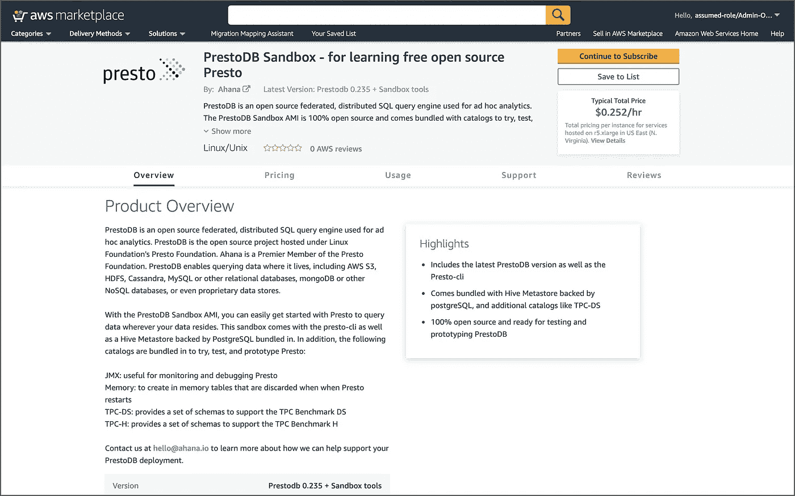

Ahana 的 PrestoDB 沙盒 AMI 允许您快速开始使用 Presto 查询数据，无论您的数据驻留在哪里。这个 AMI 将单个 EC2 实例沙箱配置为既是 Presto [协调器](https://prestodb.io/docs/current/overview/concepts.html#server-types)又是 Presto [工作器](https://prestodb.io/docs/current/overview/concepts.html#server-types)。它附带了一个由捆绑的 PostgreSQL 支持的 [Apache Hive](https://hive.apache.org/) Metastore。此外，还捆绑了以下目录，以便使用 Presto 进行尝试、测试和原型制作:

*   JMX:对监控和调试很有用
*   内存:在 RAM 中存储数据和元数据，当 Presto 重新启动时，这些数据和元数据将被丢弃
*   TPC-DS:提供一组模式来支持 [TPC 基准 DS](http://www.tpc.org/tpcds/)
*   TPC-H:提供了一组模式来支持 [TPC 基准 H](http://www.tpc.org/tpch/)

## 阿帕奇蜂房

在这个演示中，我们将使用由 [PostgreSQL](https://www.postgresql.org/) 支持的 [Apache Hive](https://cwiki.apache.org/confluence/display/Hive/Home) 和 Apache Hive [Metastore](https://cwiki.apache.org/confluence/display/Hive/Design#Design-Metastore) 。Apache Hive 是一个数据仓库软件，它使用 SQL 来帮助读取、写入和管理驻留在分布式存储中的大型数据集。该结构可以被投影到已经存储的数据上。提供了命令行工具和 JDBC 驱动程序来将用户连接到 Hive。Metastore 提供了数据仓库的两个基本特性:数据抽象和数据发现。Hive 通过提供与 Hive 查询处理系统紧密集成的元数据存储库来实现这两个功能，以便数据和元数据保持同步。

# 入门指南

要开始用 Presto 创建联邦查询，我们首先需要创建和配置我们的 AWS 环境，如下所示。

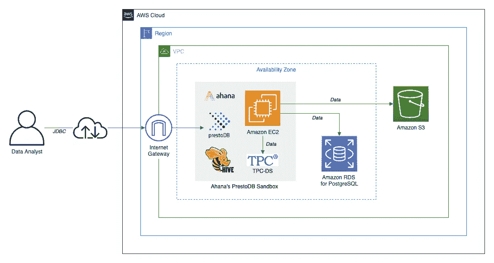

演示的 AWS 环境和资源的架构

## 订阅 Ahana 的 PrestoDB 沙盒

首先，在 AWS Marketplace 上订阅 [Ahana 的 PrestoDB 沙盒](https://aws.amazon.com/marketplace/pp/B08C21CGF6)。确保你知道所涉及的费用。美国东部(N. Virginia)基于 Linux 的 r5.xlarge 按需 EC2 实例的 AWS 当前价格为每小时 0.252 美元。为了进行演示，因为性能不是问题，所以您可以尝试一个较小的 EC2 实例，比如 r5。

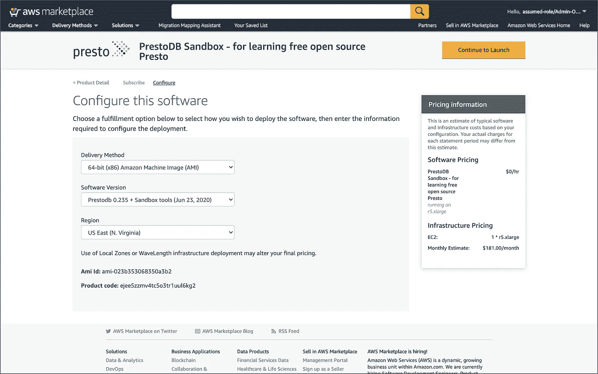

配置过程将引导您创建一个基于 Ahana 的 PrestoDB 沙盒 AMI 的 EC2 实例。

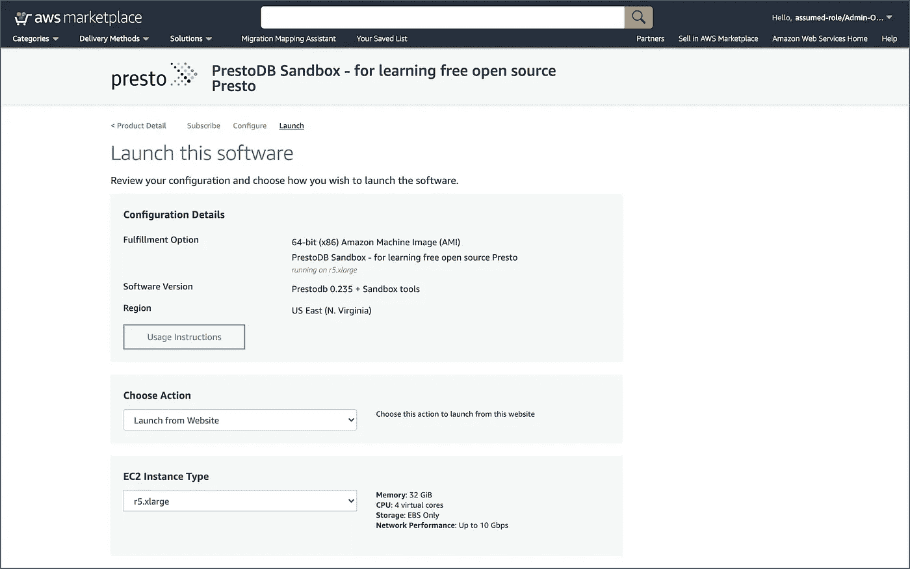

我选择在默认的 VPC 中创建 EC2 实例。演示的一部分包括使用 JDBC 本地连接到 Presto。因此，还需要为 EC2 实例包含一个公共 IP 地址。如果您选择这样做，我强烈建议将实例的安全组中所需的端口`22`和`8080`限制为您的 IP 地址(一个`/32` CIDR 块)。

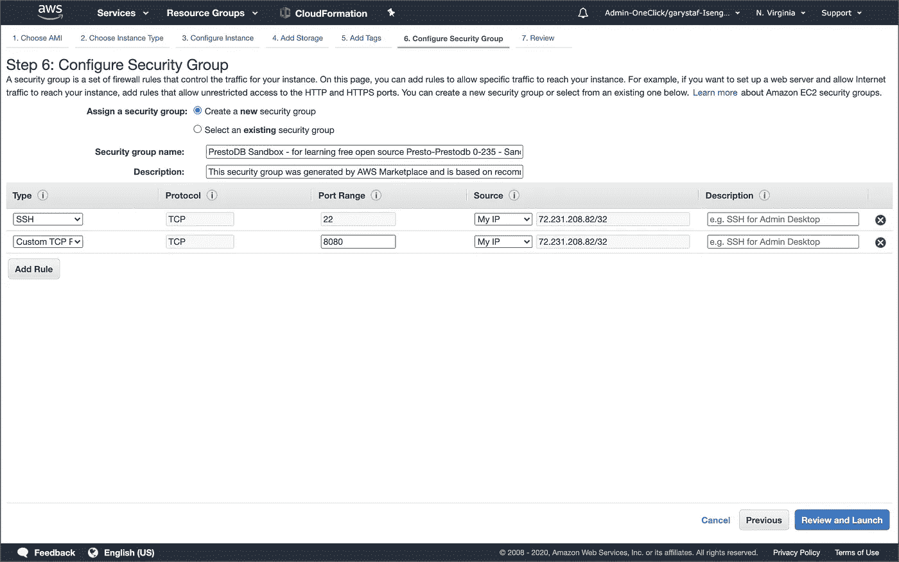

限制仅从我当前的 IP 地址访问端口 22 和 8080

最后，我们需要为 EC2 实例分配一个 IAM 角色，该实例可以访问亚马逊 S3。我将 AWS 托管策略`[AmazonS3FullAccess](https://console.aws.amazon.com/iam/home?region=us-east-1#/policies/arn:aws:iam::aws:policy/AmazonS3FullAccess$jsonEditor)`分配给 EC2 的 IAM 角色。

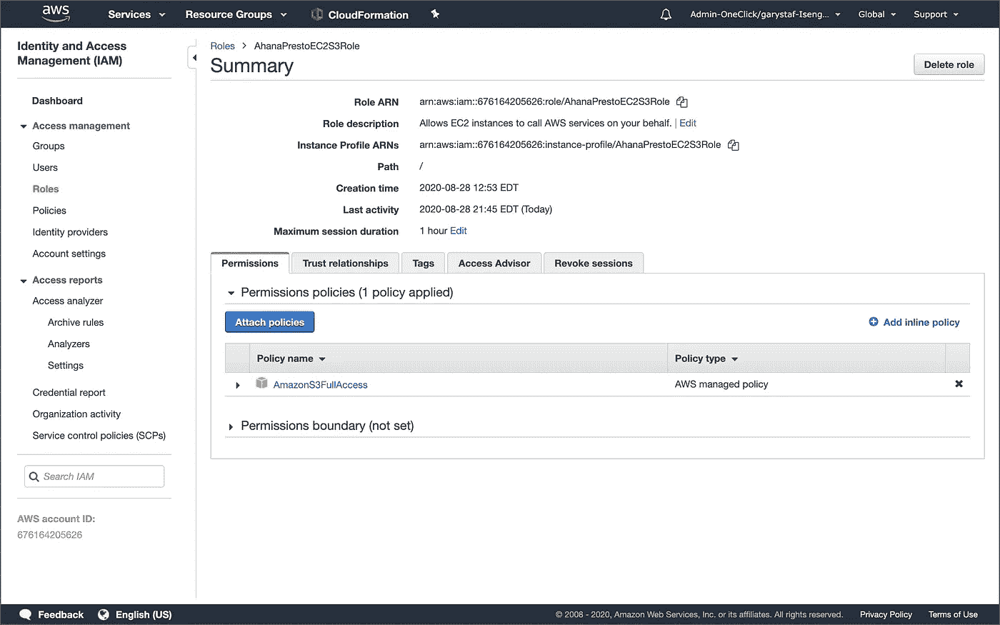

连接亚马逊 3FullAccess `AWS managed policy to the Role`

部分配置还要求一个[密钥对](https://docs.aws.amazon.com/AWSEC2/latest/UserGuide/ec2-key-pairs.html)。您可以使用现有密钥或为演示创建新密钥。为了在将来的命令中引用，我使用一个名为`ahana-presto`的键和我的键路径`~/.ssh/ahana-presto.pem`。确保更新命令以匹配您自己的密钥的名称和位置。

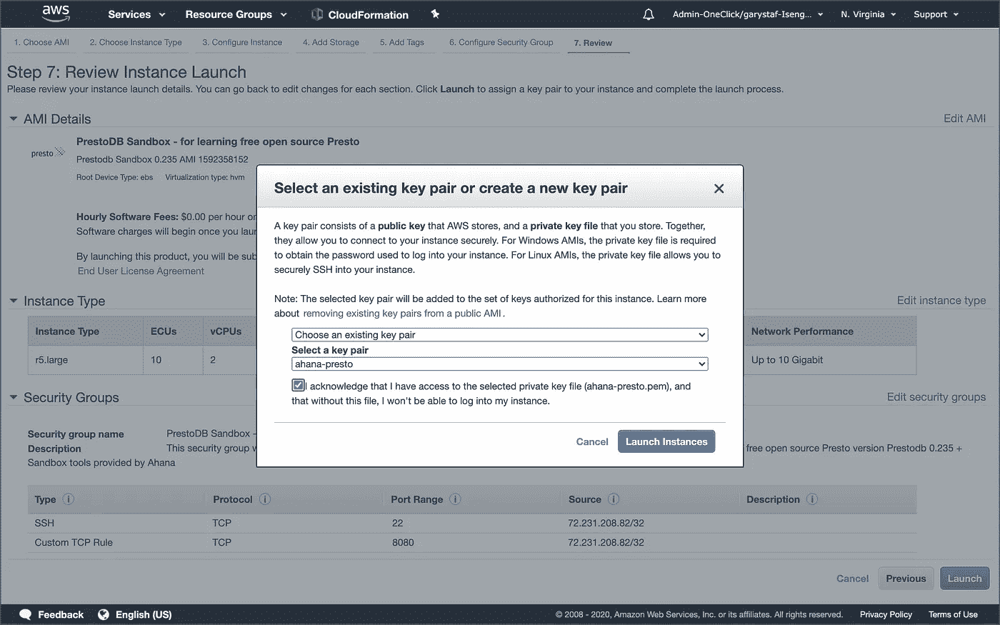

完成后，将提供使用 PrestoDB 沙箱 EC2 的说明。

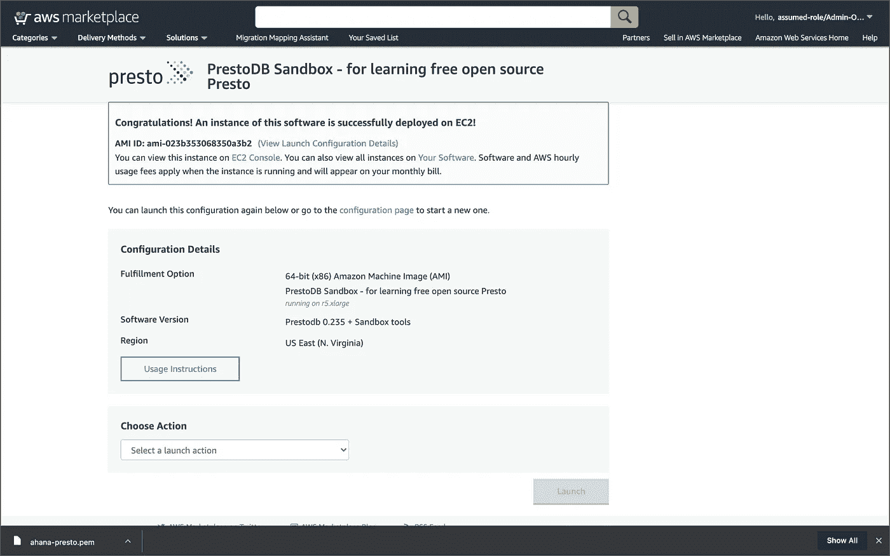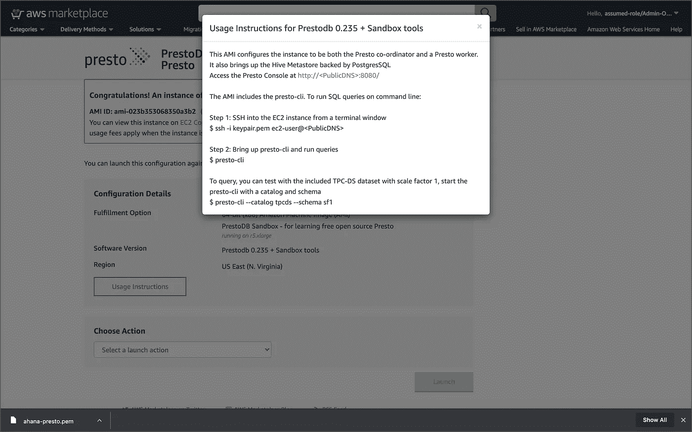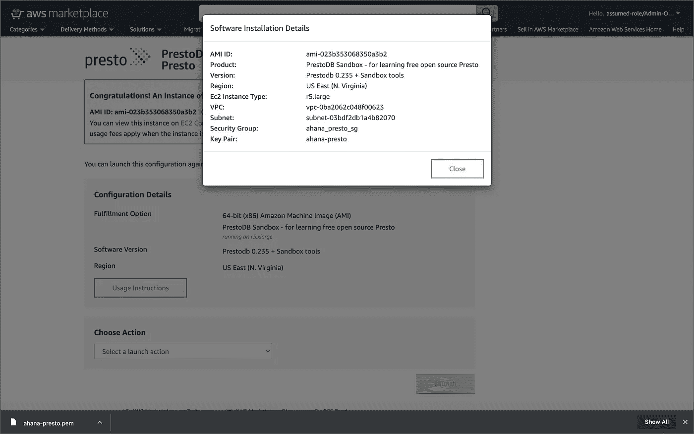

您可以从基于 web 的 AWS EC2 管理控制台查看包含 Presto 的正在运行的 EC2 实例。请务必记下公共 IPv4 地址或公共 IPv4 DNS 地址，因为在演示过程中将需要此值。

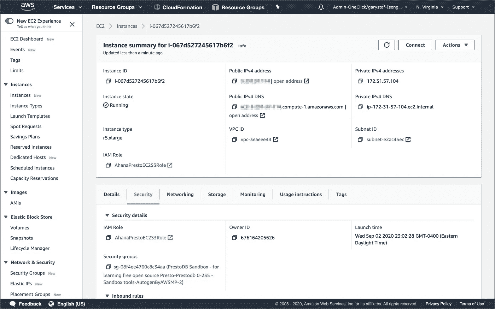

## 自动气象站云形成

我们将使用[亚马逊 RDS for PostgreSQL](https://aws.amazon.com/rds/postgresql/) 和[亚马逊 S3](https://aws.amazon.com/s3/) 作为 Presto 的附加数据源。GitHub 上的项目文件中包含一个 [AWS CloudFormation](https://aws.amazon.com/cloudformation) 模板`cloudformation/presto_ahana_demo.yaml`。该模板在默认 VPC 中为 PostgreSQL 实例创建一个 RDS，并创建一个加密的 Amazon S3 存储桶。

这篇文章的所有源代码都在 [GitHub](https://github.com/garystafford/presto-aws-federated-queries) 上。使用下面的命令来`git clone`项目的本地副本。

```
git clone --branch master --single-branch --depth 1 --no-tags \
    [https://github.com/garystafford/presto-aws-federated-queries.git](https://github.com/garystafford/presto-aws-federated-queries.git)
```

要从模板`cloudformation/rds_s3.yaml`创建 AWS CloudFormation 堆栈，请执行下面的`aws cloudformation`命令。确保您更改了`DBAvailabilityZone`参数值(粗体显示的*)以匹配创建 Ahana PrestoDB 沙箱 EC2 实例的 AWS 可用性区域。以我为例，`us-east-1f`。*

```
*aws cloudformation create-stack \
  --stack-name ahana-prestodb-demo \
  --template-body file://cloudformation/presto_ahana_demo.yaml \
  --parameters ParameterKey=DBAvailabilityZone,ParameterValue=**us-east-1f***
```

*要确保运行在 Ahana PrestoDB 沙箱 EC2 上的 Presto 可以访问 RDS for PostgreSQL 数据库实例，请手动将 PrestoDB 沙箱 EC2 的安全组添加到数据库实例的 VPC 安全组入站规则内的端口`5432`。我还将自己的 IP 添加到端口`5432`，使我能够使用 JDBC 从我的 IDE 直接连接到 RDS 实例。*

*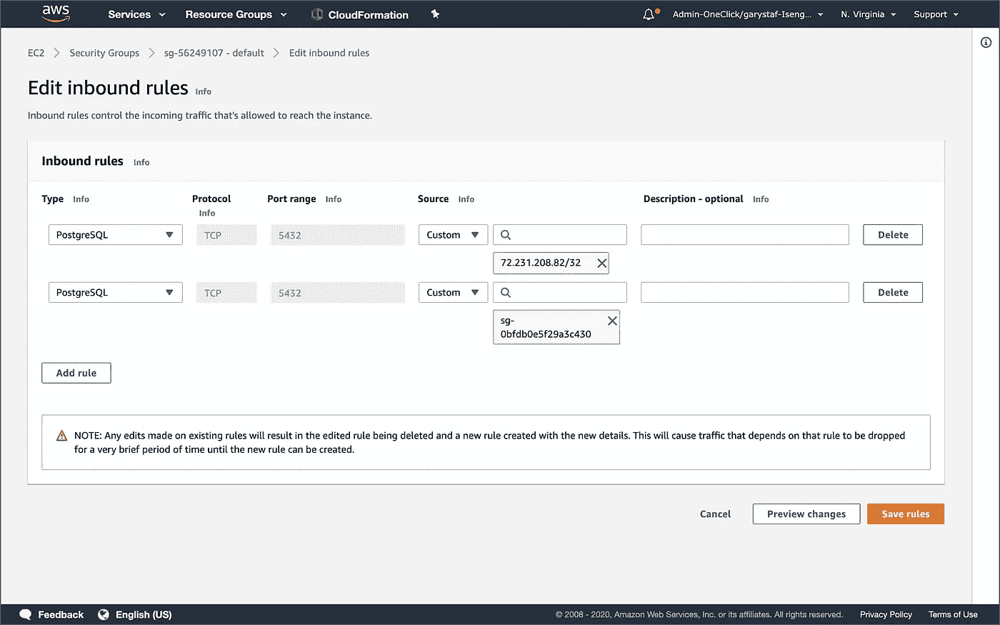*

*AWS CloudFormation 堆栈的 Outputs 选项卡包括一组值，包括 PostgreSQL 实例的新 RDS 的 JDBC 连接字符串`JdbcConnString`，以及亚马逊 S3 bucket 的名称`Bucket`。在演示过程中，所有这些值都是必需的。*

*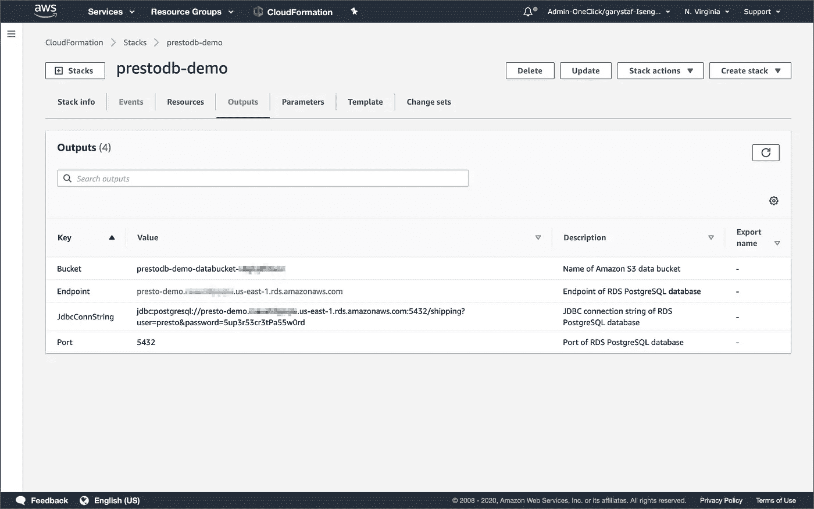*

# *准备 PrestoDB 沙箱*

*我们需要采取几个步骤来为我们的演示正确准备 PrestoDB 沙箱 EC2。首先，使用 PrestoDB 沙盒 EC2 SSH 密钥将`scp`和`properties`目录指向 Presto EC2 实例。首先，您需要将`EC2_ENDPOINT`值(粗体显示的*)设置为 EC2 的公共 IPv4 地址或公共 IPv4 DNS 值。您可以硬编码该值，或者使用下面显示的`aws ec2` API 命令以编程方式检索该值。**

```
**# on local workstation
EC2_ENDPOINT=$(aws ec2 describe-instances \
  --filters "Name=product-code,Values=ejee5zzmv4tc5o3tr1uul6kg2" \
    "Name=product-code.type,Values=marketplace" \
  --query "Reservations[*].Instances[*].{Instance:PublicDnsName}" \
  --output text)scp -i "~/.ssh/ahana-presto.pem" \
  -r properties/ sql/ \
  ec2-user@${EC2_ENDPOINT}:~/ssh -i "~/.ssh/ahana-presto.pem" ec2-user@${EC2_ENDPOINT}**
```

# **设置环境变量**

**接下来，我们需要设置几个环境变量。首先，替换下面的`DATA_BUCKET`和`POSTGRES_HOST`值(粗体显示的*)以匹配您的环境。`PGPASSWORD`值应该是正确的，除非你在 CloudFormation 模板中修改了它。然后，执行命令将变量添加到您的`.bash_profile`文件中。***

```
***echo """
export DATA_BUCKET=**prestodb-demo-databucket-CHANGE_ME**
export POSTGRES_HOST=**presto-demo.CHANGE_ME.us-east-1.rds.amazonaws.com**export PGPASSWORD=5up3r53cr3tPa55w0rd
export JAVA_HOME=/usr
export HADOOP_HOME=/home/ec2-user/hadoop
export HADOOP_CLASSPATH=$HADOOP_HOME/share/hadoop/tools/lib/*
export HIVE_HOME=/home/ec2-user/hive
export PATH=$HIVE_HOME/bin:$HADOOP_HOME/bin:$PATH
""" >>~/.bash_profile***
```

***或者，我建议用可用的更新来更新 EC2 实例，并安装您喜欢的工具，如`htop`，来监控 EC2 的性能。***

```
***yes | sudo yum update
yes | sudo yum install htop***
```

***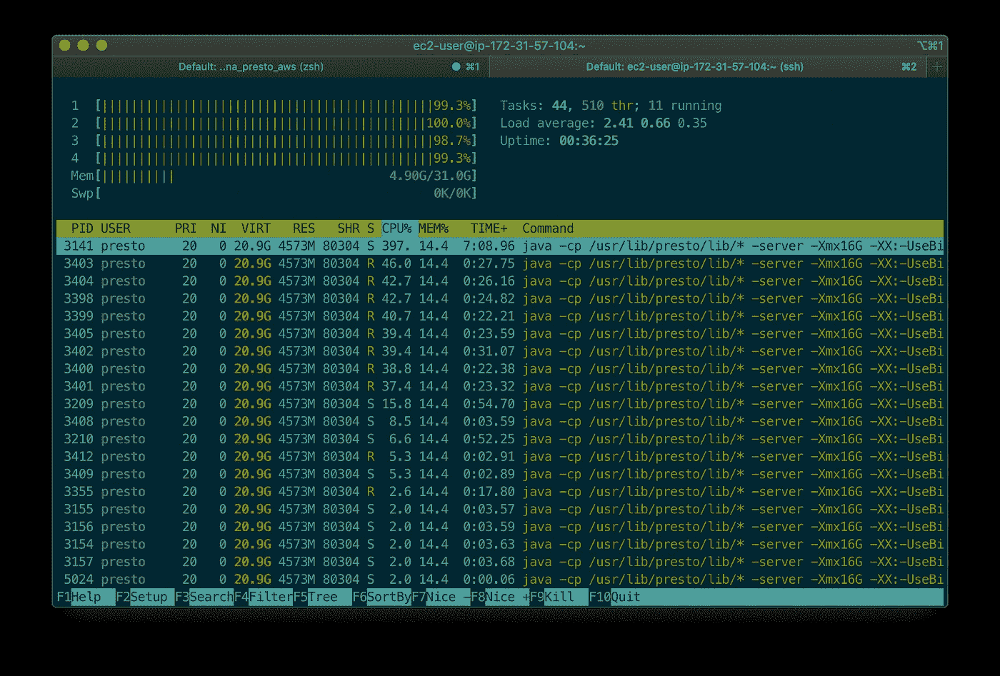***

***运行在 r5.xlarge EC2 实例上的`htop`视图***

***在进一步配置演示之前，让我们回顾一下 Ahana PrestoDB EC2 实例的几个方面。Ahana 实例上预装了几个应用程序，包括 Java、Presto、Hadoop、PostgreSQL 和 Hive。显示的版本是截至 2020 年 9 月初的最新版本。***

```
***java -version
  # openjdk version "1.8.0_252"
  # OpenJDK Runtime Environment (build 1.8.0_252-b09)
  # OpenJDK 64-Bit Server VM (build 25.252-b09, mixed mode)hadoop version
  # Hadoop 2.9.2postgres --version
  # postgres (PostgreSQL) 9.2.24psql --version
  # psql (PostgreSQL) 9.2.24hive --version
  # Hive 2.3.7presto-cli --version
  # Presto CLI 0.235-cb21100***
```

***Presto 配置文件在`/etc/presto/`目录中。配置单元配置文件在`~/hive/conf/`目录中。这里有几个命令，您可以使用它们来更好地了解它们的配置。***

```
***ls /etc/presto/cat /etc/presto/jvm.config
cat /etc/presto/config.properties
cat /etc/presto/node.properties# installed and configured catalogs
ls /etc/presto/catalog/cat ~/hive/conf/hive-site.xml***
```

# ***快速配置***

***要配置 Presto，我们需要为新创建的 RDS for PostgreSQL 实例创建并复制一个新的 Presto `postgresql` [目录属性文件](https://prestodb.io/docs/current/connector/postgresql.html)。修改`properties/rds_postgresql.properties`文件，将值`connection-url`(粗体显示的*)替换为您自己的 JDBC 连接字符串，显示在 CloudFormation Outputs 选项卡中。****

```
**connector.name=postgresql
connection-url=**jdbc:postgresql://presto-demo.abcdefg12345.us-east-1.rds.amazonaws.com:5432/shipping**
connection-user=presto
connection-password=5up3r53cr3tPa55w0rd**
```

**使用`sudo`将`rds_postgresql.properties`文件移动到正确的位置。**

```
**sudo mv properties/rds_postgresql.properties /etc/presto/catalog/**
```

**我们还需要修改现有的配置单元目录属性文件，这将允许我们从 Presto 写入非托管配置单元表。**

```
**connector.name=hive-hadoop2
hive.metastore.uri=thrift://localhost:9083
**hive.non-managed-table-writes-enabled=true****
```

**以下命令将用包含新属性的修改版本覆盖现有的`hive.properties`文件。**

```
**sudo mv properties/hive.properties |
  /etc/presto/catalog/hive.properties**
```

**为了完成目录属性文件的配置，我们需要重新启动 Presto。最简单的方法是重启 EC2 实例，然后 SSH 回到实例中。由于我们的环境变量在`.bash_profile file`中，它们将在重启和登录回 EC2 实例后继续存在。**

```
**sudo reboot**
```

# **将表添加到 Apache Hive Metastore**

**我们将使用 RDS for PostgreSQL 和 Apache Hive Metastore/Amazon S3 作为联邦查询的附加数据源。Ahana PrestoDB 沙盒实例预配置有 Apache Hive 和 Apache Hive Metastore，由 PostgreSQL 支持(*EC2 上预安装的独立 PostgreSQL 9.x 实例*)。**

**沙箱的 Presto 实例预配置了用于 [TPC 基准 DS](http://www.tpc.org/tpcds/) (TPC-DS)的模式。我们将在 Apache Hive Metastore 中创建相同的表，它们对应于 TPC-DS 数据源的`sf1`模式中的三个外部表:`tpcds.sf1.customer`、`tpcds.sf1.customer_address`和`tpcds.sf1.customer_demographics`。Hive [外部表](https://cwiki.apache.org/confluence/display/Hive/Managed+vs.+External+Tables)描述了外部文件的元数据/模式。外部表文件可以由 Hive 外部的进程访问和管理。例如，下面是在配置单元 Metastore 中创建外部`customer`表的 SQL 语句，该表的数据将存储在 S3 存储桶中。**

```
**CREATE EXTERNAL TABLE IF NOT EXISTS `customer`(
  `c_customer_sk` bigint, 
  `c_customer_id` char(16),
  `c_current_cdemo_sk` bigint, 
  `c_current_hdemo_sk` bigint, 
  `c_current_addr_sk` bigint, 
  `c_first_shipto_date_sk` bigint, 
  `c_first_sales_date_sk` bigint, 
  `c_salutation` char(10),
  `c_first_name` char(20),
  `c_last_name` char(30),
  `c_preferred_cust_flag` char(1), 
  `c_birth_day` integer, 
  `c_birth_month` integer, 
  `c_birth_year` integer, 
  `c_birth_country` char(20),
  `c_login` char(13),
  `c_email_address` char(50),
  `c_last_review_date_sk` bigint)
STORED AS PARQUET
LOCATION
  's3a://**prestodb-demo-databucket-CHANGE_ME**/customer'
TBLPROPERTIES ('parquet.compression'='SNAPPY');**
```

**三条`CREATE EXTERNAL TABLE` SQL 语句包含在`sql/`目录中:`sql/hive_customer.sql`、`sql/hive_customer_address.sql`和`sql/hive_customer_demographics.sql`。在继续之前，需要在所有三个文件中手动更新桶名(上方粗体显示的*)为您自己的桶名。***

**接下来，运行下面的`hive`命令，在现有的`default`模式/数据库中的 Hive Metastore 中创建外部表。**

```
**hive --database default -f sql/hive_customer.sql
hive --database default -f sql/hive_customer_address.sql
hive --database default -f sql/hive_customer_demographics.sql**
```

**为了确认成功创建了表，我们可以使用各种`hive`命令。**

```
**hive --database default -e "SHOW TABLES;"
hive --database default -e "DESCRIBE FORMATTED customer;"
hive --database default -e "SELECT * FROM customer LIMIT 5;"**
```

**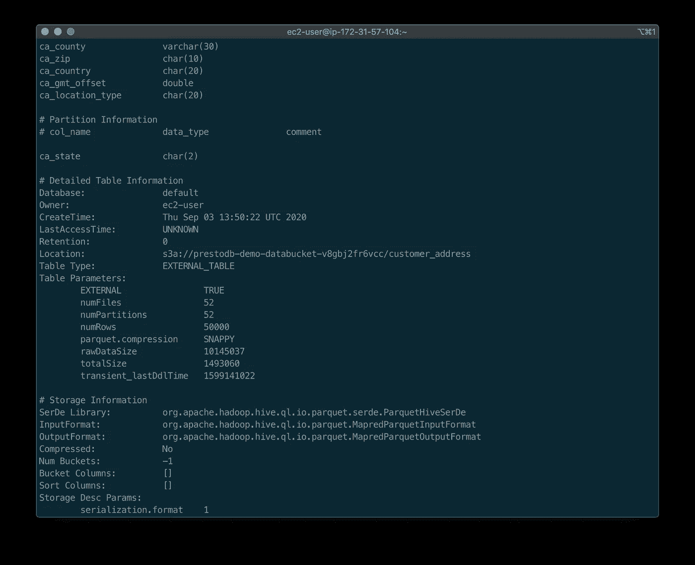**

**使用“描述格式化的客户地址”Hive 命令**

**或者，您也可以使用`hive`命令访问 CLI，从 Hive 内部交互地创建外部表。将 SQL 文件的内容复制并粘贴到`hive` CLI。使用`quit;`退出配置单元。**

**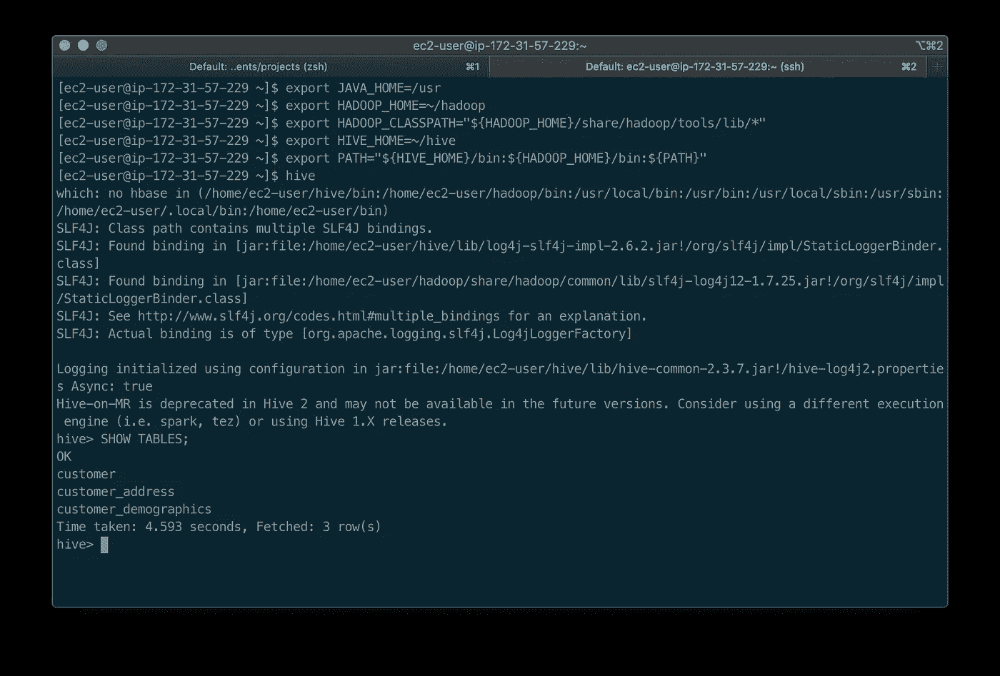**

**Apache Hive 中的交互式查询**

# **亚马逊 S3 数据源设置**

**创建外部表后，我们现在将从 TPC-DS 数据源的三个表中选择所有数据，并将这些数据插入到相应的 Hive 表中。物理数据将以高效的列存储格式写入亚马逊 S3， [SNAPPY](http://google.github.io/snappy/) 压缩的 [Apache Parquet](https://parquet.apache.org/) 文件。执行以下命令。接下来，我将解释为什么`customer_address`表语句有点不同。**

```
**# inserts 100,000 rows
presto-cli --execute """
  INSERT INTO hive.default.customer
  SELECT * FROM tpcds.sf1.customer;
  """# inserts 50,000 rows across 52 partitions
presto-cli --execute """
  INSERT INTO hive.default.customer_address
  SELECT ca_address_sk, ca_address_id, ca_street_number, 
    ca_street_name, ca_street_type, ca_suite_number, 
    ca_city, ca_county, ca_zip, ca_country, ca_gmt_offset, 
    ca_location_type, ca_state
  FROM tpcds.sf1.customer_address
  ORDER BY ca_address_sk;
  """# add new partitions in metastore
hive -e "MSCK REPAIR TABLE default.customer_address;"# inserts 1,920,800 rows
presto-cli --execute """
  INSERT INTO hive.default.customer_demographics
  SELECT * FROM tpcds.sf1.customer_demographics;
  """**
```

**使用 AWS 管理控制台或 AWS CLI 确认数据已加载到正确的 S3 存储桶位置，并且是拼花格式。请放心，即使 S3 控制台错误地将`Compression`显示为`None`，拼花格式的数据也会被快速压缩。您可以使用像 [parquet-tools](https://github.com/apache/parquet-mr/tree/master/parquet-tools) 这样的实用程序轻松地确认压缩编解码器。**

**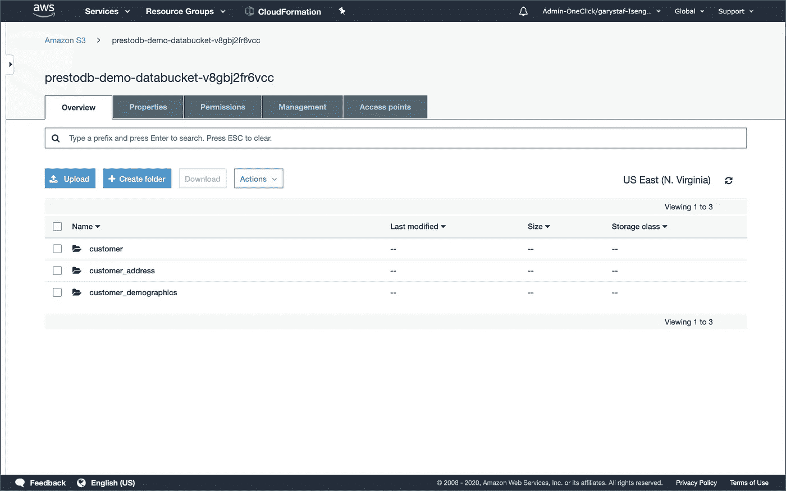**

**亚马逊 S3 中按关键字前缀组织的数据**

**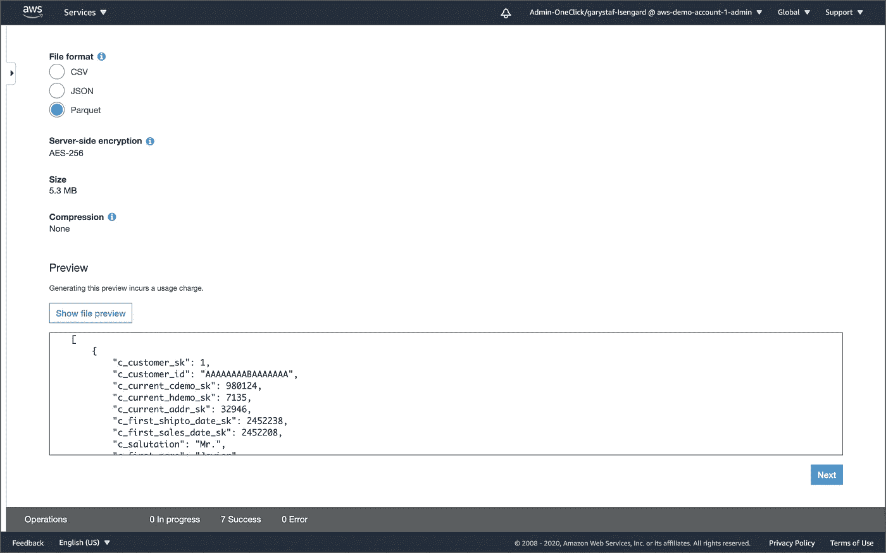**

**使用 S3 的“选择”功能预览快速压缩的拼花地板格式数据**

## **分区表**

**`customer_address`表是唯一的，因为它是由`ca_state`列进行分区的。[分区表](https://cwiki.apache.org/confluence/display/Hive/LanguageManual+DDL#LanguageManualDDL-PartitionedTables)使用`PARTITIONED BY`子句创建。**

```
**CREATE EXTERNAL TABLE `customer_address`(
    `ca_address_sk` bigint,
    `ca_address_id` char(16),
    `ca_street_number` char(10),
    `ca_street_name` char(60),
    `ca_street_type` char(15),
    `ca_suite_number` char(10),
    `ca_city` varchar(60),
    `ca_county` varchar(30),
    `ca_zip` char(10),
    `ca_country` char(20),
    `ca_gmt_offset` double precision,
    `ca_location_type` char(20)
)
**PARTITIONED BY (`ca_state` char(2))** STORED AS PARQUET
LOCATION
  's3a://**prestodb-demo-databucket-CHANGE_ME**/customer'
TBLPROPERTIES ('parquet.compression'='SNAPPY');**
```

**根据 [Apache Hive](https://cwiki.apache.org/confluence/display/Hive/LanguageManual+DDL#LanguageManualDDL-PartitionedTables) ，一个表可以有一个或多个分区列，并且为分区列中的每个不同的值组合创建一个单独的数据目录。由于 Hive 表的数据存储在亚马逊 S3 中，这意味着当数据被写入到`customer_address`表中时，它会根据状态被自动分成不同的 S3 键前缀。数据被物理地“分区”。**

**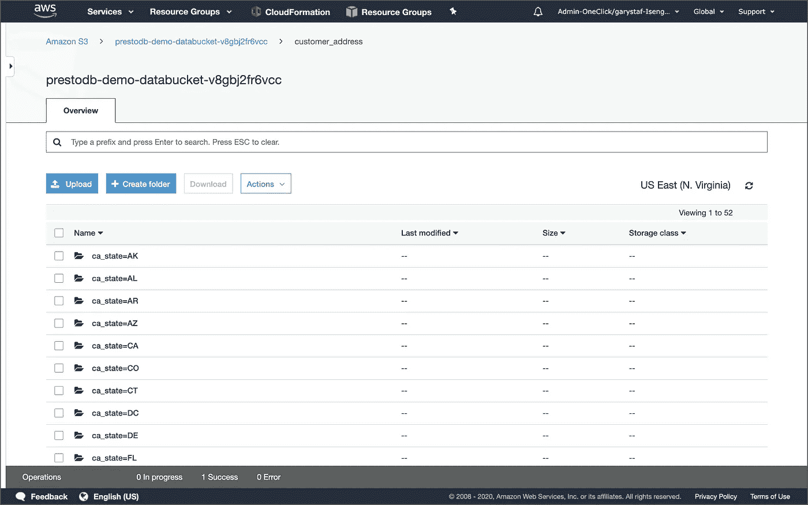**

**亚马逊 S3 按州划分的客户地址数据**

**每当在 S3 中添加新分区时，我们需要运行`MSCK REPAIR TABLE`命令来将该表的新分区添加到 Hive Metastore 中。**

```
**hive -e "MSCK REPAIR TABLE default.customer_address;"**
```

**在 SQL 中，[谓词](https://docs.intersystems.com/irislatest/csp/docbook/Doc.View.cls?KEY=RSQL_predicates)是一个条件表达式，其计算结果为布尔值，可以是真或假。定义与查询的条件/过滤器(谓词)中经常使用的属性一致的分区可以显著提高查询效率。当我们执行一个使用相等比较条件的查询时，比如`ca_state = 'TN'`，分区意味着查询将只处理对应的`ca_state=TN`前缀键中的一部分数据。在`customer_address`表中有 50000 行数据，但是在`ca_state=TN`分区中只有 1418 行(占总数据的 2.8%)。由于 Parquet 格式具有快速压缩的额外优势，分区可以显著减少查询执行时间。**

# **将数据添加到 PostgreSQL 实例的 RDS**

**为了进行演示，我们还将把`tpcds.sf1.customer_address`表的模式和数据复制到新的 PostgreSQL 实例的`shipping`数据库中。**

```
**CREATE TABLE customer_address (
    ca_address_sk bigint,
    ca_address_id char(16),
    ca_street_number char(10),
    ca_street_name char(60),
    ca_street_type char(15),
    ca_suite_number char(10),
    ca_city varchar(60),
    ca_county varchar(30),
    ca_state char(2),
    ca_zip char(10),
    ca_country char(20),
    ca_gmt_offset double precision,
    ca_location_type char(20)
);**
```

**像 Hive 和 Presto 一样，我们可以从命令行以编程方式或交互方式创建表；我更喜欢程序化的方法。使用下面的`psql`命令，我们可以在`shipping`数据库的`public`模式中创建`customer_address`表。**

```
**psql -h ${POSTGRES_HOST} -p 5432 -d shipping -U presto \
  -f sql/postgres_customer_address.sql**
```

**现在，要将数据插入到新的 PostgreSQL 表中，运行下面的`presto-cli`命令。**

```
**# inserts 50,000 rows
presto-cli --execute """
  INSERT INTO rds_postgresql.public.customer_address
  SELECT * FROM tpcds.sf1.customer_address;
  """**
```

**为了确认数据被正确导入，我们可以使用各种命令。**

```
**-- Should be 50000 rows in table
psql -h ${POSTGRES_HOST} -p 5432 -d shipping -U presto \
  -c "SELECT COUNT(*) FROM customer_address;"psql -h ${POSTGRES_HOST} -p 5432 -d shipping -U presto \
  -c "SELECT * FROM customer_address LIMIT 5;"**
```

**或者，您可以通过将`sql/postgres_customer_address.sql`文件的内容复制并粘贴到`psql`命令提示符来交互式地使用 PostgreSQL 客户端。要从`psql`命令提示符与 PostgreSQL 交互，请使用以下命令。**

```
**psql -h ${POSTGRES_HOST} -p 5432 -d shipping -U presto**
```

**使用`\dt`命令列出 PostgreSQL 表，使用`\q`命令退出 PostgreSQL 客户端。现在，我们已经创建并配置了所有新的数据源！**

# **与 Presto 交互**

**Presto 提供了一个监视和管理查询的 web 界面。该界面提供了对 Presto 集群和集群上运行的查询的仪表板式洞察。Presto UI 在使用公共 IPv4 地址或公共 IPv4 DNS 的端口`8080`上可用。**

**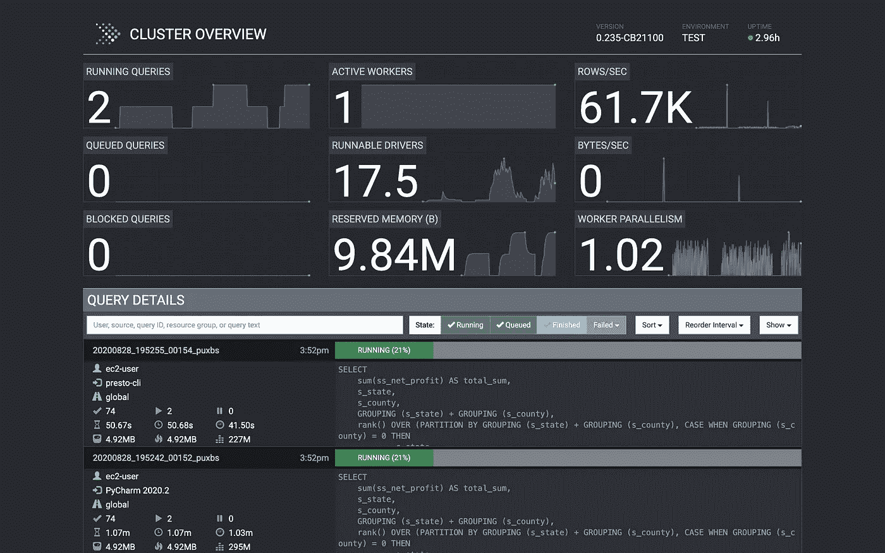**

**有几种方法可以通过 PrestoDB 沙箱与 Presto 交互。这篇文章将展示如何使用 [JDBC](https://prestodb.io/docs/current/installation/jdbc.html) 连接和 [Presto CLI](https://prestodb.io/docs/current/installation/cli.html) 在 IDE 中对 Presto 执行特定查询。其他选项包括从 Java 和 Python 应用程序、 [Tableau](https://prestodb.io/docs/current/installation/tableau.html) 或 [Apache Spark/PySpark](https://prestodb.io/docs/current/installation/spark.html) 中运行对 Presto 的查询。**

**下面，我们看到一个来自 [JetBrains PyCharm](https://www.jetbrains.com/pycharm/) 的针对 Presto 的查询，使用 Java 数据库连接(JDBC)连接。使用像 JetBrains 这样的 IDE 的优点是有一个单一的可视化界面，包括所有的项目文件、多个 JDBC 配置、输出结果，以及运行多个特定查询的能力。**

**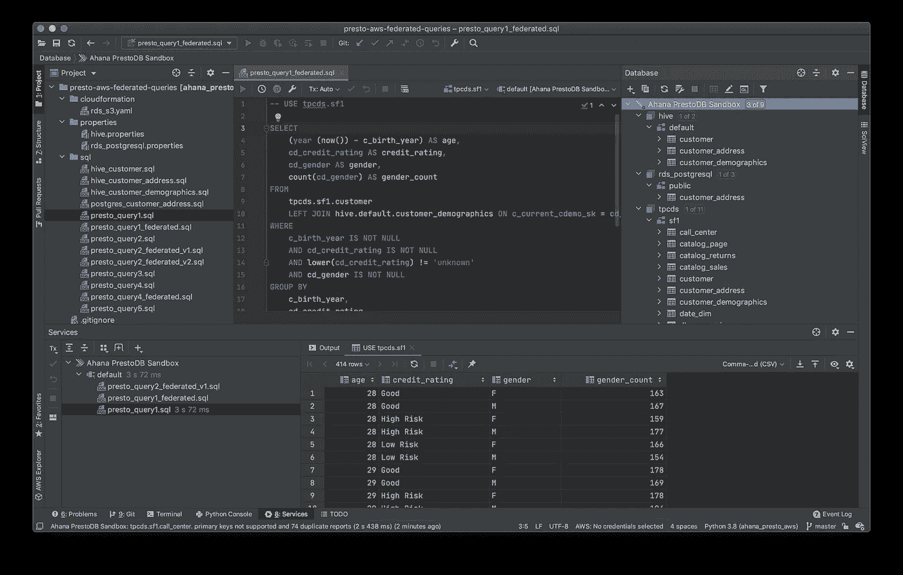**

**下面，我们将看到一个使用 JDBC 连接字符串配置 Presto 数据源的示例，该字符串在 CloudFormation stack Outputs 选项卡中提供。**

**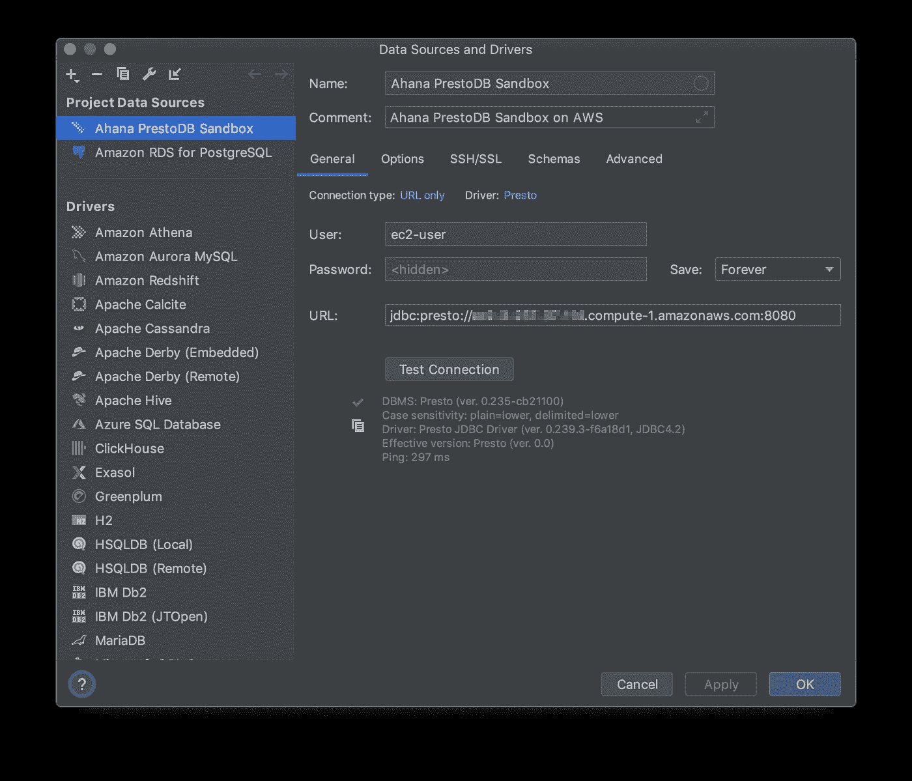**

**确保[下载](https://prestodb.io/download.html)并使用最新的 Presto JDBC 驱动 JAR。**

**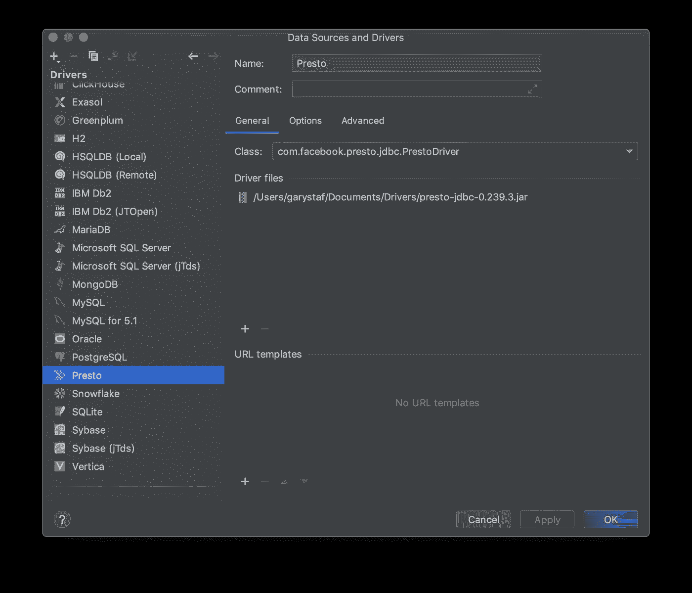**

**使用 JetBrains 的 ide，我们甚至可以限制数据源显示的数据库/模式。当我们配置了多个 Presto 目录，但是我们只对某些数据源感兴趣时，这是很有帮助的。**

**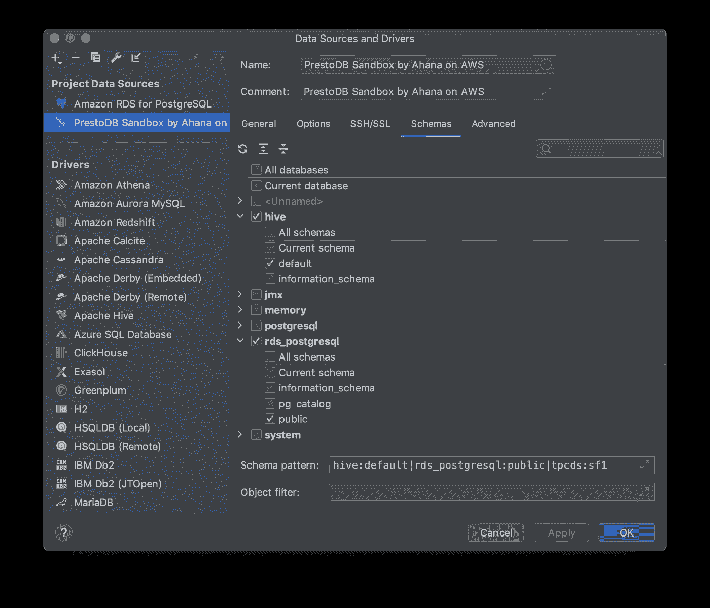**

**我们还可以使用 Presto CLI 运行查询，有三种不同的方式。我们可以将 SQL 语句传递给 Presto CLI，将包含 SQL 语句的文件传递给 Presto CLI，或者从 Presto CLI 进行交互工作。下面，我们看到一个从 Presto CLI 交互运行的查询。**

**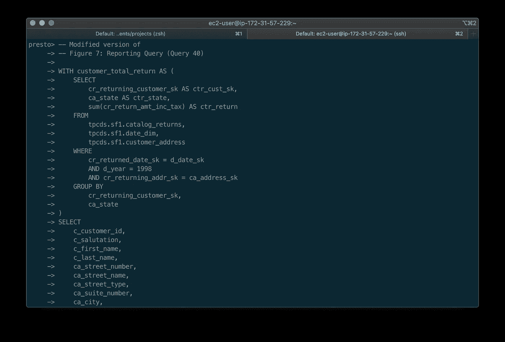**

**当查询运行时，我们可以观察到实时的 Presto 查询统计信息(在我的终端中*对用户不太友好)。***

**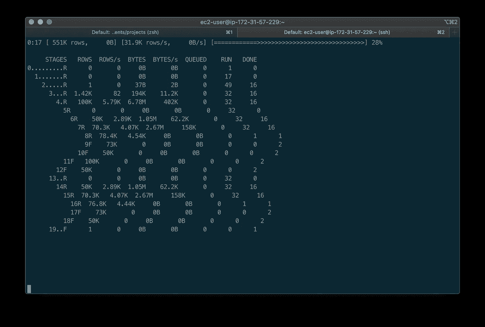**

**最后，查看查询结果。**

**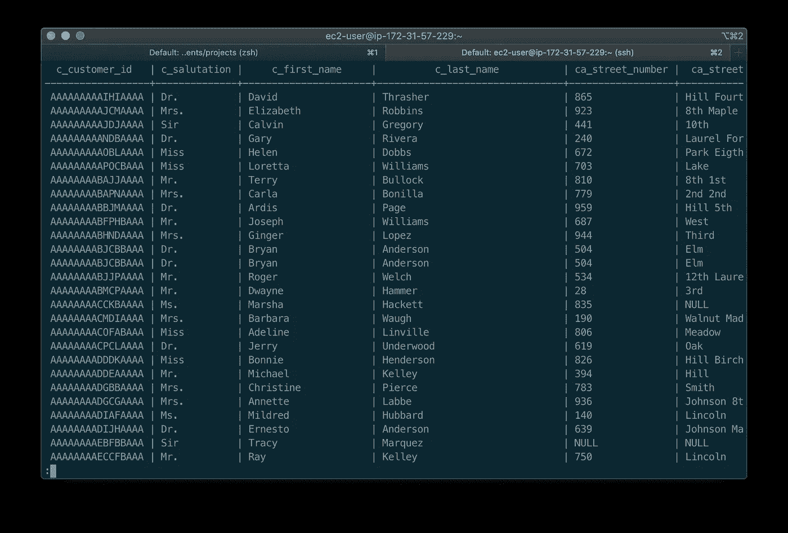**

# **联邦查询**

**演示中使用并包含在项目中的示例查询主要摘自学术文章[Why You Should Run TPC-DS:A Workload Analysis](http://www.tpc.org/tpcds/presentations/tpcds_workload_analysis.pdf)，该文章在[tpc.org](http://www.tpc.org/)网站上以 PDF 格式提供。我已经修改了 SQL 查询来处理 Presto。**

**在第一个示例中，我们将运行同一基本查询语句的三个版本。查询的版本 1 不是联合查询；它只查询一个数据源。第 2 版查询查询两个不同的数据源。最后，第 3 版查询查询三个不同的数据源。SQL 语句的三个版本都应该返回相同的结果— 93 行数据。**

## **版本 1:单一数据源**

**查询语句的第一个版本`sql/presto_query2.sql`不是联邦查询。查询的四个表(`catalog_returns`、`date_dim`、`customer`和`customer_address`)中的每一个都引用 TPC-DS 数据源，这是预装在 PrestoDB 沙箱中的。注意第 11–13 行和第 41–42 行的表引用都与`tpcds.sf1`模式相关联。**

**我们将使用`presto-cli`以非交互方式运行每个查询。我们将选择`sf1`(比例因子为 1) `tpcds`模式。根据 [Presto](https://prestodb.io/docs/current/connector/tpcds.html) ，比例因子(`sf1`、`sf10`、`sf100`)中的每个单位对应一个千兆字节的数据。**

```
**presto-cli \
  --catalog tpcds \
  --schema sf1 \
  --file sql/presto_query2.sql \
  --output-format ALIGNED \
  --client-tags "presto_query2"**
```

**下面，我们看到了`presto-cli`中的查询结果。**

**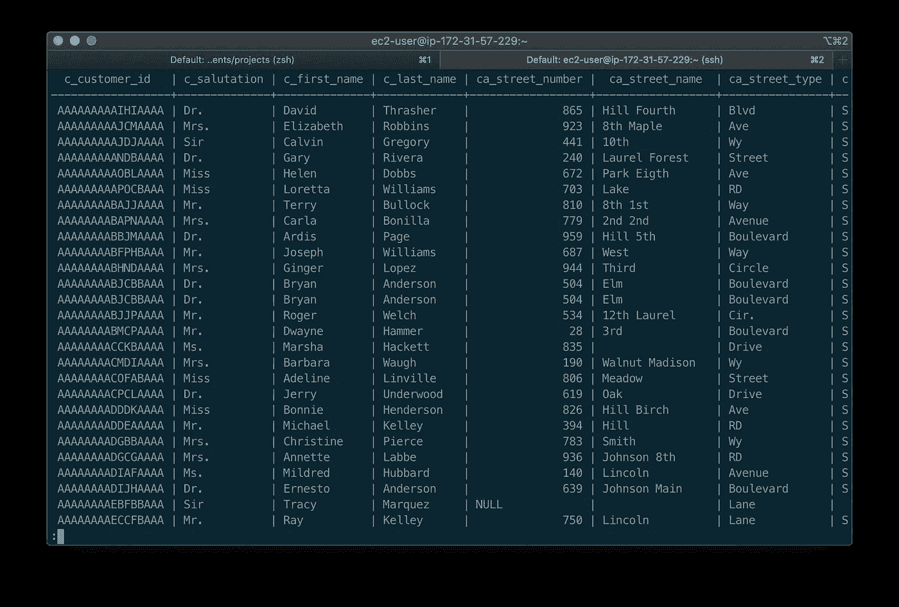**

**下面，我们看到第一个查询在 Presto 的 web 界面中运行。**

**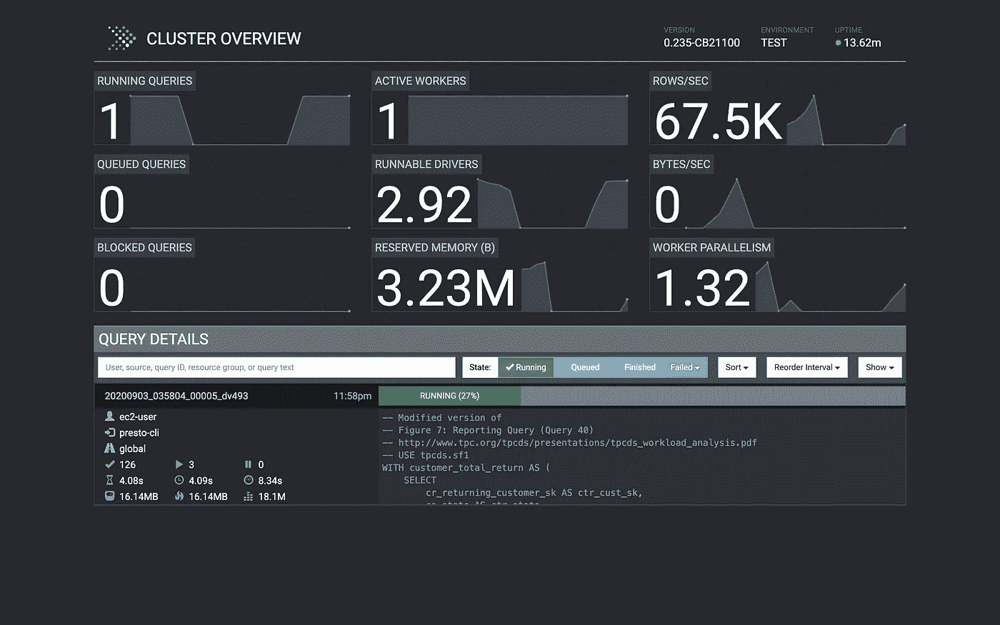**

**下面，我们在 Presto 的 web 界面中看到了第一个查询的详细结果。**

**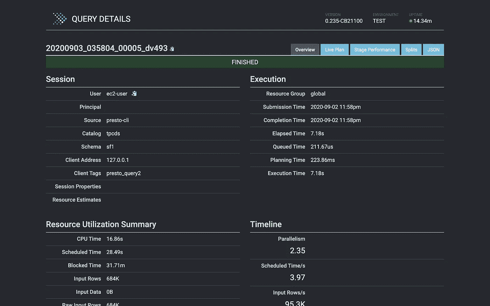**

## **版本 2:两个数据源**

**在查询语句的第二个版本`sql/presto_query2_federated_v1.sql`中，两个表(`catalog_returns`和`date_dim`)引用了 TPC-DS 数据源。另外两个表(`customer`和`customer_address`)现在引用 Apache Hive Metastore 来获取它们在亚马逊 S3 的模式和底层数据。注意第 11 行和第 12 行上的表引用，而不是第 13 行、第 41 行和第 42 行。**

**再次使用`presto-cli`运行查询。**

```
**presto-cli \
  --catalog tpcds \
  --schema sf1 \
  --file sql/presto_query2_federated_v1.sql \
  --output-format ALIGNED \
  --client-tags "presto_query2_federated_v1"**
```

**下面，我们在 Presto 的 web 界面中看到了第二个查询的详细结果。**

**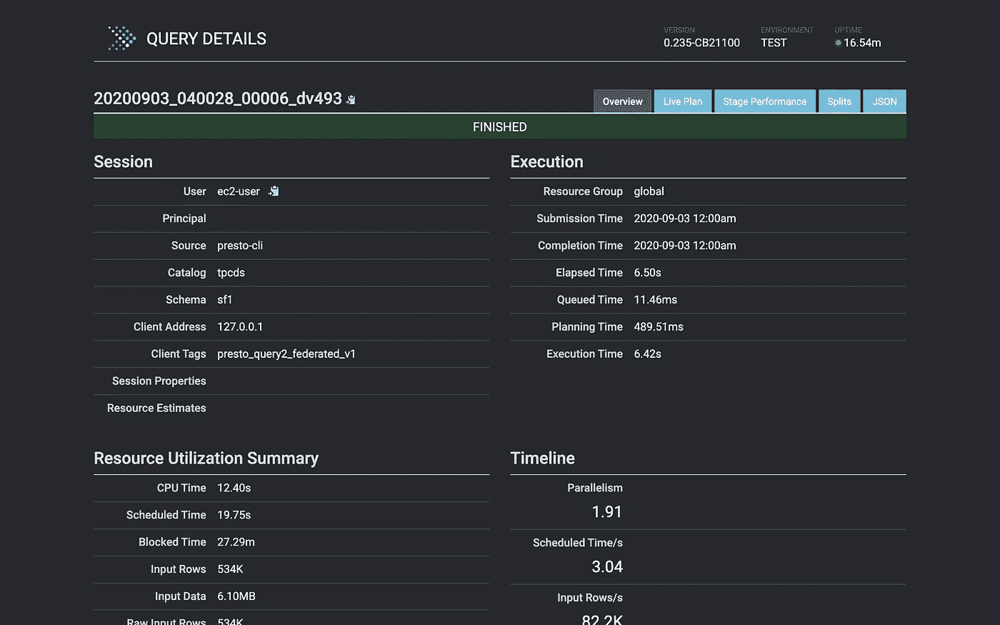**

**即使数据在两个独立的、物理上不同的数据源中，我们也可以很容易地对其进行查询，就好像它们都在同一个地方一样。**

## **版本 3:三个数据源**

**在查询语句的第三个版本`sql/presto_query2_federated_v2.sql`中，两个表(`catalog_returns`和`date_dim`)引用了 TPC-DS 数据源。其中一个表(`hive.default.customer`)引用了 Apache Hive Metastore。底层数据在亚马逊 S3。第四个表(`rds_postgresql.public.customer_address`)引用 PostgreSQL 数据库实例的新 RDS。注意第 11 行和第 12 行以及第 13 行和第 41 行的表格引用，与第 42 行相对。**

**同样，我们使用`presto-cli`运行了查询。**

```
**presto-cli \
  --catalog tpcds \
  --schema sf1 \
  --file sql/presto_query2_federated_v2.sql \
  --output-format ALIGNED \
  --client-tags "presto_query2_federated_v2"**
```

**下面，我们在 Presto 的 web 界面中看到第三个查询的详细结果。**

****

**同样，即使数据在三个独立的、物理上不同的数据源中，我们也可以很容易地对其进行查询，就好像它们都在同一个地方一样。**

# **其他查询示例**

**该项目包含几个额外的查询语句，这些语句是我从[Why You Should Run TPC-DS:A Workload Analysis](http://www.tpc.org/tpcds/presentations/tpcds_workload_analysis.pdf)中提取的，并修改了 Presto 和跨多个数据源的联邦工作。**

```
**# non-federated
presto-cli \
  --catalog tpcds \
  --schema sf1 \
  --file sql/presto_query1.sql \
  --output-format ALIGNED \
  --client-tags "presto_query1"# federated - two sources
presto-cli \
  --catalog tpcds \
  --schema sf1 \
  --file sql/presto_query1_federated.sql \
  --output-format ALIGNED \
  --client-tags "presto_query1_federated" # non-federated
presto-cli \
  --catalog tpcds \
  --schema sf1 \
  --file sql/presto_query4.sql \
  --output-format ALIGNED \
  --client-tags "presto_query4"# federated - three sources
presto-cli \
  --catalog tpcds \
  --schema sf1 \
  --file sql/presto_query4_federated.sql \
  --output-format ALIGNED \
  --client-tags "presto_query4_federated" # non-federated
presto-cli \
  --catalog tpcds \
  --schema sf1 \
  --file sql/presto_query5.sql \
  --output-format ALIGNED \
  --client-tags "presto_query5"**
```

# **结论**

**在这篇文章中，我们通过使用来自 AWS Marketplace 的 Ahana 的 [PrestoDB 沙盒](https://aws.amazon.com/marketplace/pp/Ahana-PrestoDB-Sandbox-for-learning-free-open-sour/B08C21CGF6)产品，对 Presto 有了更好的理解。我们学习了 Presto 如何查询数据所在的位置，包括 Apache Hive、Thrift、Kafka、Kudu 和 Cassandra、Elasticsearch、MongoDB 等。我们还了解了 Apache Hive 和 Apache Hive Metastore、Apache Parquet 文件格式，以及如何和为什么在亚马逊 S3 对 Hive 数据进行分区。最重要的是，我们学习了如何编写联合查询，将多个不同的数据源连接起来，而不将数据移动到一个单一的数据存储中。**

**本博客代表我自己的观点，而非我的雇主亚马逊网络服务公司的观点。**