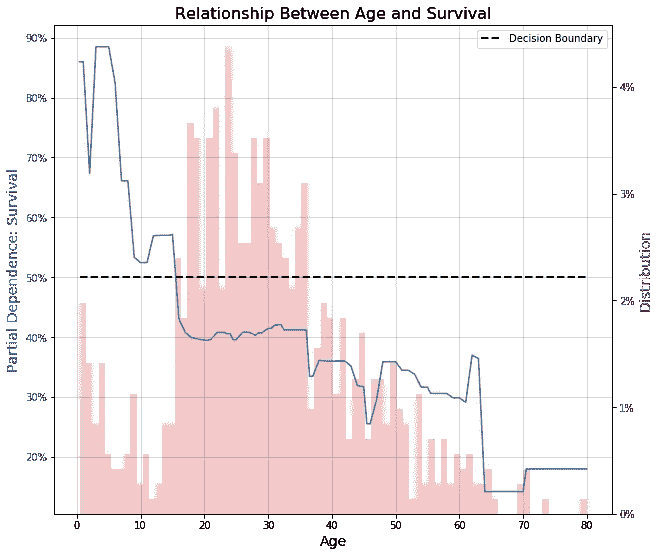

# 窥视黑匣子

> 原文：<https://towardsdatascience.com/prettifying-partial-density-plots-in-python-1f7216937ff?source=collection_archive---------20----------------------->

## [内部 AI](https://towardsdatascience.com/inside-ai/home)

## 更吸引人的部分依赖图如何在黑盒模型中与非技术涉众建立信任。


人们不相信他们不了解的东西。人工智能和机器学习算法是我们拥有的一些最强大的技术，但它们也是最容易被误解的。因此，数据科学家最重要的职责之一就是以易于理解的方式传达复杂的信息。

## 黑盒模型

也许对神经网络最大的误解之一是，我们不能直接看到产生结果的模型。我们可以看到我们的投入和产出，我们可以衡量结果，但我们并没有真正理解它们之间的关系。从实用性的角度来看，这是有问题的，因为像人类一样，关系的本质会随着时间而改变。人工智能今天对卡车的感知可能会反映出卡车明天的样子。


特斯拉赛博卡车。来源:迈克·马琳/Shutterstock.com

然而，大多数变化都不像特斯拉的网络卡车那样刺耳。如果我们看不到算法的内部，我们怎么知道算法正在跟上普通假设的逐渐变化呢？我们打开盒子。我们拥有的最好的工具之一是部分依赖图(PDP)。

## 部分相关图

[Scikit-Learn](https://scikit-learn.org/stable/modules/partial_dependence.html) 的创作者这样描述部分依赖情节:

> 部分相关性图(PDP)显示了目标响应和一组“目标”特征之间的相关性，忽略了所有其他特征(“补充”特征)的值。

换句话说，PDP 允许我们看到预测变量的变化如何影响目标变量的变化。下面是一个 PDP 的例子，显示了不同的房子特征对预测价格的影响。


来源: [Scikit-Learn](https://scikit-learn.org/stable/modules/partial_dependence.html)

从这些图中，我们可以看到，随着中值收入和房屋年龄的增加，预测价格往往会增加。然而，随着一个地区平均入住率的上升，预测价格会下降。底部的线条代表观察值的分布。

这些情节非常容易理解和创作。使用拟合的模型、数据集(仅限 X 要素)和输入要素列表，您可以在导入相关库后使用单行代码生成上述图:

```
import matplotlib.pyplot as plt
from sklearn.inspection import partial_dependence, plot_partial_dependenceplot_partial_dependence(model, X, features)
```

这些图对于几乎任何类型的回归模型都很好。然而，我发现在将 PDP 应用于分类任务时，非技术利益相关者有时很难解释结果。更重要的是，它们看起来并不特别吸引人。让我们打扮一下，并添加一些功能。

## 美化的 PDP

为了便于说明，我们将使用[泰坦尼克号数据集](https://www.kaggle.com/hesh97/titanicdataset-traincsv)。我们将使用 XGBoost 分类模型构建一个简单的模型，该模型尝试基于几个输入特征来识别幸存者。我们最感兴趣的是弄清楚我们的模型如何使用年龄作为存活率的预测指标(没有双关语)。

```
from xgboost import XGBClassifierdf = pd.read_csv('titanic.csv')
X = df[['Age', 'SibSp', 'Parch', 'Fare']]
y = df['Survived']model = XGBClassifier()
model.fit(X, y)fig = plt.figure(figsize(10, 9))
plot_partial_dependence(model, X, ['Age'], fig=fig)
plt.show()
```


正如我们所看到的，我们的模型已经确定，在所有其他因素相同的情况下，老年人更不可能存活。我们还可以看到大多数乘客年龄在 20 到 40 岁之间。

如果我们可以通过在同一个图表上绘制直方图来更清楚地了解年龄分布，这不是很好吗？将部分相关值显示为百分比怎么样？如果我们也能可视化决策边界，那不是很好吗？我们可以通过使用 partial _ dependence 方法获取部分依赖值并自己绘制结果来完成所有这些工作。幸运的是，我已经创建了一个函数来完成这项工作。

```
from sklearn.inspection import partial_dependence
```

上述函数将为单个输入变量生成一个 PDP，并允许输入轴标签和图表标题的目标名称。此外，它还提供了将 y 轴刻度显示为百分比、更改决策边界以及返回部分相关值以供进一步分析的选项。通过坚持使用标准设置并为目标传递一个名称，我们得到如下结果:

```
plot_pdp(model, X, 'Age', target='Survival')
```



有了这个，我们对年龄分布有了更丰富的了解。我们可以清楚地看到年龄跨越了决策界限。我们以一种让非技术利益相关者更容易阅读和理解的方式来标记轴。从这里开始，您可以试验这些选项，看看它们如何改变图表的显示，或者根据您的喜好修改代码。

如果没有别的，我会鼓励你想出新的方法来分享你的工作，以创造更多的非技术观众的参与。

更新:如果将上述代码与[GradientBoostingRegressor](https://scikit-learn.org/stable/modules/generated/sklearn.ensemble.GradientBoostingRegressor.html#sklearn.ensemble.GradientBoostingRegressor)或[GradientBoostingClassifier](https://scikit-learn.org/stable/modules/generated/sklearn.ensemble.GradientBoostingClassifier.html#sklearn.ensemble.GradientBoostingClassifier)一起使用，则需要将方法设置为“brute”

```
partial_dependence(model, X, ['Age'], method='brute')
```