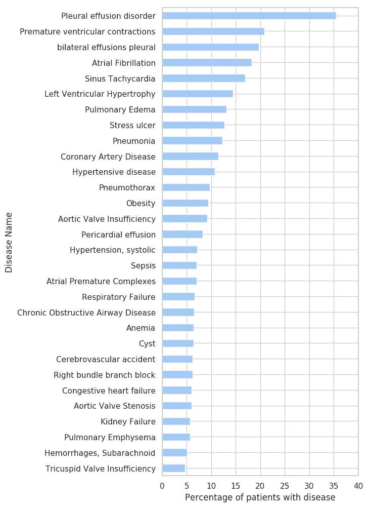
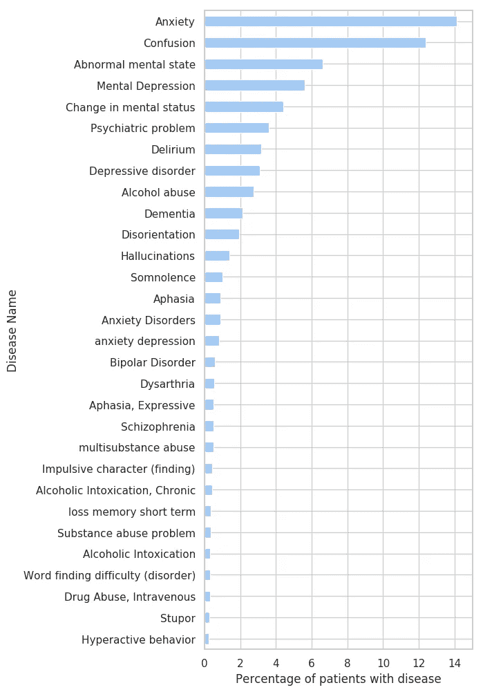
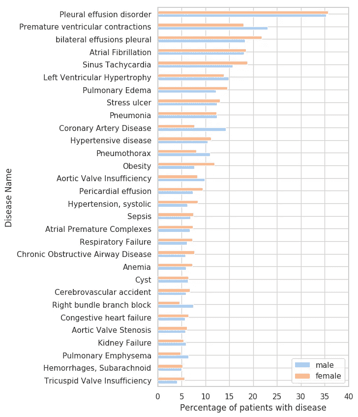
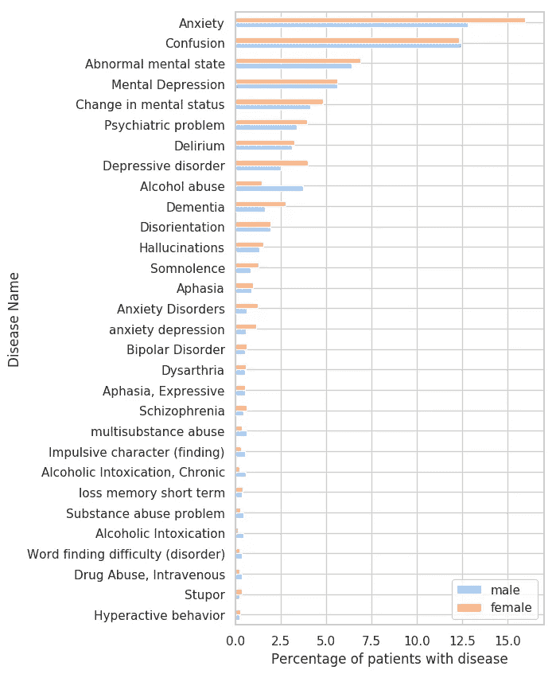
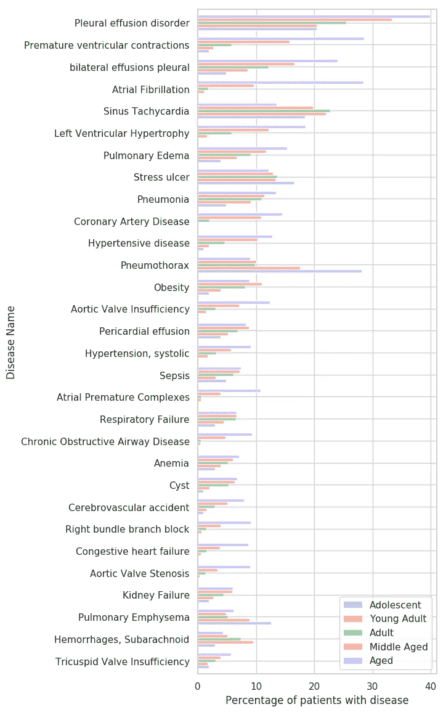

# 身体和精神疾病的流行

> 原文：<https://towardsdatascience.com/prevalence-of-physical-and-mental-diseases-450c0f4f5851?source=collection_archive---------59----------------------->

在[完全观想繁荣](https://public.flourish.studio/visualisation/1805563/)。

## 女性与男性以及年轻人与老年人——在 MIMIC-III 的约 3 万名重症监护患者的数据集上分析身体和精神疾病患病率的差异。

电子健康记录(EHRs)是医疗信息的宝库(点击阅读更多关于 EHRs 的信息[)。在本帖中，我们将使用来自](/medcat-introduction-analyzing-electronic-health-records-e1c420afa13a) [MIMIC-III](https://mimic.physionet.org/) 的 EHRs 来分析疾病流行率在年龄和性别上的差异。

EHRs 中的数据通常以自由文本的形式提供，因此很难用于任何类型的统计分析。这意味着我们首先需要构建它。为此，我们将使用[医学概念注释工具(MedCAT)](https://github.com/CogStack/MedCAT) 。MedCAT 用于从自由文本中提取和组织提及的医学概念(疾病、症状等)。一旦我们有了结构化格式的信息，我们就可以进行分析，并创建几个图表来展示疾病频率的差异。

这篇文章附有一个**[**Google Colab**](https://colab.research.google.com/drive/1P0vFNafv7C0jV2j8djlrlF81NhZrkq0N)**其中包含了完整的源代码。Colab 使用虚拟数据，模拟 MIMIC-III 中的表格(不公开提供)。****

# ****准备数据****

****[MIMIC-III](https://mimic.physionet.org/) 数据库的组织方式使得每个文档(EHR)都有一个`ID`并且每个`ID`都与一个患者相关联。对于每个病人，我们也有年龄和性别的信息。一名患者可以有 0 个或多个文档(临床记录)。如果你对如何组织和准备该项目和类似项目的 MIMIC-III 数据库感兴趣，请查看[数据集分析和准备](/medcat-dataset-analysis-and-preparation-be8bc910bd6d)。****

****这里，我将假设您知道如何使用 MedCAT，并且所有相关的概念都已经提取出来，并且在 python 字典中可用，如下所示。如果你想学习如何使用 MedCAT，请查阅 [MedCAT 教程](https://github.com/CogStack/MedCAT/tree/master/tutorial)。****

```
**concept_location = {'concept_id': [<documents_with_concept>], ...}**
```

****`concept_location` —告诉我们每个概念 ID(疾病)在哪个文档(EHR)中找到。这本字典提供了足够的信息来联系疾病和病人，并分析年龄和性别的差异。****

****`concept_id` —身体或精神疾病的唯一标识(在中为 CUI)。****

****`documents_with_concept` —找到某个概念的所有文档 id(EHR)的列表。****

****在我们继续之前，我们需要生成几个映射(下面的代码块)，考虑到数据集的格式，这样做的方式可以不同。如果你想用一些虚拟数据测试一切，看看附带的 [Google Colab](https://colab.research.google.com/drive/1P0vFNafv7C0jV2j8djlrlF81NhZrkq0N) 。虚拟日期遵循 MIMIC-III 中数据的精确组织。我们需要的所有映射都可以使用 Colab 中所示的`concept_location`来创建。****

```
**# CUI (the disease identifier) to patientId 
#that have that disease. 
cui_pts = {}# PatientID to gender
pt2gender = {}# PatientID to Age group (find the definitions for age groups [here](https://www.researchgate.net/publication/232746130_Automated_Medical_Literature_Retrieval))
pt2agegroup = {}# PatientId to age (years)
pt2age = {}# PatientId to list of disease identifiers
pt2cuis = {}**
```

****我已经为 MIMIC-III 数据集创建了映射，其方式与 Colab 中显示的方式完全相同。更进一步，我将假设上面的映射已经被计算过了。****

****现在，我们希望创建一个 CSV 文件，其中包含我们制作图表所需的所有数据，这些图表将显示每个疾病和组(年龄、性别)的患者分布情况。我们将组织 CSV，以便每行包含一种疾病及其所有必要信息:****

*   ****患有该疾病的患者总数****
*   ****患有该疾病的女性/男性患者人数****
*   ****每个年龄组的患病人数****

****首先，让我们获得每个患者组的计数，如果我们想要计算患有给定疾病的患者的比例，这是必要的:****

```
**pt_total = len(pt2age)pt_male = len([x for x in pt2gender if pt2gender[x] == "M"])pt_female = len([x for x in pt2gender if pt2gender[x] == "F"])pt_adl = len([x for x in pt2agegroup if pt2agegroup[x] == "Adolescent"])pt_yadult = len([x for x in pt2agegroup if pt2agegroup[x] == "Young Adult"])pt_adult = len([x for x in pt2agegroup if pt2agegroup[x] == "Adult"])pt_maged = len([x for x in pt2agegroup if pt2agegroup[x] == "Middle Aged"])pt_aged = len([x for x in pt2agegroup if pt2agegroup[x] == "Aged"])**
```

****现在，我们可以创建 CSV 的头部。唯一未知的一栏是`TUI`，它决定了是身体疾病还是精神疾病(摘自 [UMLS](https://www.nlm.nih.gov/research/umls/index.html) )。****

```
**csv = [['disease', 'cui', 'tui', 'total', 'male', 'female', 'Adolescent', 'Young Adult', 'Adult', 'Middle Aged', 'Aged']]**
```

****对于每种疾病，我们知道所有患有这种疾病的患者(从`cui_pts`图中)，我们可以用它来计算每一组患有某种疾病的百分比:****

```
**for cui in cui_pts:
    d = cdb.cui2pretty_name[cui]
    t = (len(cui_subjects[cui]) / pt_total) * 100
    m = (len([x for x in cui_subjects[cui] if 
         subject2gender[x] == 'M']) / pt_male) * 100
    f = (len([x for x in cui_subjects[cui] if 
         subject2gender[x] == 'F']) / pt_female) * 100

    adl = (len([x for x in cui_subjects[cui] if 
            subject2agegroup[x] == 'Adolescent']) / pt_adl) * 100
    yadult = (len([x for x in cui_subjects[cui] if
              subject2agegroup[x] == 'Young Adult'])/pt_yadult)*100
    adult = (len([x for x in cui_subjects[cui] if
             subject2agegroup[x] == 'Adult']) / pt_adult) * 100
    maged = (len([x for x in cui_subjects[cui] if
             subject2agegroup[x] == 'Middle Aged']) / pt_maged)*100
    aged = (len([x for x in cui_subjects[cui] if 
            subject2agegroup[x] == 'Aged']) / pt_aged) * 100# We get the TUI from medcat
    tui = cdb.cui2tui[cui]
    # Add to the array that will become the CSV
    dt.append([d, cui, tui, t, m, f, adl, yadult, adult, maged, aged]**
```

****现在，我们从数据中创建了一个熊猫数据框架，并根据每种疾病的患者总数对其进行排序:****

```
**df = pd.DataFrame(dt[1:], columns=dt[0])# Sort by total
df = df.sort_values(by=['total'], ascending=True)**
```

# ****身体和精神疾病****

****为了绘制前 30 种身体和精神疾病，我们现在可以简单地使用熊猫的内置绘图功能:****

```
**# Physical: T047
# Mental: T048# Subset the data, to a certain type and number
_data = df[df.tui=='T048'].iloc[-30:]ax = _data.plot(y=['total'], x="disease", kind="barh")# Hide the legend and add labels 
_ = ax.legend().set_visible(False)
_ = ax.set(xlim=(0, 17), ylabel="Disease Name", xlabel="Percentage of patients with disease")plt.show()**
```

****************

****图一。左边是身体疾病的分布，右边是精神疾病的分布。****

******请注意**:图 1 中的情节和本帖中的所有其他情节都是实验性的，主要用于展示 MedCAT。****

# ****女性 vs 男性****

****我们创建的数据框架包含了制作大量绘图所需的所有数据。如果我们现在需要精神和身体疾病的女性和男性患者:****

```
**# Subset the data
_data = df[df.tui=='T048'].iloc[-30:]
ax = _data.plot(y=['male', 'female'], x="disease", kind="barh")# Set the legend and labels
ax.legend(loc='lower right')
_ = ax.set(xlim=(0, 17), ylabel="Disease Name", xlabel="Percentage of patients with disease", )plt.show()**
```

****************

****图二。女性和男性患者的身体疾病分布在左侧，精神疾病分布在右侧。****

****在这种情况下，我们也可以证明我们的结果得到了医学领域已发表的工作的支持。图表显示*抑郁症*在女性患者中比在男性患者中更常见(由[论文](https://www.ncbi.nlm.nih.gov/pmc/articles/PMC4478054/)支持)。或者说*物质滥用*(主要是*酒精*)在男性患者中要常见得多(由[论文](https://www.ncbi.nlm.nih.gov/pmc/articles/PMC2913110/)支持)。****

****这表明我们的结果不是随机的，我们使用的整个管道工作得相当好。****

# ****年轻人对老年人****

****最后，我们将分析基于年龄的差异。由于无法按年份显示疾病，我们将患者分组(取自此处的):****

*   ******青少年** : 13 至 18 岁****
*   ******青壮年** : 19 至 24 岁****
*   ******成年人** : 25 至 44 岁****
*   ******中年** : 45 至 64 岁****
*   ******年龄** : 64 岁以上****

********

****图 3。身体疾病的年龄分布。****

****正如预期的那样，对于大多数疾病来说，随着年龄的增长，患病人数的百分比会增加。****

********

****图 4。精神疾病的年龄分布。****

****精神疾病在老年人中也更普遍，这也是意料之中的。唯一的例外是*亢奋行为*和*冲动性格*。一个有趣的概念是*酒精滥用*，成年人达到高峰，青少年比年轻人*高*。****

# ****结束了****

****我们探索疾病频率和年龄/性别之间关系的项目到此结束。相同的实验(以及更多在[分析 EHRs](/medcat-introduction-analyzing-electronic-health-records-e1c420afa13a) 中介绍的)可以很容易地在真实世界的医院数据上进行和重复，并有可能用于改善医疗保健。****

****感谢您的阅读。****