# 预防和应对疾病爆发

> 原文：<https://towardsdatascience.com/preventing-and-tackling-outbreaks-f790f2fca5d2?source=collection_archive---------30----------------------->

## 群落发现及其在系统发育网络中的应用

为了便于结果的分析和可视化，实现了一个 web 应用程序— Phyl。

随着高通量测序方法的出现，需要新的方法来可视化和分析越来越多的数据。虽然一些软件已经存在，但是它们不能很好地扩展或者需要高级技能才能在系统发育学中有用。

该项目的目的是实现三种社区发现算法——Louvain、Infomap 和分层标签传播(LLP)；使用两个合成网络——格文-纽曼(GN)和兰奇希尼蒂-福图纳托-拉迪奇(LFR)对它们进行基准测试；在真实的网络中测试它们，特别是来自*金黄色葡萄球菌* MLST 数据集的一个；比较可视化框架——cyto scape . js 和 D3.js，最后，把它们都放到网上(【mscthesis.herokuapp.com】T4)。

鲁汶、信息地图和 LLP 都是用 JavaScript 实现的。除非另有说明，以下结论适用于 GN 和 LFR。就速度而言，卢万胜过所有其他人。考虑到准确性，在有明确社区的网络中，卢万是最准确的。对于更高的混合，LLP 是最好的。与弱混合相反，在高度混合的 GN 中，提高分辨率参数是有利的。在 LFR，较高的分辨率会降低检测的准确性，与混合参数无关。平均节点度的增加提高了划分的准确性，并且最小化了偶然检测的可能性。使用项目中开发的算法或 LFR 实现来生成具有更高混合度或平均度的 GN 在计算上更密集。在*金黄色葡萄球菌*网络中，鲁汶在检测直接由共同祖先进化而来的 7 组菌株的聚类中是最快最准确的。

# 介绍

根据*经济学家*的说法，数据已经成为世界上最重要的资源[1]。越来越多的信息迫切需要新的存储、分析和可视化方法。

真实系统中不同元素之间的相互作用可以看作是网络[2]。从它们的拓扑或连接模式中，可以提取功能知识。虽然经验分析在小型网络中很有用，但对于大数据来说，使用算法来揭示其属性是不可或缺的。因此，被称为图形的数学模型被用来简化它们的表示。图论提供了分析它们的所有工具。这种表示意味着必须获得网络的所有元素及其关系。一般来说，分析越接近人群，收集数据就越困难。两个主要原因是缺乏非侵入性的获取方法或隐私问题[3]。事实上，在医疗领域，关于患者数据保护的立法变得越来越严格[4]。一方面，确保医学数据的伦理使用是基本的，另一方面，它可能构成调查许多病理原因的障碍。接下来，讨论将集中在传染病这个特定的话题上。

正如*世界卫生组织*所述，耐药性(AMR)是 2019 年需要关注的十大主要威胁之一[5]。在过去的几年里，由于使用了旨在治疗由病原微生物引起的疾病的药物，AMR 得到了加强。根据生物体的不同，它被细分为抗病毒(病毒)、抗生素(细菌)、抗真菌(真菌)或抗寄生虫(寄生虫)抗性。尽管耐药性是一个自然进化过程，随着时间的推移，最有能力的菌株会被选择出来，但抗菌药物的使用频率，甚至误用，正在加速几种微生物物种的耐药率的增长[6]。这不仅在人群中特别相关，而且在农场中也特别相关，在农场中，牛被给予预防性剂量的抗生素作为生长助剂。此外，人们在世界各地旅行的频率也促进了耐药微生物的传播。由于所有这些以及传染病的高死亡率(图 1)，授权中央卫生当局使用可扩展且易于使用的工具以允许他们在短时间内进行干预是至关重要的[7]。

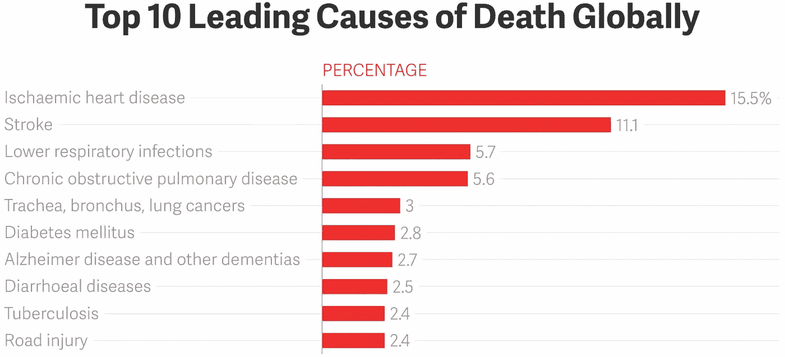

**图 1** 感染仍然是死亡的主要原因之一(*)。世卫组织在 2000 年至 2015 年间从世卫组织成员国的 90，000 多人中收集的数据。改编自[8]。

近年来开发的下一代测序方法为我们提供了大量的微生物数据[9]。事实上，由于全基因组测序方法的高分辨能力，已经有可能推断菌株之间更精确的进化关系。因此，具有更高数量基因的等位基因谱不断增加，并且由此可以评估描述菌株间进化距离的更完整的系统发育树或网络。所有这些在疾病预防的多个阶段都是有用的:疫苗设计、评估已测序菌株的致病性、检测疾病爆发和控制感染。以及诊断，增强混合感染的检测(由多种遗传上不同的生物体引起)[10]。

一般来说，这个项目的目标是从系统发育网络的拓扑结构中提取功能知识。例如，能够根据网络中其他生物的相似性和特征，推断出对抗生素的抗性等特性。与随机网络相反，真实网络呈现不对称的边分布。根据这种不对称性，可以识别出节点群。根据定义，社区是网络中边密度较高的区域。尽管如此，这个定义还不够严格，不足以在图中确定它们。这就提出了下面的问题:如果不清楚我们在找什么，我们怎么能发现社区呢？为了回答这个问题，社区发现理论在过去几年中得到了发展。尽管在检测的准确性和速度方面已经有了相当大的进步，但是在不同的网络中，一些算法比其他算法表现得更好。

# 目标

该项目的目标是用 JavaScript 实现三种社区发现算法——Louvain、Infomap 和分层标签传播(LLP)；在准确性和速度方面，与两个合成网络——格文-纽曼(GN)和兰奇希尼蒂-福图纳托-拉迪奇(LFR)网络进行比较；使用亚马逊、扎卡里空手道俱乐部和*葡萄球菌* *金黄色葡萄球菌*多位点序列分型(MLST)单位点变异(SLV)网络进行额外测试；比较不同可视化框架的工具和对大数据的稳健性——D3 . js(使用 SVG 和 Canvas 元素)和 Cytoscape.js，并创建一个 web 应用程序来实现网络可视化(在运行社区发现算法之前和之后),并绘制从基准测试中获得的所有数据。

# 文章大纲

在方法上，介绍了已实现的社区发现算法、已实现的基准工具、真实测试数据和数据可视化库。结果表明，社区发现算法在准确性和速度方面进行了分析。基准网络的生成速度是基于网络的不同属性来确定的。比较了不同的 web 可视化框架。并且使用不同的算法和输入参数来划分*金黄色葡萄球菌* MLST SLV 网络。最后，对目标是否实现进行了回顾性分析，详细说明了 INSaFLU web 应用中的主要困难和未来需要完成的工作，并对已经完成的工作提出了一系列前瞻性改进建议。

# 方法学

## 社区发现

**鲁汶算法**

该算法在项目中实施，分为两个阶段:模块化优化和社区聚集[11]。合在一起，它们被认为是 1 次通过。第一步完成后，接着是第二步。两者都被执行，直到网络中不再有变化并且实现最大模块化。

模块化优化——该算法将随机排序网络中的所有节点，以便一个接一个地将它们移除并插入不同的社区 *C* 。这将持续到模块性(输入参数)没有显著增加被证实:

设中的*∑为 *C* 、 *∑tot* 中所有链接到 *C* 、 *ki* 中节点的权重之和 *i* 、 *ki、*中所有链接到 *i* 的权重之和*

社区聚合——完成第一步后，属于同一个社区的所有节点合并成一个巨型节点。连接巨型节点的链接是先前连接来自相同不同社区的节点的链接的总和。该步骤还生成自循环，该自循环是在折叠成一个节点之前给定团体内所有链接的总和。

**信息地图算法**

与 Louvain 类似，也实现了 Infomap 算法。它使用不同的质量函数(最小描述长度[12])来划分网络:

设 *qm* 是模块 *m* 的退出概率，而 *pα* 是相对权重 *wα* ，其计算方法是将连接到α的边的总权重除以图中所有链接的总权重的两倍。

**分层标签传播算法**

LLP 算法的发展是基于标签传播(LP) [13]。后者首先为网络中的每个节点分配一个不同的社区，然后，它根据近邻节点中的主导社区迭代地修改相应的社区。在每次迭代中，对所有节点执行这个步骤，按照之前的随机顺序。

LLP 不仅考虑了邻居中的节点，还考虑了剩余网络中的节点[14]。迭代过程是一样的，区别在于它优化的值。在这种情况下，分配的社区是最大化:

被 *ki* 在给定节点的邻域中带有标签 *λi* 的节点的数量和 *νi* 在整个图中以相同方式标记的总数。

这种方法也已实现，通过其在整个网络中的常见存在，缓冲属于某个社区(在节点的邻域中)的节点的数量。

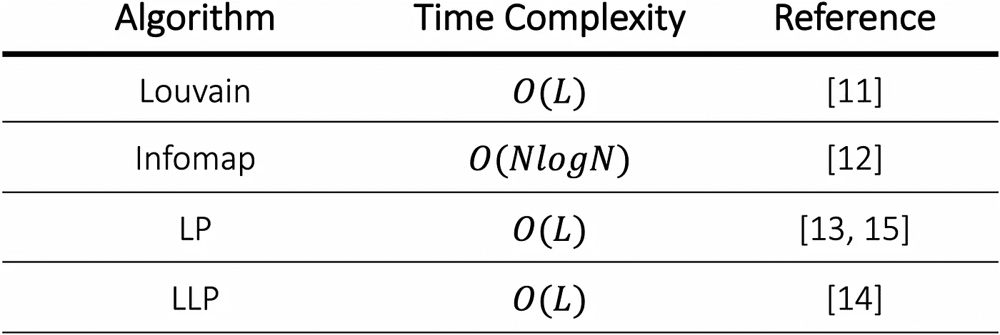

**表 1** 社区发现算法的时间复杂度。

## 基准

不同的社区发现算法以不同的方式划分同一个图。因此，了解哪些算法是最重要的。

获得这种洞察力的准确方法是对社区结构已知的网络进行划分。下一小节将介绍 GN 和 LFR 基准网络，以及 NMI，后者用于估计原始分区和检测到的分区之间的相似性。

社区发现算法不仅在准确性方面进行了测试，而且在速度方面也进行了测试。所有基准测试都重复了 10 次。平均值和相应的 95%置信区间包含在结果中。

**格文-纽曼网络**

在 GN 网络中，128 个节点被分成 4 组，每组正好有 32 个节点[16]。然后，由用户选择的混合参数定义来自不同社区的节点被连接的概率。该概率由下式给出:

每个节点都与另外 16 个节点相连(图 2)。由此实现的算法不仅允许混合参数变化，而且允许平均程度变化。这导致使用这些网络的基准测试数量增加。

**图 2** GN 合成网络。恒定的节点数(N)，可变的混合参数(μ)和平均节点度(k)。用 D3.js 和 SVG 表示。

**兰奇内蒂-福图纳托-拉迪奇网络**

LFR 基准网络(图 3) [17，16]试图更好地接近真实网络。这意味着他们不仅考虑具有系数ζ (5)的社区大小的幂律分布，而且考虑具有系数γ (6)的节点度的幂律分布:

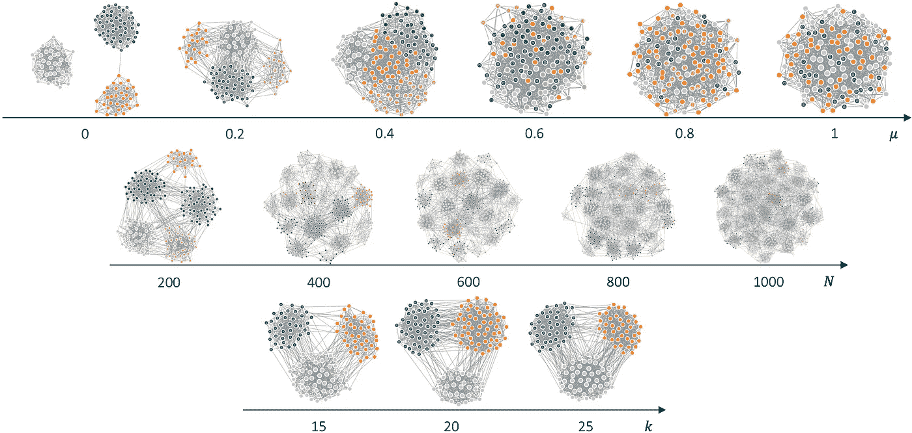

**图 3** LFR 合成网络。改变混合参数(μ)、节点数(N)和平均节点度(k)，同时保持其余 2 个变量不变。用 D3.js 和 SVG 表示。

**归一化互信息**

使用归一化互信息(NMI) [18]测试社区发现算法的聚类质量。在项目中用 JavaScript 开发了一种算法，并在几个网络中进行了测试。它接收长度相同的 2 个数组的输入，并返回相应的 NMI:

NMI 依赖于互信息 *I* ，条件熵 *H(Y|C)* 以及带标签的 *H(Y)* 和聚类集 *H(C)* 的熵。

## 真实测试数据

使用实现的算法执行的测试数量越多，它们对于最大数量的网络正常工作的确定性就越高。这样，断开的网络(从亚马逊网络取样)、小型网络(扎卡里的空手道俱乐部)和系统网络(*金黄色葡萄球菌*MLST·SLV)也被额外考虑。然而，没有使用这些进行基准测试。

**亚马逊网络**

这个网络是抓取亚马逊网站后获得的[19]。每个节点代表商店中的一个给定产品，连接的节点对意味着它们经常一起被购买。原始网络包含 334 863 个节点和 925 872 条链路。测试中只使用了各个节点的前 5 000 条链路(图 4)。

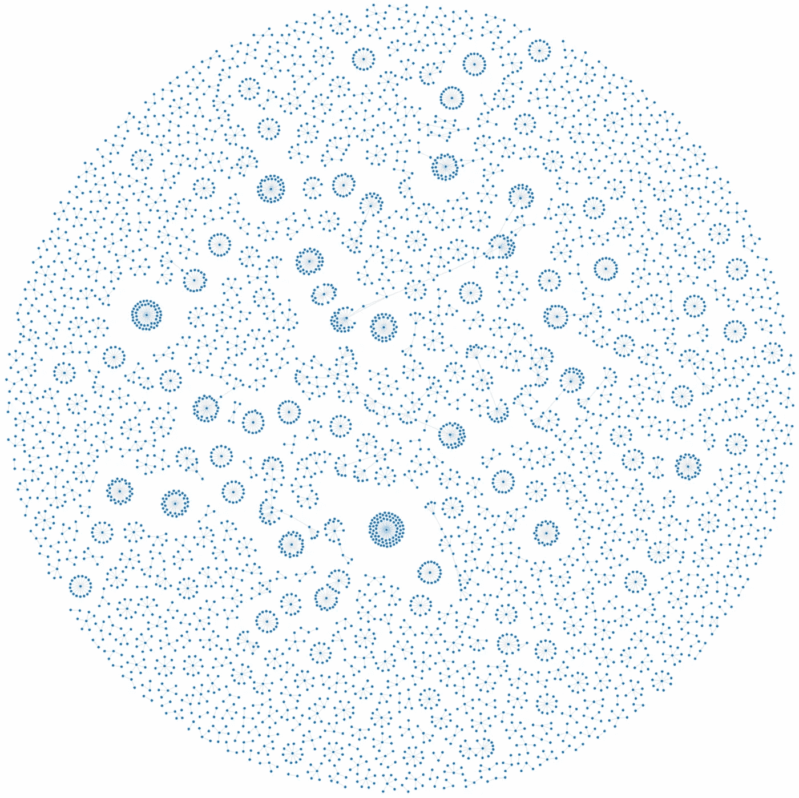

**图 4** 从 5 000 个链接图中抽取的亚马逊产品联合购买网络样本。用 D3.js 和 SVG 表示。

**扎卡里的空手道俱乐部网络**

这是一个代表来自大学空手道俱乐部的 34 个人之间的 77 种关系的社交网络[20]。

节点 1 是讲师，34 是总裁(图 5)。深蓝色和浅蓝色的节点代表俱乐部内部的分裂，这是由于他们之间的冲突造成的。每个链接连接两个成员，在他们分开之前，他们经常在俱乐部外面见面。

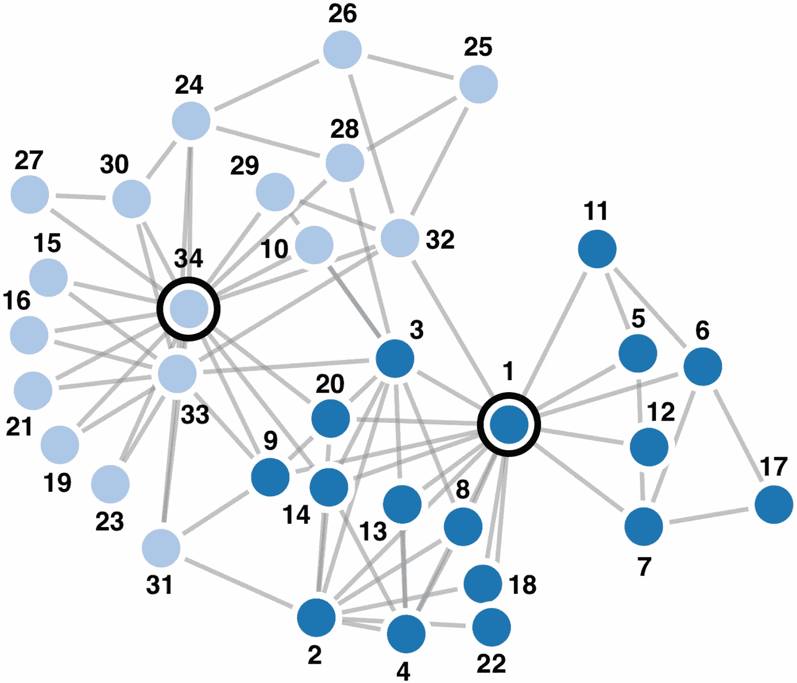

**图 5** 扎卡里的空手道俱乐部网络。用 D3.js 和 SVG 表示。

***葡萄球菌* *金黄色葡萄球菌***

为了测试群落发现算法在系统发育网络中的应用，使用了 MLST 的*金黄色葡萄球菌*等位基因谱数据库(图 6)【21】。MLST 概况包含关于七个*基因座* ( *arcC* 、 *aroE* 、 *glpF* 、 *gmk* 、 *pta* 、 *tpi* 和 *yqiL* )的信息，并且在下载时，它有 5199 个 MLST 概况(ST)。通过将每个 ST 链接到其所有 slv 来创建图，并且最大的部分用于社区发现算法的基准。选择这个测试网络是基于这样一个事实，即它可以模拟与使用 cgMLST 或 wgMLST 配置文件创建的模式相似的模式，这些模式具有比 MLST 多得多的基因座。

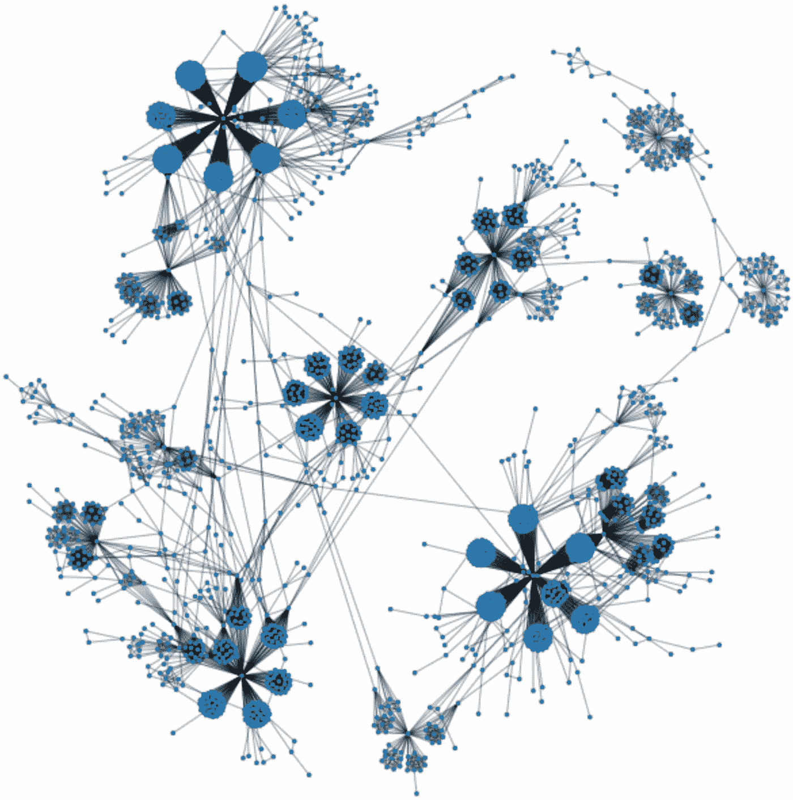

**图 6**金黄色葡萄球菌 MLST SLV 网。用 D3.js 和 Canvas 表示。

## 可视化框架

在可视化应用程序中，用户可以选择使用 D3 或 Cytoscape JavaScript 库来可视化每个网络。对于第一个框架，有可能通过画布或 SVG 元素来可视化数据。所有的网络都是使用力引导的实现来绘制的。这种模式要求开发人员设置重力、排斥力或弹簧常数等功能，这些功能将影响网络的显示方式。根据这些参数，应该减少节点和链接重叠，以便获得图形的增强视图(图 7)。

**图 7** 扎卡里的空手道俱乐部网络用 D3.js Canvas(左上)、D3.js SVG(右上)和 Cytoscape.js(下图)表示。

关于基准绘图，使用了 D3.js。它在视觉表现、性能和网上可用实例数量方面的灵活性决定了这一选择。

# 结果

## 网络应用

为了便于分析和可视化之前算法执行后的结果，实现了一个 web 应用程序([mscthesis.herokuapp.com](https://mscthesis.herokuapp.com/))。

它的后端是使用 Node.js 设计的，运行在一个 Heroku 服务器上，该服务器链接到一个 GitHub 存储库([github.com/warcraft12321/Thesis](https://github.com/warcraft12321/Thesis))，其中包含所有与项目相关的实现和文档。使用芝诺多(【zenodo.org/badge/latestdoi/162063699】)将数字对象标识符(DOI)归属于这个存储库。在 Docker Hub([cloud . Docker . com/u/war craft 12321/repository/Docker/war craft 12321/thesis](https://cloud.docker.com/u/warcraft12321/repository/docker/warcraft12321/thesis))可以获得该应用的图片。以下操作在云中严格执行:

*   生成 GN 和 LFR 基准网络。后者是使用 C++实现中的二进制文件生成的[22]。这是在从 NPM 导入一个模拟服务器命令行的包之后才有可能实现的；
*   真实的测试网络在云中对数据进行了适当的处理，这样数据就可以在前端发送和显示；
*   一旦鲁汶、信息图和 LLP 算法的执行不在用户的浏览器中进行，这可能会引起一些隐私问题。虽然，在用户端运行 Infomap 而仍然保持 web 应用程序在所有设备上的功能是不可行的；
*   应用程序和 NPM 之间的通信是在服务器中建立的，因此可以在应用程序中导入和绘制上传到 NPM 的每个包的统计数据；
*   最后，在云中运行算法后获得所有基准数据。

前端是静态和动态的。静态版本使用 HTML、CSS 和 JavaScript。动态执行由 Node.js 管理，它运行在服务器端(图 8)。

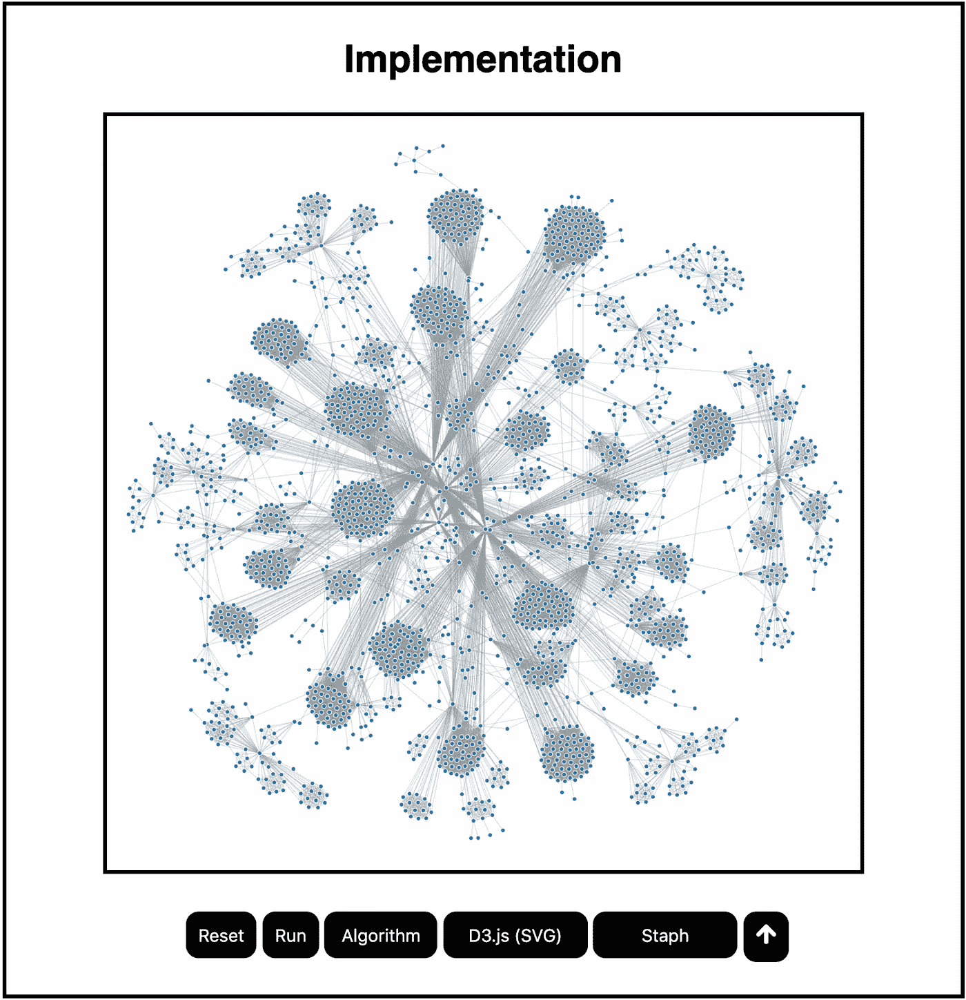

**图 8** Web 应用。

## 社区发现算法

就准确性而言，对于弱混合网络(μ < 0.4)，Louvain 优于所有其他网络。其次是对于μ < 0.3 的 Infomap，LP 和 LLP (γ = 0.5)或对于 0.3 ≤ μ ≤ 0.4 的 Infomap，LLP 和 LP (γ = 0.5)。通过增加μ，能够基于整个网络的全景来检测社区的 LLP 对于μ ≥ 0.5 始终是最有效的。比较 Louvain 和 Infomap 在μ ≥ 0.5 时的表现是差不多的。基于 95%置信区间，不可能说一个比另一个表现得更好。要强调的另一点是，Louvain 和 Infomap 非常敏感，因此，在μ ≈ 0.5 的网络中检测社区是不可靠的。LLP 和 LP 没有呈现出任何社区检测受到急剧影响的特定值。这些结论对 GN 和 LFR 网络都有效(图 9 和图 10)。

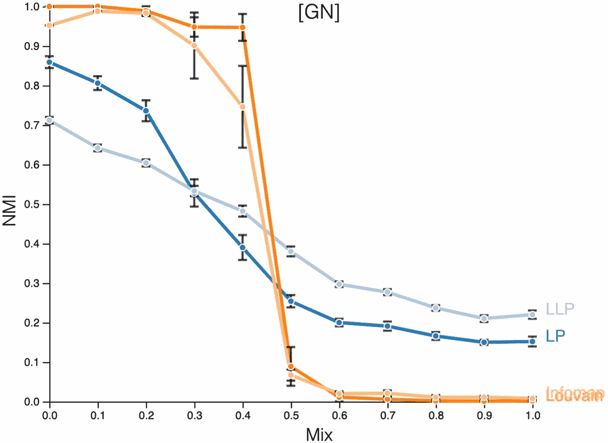

**图 9** 根据 GN 网络中的混合参数，每个算法的聚类质量:Louvain、Infomap、LP 和 LLP，其余特性如图 2 所示。

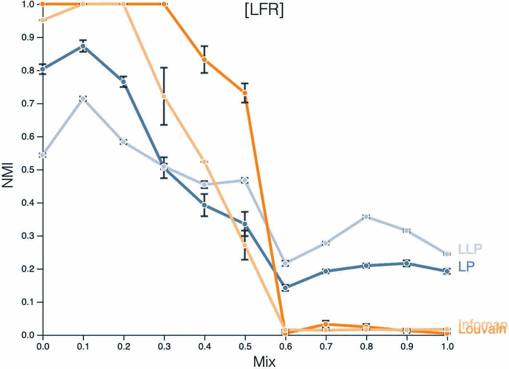

**图 10** 根据 LFR 网络中的混合参数，每个算法的聚类质量:Louvain、Infomap、LP 和 LLP，其余特性如图 3 所示。

由于只考虑了 LLP 的两个伽马值，因此需要进行更精确的分析，以检查是否有其他值可以获得更好的结果。

在 GN 网络(图 11)的情况下，可以在混合较少的网络中以更高的准确度检测社区。每当μ < 0.5\. When μ ≥ 0.5, the NMI between the detected partition and the one in the original network is higher as long as we keep increasing γ. Another point to highlight is the possibility of detecting communities with higher precision in networks with higher μ using appropriate γ than in others with lower μ but with a non-optimal γ. This is valid for networks with μ >为 0.5 时，我们增加γ，性能就会下降(图 12)。

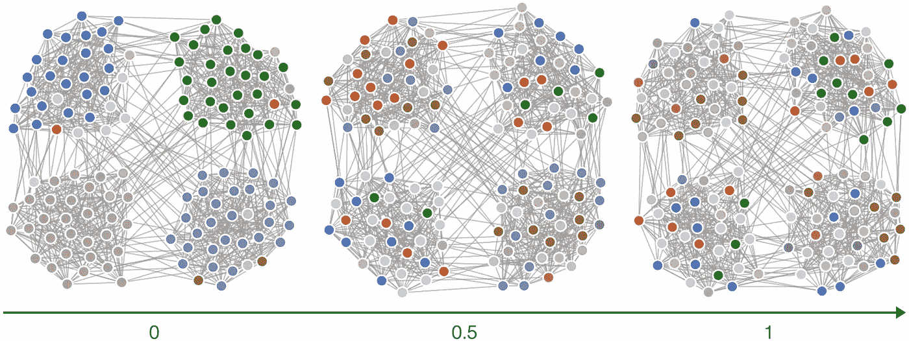

**图 11** 运行 LLP 后的 GN 网络(图 2)。当γ更接近 0 时，社区少、大、稀的网络粗结构凸显。随着γ的增长，细晶粒结构被揭开。社区变得越来越小，越来越密集。用 D3.js 和 SVG 表示。

**图 12** LLP 算法在分辨率参数方面的精确度。对 GN 网络中的混合参数 0–1(蓝色-棕色)进行分析，其余属性如图 2 所示。

在 LFR 网络中，增加 gamma 总是会导致 NMI 下降(图 13)。

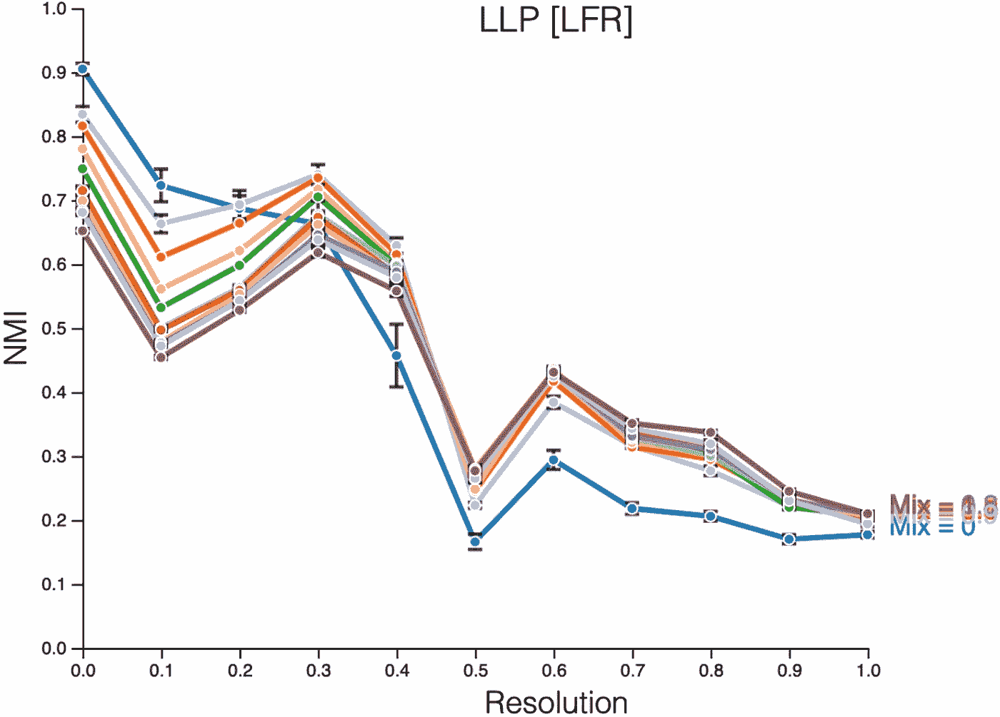

**图 13** LLP 算法在分辨率参数方面的精确度。对 LFR 网络中的混合参数 0–1(蓝色-棕色)进行分析，其余属性如图 3 所示。

测试平均节点度的影响，以检查它是否影响每个算法识别社区的能力。

在 GN 网络的情况下，对于μ ≤ 0.5，平均度数的增加增强了卢万、Infomap、LP 和 LLP 区分社区的能力。对于μ > 0.5，NMI 聚类质量较低，因为平均节点度较高。假设不期望算法识别μ ≈ 1 的原始社区，这表明较高的平均度倾向于减少偶然的检测。这种观察可以应用于 GN 和 LFR 网络(图 14)。

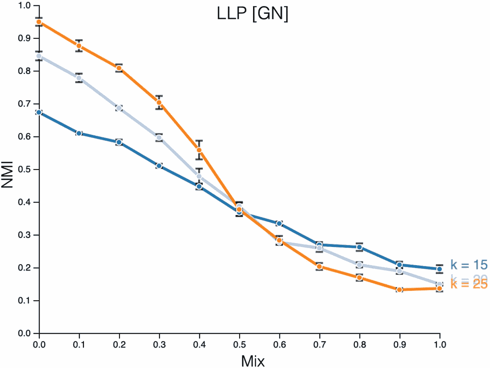

**图 14** LLP 算法在混合参数方面的精度。平均节点度为 15，20 和 25 的 GN 网络。其余的属性类似于图 2 中的属性。

在速度方面，Louvain 算法的表现明显优于其他任何算法。有助于其效率的一个重要属性是，它仅在模块化优化阶段(1)的每次迭代中计算模块化变化。在 Infomap 中，最小描述长度在优化步骤(2)的每次迭代结束时重新计算。由于这一计算密集型步骤，Infomap 在基准测试中表现最差。根据表 1，预计 Infomap 和所有其他文件之间的执行时间差异是对数的。由于实施步骤效率低下，这一目标未能实现。比较 LLP 和 LP，最快的是需要优化最简单方程的那个——LP(图 15)。尽管时间复杂度看起来是相同的，如表 1 中所预测的。同样，使用相同的表，预计 LLP 和 LP 的执行速度与鲁汶一样快。图 15 中观察到的微小差异可以用 LLP/线性规划实施中的一些非优化步骤来解释。

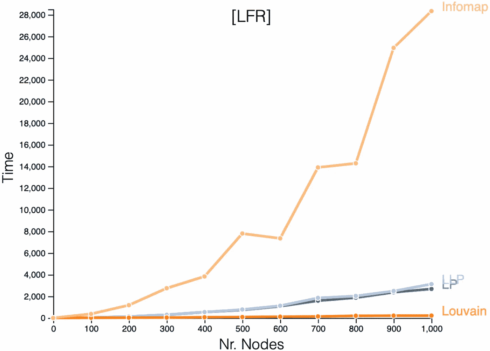

**图 15** 卢万、Infomap、LLP 和 LP 根据 LFR 网络的规模完成分析所用的时间。其余的属性类似于图 3 中的属性。

## 基准网络算法

之前生成了 GN 和 LFR 网络，因此可以执行之前的测试。在项目中实现了创建前者的算法。生成这种网络所需的时间随着平均节点度和混合参数呈指数增长(图 17)。在普通计算机中，对于高于 20 度的平均度数，执行它变得不可行。它的性能与 Fortunato 的实现进行了比较，Fortunato 的实现高度可扩展，允许在更短的时间内生成具有更多链路的网络(图 16)。已经证实，随着混合参数逐渐增加，网络生成时间近似线性增加，与项目中实施的网络相反。就像以前一样，生成具有更多边的网络需要额外的计算能力。

**图 16** 根据混合参数生成 GN 网络(使用 LFR 实现)所需的时间。在平均节点度为 15、20 和 25 的网络中进行的分析。其余的属性类似于图 2 中的属性。

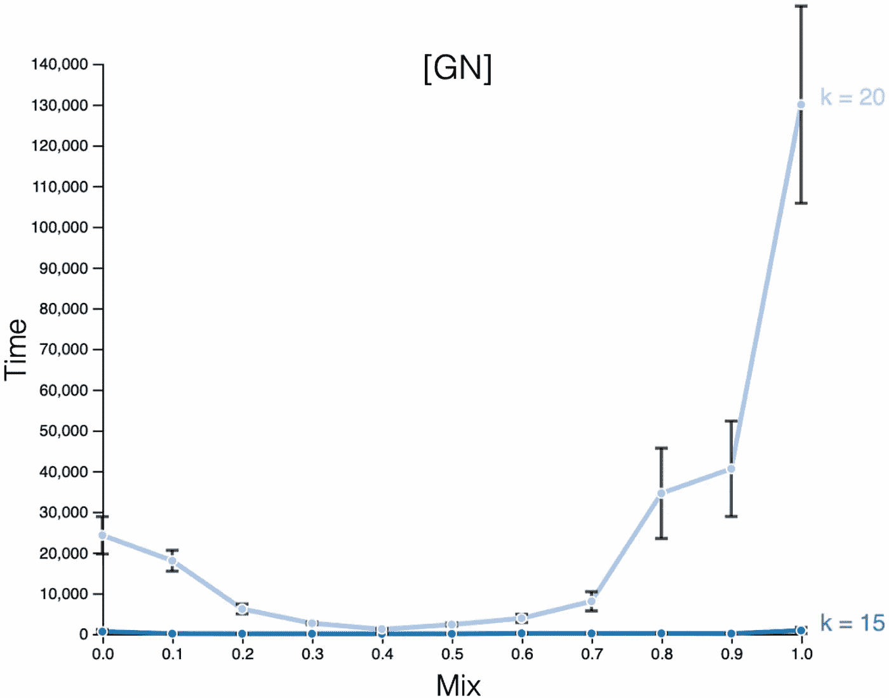

**图 17** 根据混合参数生成 GN 网络(使用项目实施)所需的时间。在平均节点度为 15 和 20 的网络中进行的分析。其余的属性类似于图 2 中的属性。

其他测试在 LFR 网络中进行。针对网络的节点数量和混合参数测试了执行时间。在这两种情况下，验证了近似线性关系(图 18 和图 19)。在 GN 网络中，一旦每个社区和社区的元素数量固定，就不考虑节点的数量。尽管只分析了混合参数和节点数量，用户仍然可以选择调整节点最大程度、节点程度分布和社区大小分布的指数、每个社区的最大/最小节点数量、每个社区的重叠节点数量(在项目中不考虑覆盖)以及重叠节点的成员数量[22]。

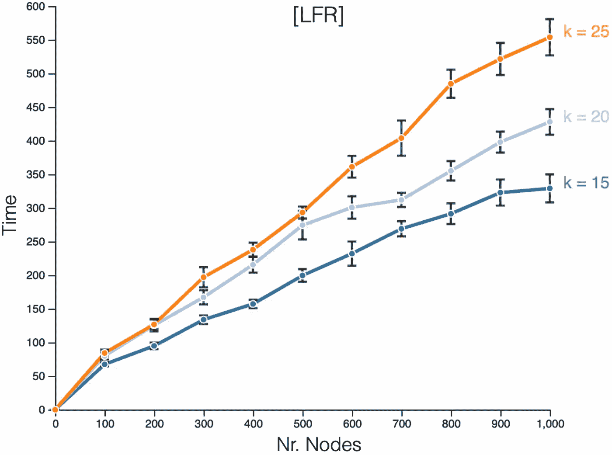

**图 18** 根据节点数量生成 LFR 网络所需的时间。在平均节点度为 15、20 和 25 的网络中进行的分析。其余的属性类似于图 3 中的属性。

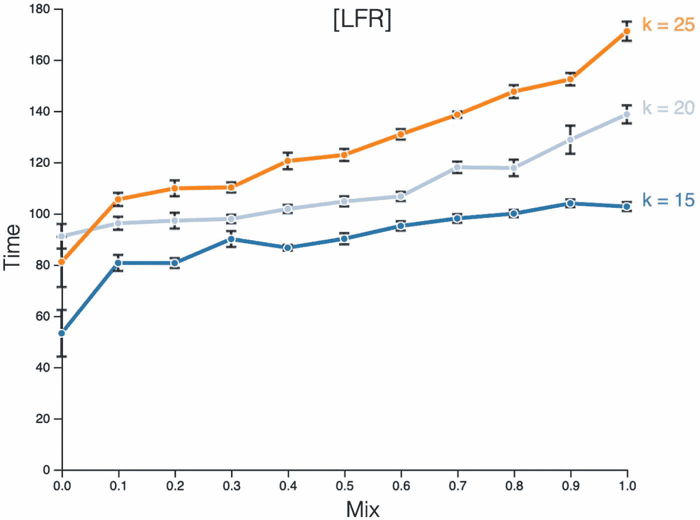

**图 19** 根据混合参数生成 LFR 网络所需的时间。在平均节点度为 15、20 和 25 的网络中进行的分析。其余的属性类似于图 3 中的属性。

每一个社区的发现，基准网络生成器，准确性措施和相关算法都在 NPM(表 2)。这样，它们可以用于任何特定于用户的应用程序。

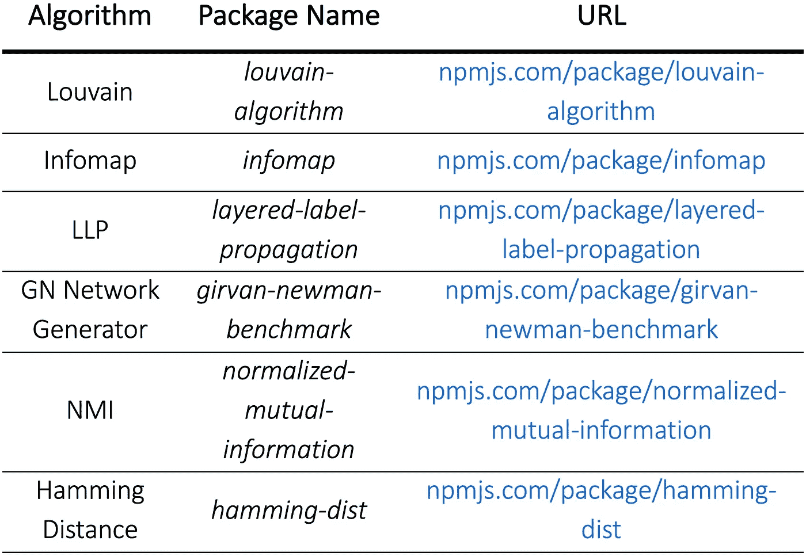

**表 2** 项目中实现的算法在 NPM 可用。

## 可视化框架

D3.js (SVG)允许用户可视化 web 应用程序中使用的所有网络，并以可能的最高分辨率表示基准图(受用户设备中像素密度的限制)。从性能上来说，是第二快的。

D3.js (Canvas)是分析过的框架中最快的。然而，与之前的相比，网络中的节点和链路失去了分辨率。

当网络分析及其表示一起执行时，Cytoscape.js 是可取的。有相当多的算法，包括社区发现算法，可以促进图的研究。工作实例的缺乏和网络数据处理的缓慢使得 Cytoscape.js 的效率较低。金黄色葡萄球菌 SLV 网络和其他具有相似或更多节点/边的网络的表示溢出了 web 应用程序。

## 金黄色葡萄球菌

在从金黄色葡萄球菌的 MLST 数据集获得的 SLV 图的最大组成部分中执行了卢万、信息图和 LLP 算法。

使用三个模块性变化阈值:0.1、0.02 和 0.01 来执行 Louvain 算法。如简介中所预测的，可以验证快速实现高模块化分区(需要 2 次通过才能获得最终结果)。这个特性使得基于模块的算法速度更快。

使用信息图算法，考虑了几个最小描述长度阈值:0.1、0.02 和 0.01。对于所有值，从同一祖先传下来的每一个小的密集节点组都被分离到不同的社区中。因此，没有进一步审议。

LLP 算法考虑分辨率参数的三个值:0、0.5 和 1。与 Infomap 类似，它将网络划分为几个小而密集的社区。

根据 Louvain、Infomap 和 LLP 对 GN network 的基准分析(图 9 和图 10 ),可以预测，一旦 Louvain 在具有明确定义的社区的网络中运行，它将比其他网络表现得更好。在调整了 Louvain 的停止参数之后，使得所识别的社区是最相关的——来自属于同一社区的同一祖先的密集连接区域的节点，获得了最终的分区(图 20)。值得注意的是，一些类似于用正方形突出显示的聚类被算法细分。一种解释是不同亚群的菌株之间存在高重组率。

通过将生成的元数据文件上传到 PHYLOViZ Online，其中的节点被相应地标记为推断的群落，可以观察到具有相同群落的原始系统发生树。

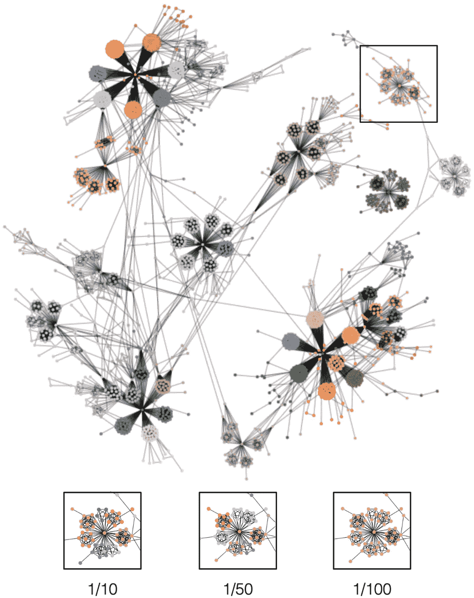

**图 20** 在*金黄色葡萄球菌* MLST SLV 网络的克隆复合体 0(如 PHYLOViZ 2 中所标识的)上运行卢万算法(考虑模块性变化的不同阈值)后获得的分区。用 D3.js 和 Canvas 表示。

# 结论

鲁汶、信息地图和 LLP 算法都是用 JavaScript 实现的。除非另有说明，以下结论适用于 GN 和 LFR 网络。就速度而言，卢万胜过所有其他人。就准确性而言，在有明确社区的网络中，卢万是最准确的。对于更高的混合，LLP 是最好的。与弱混合相反，在高度混合的 GN 网络中，增加分辨率参数是有利的。在 LFR 网络中，较高的分辨率降低了检测的准确性，而与混合参数无关。平均节点度的增加提高了分割精度，表明偶然检测被最小化。使用项目中开发的算法或 LFR 实现来生成具有更高混合度或平均度的 GN 网络在计算上更加密集。在*金黄色葡萄球菌* MLST SLV 网络中，鲁汶在检测由同一个祖先进化而来的 7 组菌株的聚类中是最快最准确的。模块化变化阈值越低，检测越好。

除了三种社区发现算法之外，GN 基准网络生成器、NMI 和汉明距离算法也在 NPM 推出。web 应用程序托管在 Heroku 云平台中。可以从 Docker Hub 下载包含在本地机器上运行应用程序所需的所有模块的映像。GitHub 提供了该项目的所有实现和完整路线图。使用 Zenodo 将数字对象标识符(DOI)归属于这个存储库。

遇到的主要困难之一是在用户端运行社区发现算法。这个功能不会引起太多的隐私问题。必须在服务器上运行算法，这样应用程序才不会崩溃。在 Infomap 实现中，不可能达到其时间复杂度所预测的计算效率。拥有超过 10 000 个节点的网络的在线可视化是不可行的，即使使用表现出最佳性能的框架— D3.js(使用 Canvas 元素)。

在接下来的几个月里，这个项目中开发的一些工具将在 INSaFLU 中实施。用于显示系统进化树的新可视化框架，以及上传的元数据，将增强流感毒株进化路径的可追溯性。随时间动态变化的地理地图将允许用户精确获取每个样本的时间和位置，并在关键季节加强流感监测。交互式直方图显示了从流感病毒样品中获得的属于共有序列的每个核苷酸，突出显示了 SNPs，以及它们在指定毒株表型中的作用。新的流感监测动态报告将允许以最小化的方式可视化增加的数据量。

作为未来的改进，实现的算法可以在内存和速度方面进行优化。在更高效的实现中，网络和图表可视化可以运行得更快。之前的更新将使 web 应用程序加载更快，运行更流畅。用一组更具代表性的网络(涵盖更广泛的拓扑属性)对社区发现算法进行基准测试，将有可能以更高的确定性来推断任何社区发现算法是否在系统发育网络中始终表现更好。将项目中开发的社区发现功能整合到系统发育/面向监测的分析网络应用程序中，如 PHYLOViZ Online 或 INSaFLU，将是有益的。

[论文](https://mscthesis.herokuapp.com/pages/thesis.html) | [扩展摘要](https://mscthesis.herokuapp.com/pages/abstract.html) | [GitHub 知识库](https://github.com/warcraft12321/Thesis)

# 参考

[1]“世界上最有价值的资源不再是石油，而是数据”《经济学人》，2017 年 5 月 6 日。【在线】。可用:[https://www . economist . com/leaders/2017/05/06/the-worlds-most-valued-resource-is-again-oil-but-data。](https://www.economist.com/leaders/2017/05/06/the-worlds-most-valuable-resource-is-no-longer-oil-but-data.)【2019 年 5 月 28 日获取】。

[2] A.-L. Barabási，《网络科学书》，[在线]。可用:[http://networksciencebook.com。](http://networksciencebook.com.)【2019 年 5 月 15 日获取】。

[3] H. G. S. Patil、A. N. Babu 和 P. S. Ramkumar，“生物医疗技术中的非侵入式数据采集和测量:概述”，载于*通过技术集成最大化医疗服务提供和管理*，IGI 全球，2016 年。

[4]“健康”，欧洲数据保护主管，[在线]。可用:[https://edps . Europa . eu/data-protection/our-work/subjects/health _ en。](https://edps.europa.eu/data-protection/our-work/subjects/health_en.)【2019 年 6 月 9 日获取】。

[5]《2019 年全球健康十大威胁》，世界卫生组织，[在线]。可用:[https://www . who . int/emergencies/ten-threats-to-global-health-in-2019。](https://www.who.int/emergencies/ten-threats-to-global-health-in-2019.)【2019 年 6 月 4 日获取】。

[6]“抗生素耐药性”，世界卫生组织，2018 年 2 月 15 日。【在线】。可用:[https://www . who . int/en/news-room/fact-sheets/detail/antimicrobial-resistance。](https://www.who.int/en/news-room/fact-sheets/detail/antimicrobial-resistance.)【2019 年 5 月 29 日访问】。

[7] Z. A. Memish、S. Venkatesh 和 A. M. Shibl，“旅行对抗生素耐药性国际传播的影响”，*《国际抗微生物剂杂志》，*，第 21 卷，第 2 期，第 135-142 页，2003 年。

[8]“全球十大死亡原因”，[在线]。可用:【https://www.theatlas.com/charts/HkLaDreuW. 【2019 年 5 月 12 日访问】。

[9]b . Ribeiro-gon alves，A. P. Francisco，C. Vaz，M. Ramirez 和 j . a . carri co，“PHYLOViZ Online:基于网络的可视化、系统发育推断、分析和共享最小生成树的工具”，*核酸研究，*第 44 卷，第 1 期，第 246–251 页，2016 年。

[10] Y. Motro 和 J. Moran-Gilad，“下一代测序在临床细菌学中的应用”，*生物分子检测和定量，*第 14 卷，第 1–6 页，2017。

[11] V. D. Blondel，J.-L. Guillaume，R. Lambiotte 和 E. Lefebvre，“大型网络中社区的快速展开”， *J. Stat .机甲战士。(2008) P10008，*2008 年第 12 页。

[12] M. Rosvall、D. Axelsson 和 C. T .博格斯特伦，“地图方程”，*《欧洲物理杂志专题》，*第 178 卷，第 1 期，第 13-23 页，2009 年。

[13] N. Raghavan，R. Albert 和 s .鸠摩罗王，“检测大规模网络中社区结构的近线性时间算法”，*物理评论 E 25th 周年里程碑，*第 76 卷第 3 期，2007 年。

[14] P. Boldi，M. Rosa，M. Santini 和 S. Vigna，“分层标签传播:用于压缩社交网络的多分辨率无坐标排序”，载于 *WWW '11 第 20 届国际万维网会议论文集*，2011 年。

[15]l . subelj，“聚类的标签传播”，载于*网络聚类和块建模的进展*，纽约，威利，2018 年。

[16] M .格文和 M. E. J .纽曼，“社会和生物网络中的社区结构”，*《美国国家科学院院刊》，*第 99 卷，第 12 期，第 7821-7826 页，2002 年。

[17] A. Lancichinetti，S. Fortunato 和 F. Radicchi，“测试社区检测算法的基准图”， *Physical review。统计、非线性和软物质物理学。，*第 78 卷，2008 年第 4 期。

[18] A. Lancichinetti，S. Fortunato 和 J. Kertesz，“检测复杂网络的重叠和分层社区结构”，*新物理学杂志，*第 11 卷，2009 年。

[19] J. Yang 和 J. Leskovec，“基于地面事实的网络社区定义和评估”，载于 2012 年 IEEE 数据挖掘国际会议(ICDM) 的*会议录，2012 年。*

[20] W. Zachary，“小群体中冲突和裂变的信息流模型”，*《人类学研究杂志》，*第 33 卷，1976 年。

[21]“金黄色葡萄球菌 MLST 数据库”，公共公报，2019 年 6 月 5 日。【在线】。可用:【https://pubmlst.org/saureus/. 【2019 年 6 月 5 日接入】。

[22]a . lanchi netti 和 S. Fortunato，“在具有重叠社区的有向和加权图上测试社区检测算法的基准”， *Physical review。统计、非线性和软物质物理学。，*2009 年第 80 卷。