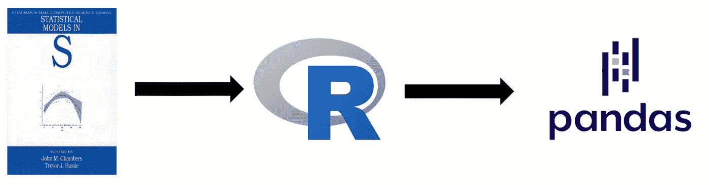
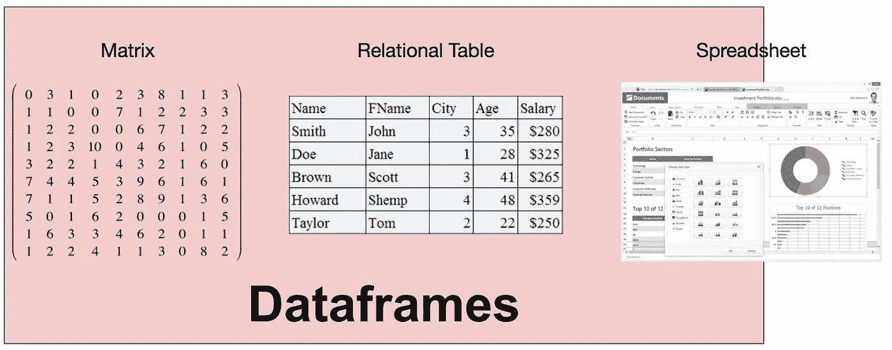
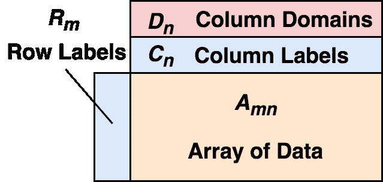
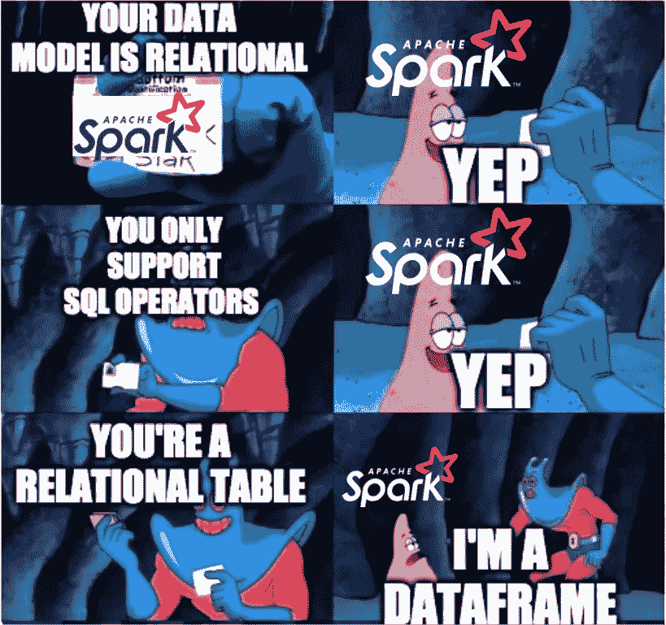

# 防止数据帧的死亡

> 原文：<https://towardsdatascience.com/preventing-the-death-of-the-dataframe-8bca1c0f83c8?source=collection_archive---------11----------------------->

## [数据帧系列](https://medium.com/tag/the-dataframe-series)

## **数据框架正在失去统计计算和机器学习的根基**

**数据框架产生于特定的需求，但是因为如此多不同的系统现在都自称为数据框架，这个术语几乎没有任何意义。为了保存数据框架，我们在最近的预印本[2]中基于原始数据模型对定义进行了形式化。**

在我们进入细节之前，我想先概述一些我将在下面回答的问题:

1.  ***什么是数据帧，它来自哪里？***
2.  ***数据帧和表格有什么不同？矩阵？***
3.  ***数据框架系统的爆炸是如何杀死数据框架的？***
4.  ***用户为什么要关心？***

# **既不是表格也不是矩阵**

最早的“dataframe”，最初是“data frame”，出现在贝尔实验室的 S 编程语言中。“数据框架”于 1990 年首次发布，并在约翰·m·钱伯斯和特雷弗·j·哈斯蒂于 1992 年撰写的《S 中的*统计模型》一书的第三章中进行了详细描述[1]。在那一章中，Chambers 和 Hastie 多次提到数据帧有一个矩阵原点。*

> **数据帧明显有矩阵的味道**；特别是，在思考和计算时，变量可以被视为矩阵结构的列，而观察值可以被视为矩阵结构的行…
> 
> 整本书要记住的基本概念是**数据框架支持类似矩阵的计算** …

Chambers 和 Hastie 继续描述了一种类似于关系表的结构，但保留了它的矩阵属性。S 的开源版本 R 于 2000 年发布了第一个稳定版本，并继承了 dataframe。2009 年， [pandas](https://pandas.pydata.org/pandas-docs/stable/index.html) 发布，为 Python 带来了 R dataframe 语义。所有这些 dataframe 实现都来自单一来源，继承了相同的语义和数据模型。

在我们最近的 arxiv 预印本[2]中，我们描述了 dataframe 数据模型的第一个形式定义和第一组 dataframe 代数。这个 dataframe 数据模型保留了最初在 S 中定义的数据模型，并且代数支持在 S、R 或 pandas 中所做的一切。

# 数据框架数据模型

数据框架产生于将数据视为矩阵和表格的需要。单一类型矩阵限制性太强，而关系表要求数据首先定义为模式。在数据帧中，可以在运行时推断列的类型，不需要事先知道，也不需要列中的所有行都是相同的类型。数据框架实际上是关系系统、矩阵以及电子表格的组合。

数据帧支持来自线性代数(矩阵)、关系代数(表格)和一些电子表格公式的运算符。

与关系系统相比，数据帧有许多有趣和独特的属性:

*   一个直观的数据模型，包含了行和列的隐式排序，并像在矩阵中一样对称地对待它们；
*   支持跨越关系(例如，过滤、连接)、线性代数(例如，转置)和类似电子表格(例如，透视)运算符的运算符的 API
*   一种直观的查询语法，鼓励快速验证简单表达式、重用查询结果以及组合成复杂查询
*   一种类型系统，允许在一列中异构类型化的行，例如在一列的 **int** 中的**字符串**作为脏数据。

**data frame 数据模型如下所示:**

数据框架数据模型。

数据帧由数据的二维混合型数组(矩阵)、一组行标签、一组列标签和每列的类型(域)组成。每列的类型都是可选的，如果需要，系统可以在运行时在列上引入一个类型。这种惰性模式允许将数据帧视为关系表，而不会牺牲其他类似矩阵的数据帧属性，这对于重用关系数据库的优化非常有用。

**与矩阵比较。**所有矩阵都可以表示为数据帧(带空标签)。然而，并不是所有的数据帧都是矩阵，即使我们去掉它们的标签。矩阵在模式中是同构的，但是数据帧允许多种类型的模式。在特殊情况下，没有标签的数据帧是一个矩阵，但是所有的数据必须是同类类型，并且属于 **int** 或 **float** 或其他满足字段代数定义的类型。我们将这些*矩阵* *称为数据帧*，它们对于数据帧和机器学习管道之间的关系尤为重要。

**与关系表的比较。**一个关系由一个声明的模式定义，一个关系有许多可能的实例——满足该模式的元组集。一个实例可以被认为是一个固定的关系表。数据帧有点像关系实例:它们代表一组固定的数据。然而，它们的模式可以是未指定的，因此由模式归纳函数基于它们的内容来归纳。这种灵活性对数据帧至关重要，并有助于解释为什么数据帧出现在 R 和 Python 等具有动态类型和运行时类型错误的语言中。

数据帧可以有效地以两种等效的方式来查看。从关系的角度来看，数据帧是有序的关系，具有指定的行、列和行的等价性，以及一个延迟诱导的模式。从线性代数的角度来看，数据帧是添加了行和列标签的异构矩阵。在预印本中，我们继续通过利用这两种观点来描述数据框架代数，但是我将把代数的细节留给感兴趣的人。

# 系统正在定义不存在的数据框架

许多系统对缩放数据帧采取的方法是移除难以缩放的属性，或者将数据帧等同于关系表。这种行为可能会带来重新定义数据帧的副作用。这与系统本身无关，系统通常都构建得很好，用户也很满意。然而，随着越来越多的系统继续被贴上“数据框架系统”的标签，我们面临着失去数据科学家工作流程中一个重要部分的风险。术语“数据框架”几乎没有任何意义。对于用户来说，仅仅根据术语来衡量自称为数据框架的系统的效用已经很困难了。

数据框架本质上是交互式的，它们是数据科学家工具箱的重要组成部分，因为我们仍然需要系统来进行人在回路中的数据清理和对结构不良的数据进行争论。也许更重要的是，**数据框架在与机器学习工具链**交互时也有明显的优势，因为数据框架的线性代数和统计计算根。在非数据框架系统中，您可能会发现自己在清理/争论之后存储数据，只是为了将数据加载回您最喜欢的机器学习库中。相反，如上定义的矩阵数据帧通常可以直接用于机器学习库。

为什么这很重要。保留来自 S、R 和 pandas 的数据帧属性和语义的正式定义很重要，因为这些系统所具有的属性使得数据帧有用且独特。隐式排序很重要，因为 dataframe 用户希望在检查查询结果时看到一致的顺序，并希望系统保持首选顺序。行/列对称性和其他类似矩阵的属性使得重塑数据和与机器学习工具的交互操作更加容易。惰性类型很有用，因为数据经常处于不同的清理阶段。在预印本中，我们基于原始实现的独特属性形式化了一个狭义的定义。

正如我们在预印本中所描述的，我们使用这个正式定义来指导一个[更具可伸缩性的数据帧系统](https://github.com/modin-project/modin)的实现。我们不改变数据帧的定义，而是试图理解它，在不改变语义的情况下扩展语义。这是我们所知的传统数据框架得以生存的唯一方式。

# 参考

[1]约翰·钱伯斯和特雷弗·哈斯蒂合编。*年代的统计模型*。第 251 卷。太平洋格罗夫，加利福尼亚州:沃兹沃斯&布鲁克斯/科尔高级图书&软件，1992 年。
[2] Petersohn，Devin 等人，“可伸缩数据框架系统”arXiv 预印本 arXiv:2001.00888 (2020)。