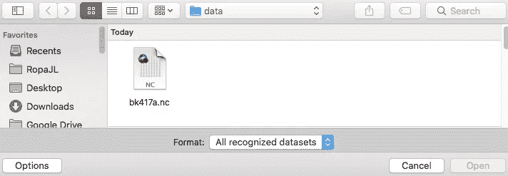
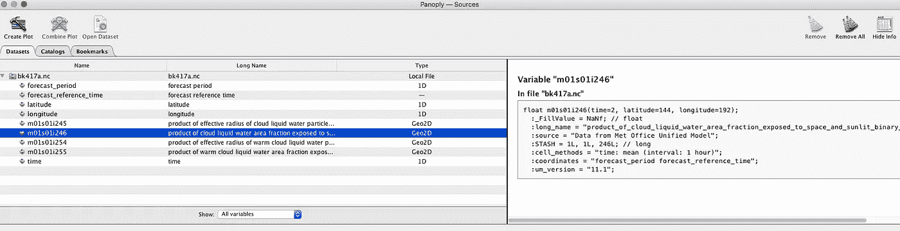
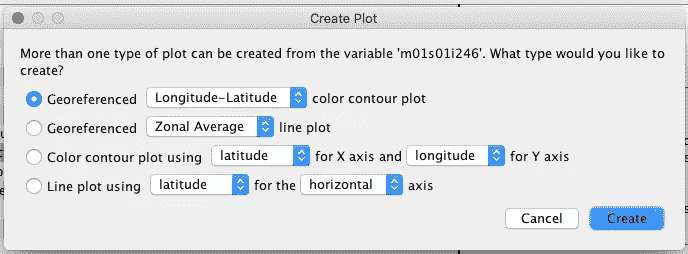
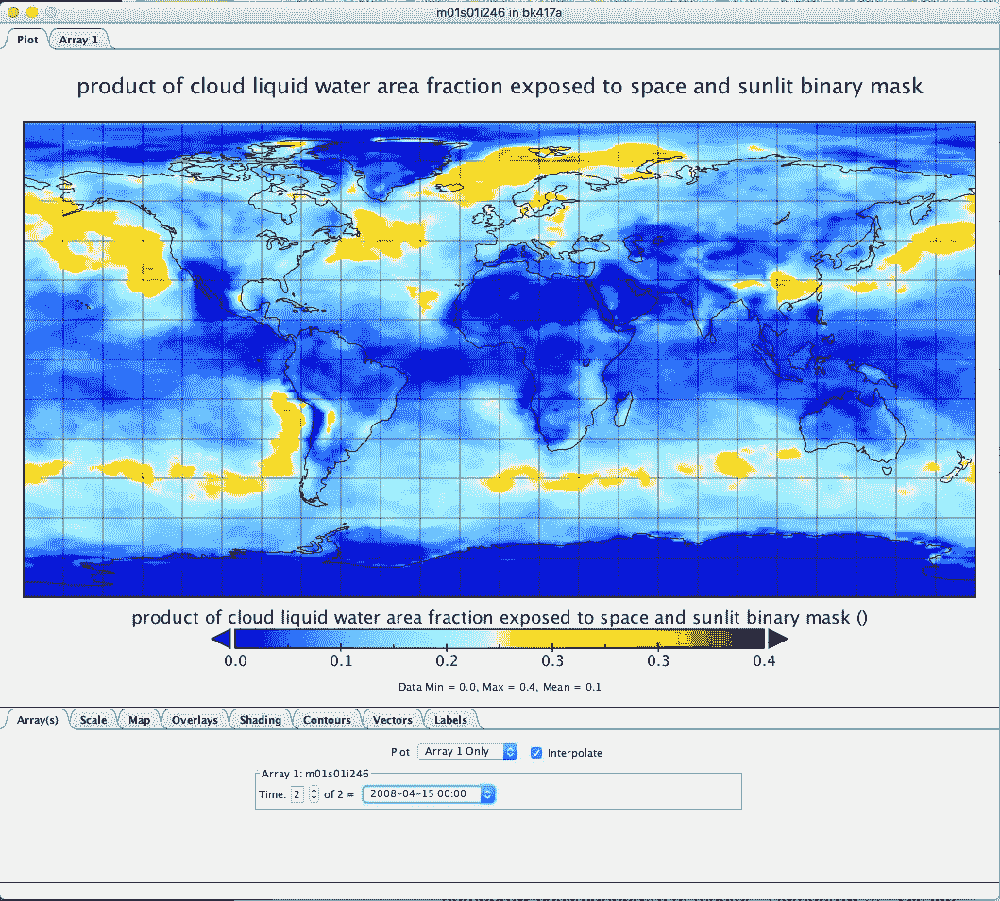
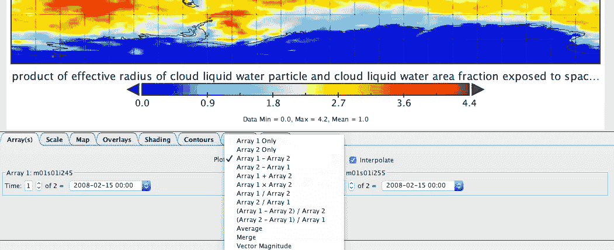

# 使用 Panoply 预览地球系统模型模拟

> 原文：<https://towardsdatascience.com/previewing-a-model-simulation-with-panoply-f1559624132e?source=collection_archive---------78----------------------->

当处理整个地球系统的模拟时，模型输出通常由数十到数百千兆字节的数据和数百个独立变量组成。使用 python 脚本等传统方法处理这个问题可能是一个漫长的过程，尤其是如果您想要快速浏览或比较数据的话。这就是 Panoply 发挥作用的地方。本文描述了这是什么，以及如何在其中加载您自己的数据集。

照片由 [NASA](https://unsplash.com/@nasa?utm_source=medium&utm_medium=referral) 在 [Unsplash](https://unsplash.com?utm_source=medium&utm_medium=referral) 拍摄

# 什么是 Panoply？

Panoply 是 NASA 的一个轻量级(~40 MB) netCDF 查看器，可用于快速了解地球模型模拟中的变量。Panoply 设计用于来自 [Goddard 地球观测系统(GEOS)](https://gmao.gsfc.nasa.gov/GEOS/) 的输出，但在使用 [AerVis](https://github.com/wolfiex/AerVis) 代码转换为 netCDFs 后，也可用于 Met Office Unified Model `.pp`输出。

# 装置

安装很简单，所需的文件很紧凑，可以在大多数操作系统上运行，不应该涉及任何管理权限。可以从以下页面找到下载链接:

 [## 美国宇航局 GISS:全景 4 netCDF，HDF 和 GRIB 数据浏览器

### panoply \PAN-uh-plee\，名词:1。壮观或令人印象深刻的阵列。...全景图地理参考和其他阵列来自…

www.giss.nasa.gov](https://www.giss.nasa.gov/tools/panoply/) 

# 加载地块

要加载一个图，我们首先打开 Panoply(双击),我们得到一个文件浏览器窗口。使用它导航到您的数据目录并选择相关文件:

# 选择您的变量

接下来，我们将看到所选文件的内容。从这里，我们可以点击我们希望进一步探索的变量。

# 选择您的绘图风格

接下来，选择绘图样式。对于 AerVis 代码，这应该是地理参考经度数据。

# 查看情节

最后，我们创建绘图——从中我们可以使用下面的选项来更改时间步长和绘图属性。

# 比较不同的图/变量

最后，如果我们愿意，可以返回 netCDF 变量(上方的**选择您的变量** *部分)选择一个不同的值，并点击**合并图**按钮*而不是*进行创建。这在我们的可视化中创建了两个绘图数组，并允许一系列的组合选项。*

# 结论

当前的方法涉及大量的数据混合和脚本来提供模型比较。现有的工具很冗长，要么需要花时间编写，要么非程序员无法使用。Panoply 提供了一种在任何计算机架构上探索 ESM 模型输出的交互式方法。因此，如果您有 netCDF 格式的全球数据，请尝试一下！

## 抽样资料

为了生成数据，可以从 [github 库](https://github.com/geoschem/geos-chem)下载 GEOS Chem，尽管建议至少在 16 个内核上运行。然而，英国气象局模型需要安全检查和许可才能获得。