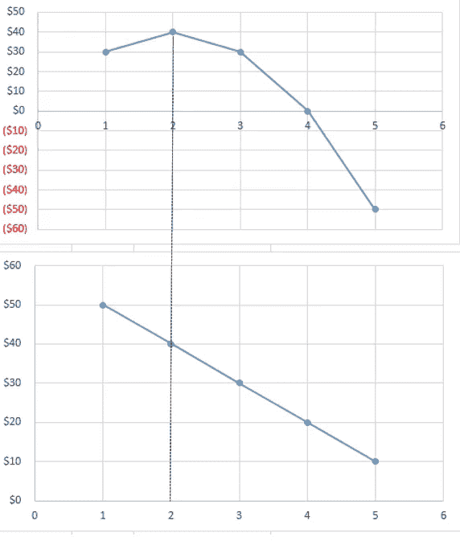

# 定价和营销分析——组织增长引擎的关键

> 原文：<https://towardsdatascience.com/pricing-and-marketing-analytics-key-to-organization-growth-engine-d5032df4b54a?source=collection_archive---------24----------------------->

定价是推动组织收入并帮助确定盈利能力的关键因素之一。一些顶级组织，尤其是亚马逊，利用了基于客户需求和行为的动态定价。你可能已经注意到，像优步，Careem 这样的公司在高峰时间收取更高的价格，这些价格是根据管理供求的算法建模的。像沃尔玛这样的零售公司之所以取得成功，是因为他们每天都采取低价策略，向顾客提供低价；这帮助他们提高了销售额和客户忠诚度。如今，随着大数据技术的出现，许多企业正在利用数据的力量来优化定价决策。即使价格上涨 1%,也能使组织的运营利润提高 10%。

因此，定价在一个组织的发展中起着关键作用，并帮助他们实现四个主要目标:

图 1:定价的四个主要目标(图片由作者提供)

这篇文章将讨论不同的定价策略，尤其将详细讨论三种重要的定价技术。所有这些技术对营销人员、业务分析师和数据科学家都很重要。

## 1.奶油/撇奶油

图 2:价格撇除策略从溢价开始(图片由作者提供)

这种定价策略包括设定初始溢价，预期随着竞争对手的进入价格会降低。这里的目标是在需求很高，并且没有竞争对手介入的情况下，获得尽可能多的收入。

示例:

**最新的 iPhone/iPad/Mac**

苹果在开始时通常会保持很高的价格。

图 3:由于这三个因素，苹果在开始时通常保持很高的价格。(图片由作者提供)

首先，苹果拥有庞大的客户群；鉴于其品牌，许多人认为苹果的产品极具吸引力。

高初始价格意味着其产品的质量。

苹果预计其销量将非常高，因此未来降低价格对其整体销量影响很小或没有影响。

请注意，当产品是创新的或豪华的时，这通常很有效。

## 2.渗透定价

图 4:渗透定价策略从低价开始(图片由作者提供)

这种定价通常被市场中的后来者使用，以便他们可以通过在开始时设定较低的价格来从竞争对手那里吸引客户。

**智能手机市场**

正如我们已经看到的例子，苹果收取非常高的价格/撇除价格。另一方面，三星以低价为工具，利用渗透定价来吸引顾客。
苹果仍然向小市场销售昂贵的手机，并能够在消费者中建立品牌忠诚度，而三星则向更广泛的客户群销售大量手机。

图 5:渗透定价策略与价格撇除策略(图片由作者提供)

## 3.日常低价

图 6:[https://en . Wikipedia . org/wiki/daily _ low _ price #/media/File:EDLP _ 1。JPG](https://en.wikipedia.org/wiki/Everyday_low_price#/media/File:EDLP_1.JPG)

**沃尔马特广告**

这种策略包括对产品设定持续的低价，而不必等待销售活动。沃尔玛获得了巨大的成功，因为每天的低价帮助它建立了提供低价的声誉。如今，该公司拥有 8500 多家门店，为超过 2 亿名客户提供服务。虽然这种策略导致低利润，但沃尔玛能够从其巨大的销售额中获得可观的利润。

## 5.成本加成定价

对于大多数零售商来说，这是一种非常常见的定价技巧，在这种情况下，销售价格是由成本和成本之外的百分比决定的。

**第一步:确定固定成本和可变成本**

**固定成本:**无论你做不做生意，这个成本都保持不变。例如月租金。

可变成本:这是原材料、劳动力或任何其他与每单位产品或服务相关的价格。这随输出水平而变化。

**第二步:确定单位成本**

单位成本包括公司生产一单位产品或服务的总成本。这包括固定成本和可变成本。

(图片由作者提供)

**第三步:确定加价**

(图片由作者提供)

因此，我们将收取 8.75 美元/台。

## 6.目标回报定价

这种定价模式根据投资者希望从投资于公司的资本中获得的收益来定价。从上面的表格中，我们可以看到投资者期望 20%的投资回报。

(图片由作者提供)

## 7.需求定价

既然我们已经看到了包括传统定价策略在内的不同定价策略，现在让我们将注意力转向动态或基于需求的定价方法。你可能每次访问都看到不同的电商网站收取不同的价格。另一个例子包括航空业；7 月份买的票和 1 月份买的票价格不一样。为什么？这是因为需求；更高的需求推高了价格。7 月份的假期可能是提振 7 月份需求的因素之一。

另一个例子包括酒店业，周末预订的房间将比工作日期间租赁的相同房间更贵。此外，你可能已经注意到，booking.com 价格每天都在根据需求而变化。

为了更好地理解这个概念，让我们来说明需求曲线的概念。

图 7:需求曲线说明了需求量和价格之间的反比关系(图片由作者提供)

这条典型的需求曲线说明了需求量和价格之间的反比关系。随着价格上涨，需求量下降。现在的问题是价格的变化会对需求量产生多大的影响？为此，经济学家计算了所谓的需求价格弹性。

需求数量的变化对价格变化的反应就是所谓的需求价格弹性。在这里，我们将探讨需求的价格弹性以及现实世界的应用。

图 8:[https://sites . Google . com/site/frameworks mkt 622/home/5-创造价值-主张/定价/价格-需求弹性](https://sites.google.com/site/frameworksmkt622/home/5-create-value-proposition/pricing/price-elasticity-of-demand)

**PED=%需求数量变化/ %价格变化**

## 解释弹性

当价格的微小变化导致需求量的较大变化时，需求被认为是有弹性的。这是强替代产品的情况，价格的微小变化可能导致客户购买替代产品。

当价格的变化引起需求的巨大变化时，需求被认为是无弹性的。

图 9:【https://hbr.org/2015/08/a-refresher-on-price-elasticity 

**说明最优定价的简单示例**

图 10a:最优定价(作者图片)

请注意，在 40 美元，我们赚取最大利润。在 50 美元时，需求量减少，导致总利润减少。这里的重点是解释弹性和数量需求根据价格变化的方式如何影响我们的整体收入和利润。

图 10b:最优定价(作者图片)

非常欢迎你计算需求的价格弹性

**企业如何利用价格弹性？**

这是营销经理/分析师最重要的指标之一。根据《哈佛商业评论》中提到的一次采访，营销人员的目标是将他或她的产品从相对弹性转变为非弹性，这是通过创造差异化产品、品牌形象和忠诚度来实现的。目标是提高支付意愿，不管价格如何。

根据麦肯锡的见解，动态定价应该包括五个模块。

1.  长尾模块:这有助于通过识别相似的产品来设定初始价格或介绍价格。根据其中一篇文章，拥有 100 万种产品的美国零售商通过收集 10 万种最畅销产品的丰富数据集建立了长尾模块，包括竞争对手的价格、客户行为和产品属性。这些产品然后被智能地匹配以确定价格。这个试点帮助零售商增加了 3%的收入。
2.  弹性模块:这已经在上面说明了。这可以通过使用时间序列方法和回归模型来实现，这些方法和模型考虑了季节性、同类相食和竞争因素。
3.  键值商品模块:这些商品的价格比其他商品更容易被消费者记住。这对于不销售产品的经销商尤为重要。例如食品杂货公司。在这种情况下，公司可以建立一个模型来评估每个项目对消费者价格感知的重要性。
4.  竞争响应模块:利用数据科学和机器学习模型的力量，公司可以实时利用竞争对手的定价数据以及这些价格对客户的影响。
5.  全渠道模块:该模块确保一个项目或产品的价格在所有渠道都得到反映。这里的公司可以利用价格歧视策略。

## 定价评估

既然我们已经看到了不同的定价策略，对一个组织来说，评估其产品价格也是非常重要的，因为投资者/股东对 ROI、盈利能力、IRR 和现金流感兴趣。我们可以用不同的方法来评估价格

1.  **收支平衡法**

在这种方法中，我们计算要达到收支平衡需要销售的单位数量。这考虑了固定成本、单位成本和价格。换句话说，盈亏平衡点是一种产品的总收入等于总支出的点。

**2。NPV 资本预算**

资本预算有许多不同的方法，包括净现值、内部收益率、回收期、盈利能力指数。

净现值(NPV)考虑了资金的账户时间价值，并将未来现金流转化为今天的美元或货币。

## 参考

[1][https://small business . chron . com/penetration-pricing-examples-18365 . html](https://smallbusiness.chron.com/penetration-pricing-examples-18365.html)

[2][https://www.marketing91.com/penetration-pricing/](https://www.marketing91.com/penetration-pricing/)

[3][https://doc player . net/36830320-Chapter-8-price-analytics . html](https://docplayer.net/36830320-Chapter-8-price-analytics.html)

[https://research.aimultiple.com/dynamic-pricing/](https://research.aimultiple.com/dynamic-pricing/)

[https://hbr.org/2015/08/a-refresher-on-price-elasticity](https://hbr.org/2015/08/a-refresher-on-price-elasticity)

[http://investopedia.com/](http://investopedia.com/)

[7][https://www . McKinsey . com/industries/retail/our-insights/how-retailers-can-drive-profitable-growth-through-dynamic-pricing](https://www.mckinsey.com/industries/retail/our-insights/how-retailers-can-drive-profitable-growth-through-dynamic-pricing)