# Mercari 中的定价对象—机器学习和深度学习视角

> 原文：<https://towardsdatascience.com/pricing-objects-in-mercari-machine-learning-deep-learning-perspectives-6aa80514b2c8?source=collection_archive---------46----------------------->

## 作为开创性自我案例研究的一部分，解决 Kaggle 的 Mercari 数据集的基于 NLP 的回归的补充工作——应用人工智能课程

> 这是我的第一篇博客，我很高兴分享我在解密 Kaggle 比赛的解决方案时的机器学习和深度学习经验。尽管这是提交给 Kaggle 的一篇迟到的文章，但我在分析过程中的学习之旅也非常直观、有趣且富有挑战性。希望这个博客最终能给读者一些有用的学习资料。

# 目录

1.  商业问题
2.  误差度量
3.  机器学习和深度学习在我们问题上的应用
4.  数据来源
5.  探索性数据分析— EDA
6.  现有方法
7.  数据准备
8.  模型解释
9.  结果
10.  我改进 RMSLE 的尝试
11.  未来的工作
12.  LinkedIn 和 GitHub 知识库
13.  参考


图片来源:[https://unsplash.com/photos/1M4wYTqVD4o](https://unsplash.com/photos/1M4wYTqVD4o)

# 1.商业问题

Mercari，Inc .是一家在日本和美国运营的电子商务公司，其主要产品是 Mercari marketplace 应用程序。人们可以使用智能手机轻松销售或购买商品。该应用程序的用户可以在列出商品时自由选择价格。然而，这里存在更高的风险，因为如果价目表与市场价格相比过高或过低，消费者和顾客都会不知所措。上述问题的解决方案是自动推荐商品价格，因此，最大的社区购物应用程序希望向其卖家提供价格建议。

眼前的问题是预测任何给定产品的价格，这说明这是一个回归问题。我们在训练数据中的特征是物品的*训练标识、名称、物品条件标识、类别名称、品牌名称、价格、运输、物品描述*。除了作为我们目标变量的*价格*之外，我们在测试数据中拥有所有其他特征。这些特征不仅是分类的和数字的，而且也是卖方提供的商品的文本描述。例如，女性配饰产品的文字描述如下:


作者图片

我们可以看到两者售价不同；第一个 16 美元，第二个 9 美元。

因此，这里的挑战是，我们需要建立一个模型，该模型应该根据上图所示的描述，以及产品名称、类别名称、品牌名称、物品状况等来预测产品的正确价格。

# 2.误差度量

这个问题的误差度量是均方根对数误差(RMSLE)。请参考[这篇博客](https://medium.com/analytics-vidhya/root-mean-square-log-error-rmse-vs-rmlse-935c6cc1802a)了解更多关于该指标的信息。下图显示了度量计算的公式:

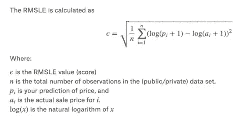

图片来源:[https://cs 230 . Stanford . edu/files _ winter _ 2018/projects/6940447 . pdf](https://cs230.stanford.edu/files_winter_2018/projects/6940447.pdf)

计算 RMSLE 的代码如下所示:

计算 RMSLE 的函数

# 3.机器学习和深度学习在我们问题上的应用

在这个人工智能(AI)的时代，我们想到 AI 的那一刻，接下来的两个流行语就是机器学习和深度学习。我们发现人工智能无处不在，事实上它们是人类生活的一部分。无论是通勤(如出租车预订)，医疗诊断，个人助理(如 Siri，Alexa)，欺诈检测，犯罪检测，在线客户支持，产品推荐，无人驾驶汽车，等等。有了尖端的机器学习和深度学习算法，任何类型的预测问题都可以解决。

我们的问题是独特的，因为它是基于 NLP(自然语言处理)的回归任务。NLP 中的第一步是将文本表示为数字，即将文本转换为数字向量表示，以构建回归变量。

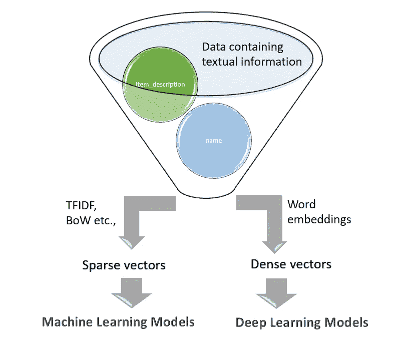

作者图片

解决价格预测问题的一种方法是利用 TF-IDF、BoW 等矢量化技术，并构建将由经典机器学习算法(例如简单线性回归器、基于树的回归器等)使用的固定大小的稀疏向量表示。).另一种方式是使用深度 NLP 架构(例如 CNN、LSTM、GRU 或它们的组合)，这些架构可以自己学习特征，并且需要来自嵌入的密集向量。在当前的分析中，我们正在研究这两种方法。

# 4.数据来源

本次分析的数据集来自 Kaggle，这是一个面向数据科学家的流行在线社区或数据平台。

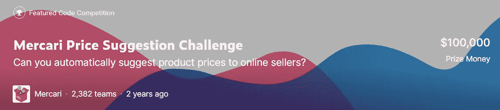

图片来源:【https://www.kaggle.com/c/mercari-price-suggestion-challenge 

## 理解数据

训练集包含超过 140 万个产品，而阶段 2 测试集包含超过 340 万个产品。

列出训练/测试数据中的字段名:

*   ***train_id*** 或 ***test_id*** —列表的唯一 id
*   ***名称*** —卖方提供的产品名称。请注意，为了避免数据泄露，该字段中的价格被删除并表示为[rm]
*   ***item _ condition _ id***—此处卖方提供物品条件
*   ***【类别名称】*** —每件商品的类别列表
*   ***brand_name*** —每件商品所属的对应品牌
*   ***价格*** —这是我们的目标变量，以美元表示(test.tsv 中不存在该列)
*   ***运费*** — 1，如果运费由卖家支付，0，否则
*   ***item _ description***—此处给出了每个项目的描述，价格被移除并表示为[rm]

下面显示的数据一瞥:

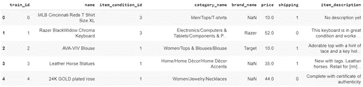

列车样本数据的屏幕截图

# 5.探索性数据分析— EDA

EDA 是数据科学过程中的一个重要步骤，是一种统计方法，通常使用可视化方法从数据集获得更多见解。在我们深入研究 EDA 之前，让我们快速浏览一下数据以了解更多信息。下面是检查空值的代码片段:

```
print(train.isnull().sum())
```

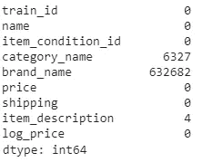

代码输出的屏幕截图

从上面的输出中，我们认识到有三列，即类别名称、品牌名称和项目描述包含空值。其中，品牌名称包含了大量缺失值(~632k)。列类别名称包含大约 6.3k 个空值，而项目描述只有 4 个空值。让我们稍后在创建模型时处理它们，现在我们逐个特性地深入研究 EDA。

## 5.1 类别名称的单变量分析

训练数据集中总共有 1287 个类别。下面显示的是计数的代码片段:

计数类别的代码

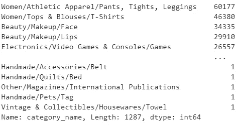

类别计数的输出

category_count 的曲线图如下所示:

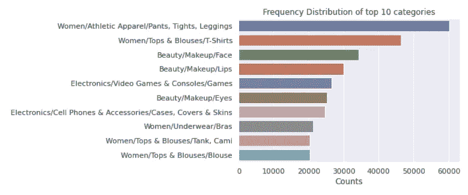

上面的条形图显示了出现频率最高的 10 个类别。人们会注意到，女装是所有服装中最引人注目的。

每个类别名称由 3 个以'/'分隔的子类组成，并具有**主类别/子类 1 /子类 2** 名称。重要的是将它们分开，并作为新的特征包括进来，这将使我们的模型做出更好的预测。

## 拆分类别

在我们的分析中，我们使用下面的函数将每个 *category_name* 拆分为 *main_category* 、 *sub_cat_1* 、 *sub_cat_2* 。

用于拆分的效用函数

此外，这三列中每一列的类别数是使用下面的代码行计算的:

```
main_category_count_te = test['main_category'].value_counts()
sub_1_count_te = test['sub_cat_1'].value_counts()
sub_2_count_te = test['sub_cat_2'].value_counts()
```

上述分析表明，有 11 个主要类别，这些类别又分为 114 个子类别(子类别 1)，这些子类别又被分配到列车数据中的 865 个特定类别(子类别 2)。绘制类别的代码如下所示:

绘图代码

绘图类别

拆分后该类别每列中前 10 项的条形图如下:

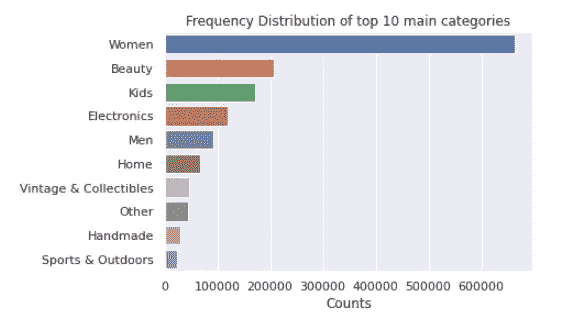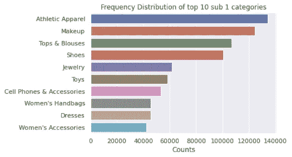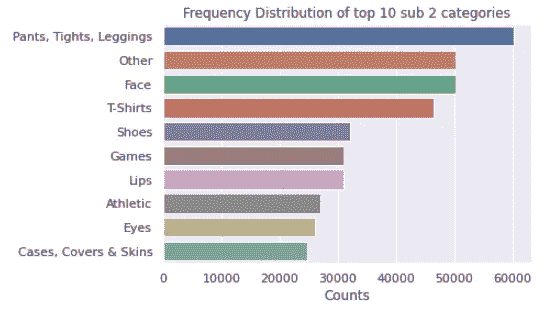

## 5.2 品牌名称的单变量分析

共有 4807 个独特品牌，其中出现频率最高的 10 个品牌如下图所示:

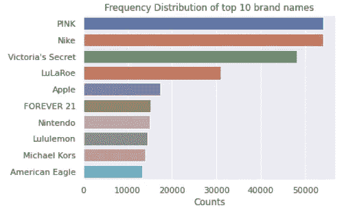

绘图代码在这里:

```
#https://www.datacamp.com/community/tutorials/categorical-data
sns.barplot(x=brand_count[:10].values, y=brand_count[:10].index)
plt.title('Frequency Distribution of top 10 brand names')
plt.xlabel('Counts', fontsize=12)
plt.show()
```

值得注意的是，粉红色和耐克品牌，其次是维多利亚的秘密，是占据领先地位的品牌。

## 5.3 价格的单变量分析

由于*价格*是数字，我们使用 describe()函数来感知统计汇总。下面是代码片段:

```
train.price.describe()
```

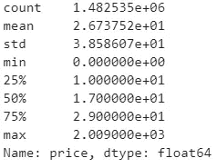

汇总统计数据

describe()函数解释了任何产品的最高价格是$2009，最低价格是 0。还注意到，75%的产品价格范围出现在 29 美元以下，50%的产品价格低于 17 美元，而 25%的产品价格低于 10 美元。平均价格范围是 26.7 美元。

## 价格变量的分布

绘制目标的分布图

```
plt.title("Distribution of Price variable")
plt.xlabel("Price(USD)")
plt.ylabel("No. of products")
plt.hist(train['price'],bins=30)
```

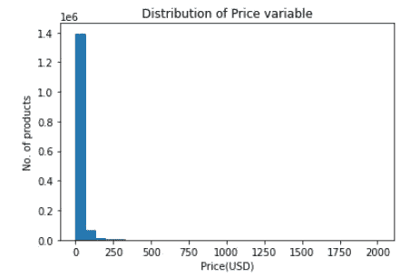

从上图可以明显看出，*价格*特征遵循右偏分布。正如这里讨论的，由于分布另一侧的点，偏斜分布会导致高均方差(MSE)值，如果数据是正态分布，MSE 是有限的。因此，价格特性的对数转换是不可避免的，如果数据是正态分布的，模型也可以表现得更好。这是通过以下代码片段完成的:

日志转换代码

下面显示的是对数变换后的*价格*变量的曲线图。

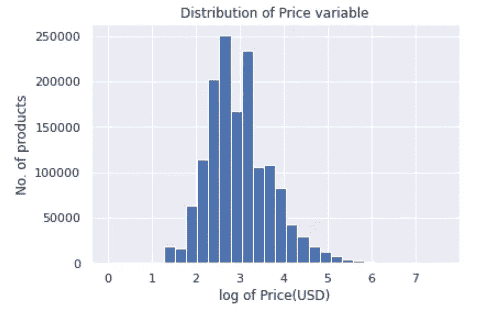

## 5.4 项目 _ 描述的单变量分析

我们绘制单词 cloud 是为了了解描述中的流行单词。对应的代码片段与下面显示的图对应:

单词 cloud 的代码

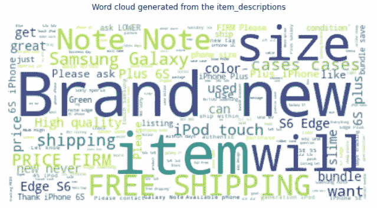

从上面的词云中，人们可以注意到在我们的 *item_description* 中频繁出现的词。

## 描述字数

单独的文本描述可能是该问题的重要特征([参考](https://cs230.stanford.edu/files_winter_2018/projects/6940447.pdf))，即对于机器学习模型，并且将有助于深度学习模型的嵌入过程。

用于计算描述中字数的代码

为了进一步研究该特性，我们绘制了如下所示的箱线图和分布图以及代码:

## 箱形图

```
sns.boxplot(train['description_wc'],orient='v')
plt.title("Box plot of description word count")
plt.xlabel("item_description")
plt.ylabel("No. of words")
plt.show()
```

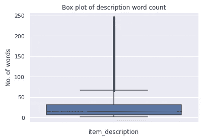

人们可以注意到大多数描述包含大约不到 40 个单词。

## 密度图

```
plt.figure(figsize=(10,3))
sns.distplot(train['description_wc'], hist=False)
plt.title('Plot of the word count for each item description')
plt.xlabel('Number of words in each description')
plt.show()
```

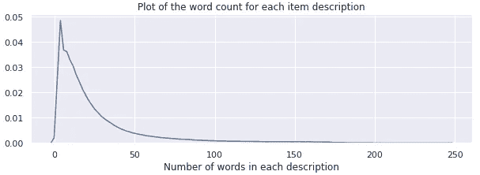

描述字数的密度图是右偏的。

## 汇总统计数据

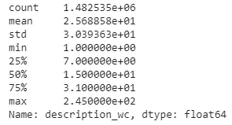

汇总统计表明 *item_description* 的最小长度为 1，而最大长度为 245。平均长度约为 25 个单词。越少的描述越长，而它们中的大多数包含不到 40 个单词，正如我们在方框图中看到的。

## 5.5 项目 _ 条件 _ 标识的单变量分析

有序分类特征 *item_condition_id* 的范围是 1 到 5。普通性是条件 1 的项目是“最好的”，条件 5 的项目是“最差的”(基于[这个](https://www.kaggle.com/captcalculator/a-very-extensive-mercari-exploratory-analysis/code)参考)。 *item_condition_id* 的条形图如下所示:

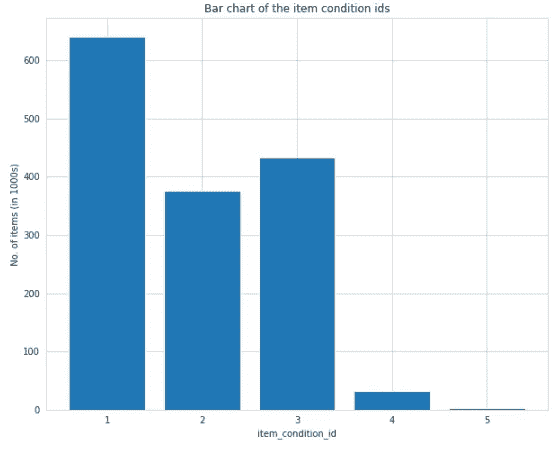

正如上面的柱状图所示，大多数待售商品状况良好。因此，条件 1 的项目较高，其次是条件 3 和条件 2，而条件 4 和条件 5 的项目较低。

## 5.6 双变量分析

了解目标变量与其他特征的关联类型将有助于特征工程。因此，价格变量与其他两个变量进行比较。

## 价格与运输

和往常一样，绘图会帮助我们更好地理解事物。代码和图形如下所示:

箱线图的代码

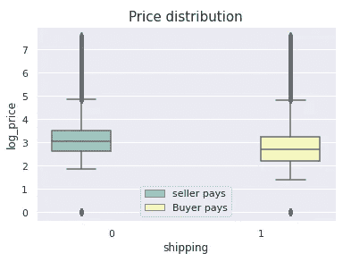

人们可以观察到，当物品的价格较高时，卖家支付运费，反之亦然。

## 价格与描述长度

这两个变量的绘图和我们上面做的一样。

```
plt.scatter(train['description_wc'],train['price'],alpha=0.4)
plt.title("Price Vs Description length")
plt.xlabel("Description length")
plt.ylabel("Price(USD)")
plt.show()
```

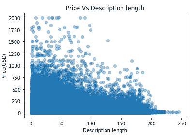

值得注意的是，描述长度较短的商品往往比描述长度较长的商品价格更高。

# 6.现有方法

有几个内核、博客和论文使用简单的机器学习或深度学习方法做出了解决方案。我们将向他们中的一些人简要介绍:

## MLP

Pawel 和 Konstantin 凭借他们惊人的解决方案赢得了这场竞赛。他们使用了一种基于前馈神经网络的方法，即一种对稀疏特征有效的简单 MLP。执行的一些预处理技巧包括对分类列进行一次性编码，使用标准 PorterStemmer、BoW-1，2-grams(有/没有 TF-IDF)对文本进行词干分析，将不同的字段(如 *name、brand name 和 item_description* )连接成一个字段。他们获得了 0.37 的优异成绩。

## 美国有线新闻网；卷积神经网络

在这项研究中，作者使用 CNN 架构和最大池分别对*名称*和*项目描述*进行矢量化。他使用预先训练的手套向量进行单词嵌入，嵌入是对*姓名*和*项目 _ 描述*的共享搜索。使用的一些有用的技巧是在最后一个完全连接的层和单词嵌入的平均池层之前跳过数字和低基数分类特征的连接。作者从单一深度学习模型([链接](https://www.kaggle.com/gspmoreira/cnn-glove-single-model-private-lb-0-41117-35th))取得了 0.41 的惊人成绩。

## LGBM +山脊

在这里，作者应用了一个名为 LightGBM 的基于树的梯度推进框架，以实现更快的训练和更高的效率。该研究还使用了一个简单、快速的岭模型进行训练。一些特征技术包括:使用 CountVectorizer 对 *name* 和 *category_name* 列进行矢量化，使用 TfidfVectorizer 对 *item_description* 进行矢量化，使用虚拟变量对 *item_condition_id* 和 *shipping_id 进行创建，*使用 LabelBinarizer 对 *brand_name* 进行矢量化。两个模型合二为一后，作者取得了 0.44 的成绩。([链接](https://www.kaggle.com/tunguz/more-effective-ridge-lgbm-script-lb-0-44823))

## GRU + 2 山脊

在这项研究中，作者使用 RNN、里奇和里奇 CV 构建了一个关联模型，其均方根误差约为 0.427。这里应用的一些有用的技巧包括对文本特征使用 GRU 层，对 RNN 训练使用预定的学习衰减，使用具有 2 个时期的小批量大小，以及对脊模型使用超过 300k 的特征([链接](https://www.kaggle.com/valkling/mercari-rnn-2ridge-models-with-notes-0-42755#RNN-Model))。

# 7.数据准备

## 数据清理

根据这份参考资料，Mercari 网站上的最低价格为 3 美元。因此，在我们的训练数据中，我们保留价格高于$3 的项目。下面显示的是相同的代码片段:

```
#https://www.kaggle.com/valkling/mercari-rnn-2ridge-models-with-notes-0-42755
train = train.drop(train[(train.price < 3.0)].index)
```

## 处理空值/缺失值

从 EDA 中，我们了解到 3 列即。、*类别名称*、*品牌名称、*和*项目描述*为空值。因此，我们用适当的值替换它们。我们用下面的函数来做这件事:

处理缺失值的代码

## 列车测试分离

在我们的分析中，*价格*字段是目标变量“y”。根据误差函数评估我们的回归模型的适合度是很重要的，我们需要观察“y”并预测“y”。不幸的是，我们没有观察到的目标值来评估我们的模型。因此，训练数据被分成训练集和测试集。

对于基本的线性回归模型，测试集由 10%的数据组成，对于深度学习模型，测试集包括总数据的 20%。

## 缩放目标

使用 sklearn.preprocessing 中的 StandardScaler 函数对目标变量进行标准化，如下所示:

缩放目标变量

因为我们的目标变量是使用上述函数标准化的，所以在我们计算误差度量之前，将预测值按比例缩小(逆变换)是很重要的。这是通过使用以下函数来完成的:

# 8.模型解释

让我们详细了解一下机器学习和深度学习管道。

## 8.1 机器学习管道

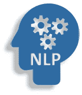

作者图片

在此分析中，自然语言处理概念如 BoW、TFIDF 等。用于对机器学习回归模型的文本进行矢量化。

## 特征构造

在执行 EDA 时，我们添加了四个新特性，即通过拆分列*类别*生成三个新列，并添加来自 *item_description* 的文本描述的字数。此外，我们根据姓名文本的长度再创建一列。所以，我们有了五个新特性。

我们的数据集由分类特征、数字特征和文本特征组成。必须对分类特征进行编码，并对文本特征进行矢量化，以创建模型使用的特征矩阵。

## 分类特征编码

我们使用 sci-kit 中的 CountVectorizer 函数对分类特征进行一次性编码，如 *category_name* 、 *main_category* 、 *sub_cat_1* 、 *sub_cat_2* 、 *brand_name* ，并使用 get_dummies()函数对 *shipping_id* 和 *item_condition_id* 进行编码。下面是相同的代码:

一键编码的代码

## 文本特征矢量化

我们分别使用 BoW(一元和二元)和 TFIDF(一元、二元和三元)编码文本特征 *name* 和 *item_description* 。其功能如下所示:

矢量化代码

下面给出了使用上述函数的代码:

## 特征矩阵

通过将所有编码特征(分类特征和文本特征)与两个数字特征(即文本描述和姓名的字数)连接起来，生成最终的矩阵。以下代码供参考:

产生的最终矩阵由超过 206k 个特征组成。的确，这是一个很大的特点。

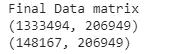

最终矩阵形状的屏幕截图

## 首次切割模型

为这个问题选择一个合适的算法可能是一项艰巨的任务，尤其是对初学者来说。


图片来源:[https://unsplash.com/photos/bmrGgKXz_xU](https://unsplash.com/photos/bmrGgKXz_xU)

我们学习根据数据维度、线性、训练时间、问题类型等选择算法。正如这里讨论的。

在我们的分析中，我们首先使用简单的线性模型进行实验，如线性回归、支持向量回归机，对于这两个模型，我们都选择 sci-kit learn 中的 SGDRegressor。在此之后，我们训练岭回归。

我们使用 GridSearchCV 通过以下函数对所有模型的参数进行超参数调整:

## 线性回归

线性回归旨在减少预测和实际数据之间的误差。我们使用具有“平方损失”的 SGDregressor 和针对不同 alphas 的超参数调整来训练简单的线性回归。下面显示的代码是相同的:

根据我们的测试数据，这个简单的模型得出的最佳 alpha = 0.001 的 RMSLE 为 0.513。

## 支持向量回归机:

支持向量回归机(SVR)旨在预测偏离实际数据不超过ε的函数([参见](https://in.mathworks.com/help/stats/understanding-support-vector-machine-regression.html))。我们使用具有“epsilon_insensitive”的 SGDRegressor 作为 alphas 的损失和超参数调谐来训练 SVR。在我们的测试数据中，当 alpha = 0.0001 时，该模型产生的 RMSLE 为 0.632。在我们的例子中，简单的线性回归比支持向量机表现得好得多。SVR 的代码如下:

## 里脊回归

岭回归是线性回归的近亲，具有由 L2 范数给出的一些正则化以防止过度拟合。我们在线性模型下使用 sci-kit learn Ridge 库获得了良好的拟合，对于 alpha = 6.0，RMSLE 为 0.490。下面是具有超参数调整的岭模型的代码:

## 里奇夫

它是一种交叉验证估计器，可以自动选择最佳超参数(这里指的是:)。换句话说，带有内置交叉验证的岭回归。正如在[这个](https://www.kaggle.com/valkling/mercari-rnn-2ridge-models-with-notes-0-42755#RNN-Model)内核中所述，对于我们的问题，它比 Ridge 表现得更好，我们构建了 RidgeCV 模型，在我们的测试数据上，它为 alpha 6.0 产生了 0.442 的 RMSLE。相同的代码如下所示:

我们还可以观察到 RidgeCV 在我们的第一次切割模型中表现更好。为了进一步提高分数，我们正在探索使用 RNN 解决这个问题的神经网络。

## 8.2 深度学习管道

递归神经网络(RNN)擅长处理序列数据信息(更多信息请参见[参考](/illustrated-guide-to-lstms-and-gru-s-a-step-by-step-explanation-44e9eb85bf21))。我们使用门控递归单元(GRUs)来构建使用神经网络的回归器，这是一种训练速度更快的新型 RNN。从 GRU，我们获得嵌入后的*名称、item_description* 列的文本特征向量，对于其他分类字段，我们使用嵌入，然后进行展平。所有这些共同构成了我们深度学习模型的 80 维特征向量。

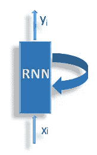

作者图片

## 嵌入

深度学习(DL)管道的数据准备遵循与 ML 管道相同的程序，除了训练-测试分离。这里我们认为 20%的训练数据是测试数据。如前所述，DL 管道需要密集的向量，而神经网络嵌入是将我们的离散变量表示为连续向量的有效手段([参见](/neural-network-embeddings-explained-4d028e6f0526))。

## 标记化和填充

嵌入层要求输入为整数编码([参考](https://machinelearningmastery.com/use-word-embedding-layers-deep-learning-keras/))。因此，我们使用 [Tokenizer API](https://keras.io/preprocessing/text/#tokenizer) 对文本数据进行编码，下面是相同的代码片段:

标记化后的示例描述数据截图如下所示:

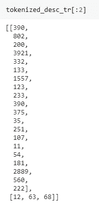

标记化后描述文本的屏幕截图

在标记化之后，我们填充序列。*名称*和*描述*文本长度不同，Keras 倾向于输入序列长度相同。我们计算超出特定单词范围的数据点的百分比，以确定填充长度。

下面显示的代码用于选择描述文本的填充长度:

```
print("% of sequence containing len > 160 is")
len(X_train[X_train.wc_desc > 160])/X_train.shape[0]*100
```

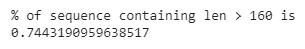

上面代码的输出

从上图中我们看到长度超过 160 的点的百分比是 0.7，这是< 1%. Hence we pad description text with 160\. Similarly, we calculate for the *名称*列，我们选择 10。相应的代码片段如下所示:

```
print("% of name containing len > 10 is")
len(X_train[X_train.wc_name > 10])/X_train.shape[0]*100
```

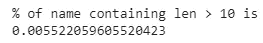

以上代码的输出

此外，我们根据排名对分类变量进行编码，代码片段如下所示:

*注意:所有的嵌入都是和模型一起学习的。*

整个数据准备管道以及编码、标记化和填充由以下函数执行:

## 网络体系结构

当前分析的网络设计受[这个](https://www.kaggle.com/valkling/mercari-rnn-2ridge-models-with-notes-0-42755#RNN-Model)内核的启发。此外，我们在这个框架中试验了额外的丢弃层和批量规范化层。下面是构建我们的网络的代码片段:

看看我们下面的网络:


GRU 神经网络

## 深度学习模型

总共训练了四个模型，它们的退出率和学习率不同。每个网络由四个退出层组成，对于这些层中的每一层，我们对所有模型尝试不同的退出率(详见结果)。

## 培养

对于训练模型 1 和模型 2，我们使用具有默认学习速率的 Adam 优化器。此外，这些模型用两倍的批量大小训练 3 个时期。模型 1 和模型 2 的测试数据的均方根误差分别为 0.436 和 0.441。模型训练如下图所示:

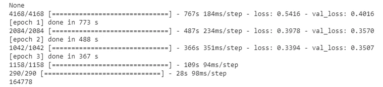

具有默认学习率的模型 2 训练

模型 3 和 4 使用 Adam optimizer 以预定的学习速率进行训练。共 3 个时期，批量为 1024。对于时段 1 和 2，学习率是 0.005，对于最后一个时段，我们将其降低到 0.001。模型 4 的培训如下所示:

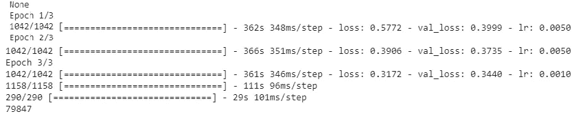

模式 4 以预定的学习率进行培训

## 模型平均集合

模型平均是一种集成学习技术，用于减少神经网络中的高方差。在目前的分析中，我们集成了在不同退出正则化条件下训练的模型([参考](https://machinelearningmastery.com/ensemble-methods-for-deep-learning-neural-networks/#comment-539557))。每个模型大约需要 30 到 35 分钟来训练。考虑到训练时间，我们只包括两个模型进行组合。因此，在四个模型中，创建了两个系综，即，一个来自实现 RMSLE 0.433 的模型 1 & 2，另一个来自 RMSLE 0.429 的模型 3 & 4

组装模型 1 和 2 的代码如下所示:

我们观察到来自**模型 3 & 4 的**集合**在我们的训练测试分割数据中表现优于**。

## 最终模型

为了获得 Kaggle 的最终分数，我们现在在 Kaggle 内核中训练。我们建立了两个与模型 3 和 4 相同的模型用于组装。下面展示的是在 Kaggle 接受训练的模特的截图:

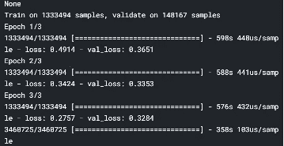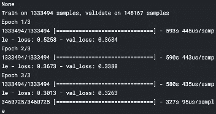

这两个模型的模型平均组合在包含约 340 万个产品的最终测试数据上的 Kaggle 公开评分中得到 0.428 分。因此，我们获得了排名榜前 10%的**分数。**

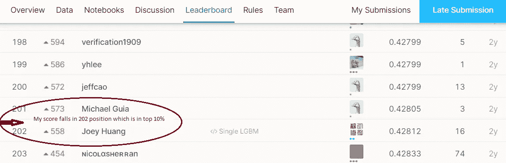

排行榜截图

# 9.结果

下面显示的是模型输出的摘要屏幕截图:

**机器学习流水线的输出:**

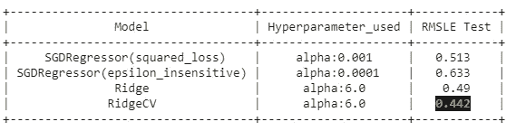

**深度学习管道输出快照:**

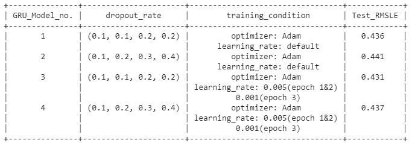

4 个模型的输出

**组装输出截图**:

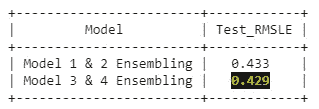

2 个系综的输出

**Kaggle 投稿评分**:

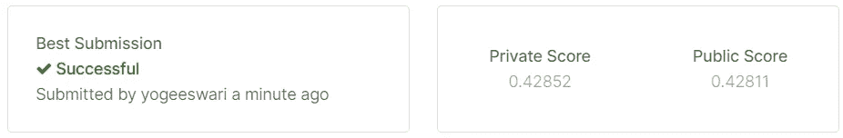

# 10.我改进 RMSLE 的尝试

一般来说，Kaggle 的竞争对手的核心是说教的来源。本分析的灵感来自于[这个](https://www.kaggle.com/valkling/mercari-rnn-2ridge-models-with-notes-0-42755#RNN-Model)、[这个](https://www.kaggle.com/gspmoreira/cnn-glove-single-model-private-lb-0-41117-35th)以及一些来自于赢家的解决方案。提高我们分数的策略如下:

*   **包含停用词进行分析:**这个问题的一个关键是，删除文本描述/名称中的停用词会影响 RMSLE 分数。停用词的保留提高了分数。
*   **考虑更多的文本特征用于建模:**总共得到 206k 个特征，其中包括仅来自文本数据的 200k 个特征。在这个问题中，更加重视文本信息可以提高分数。
*   **二元语法和三元语法:**在自然语言处理中，习惯上包括二元语法、三元语法等 n 元语法。如果我们打算在矢量化过程中添加一些语义。在我们的研究中，我们使用单词包对名称应用一元和二元语法，使用 TFIDF 对项目描述应用一元、二元和三元语法。
*   **根据*价格*** 过滤数据:Mercari 不允许发布低于 3 美元的商品。因此，那些产品*价格*低于$3 的行将是错误点。移除它们将有助于模型更好地运行。
*   **小批量模型训练&少时段:**使用 1024 的批量和预定的学习提高了分数
*   **集成两个神经网络模型:**这种策略是当前研究独有的，它将分数推高到了排行榜上。我们通过训练两个神经网络模型并构建它们的集成来执行我们的预测分析。

# 11.未来的工作

可以通过探索以下选项来提高分数:

1.  使用多层感知器，因为它是解决这个问题的流行方法
2.  使用 CNN 结合 RNN 处理文本数据
3.  添加更多的 GRU 层或进一步微调

这些是我们随后想要探索的一些可能性。

# 12.LinkedIn 和 GitHub 知识库

这是我在 LinkedIn 上的简介。请参考我的 [GitHub](https://github.com/syogeeshwari/Mercari_price_prediction) 库查看完整代码。

# 13.参考

[https://github . com/pjankiewicz/mercari solution/blob/master/presentation/build/yandex . pdf](https://github.com/pjankiewicz/mercari-solution/blob/master/presentation/build/yandex.pdf)

[](https://www.kaggle.com/valkling/mercari-rnn-2ridge-models-with-notes-0-42755) [## 带注释的 RNN+2 桥模型(~0.42755)

### 使用 Kaggle 笔记本探索和运行机器学习代码|使用来自 Mercari 价格建议挑战赛的数据

www.kaggle.com](https://www.kaggle.com/valkling/mercari-rnn-2ridge-models-with-notes-0-42755) [](https://medium.com/analytics-vidhya/mercari-price-suggestion-challenge-66500ac1f88a) [## Mercari 价格建议挑战

### 这是我在 Kaggle 环境中的第一次数据科学体验。虽然挑战本身很有趣，经历也…

medium.com](https://medium.com/analytics-vidhya/mercari-price-suggestion-challenge-66500ac1f88a) [](https://medium.com/analytics-vidhya/mercari-price-suggestion-challenge-a-machine-learning-regression-case-study-9d776d5293a0) [## Mercari 价格建议挑战——机器学习回归案例研究

### 这是我的第一个媒介故事。希望你读它的时候开心，就像我喜欢为观众写它一样

medium.com](https://medium.com/analytics-vidhya/mercari-price-suggestion-challenge-a-machine-learning-regression-case-study-9d776d5293a0) [](https://machinelearningmastery.com/ensemble-methods-for-deep-learning-neural-networks/) [## 深度学习神经网络的集成学习方法——机器学习掌握

### 如何通过组合多个模型的预测来提高性能？深度学习神经网络是非线性的…

machinelearningmastery.com](https://machinelearningmastery.com/ensemble-methods-for-deep-learning-neural-networks/) [](https://machinelearningmastery.com/model-averaging-ensemble-for-deep-learning-neural-networks/) [## 如何在 Keras 中开发一套深度学习模型——机器学习掌握

### 深度学习神经网络模型是高度灵活的非线性算法，能够学习近乎无限数量的…

machinelearningmastery.com](https://machinelearningmastery.com/model-averaging-ensemble-for-deep-learning-neural-networks/) [](https://medium.com/unstructured/how-i-lost-a-silver-medal-in-kaggles-mercari-price-suggestion-challenge-using-cnns-and-tensorflow-4013660fcded) [## 我如何在使用 CNN 和 Tensorflow 的 Kaggle 的 Mercari 价格建议挑战中失去银牌

### 2018 年 1 月，我参加了一个名为 Mercari 价格建议的 Kaggle 比赛。比赛持续了三…

medium.com](https://medium.com/unstructured/how-i-lost-a-silver-medal-in-kaggles-mercari-price-suggestion-challenge-using-cnns-and-tensorflow-4013660fcded) [](https://www.appliedaicourse.com/course/11/Applied-Machine-learning-course) [## 应用课程

### 应用机器学习课程 GATE CS 混合课程面试准备课程 AI Workshop AI 案例研究

www.appliedaicourse.com](https://www.appliedaicourse.com/course/11/Applied-Machine-learning-course)