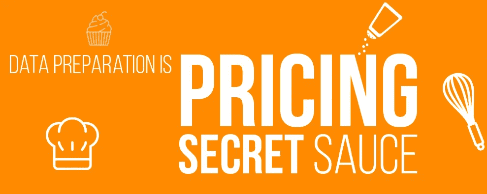
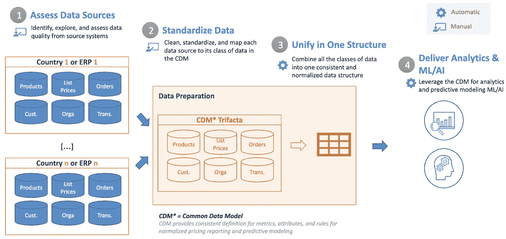

# 危机期间的定价优化:数据是关键

> 原文：<https://towardsdatascience.com/pricing-optimization-during-the-crisis-data-is-key-a4d4f6c678b?source=collection_archive---------47----------------------->

疫情引发的危机给客户需求带来了前所未有的压力。如果没有受到这些环境的巨大影响，组织必须相应地快速适应市场变化，以维持甚至发展业务并超越竞争对手。因此，优化他们的定价策略对于驾驭这种新常态至关重要。

然而，即使在平时，也很少有公司在第一次尝试时就能正确定价，第二次、第三次或第四次尝试时也是如此。根据贝恩公司的一项研究，高达 85%的 B2B 公司“在定价上有很大的提升空间”但是，即使一家公司碰巧接近目标，继续向最优定价前进也会产生巨大的差异。

我最近一直在与来自[顶级实验室](http://www.thetoplinelab.com)的同事一起研究这个特定的主题，特别是他的创始人 [Manu Carricano](https://www.linkedin.com/in/manu-carricano-phd-906455/) ，我们一起编写了 [*这份白皮书*](https://www.trifacta.com/gated-form/pricing-optimization-whitepaper/) ，并举办了一场 [*网络研讨会*](https://www.trifacta.com/resource-library/pricing-optimization-webinar/) ，分享了我们的一些发现，以及如何构建一个可靠而灵活的框架来监控和调整定价策略。

# 数据是关键

定价优化的一个基本要素是数据。传统上，公司通过选择少量相关数据流来确定固定价格，从而锚定其定价策略。然而，如今的组织越来越多地将越来越多的元素纳入动态而非固定的定价模型。随着定价成为差异化的核心杠杆，在这个不可能的时代，组织需要能够比以往任何时候都更快地响应市场变化，这意味着根据环境(如本地化或特殊场合)优化一系列决策(如定价或促销)，以服务于多个业务目标的功能(如净收入增长或交叉销售)。

# 公共数据模型:走向可信定价模型的第一步

动态定价模型有可能极大地改变组织的底线。但是它也可以测试特定数据架构和数据管理实践的限制。在整合越来越多的数据流时，由于缺乏数据质量、跨多个地理位置或业务部门的数据治理不力，以及部署时间过长且效率低下，许多组织都面临着重复的“信任”问题。

解决这些问题的第一步是开发一个公共数据模型(CDM)。为所有需要的数据建立一个集中的模型对于确保用户拥有单一的真实来源是至关重要的。CDM 为影响定价优化的关键部分定义了标准，包括交易、产品、价格和客户。从那里，标准通过混合数据流应用，并服务于下游系统以利用定价数据(业务应用、仪表板、微服务等)。)与一个同构数据模型。CDM 还为参与该计划的各个团队提供了一种一致的方式，以便使用一种共同的语言更好地协作。

# 为定价优化准备适当的数据

拥有一个通用的数据模型是一个重要的基础组件。但定价优化效率的真正考验将取决于定价和收入专家对这些数据采取行动的速度。换句话说，用户准备数据有多容易，这是数据分析的第一步，也是最关键的一步。从历史上看，答案一直是“不太”。准备数据可能包括从处理空值到标准化不匹配的数据到拆分或连接列的所有内容，这是一个非常耗时的过程，需要非常注意细节，并且通常需要大量的技术技能。它可能会占用整个分析过程的 80%。但总的来说，花费额外的时间是值得的——适当准备的数据可以在错误和准确的最终分析之间产生差异。

为了解决定价优化的数据方面，我非常喜欢谷歌云用 [Cloud Dataprep](https://www.trifacta.com/cloud-dataprep/) 解决数据准备问题，这是一种完全托管的服务，利用 [Trifacta](http://trifacta.com/) 技术，允许用户访问、标准化和统一所需的数据源。其机器学习驱动的引擎和可视化界面将整体数据准备过程的速度加快了 90%。利用云数据准备进行定价优化的一些关键步骤包括:

1.  **评估数据源**:在获取定价优化所需的数据后，必须对其内容进行评估。每个源系统都有自己描述和存储数据的方式。每个源系统也将具有不同的精确度。在这第一步，建立一个清单是必要的，以便清楚地了解每个来源的质量，这将在以后通知他们应该如何清洗和标准化。
2.  **标准化数据**:在确定源系统并评估其数据质量之后，下一步实际上是解决那些数据质量问题，以实现数据的准确性、完整性、一致性和完整性。最终，这些数据将被标准化并映射到其相应的 CDM 数据类别。
3.  **在一个结构中统一**:将这些数据统一到一个单一的结构中包括将所有单独的 CDM 数据类与每个单独的类在最细的粒度级别上的属性连接起来。这是一个关键步骤，因为它为所有定价优化工作创建了一个可靠的数据源。
4.  **交付分析& ML/AI** :一旦数据干净并准备好进行分析，分析师就可以开始运行用例及场景，探索价格变化的影响。正是在这个阶段，组织将开始看到其底线的巨大变化，但不是没有准备这些数据的所有艰苦的前期工作。

# 了解更多信息

想要了解在云中成功实施定价分析框架的关键因素吗？你可以[阅读我们与](https://www.trifacta.com/gated-form/pricing-optimization-whitepaper/)[致力于价格优化实践的团队](https://thetoplinelab.com/)共同撰写的白皮书。您还可以[观看我们就该特定主题举办的网络研讨会](https://www.trifacta.com/resource-library/pricing-optimization-webinar/),这样您就可以找出贵组织的弱点，更好地了解您的定价优化之旅所需的数据源，并查看 Google Cloud 智能分析套件如何实现基本公共数据模型(CDM)的分步演示。