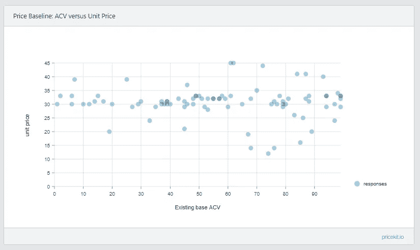
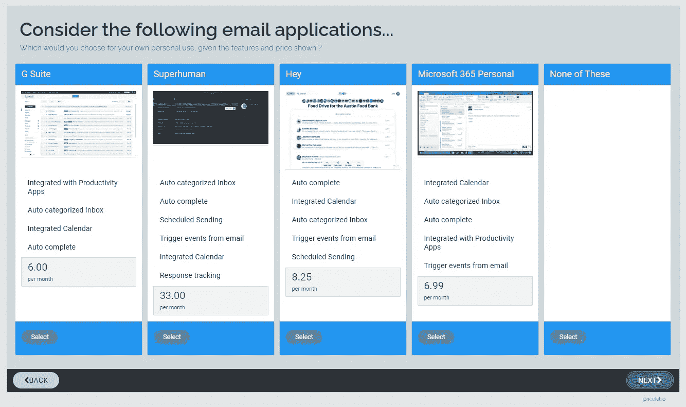
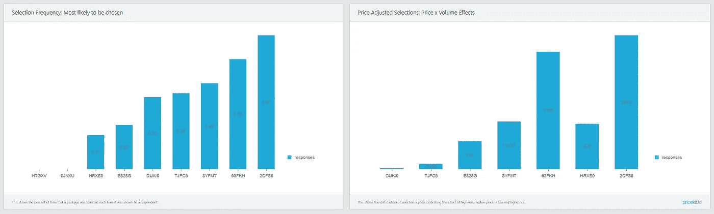

# 定价，包装和产品:如何使用联合和 maxdiff 得到它的权利

> 原文：<https://towardsdatascience.com/pricing-packaging-and-product-how-to-use-conjoint-and-maxdiff-to-get-it-right-8340b93e341c?source=collection_archive---------33----------------------->

摄影:rinke dohmen 资料来源:联合国人类住区规划署

我打赌你们公司的定价都是错的。

好吧，也许不是*错了*，让我们只说*明显是次优*。我不认识你或你的公司，但我知道在这方面我胜算很大——我也知道很少有产品经理或公司高管相信他们的定价是*正确的*。

你的产品和营销策略中最重要的一个方面(也许是最重要的)很少被关注，很可能是自动运行的。事实上，我最近对产品经理进行了一项调查，平均而言，他们最近一次对材料定价进行审查/更改是在 26 个月前。我明白为什么会这样——定价和包装决策是困难的、有风险的，而且是跨职能的。但这并不意味着什么都不做是明智的做法。

很多公司都做对了。一些行业有效地强迫它(想想消费品/零售)。但这是一个 B2B、技术和服务型公司特别努力的领域。好消息是，通过一些工作，它可以被修复，您可以立即对您公司的运营经济产生重大影响。

# 框架

我组织定价/包装分析的方式分为四个相关主题:

1.*打包*:在这种情况下，这意味着将各种功能或属性组合成不同的产品(SKU)。

2.*价格模型和价格指标*:这是您组织 SKU 和向客户收取产品费用的方式。例如，您可能有一组好-更好-最好的分层产品(模型)，您对其收取一次性安装费，并按用户每月订阅费(指标)。

3.*价格点*:这些是您收取的实际价格(例如 3.99 美元)，不同的 SKU 会有所不同。价格点可以基于期限承诺和数量以及细分市场和地理位置。在大多数地方，价目表实际上是一个价格矩阵。

4.*商业条款*:在 B2B 环境中，你将有一个协议来管理双方之间的业务关系。这是升级、降级、取消、产品寿命终止和未来价格上涨的定义。

在分析和改变这四个定价/包装领域时，需要一点艺术和科学。科学方面是关于使用正确的方法获得做出明智决策所需的数据。艺术维度是你如何将这些洞察力应用到市场中。例如，您可能故意优化包装/定价，因为从营销信息或定位的角度来看,“正确”的答案不起作用。

接下来的部分主要集中在寻找合适的定价和包装的科学方面。

# 该方法

***步骤 1-创建基线***

假设你有一个现有的企业，首先你应该把你的客户的交易规模和他们支付的平均单价放在一起*绘图。在 x 轴上，您按照 ACV 从最小到最大对客户订单进行排序，在 y 轴上是支付的单价。如果您没有单一的可变价格指标(例如，每用户),而是只有一个固定费用类型模型或使用各种不同的指标，那么您应该使用适用于您产品的最接近的使用指标。这使你的顾客群支付的实际价格标准化了。*

来源:pricekit.io

这告诉你什么？首先，这给了你一个要超越的底线。其次，如果您看到大量分散的数据点，这表明不一致的销售折扣做法(如果得到解决，这本身可能是一个快速的胜利)。

另一个值得获取的数据点来自你失去的交易(你应该密切跟踪)。如果你有细节，把它们画在上面的同一张图上。毫无疑问，由于价格和其他因素而被归类为失败的交易将被夸大。如果你看到这些拟议中的交易与成功的交易没有什么不同，这强烈表明价格以外的因素也在起作用。

第二项活动是*审查你现有的商业条款*。如果您对某些客户有最惠价格、价格上涨的数量和频率限制或其他此类承诺，您需要将它们记录下来并跟踪到受影响的客户。当您计划推出任何新模型时，您将需要它。

此外，这项工作的一部分应该是让你评估*将现有客户群*货币化的机会。

你的账户级别变动是多少？这衡量的是不续订和完全离开你的客户。如果价格很低，并且存在退出障碍(比如，向新供应商迁移的成本很高)，那么你就拥有定价权。你的商业条款会告诉你，你可以在这些现有客户身上提高价格的程度和过程。其次，看看 NRR(我在这里谈论这个话题)，如果它*不是*强大(比如说< 110%)，这表明你应该寻找包装机会，以推动更强的向上销售和交叉销售运动进入现有基础。

最后，*记录竞争对手的报价。*这既包括直接竞争对手，也包括客户可能采用的替代产品，而不是购买您的产品。获得全面的报价菜单、标价和有效折扣需要努力，但这是值得的。询问客户、失去的交易、行业专家、渠道合作伙伴的见解。详细的机密数据不是目标，但了解他们的主要产品、他们使用的指标和粗略的价格点才是。

***第二步—编译离散选择选项***

找到合适的定价和包装的最佳方法是 AB 测试你的方式。没有什么比实际购买数据更真实、更确凿的了。但是除非你有很大的耐心，很大的预算，并且只通过数字和直接的方式销售——那么你需要找到另一种方式。

另一种方法是获取数据，以便对客户购买行为进行建模。做到这一点的方法是**离散选择分析**。

离散选择分析是一种统计建模，涉及在给定一组选项的情况下，个人选择特定选项的概率。它还与逻辑回归相关，逻辑回归是预测二元(例如是/否)结果的常用方法。

您可能在过去见过或使用过联合分析或最大差异分析——这两种分析都可以被视为离散选择模型的形式，至少它们通常是如何应用于产品定价/包装问题的。

离散选择的本质是给顾客提供一套现实的备选方案，然后看他们选择什么。轻松点。

来源:pricekit.io

嗯，概念上很容易，但要做好它需要相当多的工作。特别是，您需要解决两个挑战:

许多可能的选项。假设你销售的产品有 5 个特点或功能。在这 5 个包中，你可以创建 31 个不同的包。(如果你对这个怎么算感兴趣，查一下组合公式。它是:组合 5 选 5，加 5 选 4，以此类推)的和。

让我们进一步说，你想测试不同的价格点，一个高，一个基线和一个低端，以确定其对所选套餐的影响。您可能想知道每用户销售额、每笔交易销售额或其他指标之间是否存在差异。您需要将它们与市场上已有的竞争对手和替代产品进行比较。你可以看到这些选项是如何叠加的。

没有办法在一次调查中显示所有的问题。下一节将讨论如何缩小这些选项的范围。

第二个问题是*恰当地传达以可消费的方式构成备选方案的特性*。商品可以通过简单的描述(屏幕尺寸 48 英寸、50 英寸、55 英寸)来理解。然而，大多数产品需要更多的细节和背景——尤其是那些具有新/新奇功能的产品。有时候详细描述一下就够了。有时候你需要一个截屏，或者视频或者 gif。有时，在你询问受访者之前，你需要用中间内容来解释概念(即一元方法)。如果你不能给顾客提供一个现实的和可理解的选择，你就不会得到好的数据。

为了做好这项工作，你需要努力确保你的措辞是正确的，你的功能命名是清晰的，并且你有很好的资产来实现你的概念。这不是那种你可以忽略深思熟虑的内容和谨慎措辞的项目。

***第三步:缩小选项并形成假设***

实际上，你需要将所有可能的特性缩小到一个更小、更集中的列表中，只列出重要的和不同的特性。大多数产品特性，即使它们是*必需的*，也属于我称之为“预期填充物”的范畴。查看您的产品使用情况，询问销售工程师他们总是演示什么，与行业分析师交谈，询问一些客户为什么选择您而不是竞争对手——这些功能往往会真正影响选择。

您还应该尽早建立您的基准定价模型和指标。这样做的原因是，如果可以的话，减少一整类变量在你的选择练习中进行测试。如果有一个分类标准，可能很难偏离它，除非你是一个提供独特产品的新进入者。此外，您的价格指标需要与您的业务模式、销售方式以及企业的运营经济直接保持一致。例如，如果你有直销团队或高 CAC，免费增值或基于使用量的现收现付模式就不适合你，除非你准备采用批发业务模式和 GTM 改革，以适应新的目标市场和定价/包装。这对大多数公司来说都太难了。

一个好的经验法则是，尽可能直接根据产品的使用方式和客户从中获得的价值来确定价格。(但从客户的角度来看，它需要简单、事先可知并且可预测)。而且，理想情况下，它也是线性可扩展的——因此更大的客户、更大的使用量和更大的价值相应地支付更多。

如果您没有足够的背景数据来缩小功能并自己建立度量假设，并且没有保留，一个好的方法是对功能和价格模型运行 maxdiff 分析。

Maxdiff 是一种直接获得排序偏好的方法。您向回答者展示一个选项列表，并要求给出最佳/最差的评分，通常会对选项子集重复这一过程，以生成足够的回答来计算整个集合的排序偏好。这种方法避免了让人们在一个尺度上单独评价项目时“一切都是高优先级”的问题。因此，maxdiff 是区分重要事物和不重要事物的特别有用的方法。像这样做一个快速的预先调查会增加你的整体定价/包装工作的时间和成本，但是洞察力和信心可能会抵消它。

你的准备工作的结果应该是一组，比如说 5 个不同的包装选项，每个选项由 3-6 个你的关键功能的组合组成，围绕一个价格指标构建。该填充符可以被卷成一个“基本能力”描述，描述所有产品做什么或者从分析中一起删除。假设有另外 3 个竞争对手的报价要测试，并且您想在 3 个不同的价位测试每一个，这就给了您 25 个要担心的包(24 + a“不要选择这些”)。这个数字是可以控制的。

***第四步:构建并运行分析***

要进行基于选择的联合或最大差异调查，您需要一个能够胜任这项任务的调查工具。如果你有一个复杂的产品，你需要一些能给你提供格式和媒体选项的东西来以一种真实的方式展示项目。您还需要一个工具，能够在您的调查受访者中智能地分配选择范围，并且能够显示相同套餐的不同价位。有一些专门从事离散选择类型调查的工具，也允许产品经理、数据科学家、金融分析师和营销人员直接做这项工作。如果你了解你的业务，并想了解和解释结果，这是适合你的路线。如果没有，你当然可以外包给咨询或市场研究公司，他们有自己的工具，可以为你做这项工作。

这个分析的核心应该是基于选择的联合**。这是一种离散选择练习，您向调查受访者提供一组选项，通常每次 4 或 5 个，并让他们选择最有可能购买的一个。这个练习重复几次，显示不同价位的不同选项。**

一旦掌握了调查数据，建模和分析就有 4 个关键领域:

*Preferences and share* :最重要的数据是包选择频率(选择的时间百分比)。这将告诉你哪些包装在市场上有最强和最弱的需求——假设你的调查对象是市场的代表。所有软件包(您的和竞争对手的)的选择频率分布提供了一种市场份额视图，如果所有软件包都在市场上，将会发生什么。由于你测试的可能是你自己的替代品，而不是最终提供给客户的，所以这不是一个精确的衡量标准(但是像商业中的大多数事情一样，指示性/方向性数据通常就足够了)。

来源:pricekit.io

*价格敏感度*。数据还应该告诉你一个包的价格变化如何影响该包的选择频率。我通常使用 3 个价格点——基线和基线的+/- 50%。这造成了足够大的差异，因此它将显示在偏好数据中，但仍然是市场现实的价格。

由此，您可以计算每个包的平均选择价格，并由此计算价格调整频率(即频率 x 平均选择价格)。将各种套餐的原始频率视为客户市场份额的衡量标准，将价格调整后的频率视为收入市场份额的衡量标准。

此外，我还关注我所谓的价格敏感度指数。我的计算方法是，查看展示给回答者的每组选项，然后用所选价格点除以所展示的套餐的平均价格点。当在每个集合中绘制这些价格敏感度指标时:如果它们聚集在 1 附近，这就是如果价格完全不影响决策时你所期望的。大于 1 的选项群是那些选择更贵的套餐的人，小于 1 意味着他们倾向于选择更便宜的选项。这将告诉你顾客在多大程度上被便宜的选择所吸引(或者不是)。请注意，这是假设所有的包都在相同的大致价格范围内。如果有一家公司的价格是其他公司的 10 倍，结果就会有偏差。

*效用(又名部分价值)*:一些联合调查软件包首先被设计用来计算特征效用。这种分析量化了每个单独特性对整个产品包的价值水平。例如，这种分析可以告诉您，“单点登录功能”的感知价值比“双因素身份认证功能”高 30%。

我发现效用值更有助于解释*为什么*一些包比其他的好，而不是首先作为构建包的指南。在解释为什么客户可能会从入门级产品选择或升级到高级/更贵的产品时，尤其如此。但是——小心调查软件，它迫使你仅仅为了获得统计上有效和全面的功能效用而构建简单化或人为限制的选择。依我看，这不是这项工作的主要目的。

*细分*:查看每个回答者选择的最优方案，你可以将他们分成相似的行为细分(例如，使用 *K-means* )。找到不同但相当大的群体，他们喜欢不同的套餐和不同的价位，这是你整个 SKU 系列的基础。

您不是在寻找一个合适的套餐和价格，而是寻找一个小的套餐和价位集合—每个都针对有价值的细分市场进行了优化。

您的调查中的人口统计问题应设计为允许您估计集群的真实市场规模，并使您能够将这些偏好反馈到现有客户群中(例如，用于追加销售和续订评分)。在调查中添加态度和认知问题，可用于告知围绕每个集群及其独特包装的营销信息。

到目前为止所做的分析旨在获得试图模拟现实世界行为的数据。你应该了解(a)什么功能重要，什么型号更受欢迎,( b)什么套餐需求最大,( c)这些套餐的价格敏感度如何,( d)你的套餐相对于竞争对手的表现如何,( e)这些项目在不同客户群中有何不同。

但是没有算法可以返回唯一确定的最佳答案。这就是你的判断和实际情况发挥作用的地方。最重要的指导应该是:你的报价需要适销对路。

这可能意味着您将特性聚合到更高的类别中，并将它们作为一个组附加到一个或另一个包中。我会避免你说这样的话:“这个 SKU 有很好的(安全、分析、报告、集成等)，但另一个 SKU 有更好的(这些)”。如果你在你的价值主张中引入了很多细微差别，你已经给你的营销和销售团队造成了很大的伤害。一般来说，我认为最好保持价值主张的强势，即使牺牲一些(潜在的)功能驱动的追加销售活动。

一旦模型和定价到位，实现工作就开始了。根据变化的程度，这可能是一个简单的更新，也可能是一个公司范围内的重大举措。

你将不得不修改你的价目表，你的账单应用程序，并把这个模型应用到你的标准商业条款中。通常，由于过去的条款协议，您可能必须在维护旧 SKU 的同时维护旧 SKU，直到客户可以迁移。对于你在第一步中发现的条款与新模式或价格点有冲突的客户，你必须制定一个沟通和行动计划。

如果有大的结构变化，你需要更新营销材料、支持内容、销售宣传材料、演示、价目表、培训合作伙伴等等。这最好与主要新功能或新产品功能的引入或新的消息传递/定位/营销活动一起进行，以便所有这些变化可以同时进行，并相互加强。

从开始到结束，这项工作可能需要几个星期到几个月。一旦你有了数据，你就知道了方法，为新产品发布或年度战略计划节奏更新数据的工作就少多了。这是在你的公司内部建立一种能力，而不仅仅是做一个一次性的项目。你投入在正确定价和包装上的精力可能比你能做的几乎任何事情都有更大的回报。