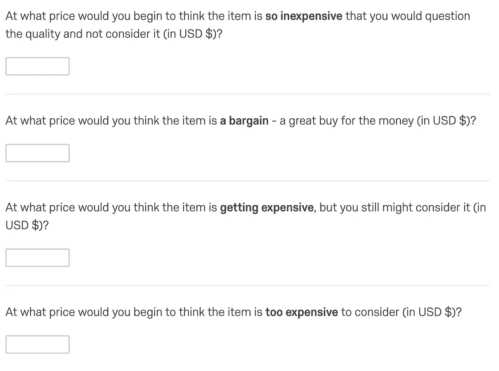
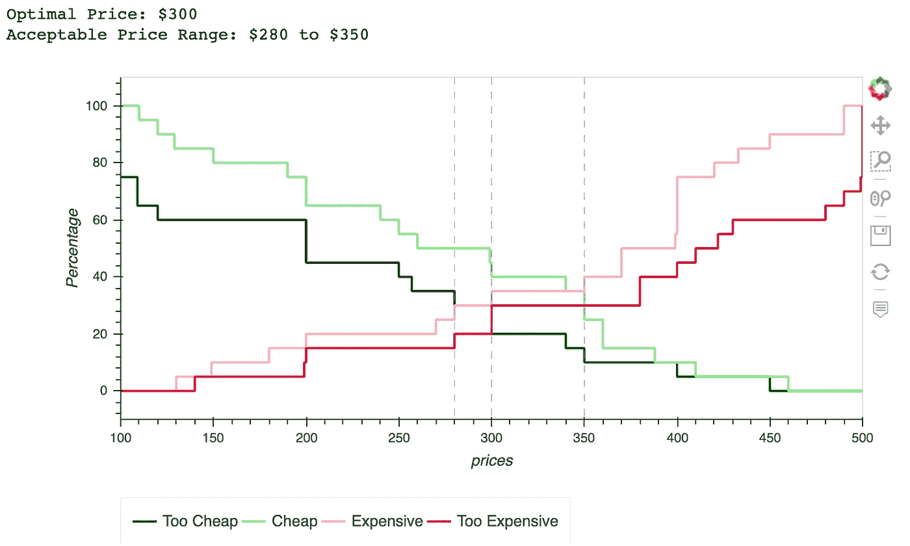

# 定价研究——Van westen dorp 的 Python 价格敏感度表

> 原文：<https://towardsdatascience.com/pricing-research-van-westendorps-price-sensitivity-meter-in-python-ec07fabbeacd?source=collection_archive---------19----------------------->

## Python 中的测量设计和分析

# 调查

范·韦斯滕多尔普的价格敏感度测量仪是用来调查顾客价格偏好的。价格敏感度量表调查包括四个问题，要求每个调查参与者提供产品的四个价格点，当产品是:

*   太便宜(即太便宜)
*   便宜(即便宜货)
*   昂贵的
*   太贵了

这四个问题的示例如下所示:

资料来源:Qualtrics

# 数据

假设有 20 名参与者填写了调查问卷。让我们首先导入所需的库，并从这 20 个参与者那里读入数据。

数据框的前五行如下所示:

# **分析**

这里我写了一个函数，计算四个问题(太便宜，便宜，贵，太贵)的累计百分比，绘制四条线，并报告最优价格和可接受的价格范围。

这是我们运行`price_sensitivity_meter(df)`时的输出。x 轴显示价格点，y 轴显示价格累计频率的百分比。如果你想让剧情更流畅，可以设置`interpolate=True`。在我们的函数中，`interpolate`的默认值是 False。

主要结果是:

*   **最优价格点(OPP)**

“太便宜”和“太贵”的交集。在我们的例子中，最优价格是 300 美元。

*   **可接受的价格范围**

下界(又名。边际便宜点或 PMC)是“太便宜”和“太贵”的交集。上限(又名。边际成本点或 PME。)是“便宜”和“太贵”的交集。在我们的例子中，可接受的价格范围是 280 美元到 350 美元。

# **用质量验证结果**

为了确保我们的结果是正确的，我用 Qualtrics 验证了我的结果。使用相同的数据，Qualtrics 生成以下报告:

资料来源:Qualtrics

最优价格与我们的结果相同。两者都显示 300 美元是最佳价格。可接受的价格范围不同，但非常接近。我们得到了 280 到 350 美元，而 Qualtrics 报告了 280.1 到 350.0 美元。(我不确定为什么 Qualtrics 在剧情中每一步都有一个斜率。台阶之间的垂直线不直。我怀疑数据量大了，竖线会变直。)

现在，您可以用 Python 设计自己的价格敏感度测量仪调查并分析结果。尽情享受吧！

# 参考

 [## Van Westendorp 价格敏感度量表研究| Qualtrics

### 许可证包含的产品体验 Van Westendorp 定价模型 Van Westendorp 方法使用一系列…

www.qualtrics.com](https://www.qualtrics.com/marketplace/vanwesterndorp-pricing-sensitivity-study/)