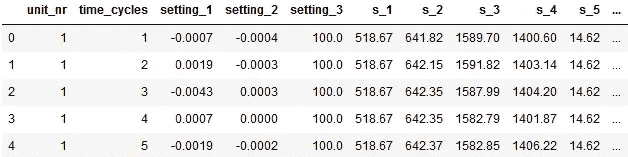

# 在 Jupyter 笔记本中开发可再生神经网络的初级读本

> 原文：<https://towardsdatascience.com/primer-on-developing-reproducible-neural-networks-in-jupyter-notebook-2f88d23b7c8d?source=collection_archive---------30----------------------->


照片由[耶鲁安穴獭](https://unsplash.com/@jeroendenotter?utm_source=medium&utm_medium=referral)在 [Unsplash](https://unsplash.com?utm_source=medium&utm_medium=referral)

## [探索美国宇航局的涡轮风扇数据集](https://towardsdatascience.com/tagged/exploring-nasa-turbofan)

## 这不仅仅是为迭代开发播下种子

在准备我的[下一篇](/lagged-mlp-for-predictive-maintenance-of-turbofan-engines-c79f02a15329?sk=84c2225e20760c04e9f27234c3803175)文章时，在训练神经网络(NN)之前，我在一个 Jupyter 笔记本上尝试了不同的预处理设置。在尝试了一些设置后，我决定恢复到以前的设置，因为它的性能更好。然而，在执行细胞时，神经网络的结果并不相同，即使我已经设置了种子…

因此，在 Jupyter Notebook 中开发 NNs 时，我开始寻求可重复的结果。*专门针对您在处理单元和训练单元之间来回切换的场景*。

# 可重复和可比较的结果引物

开发神经网络模型时，比较模型性能并验证改进模型的尝试的有效性非常重要。编译 NN 为网络中的每个连接生成/初始化随机权重。这些权重在训练期间更新。然而，随机初始化的影响大到足以影响模型性能到小数点后第十位，妨碍了模型的比较。因此，我们需要“控制”这种随机初始化，以便在迭代、预处理或特征工程之间来回切换时，结果仍然具有可比性。

为了实现这一点，我发现我需要在两个层面上控制这种随机性:

1.  **会话间再现性**(始终适用)—您需要设置各种随机样本生成器的种子，以确保您在笔记本中训练的神经网络在每次启动笔记本时返回相同的结果(无论是在不同的一天还是在重新启动内核后)。甚至必须在导入其他包之前【1，2】设置原生 Python 种子。这将确保每次执行代码时生成的权重是相同的，例如，第一组随机生成的值将总是相同的，第二组随机生成的值将总是相同的，等等。
2.  **在会话比较中**(特别适用于笔记本电脑)—在编译 NN(首次抽取随机权重)后，您可能想要尝试不同的预处理方法。你*必须*在神经网络编译后保存权重，并在(重新)训练前重新加载这些权重。否则，重新编译你的神经网络会根据你设置的种子生成新的权重(随机权重的第二次抽取)。将其与没有替换的操纵概率进行比较[3]。你的第一次抽签将总是产生相同的结果，你的第二次抽签也将总是产生相同的结果，但它不等于第一次抽签。因此，您必须保存并恢复首次初始化的权重。此外，您还必须重置优化器，以避免从它的最后状态继续学习。

这两个步骤对于获得可比较和可重现的结果至关重要。

最后一点:当设置你的随机种子时，它可能会产生可怕的初始权重。因此，建议尝试一些随机的种子，以确保你不会吃亏。

让我们看看这是什么样子的

# 示例实现

对于这个示例实现，我将使用 NASAs CMAPSS 关于涡扇发动机退化的数据集。目标是预测剩余使用寿命。

首先，导入库，并为 python 环境、其内置随机库 numpy 和 tensorflow 设置随机种子。

接下来，您读入数据。



train.head()的结果

我就走个捷径，跳过解释几个数据准备步骤。你可以通过底部的链接查看完整的代码。让我们定义一个简单的 MLP。

定义模型后，我们编译它。通过编译模型，权重根据我们在开始时设置的种子进行初始化。这是我们第一次在时段再现性之间随机抽取重量和支持*。此外，初始化的权重被保存以供以后(重新)使用。保存权重是在*会话比较中支持*的重要步骤。*

对于下面的代码块，最重要的一行是第 1 行。Alpha 值决定了平滑滤波器的强度。

因为我是在笔记本上工作，所以在数据准备单元格和模型拟合单元格之间来来回回。出于这个原因，我在拟合之前重新编译模型以重置优化器，否则它会继续从它的最后状态学习。但是，重新编译模型会生成一组新的权重(随机权重的第二次抽取)。因此，我重新加载初始权重，以获得可比较和可重复的结果。

我现在可以试验不同的过滤强度来了解它的效果。一旦超过了α的值，我就可以回到之前的值，确保得到相同的结果。

```
alpha = 1.0, train_rmse = 18.00
alpha = 0.4, train_rmse = 17.43
alpha = 0.2, train_rmse = 17.82
alpha = 0.4, train_rmse = 17.43!
```

不幸的是，平滑 FD001 的数据会使*测试集*上的预测变得更糟，但这与这个玩具示例无关。要点是:通过实现这两个步骤，您可以在会话内和会话间获得可重复的结果。您可以在预处理和训练单元格之间来回切换，尝试不同的设置。当您想要使用以前的设置时，您可以确信结果是相同的。此外，当您第二天返回(或重启内核)时，您可以确信结果仍然是一样的。

希望这能让你的生活更轻松！完整的代码，请查看我的 github 页面[这里](https://github.com/kpeters/exploring-nasas-turbofan-dataset)。我要感谢迈克尔·格罗贝和杰弗里·卢普斯对我的文章的评论。

对于关注我的系列“[探索 NASA 的涡扇数据集](https://towardsdatascience.com/tagged/exploring-nasa-turbofan)”的读者来说，这里开发的初始 NN(没有平滑或特征选择)已经在 FD001 数据集上具有 18.50 的测试 RMSE。比基线模型提高了 42%，比之前最好的模型有了很大的提高，后者是一个 RMSE 为 20.54 的支持向量回归模型(在基线上总体提高了 35.7%)。在我的[下一篇文章](/lagged-mlp-for-predictive-maintenance-of-turbofan-engines-c79f02a15329?sk=84c2225e20760c04e9f27234c3803175)中，我们将深入研究 FD002，其中涡扇发动机在不同的运行条件下运行，指数平滑确实具有有益的效果。

参考资料:
【1】[https://keras . io/getting _ started/FAQ/# how-can-I-obtain-reproducible-results-using-keras-during-development](https://keras.io/getting_started/faq/#how-can-i-obtain-reproducible-results-using-keras-during-development)
【2】[https://stack overflow . com/questions/32419510/how-to-get-reproducible-results-in-keras/59076062 # 59076062](https://stackoverflow.com/questions/32419510/how-to-get-reproducible-results-in-keras/59076062#59076062)
【3