# 主成分分析

> 原文：<https://towardsdatascience.com/principal-component-analysis-3c39fbf5cb9d?source=collection_archive---------23----------------------->

## (2021 年 9 月更新)无监督学习中最重要的算法之一背后的逐步直觉、数学原理和 python 代码片段

这个动画展示了当旋转方向到达两个特殊方向时，投影点(A…E)的协方差矩阵如何对角化(是下面的特征分解方程的解)。为了验证这一点，当方向与橙色虚线(第一主成分)或第二粉红色虚线(第二主成分)重叠时，请减慢视频速度或尝试暂停视频。您还会注意到矩阵的对角线元素达到了它们的最大值(最大方差)。(视频由作者使用 Geogebra6 sw 制作)

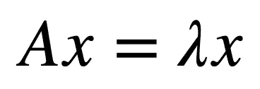

这个公式叫做特征分解方程。最初的工作始于 1800 年底，但由于(个人)计算能力的进步，直到最近才在大数据分析中得到实际应用。

大家好，我是意大利米兰的 Andrea Grianti。在阅读了许多关于这个主题的书籍和论文后，我写了这篇文章来分享我的想法。这不是一本教科书，而是进一步理解该主题的起点。因为后面的数学/代数很难，我把它分成了四部分:

1.  PCA 直觉
2.  数学/代数(简单)
3.  数学/代数(难)
4.  Python 片段

# **1。PCA 直觉**

如果您有一个包含数千/数百万个观察值(行)和数百个不同变量(列)的大型数据集，首要目标之一是验证是否有可能简化和缩减数据集，以便于对原始数据的一个小得多的子集进行分析。

直接消除变量是显而易见的方法，但它显然会影响数据集的*信息*内容。过多或错误的剔除会使你的数据集变得无用，过少的剔除会使数据集变得庞大和难以分析。

术语'*信息*'是一个非常通用的主题，很难定义它。这取决于数据集。对我来说，一个数据集可能包含*信息*,而对其他人来说，可能什么也不包含，反之亦然。

我们可以尝试使用“信息内容”这样的概念来定义数据集中的*信息量*，这是一个与特定值发生的概率相关的概念，在数据集变量的所有可能值中。

根据这一概念，变量 *x* 的可能结果越多，预测其值的概率越低，因此信息含量越高。

这是我们**要牢记的第一个假设**:***更高的方差= >更高的信息含量*。只有上下文和我们的数据能告诉我们这个假设是否成立。**

在关注高方差数据概念之前我们必须处理一个**第二个假设:** ***变量之间的相关性是数据冗余的一种形式*** 。如果两个变量之间有明确定义的关系，例如以度为单位的角度和以弧度为单位的角度，或者以厘格或法拉为单位的温度，那么这两个变量中的一个是无用的，可以直接从数据集中消除。相反，当相关性不太明确时，不推荐直接排除，可以通过第三个假设尝试管理相关性证据的缺乏。

**第三个假设**是: ***我们假设无论变量之间的相关性是什么，这都是线性的*** 。

概括一下，我们假设:

*   方差与信息内容有关，应该最大化
*   冗余变量和变量之间的高度相关性是一种应该最小化的噪声形式
*   变量之间的相关性是线性的

这两个假设为什么重要？因为要降低数据集的维度，我们应该评估每个变量对数据集总体方差(=信息)的贡献，以便选择贡献最大的变量，丢弃贡献最小的变量。

这种运算的战场是协方差矩阵或它的兄弟相关矩阵。因为相关矩阵通过绑定两个变量之间的简单协方差和相关性的相同关系严格绑定到协方差矩阵，所以我将使用协方差矩阵，因为选择与后面的数学原理的理解无关。

在任何情况下，对于那些喜欢简单刷新协方差和相关性概念以便理解这里的关系的人来说，它是:

我们知道，对于两个变量，协方差公式为(如果我们的数据集是从总体中抽取的数据样本):

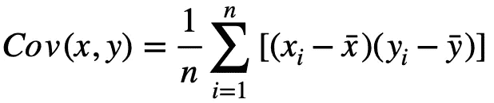

不集中在平均样本数据的协方差(来源:作者)

协方差代表一种离差度量，它包括两个变量之间的线性“**同步性**的概念，这两个变量与它们各自的均值相关。

也就是说，对于每个点，测量一个点的 x 坐标>与所有 x 点的平均值>、**之间的差值**如何与**同步的**、**、<与同一点的 y 坐标>和<之间的差值**，然后对所有 y 点的平均值>求平均值。****

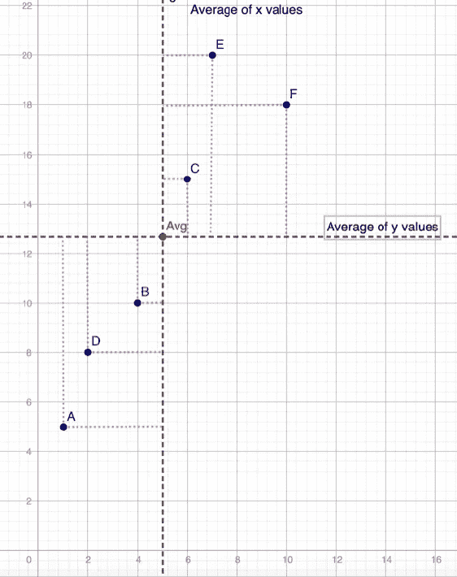

画在笛卡尔坐标系上的点。注意红色的平均点。还要注意，当重新定义轴时，将(0，0)点设置在平均值上，离散度不受影响。这实际上简化了理解协方差和相关性之间关系的推理。(来源:作者)

有趣的是，在上面的示例图片中，平均值的左右两边有相同数量的点(对于维度 x)，平均值的上下两边也有相同数量的点(对于维度 y)。

这个简单的例子让你明白了**协方差对于** **符号**的重要性。当结果给你一个正号或负号时，它给你一个关于**象限**的概念，其中**同步**的**方向**在哪里。还要注意，具有相同的符号并不能告诉你任何关于方向的**斜率**的信息，只能告诉你方向所在的象限。

如果点不是从左下到右上，而是从左上到右下(沿平均值的水平线反映)，协方差将是相同的值，但前面有一个负号。

## 协方差如何绑定到相关性

如果你暂时不考虑上述协方差公式中的常数，等式的其余部分就是**乘积**与**差值**的**和**，这应该让你想起(至少对于**乘积**的和)代数中的**点积**概念。

为了使它看起来像两个向量之间的点积，我们可以**将数据点居中**(从每个变量值中减去该变量的平均值)，并且我们两个的平均值都= 0，而**方差保持不变**(因为移动所有点不会改变点之间的距离，并且离差保持不变)。

在这种情况下，中心数据的协方差公式简化为:

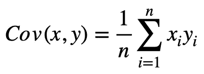

以平均数据为中心的的**协方差公式(来源:作者)**

其中包含点积的定义我们知道是:

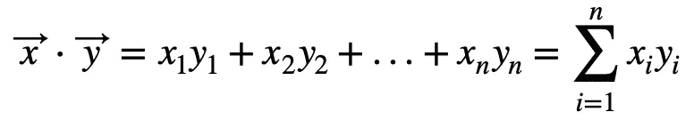

点积(来源:作者)

但是我们从几何学中知道，点积也可以写成:

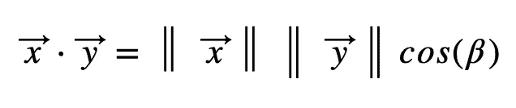

点积:几何版(来源:作者)

考虑到当数据居中时，方差公式也简化为:

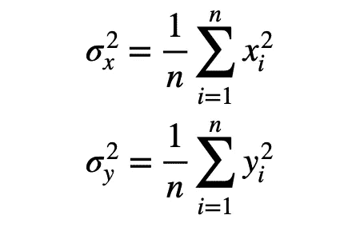

居中变量 X 和 y 的方差公式。

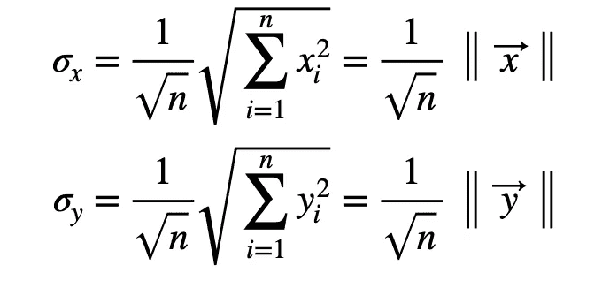

中心数据相对于向量 X 和 Y 长度的标准偏差

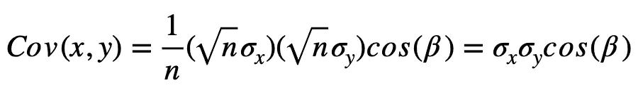

对于中心数据，协方差公式用标准差和向量 X 和 Y 之间的夹角余弦表示，即相关系数。(来源:作者)

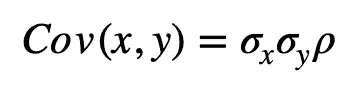

两个中心变量情况下协方差和相关性(rho)之间的关系。当变量为 n 时，相同概念可以根据矩阵进行转置(来源:作者)

两个中心变量的简单协方差和相关性之间的关系:σ是它们的标准偏差，ρ是相关系数。在相关性为零的极端情况下，协方差为零。另一方面，当相关性最大时，ρ= 1 或ρ=-1，协方差是每个变量的标准偏差的乘积。

# 从协方差到协方差矩阵

考虑到上面的协方差公式仅适用于 2 个变量，我们可以将协方差矩阵视为数据集中所有变量之间所有协方差的“大图”。

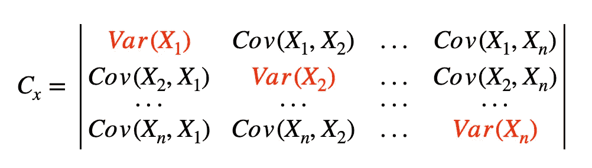

协方差矩阵(在文献中也称为方差/协方差矩阵)(来源:作者)

当我们计算原始数据集(我们称原始数据集 X 为许多列向量 X1，X2…Xn 的集合)的方差/协方差矩阵时，我们会看到沿对角线的方差，但我们也会看到非对角线元素中的联合协方差，这是一个变量与其他变量之间的**‘同步性’**大小的(难以解释)度量。

因为我们当然不能为了消除变量之间的相关性而修改我们的原始数据 X(除非我们完全删除一个变量，这总是可能的，但有风险，因为我们可能不情愿地删除重要信息)， 我们可以尝试找到一种方法，将 X“转换”成不同的数据集 Y，该数据集 Y 具有与 X 相关联的 **special** (德语中 special =**eigen**……)但是以这样的方式构建，Y(Y1，Y2…Yn)的新变量将具有不同的协方差矩阵 Cy，其中这些变量的方差将与其他变量的区间(相关性)隔离开来(= >协方差= 0)。

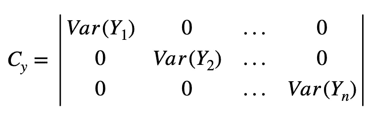

这是我们想降落的地方。具有对角化的新协方差矩阵 Cy。意味着我们要解决一个问题，找到一个新的数据集 Y，绑定到原始数据集 X(我们将看到绑定是如何工作的)，其中 Y 的所有新变量在它们之间是不相关的。这样，Cy 矩阵中的协方差将为零，方差被隔离在对角线中。这将清楚地允许我们将数据集的总方差定义为对角线元素的总和(Trace)(来源:作者)。

这个操作就是**特征分解方程**的魔力。通过求解该方程，我们将找到一种方法来转换原始 X 数据集，从而将协方差矩阵 Cx 转换为新的数据集 Y，并使用一种称为 B 的特殊转换矩阵将**对角化**协方差矩阵 Cy 转换为新的数据集 Y。B 将是我们用来从 X 到 Y 来回转换的方式，反之亦然。

假设我们能够解出那个**特征分解方程** …那又怎样？如果使用原始数据 X，我不得不使用 Cx 来解决无法根据相关性隔离单个变量对总体方差的贡献的问题，现在，通过求解该方程，我可以使用一个新的 Y 数据集，其协方差矩阵为 Cy，并且是对角的，因此 Y 的每个变量的方差贡献都有明确的定义，并且不受联合交互/相关性的影响。这样，我们就可以根据它们的方差值来决定在哪里切割 Y 数据集，以根据它们相对于 Cy 中的方差值总和的贡献权重来保留最重要的 Y 变量的子集。

当我们用 Y 而不是 X 工作时，要付出什么样的代价？因为新的 Y 数据集的变量(我们将会看到)是原始 X 数据的线性组合，它们的含义是不确定的。因此，要给 y 变量赋予上下文意义，就需要一定的敏锐度，让它们从实用的角度“说话”。当然，事情有点复杂，关于如何命名新发现的变量，我们在这里跳过了许多细节，但要框定问题和解决方案，就这样。

在任何情况下，要从 X 到 Y(以及从 Cx 到 Cy)，我们需要理解我们可以对原始数据进行的转换的逻辑(通过一个仍待定义的 B 矩阵)。所以我们需要讨论(研究)一下**投影**和**线性变换**，因为它们是严格联系的。

# **2。PCA 后面的数学/代数(更容易)**

**投影**概念:简而言之，我们在图表中绘制的内容取决于我们用来表示数据的坐标系统。艺术中的*透视*思考:它是现实生活中的*投影*按照特定的规则变换。

例如，在三维中，我们使用笛卡尔系统，其由正交向量(长度=1 的正交/垂直向量)的矩阵(E)表示。

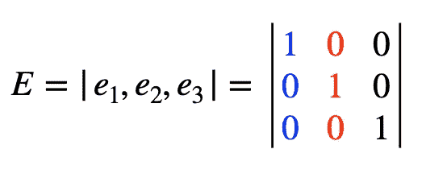

卡茨安基地(来源:作者)

例如，当我们有一个数据集 X(测量值是三维的:列向量 x1、x2、x3)时，为了计算变量 x1 的方差，我们应用通常的方差公式。**但是**我们实际做的是通过**点积**将 X 的每个数据点的坐标投影到 E 的 3 个方向上。

因此，一般来说，我们有**X \u E = X。**这个投影操作在笛卡尔坐标系中是“透明的”,我们甚至没有意识到要进行投影，因为它在我们的头脑中是“自动的”。

但是，如果我们决定离开笛卡尔系统，我们可以建立一组类似的**正交** **向量**，它们定义了由 b1、b2、b3(而不是由 e1、e2、e3 组成的 E)组成的新基 B，如下所示:


(来源:作者)

如果我们**点**乘(例如)数据集 X 的一个通用行向量，该向量包含单个数据点的坐标(如果您喜欢，可以是单个观察值):

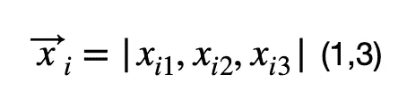

通用数据行，(1，3)表示 1 行 3 列

对于 B (=3 行，3 列)，我们获得新的行向量(=1 行，3 列):

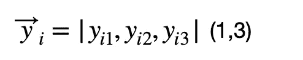

Y 中相应的新行，使用 X 的一般行，用 B 转换

其中该向量的每个元素具有新的“度量”/“坐标”，由下式给出:

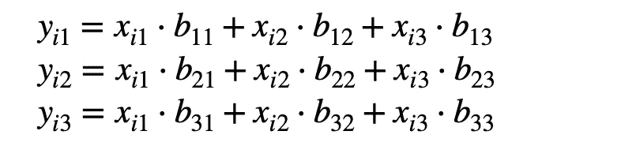

这里的三个方程是上图易方程的展开。因此，在维度上，形状仍然是(1 行，3 列)，但行中的每个元素都是 xi 和 B 的线性组合。

在代数术语中，一般来说，在我们的例子中，我们简单地用以下公式改变基:

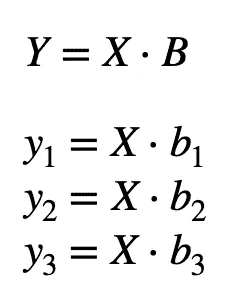

首先是矩阵形式。在我们的例子中，Y 由 3 列向量(y1，y2，y3，m 行)组成，B 由 3 列向量(b1，b2，b3，3 行)组成。所以 Y 是(m，n) = X (m，n)。B (n，n)。当找到 B 的解时，这 3 个方程将代表所谓的“主分量”。

其中 X 是基 E 中的原始数据矩阵(m 行乘 n 列)，B 是新的标准正交基(n 乘 n)，Y (m 乘 n)是在新基 B 中测量值被转置**的结果新数据矩阵。**

注意，y1、y2、y3 是**新变量**，其含义与 x1、x2、x3 无关，但是它们是新的，并且新含义*必须在语义上定义*，因为它们是分别由 B 的 b1、b2、b3 向量的相应分量加权的**所有**X 变量*的线性组合。那就是:*

*   y1 由向量 b1=[b11，b12，b13]加权的 X 的每个变量组成
*   y2 由向量 b2=[b21，b22，b23]加权的 X 的每个变量组成
*   y3 由向量 b3=[b31，b32，b33]加权的 X 的每个变量组成。

所以如果我们找到 B 的解，我们可以用 y 的新变量。但是，我们应该使用什么 B 来达到我们的目标，找到 Y 与 Cy 对角矩阵？

b 可以逐步建立**如果我们知道它存在一个唯一的方向，使沿该方向投影的 X 的方差最大化。我们可以沿着笛卡尔坐标系的 X 轴投影数据集 X，但在这种情况下，方差可能没有最大化。因此，我们需要找到那个特定的方向。一旦我们找到了最大方差的方向和值，我们就知道找到了第一个本征向量和第一个本征值。一般来说，我们可以说已经找到了第一主分量 PC1: y1=X.b1，其强度是特征值 1(λ1)。**

为了根据方差解释了多少来评估 y1，在这个阶段，可以将λ1 除以协方差矩阵 Cx 的对角元素之和，因为总方差之和不会从 Cx 变为 Cy。

然后，利用相同的原理，我们可以找到第二方向**B2(第二*特征向量*)作为最大化 X 沿着单位长度且正交于 b1 的第二方向的所有可能投影之间的方差(第二*特征向量*)的方向。当发现这是第二个主成分时:PC2: y2=X.b2**

然后**第三方向** b3 使 X 沿第三方向的方差最大化，该第三方向再次由单位向量定义，该单位向量也必须与 b2 和 b1 都正交。当发现这是第三个主成分:PC3: y3=X.b3

在这些迭代结束时，我们将建立一个特殊的 B=[b1*，b2*，b3*](特征向量矩阵)，一个新的数据集 Y =[y1=X.b1，y2=X.b2，y3=X.b3]由 3 个“主分量”组成，按方差强度排序，一个特殊的特征值向量λs =(λ1，λ2，λ3)，其中每个λ是每个 y1，y2，y3 的方差。

当然，迭代可以进行到 n 维。最后，根据总方差和(λ1，λ2，λ3)上的每个方差的相应权重，我们有所有元素来减少 Y。希望用 Y 的几个变量，我们可以“解释”总方差的大部分，我们可以减少变量的数量，但不能减少它包含的信息量..

# 3.PCA 后面的数学/代数(难)

以上是解释手动迭代程序以求解特征分解方程的冗长部分。现在我们来看看从开始到本征分解方程的解的整个数学过程。

我们称 X 为原始数据集(m 行 x n 列),其中列中的每个变量已经围绕它们各自的平均值“居中”, Cx 是 X 的协方差矩阵，b1 是 n 个元素的未知向量和未来 B 变换矩阵的第一列，y1 是 X 沿未知向量 b1 的投影:y1=X.b1

*   Y 的第一个新变量的方差我们称之为 y1:

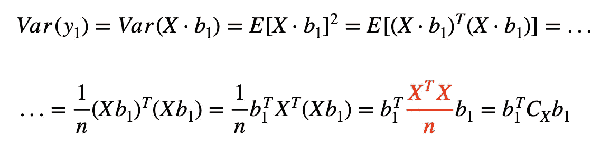

*   为了最大化 Var(y1)并找到相应的第一方向，我们使用带有拉格朗日乘数的拉普拉斯方程。符号是梯度，f 是最大化的函数，在我们的情况下是 y1 的方差 X.b1，g 是我们设置约束的函数，b 向量的长度必须是 1:


图一

*   f 对 B1(n 分量的未知向量)的偏导数为:

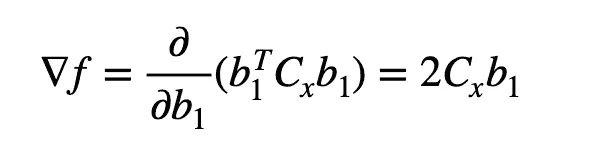

图 2 如果你想知道为什么你可以用一个简单的未知向量 B1(b11，b12)，一个给定的 simmetric Cx like ([4，2][2，1])，以及未知项 B1(b11，b12)。你将有一个二次多项式和两个偏导数(b11 和 b12)组成一个矩阵，它是 Cx 乘以 b1 的 2 倍

*   g 对 b1 的偏导数是:

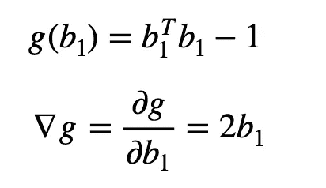

图 3

*   本征分解方程变为:

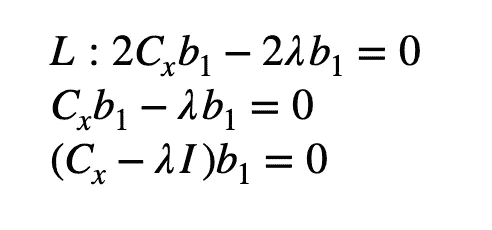

图 4

*   为了找到某个 b1 向量<> 0，我们必须找到括号中的项的行列式，并将其设置为 0。只有在这种情况下，b1 的 n 个未知分量中的 n 个方程组才有非平凡解:

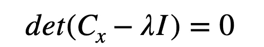

图 5

*   这个含有 n 个未知数的 n 方程系统的解可能会给出(我保持简单，因为可能有例外)n 个不同的λ。这些λ代表 X 的投影点沿待定方向的 n 个不同方差。
*   现在我们应该指定找到的 lambdas(姑且称之为 lambda1)的最大值，并通过求解由下式给出的系统来找到 b1:


图 6

*   在我们找到 b1 之后，我们取λ2，并且我们在上面的等式中再次求解该系统以找到 b2，等等，直到对于所有的λ，我们有了所有的 b 向量。
*   正如你所想象的，计算对于 3 个变量来说是非常长的，这就是为什么我们需要 Python 和数字算法来完成这些脏活。
*   最后我们将(例外情况除外)得到:作为 b1，b2，b3 … bn 列向量序列的特征向量 B 矩阵；特征值向量 L(ambda)表示 Y(作为主分量)的每个 Y 的方差或特征向量的幅度。

# 4.Python 片段:

这里有很多例子和库，但在这里我想用 Python 来展示，只需用 **numpy** 代码片段，你就可以快速尝试你的样本小数据集，并通过查看结果来理解发生了什么。我跳过了 print 语句，因为您可以在控制台上工作并自己检查变量的内容。甚至图表都被省略了，但是你可以用 matplotlib 或者类似的工具做你想做的事情。这里的重点不是构建一个应用程序，而是展示对逻辑的理解。

```
import numpy as np
import pandas as pdpd.options.display.max_columns = 200
pd.options.display.width=200
pd.options.display.max_rows=200def fcenter(X): #function to center data
    data_mean=np.mean(X,axis=0) #calc mean by column 
    X=X-data_mean #centered data
    return Xdef fcov(X): #function to find the covariance matrix
    covx=(X.T.dot(X))/X.shape[0] #calc cov matrix of X
    #alternative to: covx=np.cov(X,rowvar=False,ddof=0)
    return covxdef feigen_decomp(Cx): #this is the core to solve the eigen decomposition equation
    eigval,eigvec=np.linalg.eig(Cx) #solve eigen equation
    return eigval,eigvecX=np.array([[1,1,6],[4,2,9],[2,-2,3],[-3,3,1],[-5,1,7]]) #some data
Xc=fcenter(X) #centered data
#----------------------
#this shows that variance does not change when centering data
vX=np.var(X,axis=0)   #variance of columns of X
vXc=np.var(Xc,axis=0) #variance of columns of Xc
#----------------------
Cx=fcov(Xc)           #Cx=covariance of Xc
L,B=feigen_decomp(Cx) #L=eigenvalues vector, B=eigenvectors matrix
Lw=L/L.sum()          #weight in % of every PC (not cumulative)
Y=Xc.dot(B)           #Y=Principal Components matrix (in columns = y  
                       scores) 
Cy=fcov(Y)            #shows that diagonal of covariance matrix of Y
                       coincides con L
#----------------------
#Loadings analysis
Loadings=np.sqrt(L)*B   #see comments
Loadings_sq=Loadings**2 #see comments
Loadings_sq.sum(axis=0) #see comments
Loadings_sq.sum(axis=1) #see comments
```

关于加载的一个注意事项:当您想要了解结果时，加载是有用的。回想一下，Y 的每个新变量都是所有 X 变量的线性组合。负载矩阵垂直表示每个 PC 的方差有多少是由 X 的每个变量 X 解释的:事实上，每列的总和等于 L，水平表示每个 PC 解释了每个 X 的方差有多少:事实上，行的总和等于 X 的方差。如果你想的话，可以去看看。最后比这个还好玩:-)。

对于试图定义与对主成分的值(分数)有贡献的最相关的 x 的名称相关的 PCs 的名称，加载是重要的。

# …跟我来

大家好，我叫 Andrea Grianti，我的职业生涯是在 IT 和数据仓库方面度过的，但后来我对数据科学和分析主题越来越有热情。

请考虑跟随我，以使我达到追随者数量的阈值，以便 Medium platform 将我纳入他们的合作伙伴计划。