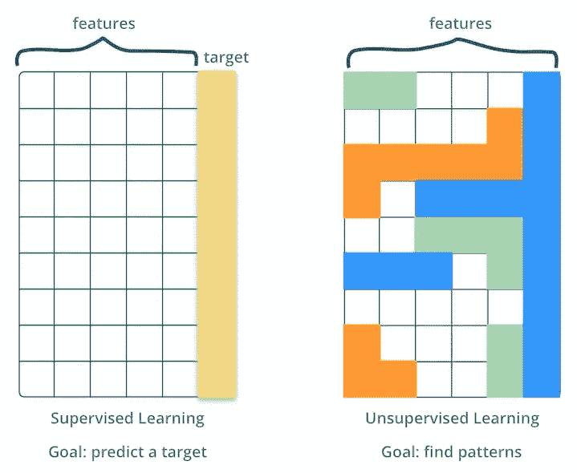
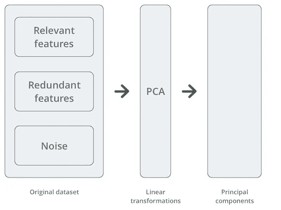
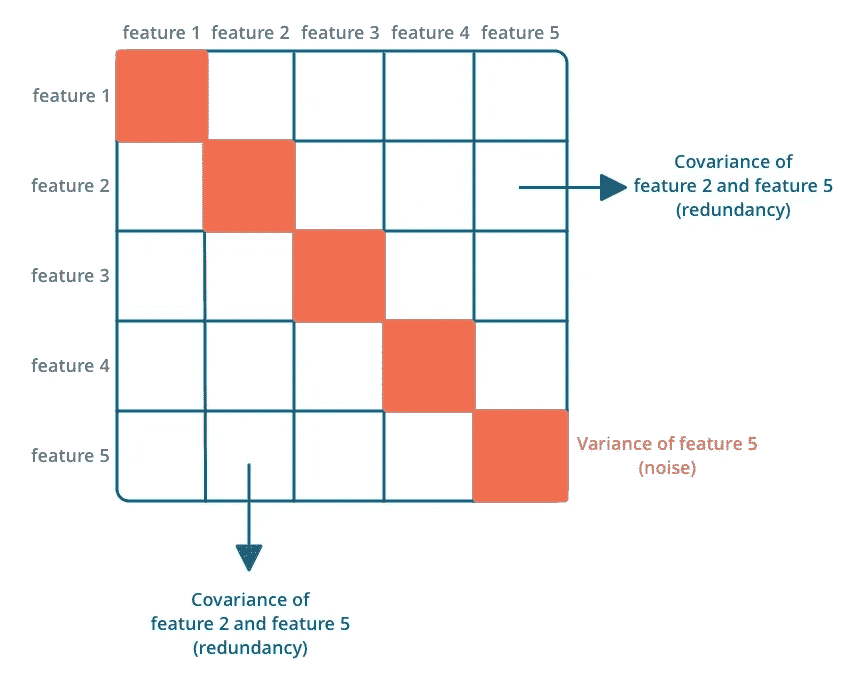
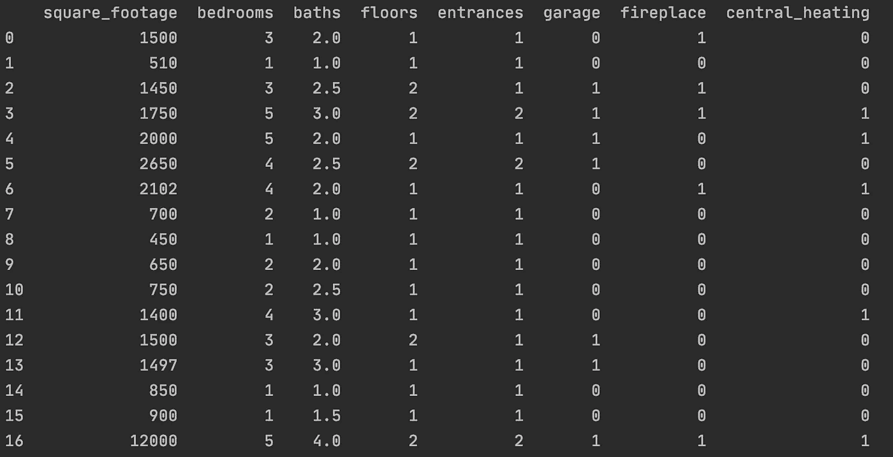
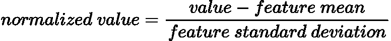
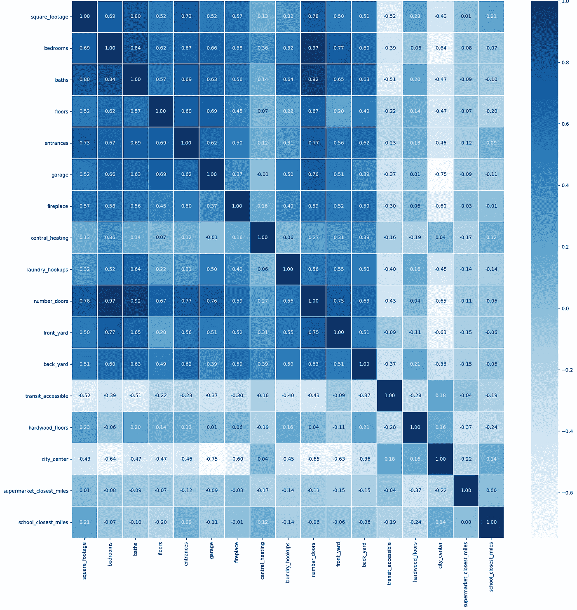
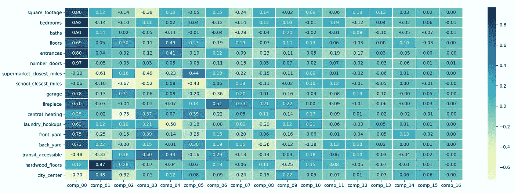
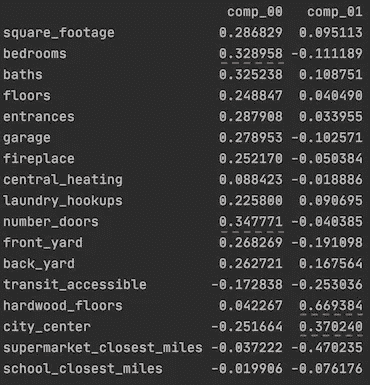
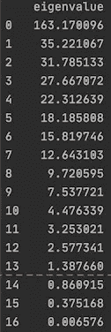
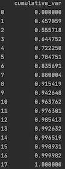

# 现实生活中的主成分分析算法:发现房地产数据集中的模式

> 原文：<https://towardsdatascience.com/principal-component-analysis-algorithm-in-real-life-discovering-patterns-in-a-real-estate-dataset-18134c57ffe7?source=collection_archive---------4----------------------->

## 在 Python 中使用 PCA 进行降维和模式可视化


主成分分析，简称 PCA，是一种无监督的学习技术，用于显示数据中的核心模式。

在本文中，我们将介绍 PCA 如何处理真实生活中的一个房地产经纪人的例子，他想了解为什么他们的一些房源需要很长时间才能关闭，以及我们如何使用 PCA 来编码一个更小的数据集。

你的朋友 Maggie 是一名房地产经纪人，她很困惑为什么她公司管理的一些房产六个多月都没有卖出去。她知道你是一名数据科学家，并问你是否能帮助她了解正在发生的事情。

你从做一些探索性的分析开始。您对数据进行全面检查，看看是否有缺失或不一致的值，然后就该在数据中寻找模式了。

Maggie 想知道为什么这些房产这么长时间都卖不出去。她想知道数据中的特征和模式是什么，使得这些房产需要这么长时间才能售出。

但是，在一个庞大且具有大量属性(通常称为特征)的数据集中寻找模式是不可能手工完成的。

除此之外，您的数据集可能有几个冗余要素。您可能会怀疑有些功能是其他功能的细微变化。在某些情况下，一些特征可能是纯粹的噪声，不能揭示数据中的核心模式。

例如，您注意到在 Maggie 的数据集中有以下特征:

*   一所房子的门的总数，
*   卧室总数，
*   浴室总数。

拥有一个关于门总数的特征似乎并不能揭示关于数据的一些关键信息，因为我们拥有另外两个特征。从统计学的角度来看，一所房子的门的总数很可能是一个多余的特征，并不能解释数据中的差异。

好吧，没什么大不了的！如果一所房子的门的总数是一个多余的特征，我们可以从数据集中删除它。这在我们的情况下是有意义的，但是在具有数百甚至数千个特征的数据集中，我们需要更加谨慎。

在包含大量要素的数据集中，我们需要在移除某个要素之前确保它是冗余的或有噪声的。我们可能会在不知情的情况下删除关于数据的重要信息。

> 我们应该只移除我们确信不会影响数据模式或预测结果的特征。

要在这个数据集中找到模式，您会立即想到[主成分分析](https://en.wikipedia.org/wiki/Principal_component_analysis)。

主成分分析(PCA)是一种无监督的学习方法，这意味着当我们在数据集中没有每个观察值的标签或目标时，可以使用它。



监督与非监督学习的目标。

在有监督的学习方法中，我们必须为每个观察值设置一个标签，因为目标是预测一个类别或一个数字，而在无监督的学习中，目标是在数据中寻找模式。

所以，你可以帮助我们的朋友 Maggie，使用主成分分析来找出需要更长时间才能出售的资产的核心特征。

# PCA 是如何工作的

主成分分析的目标是对数据进行线性变换，从而最大限度地减少噪音和冗余。结果是数据集揭示了数据的最重要的特征。



应用 PCA 后，您将拥有一组主成分，按照它们对描述数据模式的贡献大小降序排列。用统计学的术语来说，它们是根据它们解释了多少差异来排名的。

第一个主成分在描述数据的变化方面是最重要的。其余的主成分在表达数据模式的可变性方面不太重要。

在幕后，主成分分析使用统计工具来识别数据集中的噪声和冗余。它使用协方差矩阵来分析:

*   每个特征的方差。它会显示某个特征是相关的还是纯粹的噪声，我们可以在对角线单元格中读取。
*   特征对之间线性关系的强度。这有助于发现冗余特征，并且它被读入所有非对角线值。



解释协方差矩阵。

协方差矩阵突出显示了妨碍观察数据模式的东西。那么，在一天结束时，什么样的主成分分析将产生一组主成分:

*   通过最大化特征方差来减少噪声。
*   通过最小化要素对之间的协方差来减少冗余。

PCA 的基础是协方差矩阵，并且在实践中，有两种方法来识别主分量:

*   计算协方差矩阵的[特征向量](https://en.wikipedia.org/wiki/Eigenvalues_and_eigenvectors)。
*   计算协方差矩阵的[奇异值分解](https://en.wikipedia.org/wiki/Singular_value_decomposition)。

在研究 Maggie 的数据之前，PCA 要求我们准备好数据集。原始数据集如下所示:



我们虚拟数据集的一部分😀

在探索性分析阶段，我们还想创建一个 [pairplot](https://seaborn.pydata.org/generated/seaborn.pairplot.html) ，并找出特征之间任何明显的相关性。但是，即使在这个只有 17 个要素的小虚拟数据集上，生成的 pairplot 也是巨大的，并且计算起来很慢。这是有道理的，因为我们必须选择 2 = 136 个单独的地块。

# 特征标准化和缩放

PCA 的第一步是归一化数据，并确保所有特征呈正态分布。然后，数据将遵循标准正态分布，平均值等于零，标准偏差等于一。

对数据进行规范化会将每个要素转换为一个通用的表示形式，并使要素之间的所有值具有可比性。当要素具有不同的比例时，对其进行归一化尤为重要。例如，当一个要素以英里为单位，而另一个以分钟为单位时。

标准化还保证主要成分是:

*   线性无关。每个主成分都是一个线性组合，不是由其他主成分组成的。
*   正交。这意味着所有的主分量彼此成 90 度角。

有几种方法可以标准化您的特征，通常称为[特征缩放](https://en.wikipedia.org/wiki/Feature_scaling)。其中之一是 Z 分数标准化，也称为标准化。

要对数据集应用 Z 值归一化，您需要更新每个数据点的值，以便:



我们走了这条弯路来讨论规范化，但是大多数统计库会为您做这件事。有了像 [ScikitLearn](https://scikit-learn.org/stable/) 或 [statsmodels](https://www.statsmodels.org/stable/index.html) 这样的 Python 库，你只需要设置一些参数。

在这个过程的最后，PCA 会将你的特征编码成主成分。但是需要注意的是，主成分不一定与特征一一对应。它们是数据集的新表示形式，可以一次对多个要素进行编码。

# 查看协方差矩阵

我们探索性分析的另一步是看一下协方差矩阵。PCA 对数据进行归一化并创建协方差矩阵，但它对于可视化要素之间的线性关系非常有用。



数据集的协方差矩阵。

要阅读这个矩阵，我们应该首先关注较暗的区域:

*   在非对角线上，成对的冗余特征。证实我们最初的预感*卧室*和*号 _ 门*有 97%的协方差。这意味着这两个特征之间有很强的线性关系。随着*号门*增加一个单位，*间卧室*增加一个单位，反之亦然。这对特征编码了相似的模式，所以我们可以认为它们是多余的。
*   在对角线上，我们看到所有的特征都有很高的方差。看起来所有的特征都是相关的，没有一个是纯粹的噪音。

下面是如何绘制协方差矩阵。

```
import numpy as np
import pandas as pd
import seaborn as sns
import matplotlib.pyplot as plt# Load dataset
dataset = pd.read_csv('src/dataset.csv')pca = PCA(dataset, standardize=True, method='eig')
normalized_dataset = pca.transformed_data# Covariance Matrix
# bias =True, so dataset is normalized
# rowvar = False, each column represents a variable, i.e., a feature. This way we compute the covariance of features as whole instead of the covariance of each rowcovariance_df = pd.DataFrame(data=np.cov(normalized_dataset, bias=True, rowvar=False), columns=dataset.columns)# Plot Covariance Matrix
plt.subplots(figsize=(20, 20))sns.heatmap(covariance_df, cmap='Blues', linewidths=.7, annot=True, fmt='.2f', yticklabels=dataset.columns)plt.show()
```

# Python 中的 PCA

我们将使用 Python 库 [statsmodels](https://www.statsmodels.org/stable/index.html) 来执行 PCA。你也可以使用 [ScikitLearn](https://scikit-learn.org/stable/) ，但是 *statsmodels* 提供了更多的灵活性。例如，你可以选择是使用特征向量还是奇异值分解。

因此，在本例中，我们将在 [statsmodel PCA 方法](https://www.statsmodels.org/stable/generated/statsmodels.multivariate.pca.PCA.html)中设置以下标志:

*   *标准化*设置为 True，所以我们用均值 0 和方差 1 来标准化数据。
*   *方法*设置为 *eig* ，那么协方差矩阵的特征向量就成为我们的主成分。

我们将让参数 *ncomp* 不设置，因此 PCA 返回所有主成分，即与特征的数量一样多。

```
import pandas as pd
from sklearn import preprocessing# Load dataset
dataset = pd.read_csv('dataset.csv')# Run PCA
pca = PCA(dataset, standardize=True, method='eig')components_df = pca.factors
```

# 解释 PCA 的结果

所以， *components_df* 是一个包含所有主分量的数组，即协方差矩阵的特征向量。

但是这本身并不能告诉我们太多的数据。我们需要找到一种方法来解释这些结果，并将其与我们的原始数据集联系起来。

我们将首先计算原始数据集中每个主成分和每个要素之间的相关性。这里的关键是将主成分和特征作为一个整体进行成对关联，而不是在单个值之间进行关联。

如果我们把相关矩阵可视化就更容易了。在颜色渐变的顶部，我们将稍微调整一下图形:

*   在单元格之间创建一些空间，为了更好的可读性和美观，线宽= 0.7。
*   用 *annot=True 将相关值添加到每个单元格。*这样更容易发现单元格数值之间的差异。
*   用 *fmt='.2f'* 截断每个单元格中的值，使其具有两位有效数字，以提高可读性。

我们有一个相关矩阵😀



主成分和原始数据集特征的相关矩阵。

我们可以立即看到与第一主成分 *comp_00 相关的最高相关值。*

主成分是根据它们编码的数据集中的可变性大小来排序的。因此，第一主成分与数据集特征具有更高的相关性是有意义的。

与第一主成分相关联的这些特征与确定数据中的模式最相关。

我们还看到特征和主成分之间没有一对一的关系。第一主成分与几个特征有很强的正相关性。

```
import pandas as pd
import seaborn as sns
import matplotlib.pyplot as plt# Load dataset
dataset = pd.read_csv('dataset.csv')# Run PCA
pca = PCA(dataset, standardize=True, method='eig')
components_df = pca.factorscombined_df = pd.concat([dataset, components_df], axis=1)
correlation = combined_df.corr() # This matrix will have the correlation between:
# 1\. feature vs features
# 2\. feature vs principal component
# 3\. principal component vs principal component
# We're removing part of the output to keep only the correlation between features and principal componentscorrelation_plot_data = correlation[:-len(components_df.columns)].loc[:, 'comp_00':] # plot correlation matrix
fig, ax = plt.subplots(figsize=(20, 7))
sns.heatmap(correlation, cmap='YlGnBu', linewidths=.7, annot=True, fmt='.2f')
plt.show()
```

## PCA 如何帮助 Maggie

相关矩阵显示了哪些特征与第一主成分相关，因此哪些特征将一起改变。一个很好的例子是，由于第一主成分和*卧室*和*平方英尺*之间存在正相关，我们可以说，当你增加卧室或浴室的数量时，平方英尺往往会增加。

但是也有一些与第一主成分负相关，例如与*交通可达性、靠近市中心*和*超市靠近度*负相关。这表明，更大的房子，有更大的*面积*和更多的*卧室*、*、*将倾向于远离市中心、超市和更低的交通可达性。

由于 Maggie 正在分析超过 6 个月仍未售出的房屋的特征，她可以研究这些负相关性，以找到这些房屋为何长期未售出的线索。

# 权衡:失去可解释性

第一主成分与数据集中 17 个特征中的 11 个具有强正相关。这意味着它编码或代表了这些特征的模式。

这很棒，因为我们现在可以用更少的数据表达更多的信息。这里的权衡是，我们失去了可解释性。

当我们绘制彼此相对的特征时，更容易理解这些模式。但是由于主成分编码了几个特征，当我们绘制它们时，就不清楚了:

*   每个主成分编码什么特征，
*   每个特征的比例对我们看到的模式有更大的影响。

为了理解每个特征对主成分的贡献，我们需要查看每个主成分的*负载*。

负载是应用于线性组合中的每个特征的权重，其导致主成分的得分。



前两个主要成分的载荷。

只看前两个主成分，我们可以看到:

*   *卧室*和*数量 _ 门*在第一主成分中捕获更多信息。
*   *硬木地板*和*城市中心*在第二主成分中捕获了更多的信息。

以下是检查装载的方法。

```
import pandas as pd
from statsmodels.multivariate.pca import PCA# Load dataset
dataset = pd.read_csv('dataset.csv')pca = PCA(dataset, standardize=True, method='eig')
loadings = pca.loadings
print(loadings)
```

# 降维

PCA 最受欢迎的应用之一是降维。这是一种创建数据集新表示的方式，即:

*   小于原始数据集，
*   仅保留其核心模式和特征。

选择主成分来表示较小版本的数据集本身就是一个复杂的主题。之所以叫[因子分析](https://en.wikipedia.org/wiki/Factor_analysis)，是因为我们也可以把组件称为因子。

挑选因素的传统方法包括:

*   凯泽准则
*   解释方差
*   碎石图

## 凯泽准则

根据 Kaiser 准则，我们只选择特征值大于 1 的主成分。每个特征值与一个特征向量相关联，该特征向量实际上是一个主分量。



凯泽标准适用于我们的结果。

如果我们使用这种方法，我们将排除最后三个主要成分。

```
import pandas as pd
from statsmodels.multivariate.pca import PCA # Load dataset
dataset = pd.read_csv('src/dataset.csv')pca = PCA(dataset, standardize=True, method='eig')
eigen_values = pd.DataFrame(data=pca.eigenvals.values, columns=['eigenvalue'])print(eigen_values)
```

# 解释方差

使用这种方法，您可以选择想要主成分编码的数据集中的总方差。通常这些临界值是 80%或 90%。



主成分解释的累积方差。

如果我们使用这种方法，我们有:

*   前六个主成分解释了 80%多一点的方差，
*   前九个主成分可以大致解释我们数据集中 90%的差异。

我们会使用前六个或前九个主成分，这取决于我们建立的临界值。

```
import pandas as pd
from statsmodels.multivariate.pca import PCA# Load dataset
dataset = pd.read_csv('src/dataset.csv')pca = PCA(dataset, standardize=True, method='eig')# Cumulative Variance Explainedcumulative_variance_explained = pd.DataFrame(data=pca.rsquare.values, columns=['cumulative_var'])print(cumulative_variance_explained)
```

在统计学中， [R 平方](https://en.wikipedia.org/wiki/Coefficient_of_determination)是用于确定一个变量的方差有多少是由另一个变量解释的度量。因此，PCA 模型的这个属性的名称。

# 碎石图

有了 [scree plot](https://en.wikipedia.org/wiki/Scree_plot) ，我们可以更直观的方式挑选组件。我们绘制每个组件的特征值，并使用[肘方法](https://en.wikipedia.org/wiki/Elbow_method_(clustering))来确定我们的分界点。


在碎石块中寻找弯头。

这个想法是沿着减少的特征值，看看这些值在哪里形成一个弯头。我们只包括导致拐点的主分量。

这是一个不太精确的方法，因为它取决于每个人看手肘的角度。

```
import pandas as pd
import matplotlib.pyplot as plt
from statsmodels.multivariate.pca import PCA# Load dataset
dataset = pd.read_csv('src/dataset.csv')pca = PCA(dataset, standardize=True, method='eig')plt.subplots(figsize=(10, 10))
pca.plot_scree()
plt.show()
```

# 结论

希望你喜欢这个例子。借助这个随机生成的数据集，我们经历了 PCA 的每个步骤，涵盖了:

*   PCA 的工作原理。
*   什么是主成分以及它们与原始数据集的关系。
*   如何决定保留哪些主成分，以防我们想要*缩减*我们的数据集。

*感谢阅读！*