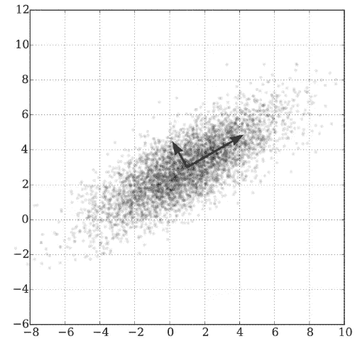
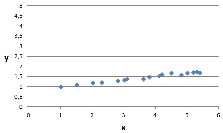
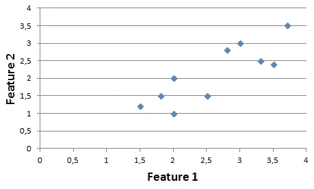
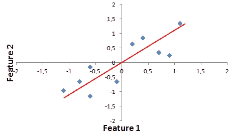
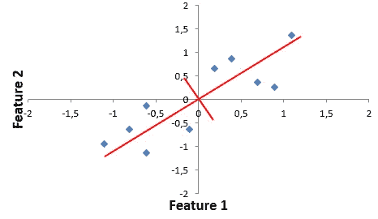
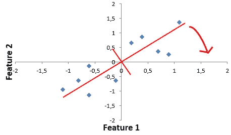
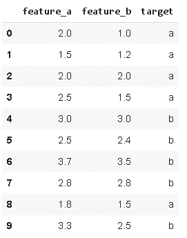
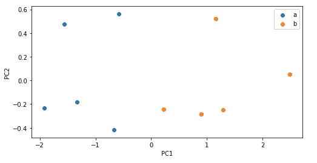
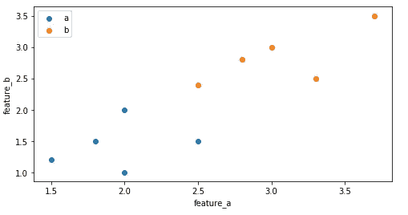
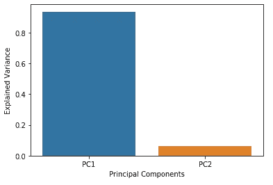

# 主成分分析—已解释

> 原文：<https://towardsdatascience.com/principal-component-analysis-explained-d404c34d76e7?source=collection_archive---------14----------------------->

## 详细的理论解释和 scikit-learn 示例



[图源](https://en.wikipedia.org/wiki/Principal_component_analysis)

# **主成分分析为什么重要？**

随着数据科学的巨大进步，数据变得比以往任何时候都更有价值。现实生活中的数据集通常有许多要素(列)。一些特征可能是无信息的或者与其他特征相关。然而，我们可能事先不知道这一点，所以我们倾向于收集尽可能多的数据。在某些情况下，不使用所有功能也可以完成任务。由于计算和性能的原因，如果可能的话，希望用较少数量的特征来完成任务。无信息特征不提供任何预测能力，并且还导致计算负担。假设我们正在尝试预测篮球运动员的投篮命中率。数据集包括到篮筐的距离，方向的角度，防守者的位置，以前投篮的准确性和球的颜色。显而易见，球的颜色与投篮的准确性没有关系，所以我们可以把它去掉。现实生活中的情况不是那么明显，我们需要做一些预处理来确定无信息特征。使用软件包可以很容易地计算出特征之间或特征与目标变量之间的相关性。

也有一些案例具有大量的自然特征。例如，具有 8×8 像素图像的图像分类任务具有 64 个特征。我们可以找到一种方法，在不丢失大量信息的情况下，用较少的特征来表示这些图像。根据您工作的领域，您甚至可能会遇到包含一千多个要素的数据集。在这种情况下，减少功能的数量是一项具有挑战性但非常有益的任务。

随着特征数量的增加，分类器的性能在某个点之后开始下降。更多的特征导致模型需要学习更多的组合，以便准确地预测目标。因此，对于相同数量的观测值(行),模型往往在要素数量较少的数据集上表现更好。此外，大量的特征增加了过度拟合的风险。

有两种主要的方法来减少特征的数量。第一个是**特征选择**，旨在找到最有信息的特征或消除无信息的特征。可以手动或使用软件工具选择功能。第二种方法是在保留尽可能多的信息的情况下，从现有的特性中派生出新的特性。这个过程叫做**特征提取**或者**降维**。

我说的“保存尽可能多的信息”是什么意思？我们如何衡量信息量？答案是**方差**，这是一个变量被分散多少的度量。如果一个变量(特征)的方差很低，那么在建立模型时，它并不能告诉我们太多。下图显示了两个变量 x 和 y 的分布。正如您所看到的，x 的范围是从 1 到 6，而 y 的值介于 1 和 2 之间。在这种情况下，x 具有高方差。如果只有这两个特征来预测一个目标变量，那么 x 在预测中的作用远远高于 y。



在进行降维时，必须尽可能地保留当前数据集中的差异。降维的方法有很多。在这篇文章中，我将介绍一种最广泛使用的降维算法:**【主成分分析】**。

PCA 是一种无监督学习算法，它在数据集中寻找特征之间的关系。它也被广泛用作监督学习算法的预处理步骤。

# **PCA 是如何工作的？**

*注意:PCA 是一种线性降维算法。也有非线性方法可用。*



我们首先需要移动数据点，使数据中心位于原点。虽然单个数据点的位置会改变，但相对位置不会改变。例如，具有最高要素 1 值的点仍具有最高要素 1 值。然后，PCA 将直线拟合到数据，使数据点到直线的距离最小化。



这条红线是新的轴或第一个主分量(PC1)。数据集的大部分方差可以用 PC1 来解释。第二个主成分能够解释相对于 PC1 的垂直变化。



排序红线是第二个主成分(PC2)。主成分的顺序根据它们所解释的原始数据集的方差分数来确定。很明显，PC1 比 PC2 能解释更多的差异。

然后旋转主分量和数据点，使得 PC1 成为新的 x 轴，PC2 成为新的 y 轴。数据点的相对位置不会改变。主分量彼此正交，因此线性无关。



主成分是原始数据集特征的线性组合。

PCA 的优点是使用比原始数据集少得多的特征保留了原始数据集的大量差异。主成分是根据它们所代表的方差来排序的。

让我们来看一个使用 scikit-learn 的例子。 [Scikit-learn](https://scikit-learn.org/stable/) 是一个机器学习库，为预测数据分析提供简单高效的工具。

# **Scikit 学习实现**

为了保持一致，我将使用我从一开始就展示的数据点。这是一个非常简单的例子，但足以理解这个概念。

我们使用这些数据点创建一个数据帧，并为每个数据点分配一个类。

```
import numpy as np
import pandas as pddf = pd.DataFrame({
'feature_a':[2,1.5,2,2.5,3,2.5,3.7,2.8,1.8,3.3],
'feature_b':[1,1.2,2,1.5,3,2.4,3.5,2.8,1.5,2.5],
'target':['a','a','a','a','b','b','b','b','a','b']})
```



所以这是一个有两个独立变量的二元分类任务。

在应用 PCA 之前，我们需要将数据标准化，使数据点的平均值为 0，方差为 1。Scikit-learn 提供了来自 sklearn 的 **StandardScaler()** .预处理导入 StandardScaler

```
from sklearn.preprocessing import StandardScalerdf_features = df[['feature_a','feature_b']]
df_features = StandardScaler().fit_transform(df_features)
```

然后，我们使用创建一个 PCA()对象，并拟合数据点。

```
from sklearn.decomposition import PCApca = PCA(n_components=2)
PCs = pca.fit_transform(df_features)
```

然后，我们使用主成分创建一个新的数据帧:

```
#Data visualization libraries
import seaborn as sns
import matplotlib.pyplot as plt
%matplotlib inline#Create DataFrame
df_new = pd.DataFrame(data=PCs, columns={'PC1','PC2'})
df_new['target'] = df['target'] #targets do not change
```

我们可以绘制一个散点图来查看新的数据点:

```
fig = plt.figure(figsize = (8,4))
ax = fig.add_subplot()
ax.set_xlabel('PC1')
ax.set_ylabel('PC2')targets = ['a', 'b']
colors = ['r', 'b']for target, color in zip(targets,colors):
    rows = df_new['target'] == target
    ax.scatter(df_new.loc[rows, 'PC1'],
    df_new.loc[rows, 'PC2'],
    ax.legend(targets)
```



根据主成分的数据点

我们还可以绘制原始数据点的散点图，以便您可以清楚地看到数据点是如何转换的:



正如您在主成分图中看到的，仅使用 PC1 就可以将两个类分开，而不用同时使用 feature_a 和 feature_b。因此，我们可以说 PC1 解释了大部分差异。确切地说，我们可以计算每个主成分对方差的解释程度。Scikit-learn 提供了**解释 _ 方差 _ 比率 _** 方法来计算这些金额:

```
pca.explained_variance_ratio_array([0.93606831, 0.06393169])
```

PC1 解释了 93.6%的方差，PC2 解释了 6.4%。



每个主成分解释的差异

*注:主成分是原始特征的线性组合。*

这个例子是一个非常简单的例子，但它解释了这个概念。当在具有更多特征的数据集上进行 PCA 时，我们只需遵循相同的步骤。

感谢您的阅读。如果您有任何反馈，请告诉我。

# 我的其他帖子

**机器学习**

*   [朴素贝叶斯分类器—解释](/naive-bayes-classifier-explained-50f9723571ed)
*   [逻辑回归—已解释](/logistic-regression-explained-593e9ddb7c6c)
*   [支持向量机—解释](/support-vector-machine-explained-8d75fe8738fd)
*   [决策树和随机森林—解释](/decision-tree-and-random-forest-explained-8d20ddabc9dd)
*   [梯度增强决策树—解释](/gradient-boosted-decision-trees-explained-9259bd8205af)
*   [用机器学习预测二手车价格](/predicting-used-car-prices-with-machine-learning-fea53811b1ab)

**数据分析**

*   [数据科学中最被低估的工具:NumPy](/the-most-underrated-tool-in-data-science-numpy-68d8fcbde524)
*   [使用熊猫组合数据帧](/combining-dataframes-using-pandas-b9e2e83b9869)
*   [用熊猫处理缺失值](/handling-missing-values-with-pandas-b876bf6f008f)
*   [熊猫的三大功能](https://medium.com/@soneryildirim1988/3-useful-functionalities-of-pandas-f4cb342a77ab)