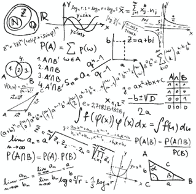
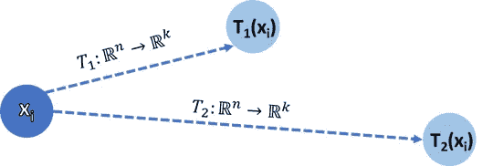

# 主成分分析-现在用你自己的术语解释

> 原文：<https://towardsdatascience.com/principal-component-analysis-now-explained-in-your-own-terms-6f7a4af1da8?source=collection_archive---------34----------------------->

## 学习一种重要的机器学习技术，根据你的理解水平量身定制五种不同的解释。

主成分分析——现在用你自己的方式解释(图片:[unsplash.com](https://unsplash.com/photos/jZxairpkhho)

几个月前的一个晚上，在线杂志《连线》的标题引起了我的注意。当我把目光聚焦在它上面时，上面写着:“*能不能用每个人都能理解的语言向他们解释所有的事情？在 5 个层次中，一位专家科学家在 5 个不同的复杂层次中解释一个高层次的主题* - *首先是对一个孩子，然后是青少年，然后是同一主题的本科生，研究生，最后是同事*。

出于好奇，我点击了链接，开始学习令人兴奋的新概念，我终于可以用自己的理解水平掌握这些新概念了。音乐、生物、物理、医学——那天晚上一切似乎都很清楚。不用说，我不能停止看连续剧，很晚很晚才睡觉。

连线网站截图，展示“5 级”概念集合(图片:截图)

实际上，我是在撰写一篇更具技术性的文章时开始写这篇文章的。从文本中的几个段落开始，它变得越来越大，直到我觉得我原来的文章再也支撑不住它的重量。我能向同龄人、同事、孩子和没有数学倾向的人解释这些关键概念吗？读者能在多大程度上理解这些解释？

让我们来了解一下:)

**1)子代**

有时，当我们学习新的东西时，我们被告知许多事实，可能会看到一幅画或一个有数字的表格。看到大量的数字和表格可能会令人困惑，所以如果我们能够得出相同的结论，只是使用更少的这些事实、表格和数字，这将非常有帮助。

主成分分析(或简称 PCA)就是我们所说的*算法:*一组要遵循的指令。如果我们用数字来表示我们所有的事实和表格，遵循这些指示将允许我们用更少的数字来表示它们。

如果我们把这些数字转换回事实，我们仍然可以得出同样的结论。但是因为我们用比以前更少的事实来画它们，执行 PCA 只是帮助我们不那么困惑。

**2)高中年龄的青少年**

我们的数学研究集中在几个关键领域，这些领域为我们的数学理解和定位提供了基础。高中数学通常意味着学习微积分，它涉及函数分析和解析几何等科目。让我们用它们来更好地解释主成分分析。

你可能在高中的某个时候遇到过类似的函数(图片由作者提供)

函数是数学中的特殊对象，当我们给它输入值时，它会给我们一个输出值。这使得它们在学习数据中的某些关系时非常有用。高中教授的一个关键技术是如何通过对函数的性质进行简短的分析来绘制函数的图形。我们使用微积分中的一个东西叫做导数:导数就是函数在给定点的斜率的近似值。我们在图形区域内选择几个关键点，找出函数在这些点上的值，并计算函数在这些点上的导数，从而得到函数斜率的提示。然后我们用刚刚得到的点和斜率画出函数形状的近似值。

但有时函数会变得邪恶……(图片由作者提供)

在现实世界中，有时我们有很多函数，甚至是奇怪的东西，比如同时输出多个值的函数，或者需要多个输入才能给我们值的函数。如果你是那种觉得高中函数很可怕的人，想象一下这些多数字函数有多可怕——即使对熟练的成年人来说也是如此！主成分分析是一种技术，它获取所有这些函数的输出，并使用更少的这些数字给出我们接近的近似值。更少的数字通常意味着记忆更少的数据，更小更便宜的存储方式，以及更少的当我们看到如此多的数字而不知道从哪里开始时的“困惑”感。

大学一年级学生

在学习期间，你已经学习了线性代数、统计学和概率。您已经处理了一些输入和输出多个值的“真实世界”函数，并了解到它们处理的是称为向量和矩阵的东西。您还学习了所有关于随机变量、样本值、均值、方差、分布、协方差、相关性以及所有其他统计学技术术语。

数学术语(图片:【youtoart.com】T2)

主成分分析依赖于一种叫做“奇异值分解”(简称 SVD)的技术。现在让我们把它当作计算机科学中所谓的“黑匣子”:一个未知的函数，一旦我们给它输入所需的输入，它就会给出我们想要的输出。如果我们收集大量数据(来自观察、实验、监控等)并以矩阵形式存储，我们可以将这个矩阵输入到我们的 SVD 函数中，得到一个更小维度的矩阵，使我们可以用更少的值来表示我们的数据。

虽然现在，将 SVD 作为一个黑盒可能是有意义的，但是进一步研究输入和输出矩阵可能是有趣的。事实证明，SVD 为一种称为“协方差矩阵”的特殊矩阵提供了额外的有意义的输出。作为一名本科生，你已经处理过协方差矩阵，但你可能会想:“我的数据与它们有什么关系？”

左——尤金尼奥·贝尔特拉米；右——卡米尔·乔丹；两位 19 世纪晚期的数学家独立发现了奇异值分解(图像:公共领域)

我们的数据实际上与协方差矩阵有很大关系。如果我们将数据分为不同的类别，我们可以将相关的值分组到一个表示该类别的向量中。这些向量中的每一个也可以被视为一个随机变量，包含 n 个样本(这使得 n 是向量的长度)。如果我们将这些向量连接在一起，我们可以形成一个 m 个随机变量的矩阵 X，或者一个具有 m 个标量的随机向量，保存该向量的 n 个测量值。

代表我们的数据的连接向量矩阵可以用来计算我们的随机向量的协方差矩阵。然后，这个矩阵作为输入提供给我们的 SVD，SVD 为我们提供了一个酉矩阵作为输出。

在不深入研究酉矩阵的情况下，输出矩阵有一个简单的特性:我们可以从矩阵中挑选前 k 个列向量来生成一个新的矩阵 U，并将原始矩阵 X 乘以矩阵 U 来获得一个更低维的矩阵。事实证明，当映射到一个较低的维度时，这个矩阵是存储在 X 中的数据的“最佳”表示。

理科学士

毕业于一个学术学位，你现在有了正确解释主成分分析所需的数学背景。但是，如果我们不理解数学背后的直觉或我们试图解决的问题，仅仅写下数学是没有帮助的。

PCA 试图解决的问题是我们称为“维数灾难”的问题:当我们试图训练机器学习算法时，经验法则是我们收集的数据越多，我们的预测就越好。但是对于每一个新的数据特征(意味着我们现在有一个额外的随机向量)，特征向量所跨越的向量空间的维度增加一。我们的向量空间越大，训练我们的学习算法所需的时间就越长，一些数据冗余的可能性就越高。

机器学习算法经常需要非常大量的数据(图片:【towardsdatascience.com】T2)

为了解决这个问题，研究人员和数学家一直在努力寻找执行“降维”的技术:将我们的向量空间嵌入另一个更低维度的空间。维数减少的固有问题是，对于向量空间维数的每一次减少，我们实质上丢弃了跨越原始向量空间的随机向量中的一个。这是因为新空间的基础少了一个向量，使得我们的随机向量之一是其他向量的线性组合，因此在训练我们的算法时是多余的。

当然，我们确实有简单的降维技术(比如丢弃随机向量，检查哪个丢失的向量对算法的准确性影响最小)。但是问的问题是“在进行降维时，如何才能损失最少的信息？”结果答案是“通过使用主成分分析”。

从数学上来说，如果我们像以前一样用矩阵形式表示我们的数据，n 个随机变量每个都有 m 个测量值，我们将每个样本表示为行 xi。因此，我们正在寻找一个线性映射 T: **ℝ** n → **ℝ** k，它使 xi 和 T(xi)之间的欧几里德距离最小化

我们要做什么？为了最小化降维过程中的信息损失

这个公式背后的直觉是，如果我们将我们的图像向量表示为原始向量空间中的 n 维向量，它们从原始位置移动的越少，意味着信息损失越小。为什么距离意味着信息的丢失？因为向量的表示越接近其原始位置，表示就越准确。

我们可以说 T1 是比 T2 更精确的投影，因为它更接近原始向量 Xi(图片由作者提供)

我们如何找到线性地图？原来地图是奇异值分解提供的！回想一下，如果我们调用 SVD，我们得到一个酉矩阵 U，它满足

由于线性映射空间和矩阵空间之间的同构，我们可以看到矩阵 u 表示从 **ℝ** n 到 **ℝ** n 的线性映射:

从 Rn 到 Rk 的线性映射的向量空间同构于矩阵空间 R(n×k)

SVD 到底是怎么给我们提供函数 U 的？奇异值分解本质上是线性代数中一个重要定理的推广，这个定理叫做谱定理。虽然谱定理只能应用于正常矩阵(满足 MM* = M*M，其中 M*是 M 的复共轭)，但 SVD 通过将矩阵分解为三个矩阵，将结果推广到任意矩阵 M:SVD(M)= U *σ* v。

根据谱定理，U 是酉矩阵，其行向量是 Rn 的正交基，每个行向量跨越一个与其他特征空间正交的特征空间。如果我们把那个基表示为 B = {u1，u2 … un}，并且因为 U 对角化了矩阵 M，所以它也可以看作是标准基和基 B 之间的变换矩阵。

将任意线性地图分解成 3 个正交投影的图示。其中每一个都将 Xi 投影到匹配的特征空间，嵌套在 R3 内(图片由作者提供)

当然，任何子集 Bk = {u1，u2 … uk}都是 **ℝ** (k)的正交基。这意味着执行乘法 M * U-1(类似于乘以 U * M)同构于线性映射 t:**ℝ**n→**ℝ**k . SVD 背后的定理将这个结果推广到任何给定的矩阵。虽然这些矩阵不一定是可对角化的(甚至是正方形的)，但关于酉矩阵的结果仍然适用于 U 和 v，我们剩下的就是执行乘法 X' = Cov(X) * U，执行我们正在搜索的维数约简。我们现在可以把简化的矩阵 X '用于任何我们曾经使用原始矩阵 X 的目的。

专家数据科学家

作为一名在学习算法的研究和开发方面拥有丰富经验的专家数据科学家，您可能已经知道 PCA，并且不需要对其内部工作方式和在实践中的应用进行简要描述。然而，我确实发现，很多时候，即使我们已经应用了一段时间的算法，我们并不总是知道使它工作的数学。

如果你遵循了前面的解释，我们仍然有两个问题:为什么矩阵 U 表示线性映射 T，它最小化了信息的损失？而 SVD 是如何给我们提供这样一个矩阵 U 的呢？

第一个问题的答案在于线性代数中一个重要的结果，叫做主轴定理。它陈述了解析几何中的每个椭球体(或超椭球体等价体)形状可以表示为形状 Q(x)=x'Ax 的二次型 q:**ℝ**n x**ℝ**n→**ℝ**(这里 x '表示 x 的转置)使得 a 可对角化并且具有到相互正交的特征空间的谱分解。所获得的特征向量形成了 **ℝ** n 的标准正交基，并且具有匹配超椭球轴的性质。太棒了！

主轴定理向我们展示了 A 的特征向量与 Q 定义的椭球的轴重合(图片修改自[researchgate.net](https://www.researchgate.net/figure/Synthesised-data-set-and-best-t-ellipsoid_fig2_2239930)

主轴定理显示了线性代数和解析几何之间的基本联系。当绘制我们的矩阵 X 并可视化各个值时，我们可以绘制一个包含我们的数据点的(粗略的)超椭球形状。然后，我们可以为数据的每个维度绘制一条回归线，尝试最小化数据点到回归线的正交投影的距离。由于超椭球体的特性，这些线就是它们的轴。因此，回归线对应于从二次型 q 的谱分解获得的跨越特征向量。

向量、可能的正交投影和投影的正交补码之间的关系和权衡(图片由作者提供)

回顾类似于公式化问题时使用的图表，注意正交投影的长度与其正交补的长度之间的权衡:正交补越小，正交投影越大。即使 X 是以矩阵形式写的，我们也不能忘记它是一个随机向量，因此它的分量在它们的测量值之间表现出方差。由于 P(x)是一个投影，它不可避免地丢失了一些关于 x 的信息，这些信息累积起来就是方差的损失。

为了最小化正交投影上的方差损失(即保留最大可能方差)，我们必须最小化正交补的长度。由于与数据主轴重合的回归线使代表测量值的向量的正交互补最小化，因此它们也使原始向量的方差最大化。这正是 SVD“最小化信息损失”的原因:因为它最大化了保留的方差。

既然我们已经讨论了 SVD 背后的理论，那么它是如何施展魔力的呢？SVD 以一个矩阵 X 为输入，将其分解为满足 X = U *σ* V 的三个矩阵:U，σ，V，由于 SVD 是一个分解而不是一个定理，所以让我们在给定的矩阵 X 上一步一步地执行。

首先，我们要引入一个新术语:矩阵的奇异向量是任何满足等式的向量 v

由于 X ∈ **ℝ** (m x n)，我们无法保证它的维度或内容。X 可能没有特征值(因为特征值只为方阵定义)，但它总是至少有ρ个不同的奇异向量(ρ(X)是 X 的秩)，每个向量都有匹配的奇异值。

然后我们可以用 X 来构造一个对称矩阵

因为每个转置矩阵也是伴随矩阵，所以 XT 的奇异值是 X 的奇异值的复共轭。这使得 XT*X 的每个特征值是 X 的匹配奇异值的平方:

XT*X 的特征值是 X 的奇异值的平方

因为 XT*X 是对称的，所以也很正常。因此，XT*X 是正交可对角化的:存在对角矩阵σ2，它可以写成三个矩阵的乘积:

XT*X 的正交对角化

其中 V 是由 XTX 的特征向量构成的标准正交矩阵。我们将这些向量标记为

Bv 是使用 XT*X 的正交对角化获得的 **ℝ** n 的标准正交基

我们现在构造一组新的向量

我们将每个成员定义为

注意，因为 Bv 是一个正交群，对于每一个 1≤i≤j≤n

因此，我们可以证明:

关键方程#1:因为 Bv 是正交群，所以 Bu 也是正交群

另外，ui 也是 X*XT 的一个特征向量:这是因为

关键等式#2: Bu 由 X*XT 的特征向量组成

我们现在可以通过以矩阵形式表示 Bu 和 Bv 之间的关系来完成证明:

ui 和 vi 之间的关系，以矩阵形式表示

然后通过标准矩阵乘法:U *σ= X * V，紧接着就是

我们刚刚取得的结果令人印象深刻，但请记住，我们使用 Bv 的向量将 Bu 构造为一组 n 个向量，即 U∈R(m×n)而σ∈R(n×n)。虽然这是有效的乘法，但 U 不是方阵，因此不能是酉矩阵。为了解决这个问题，我们用零“填充”矩阵σ以实现 m×n 形状，并使用 Gram-Schmidt 过程将 U 扩展为 m×m 形状。

既然我们已经完成了数学部分(唷…)，我们可以开始画一些简洁的连接了。首先，虽然 SVD 在技术上可以分解任何矩阵，我们可以只输入原始数据矩阵 X，但是主轴定理只适用于可对角化的矩阵。

第二，主轴定理通过在矩阵的特征向量上执行正交投影来最大化矩阵中保留的方差。但是谁说我们的矩阵首先捕获了大量的变化？

为了回答这些问题，并结束本文，我们将首先重申，捕获随机变量之间的方差是通过使用协方差矩阵来完成的。并且因为协方差矩阵是对称的和半正定的，所以它是正交可对角化的，并且具有谱分解。然后，我们可以使用这个简洁的公式重写协方差矩阵的公式，该公式是通过将 SVD 应用于相乘形成协方差矩阵的矩阵而获得的:

关键等式 3:注意这非常类似于 XT*X 的正交对角化

这就是为什么我们说 SVD 在应用于 X 的协方差矩阵时会给出额外的有意义的输出:

a)Cov(X)的奇异值分解不仅与其谱分解相同，而且将其对角化！

b)对角化矩阵 V 是由 Cov(X)的酉特征向量构成的标准正交矩阵，用于进行 X 的主成分分析！

c)使用 Cov(X)捕获我们的数据中的最大方差，并且通过将其投影到与 Cov(X)的 k 个最大特征值相关联的基本特征向量上，我们丢失了将我们的数据减少(n-k)维的最小可能方差

d)主轴定理确保我们在使用 Cov(X)和 v 执行 PCA 时，最小化来自 **ℝ** n→ **ℝ** k 的投影误差