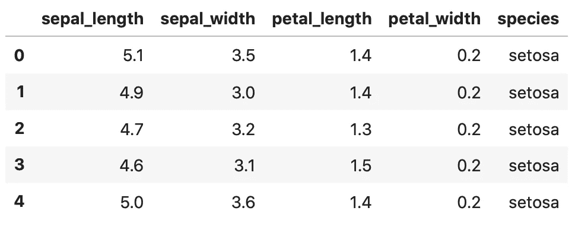
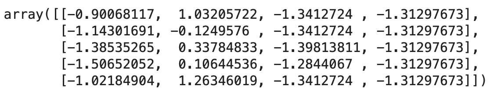
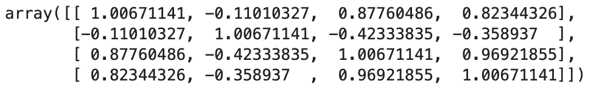
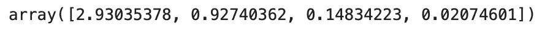
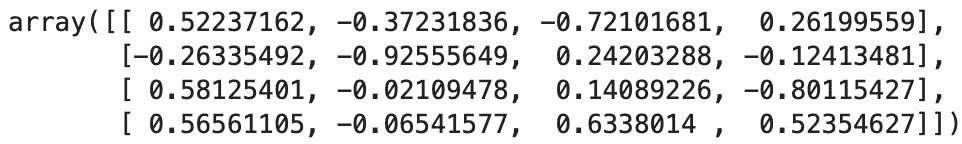
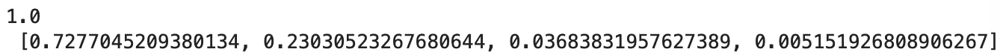
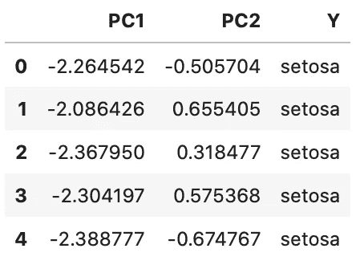
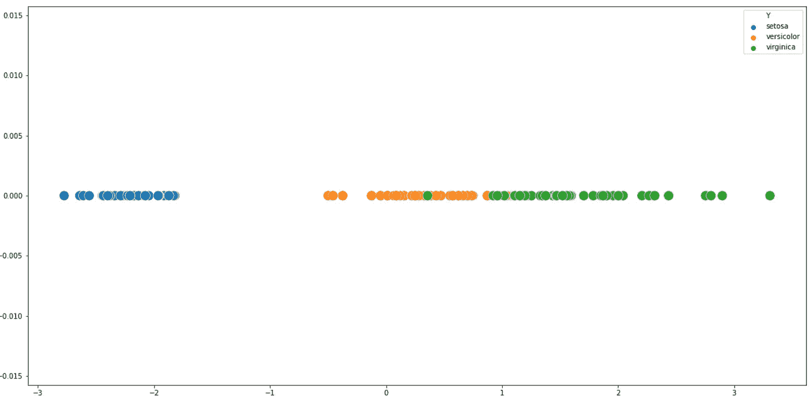
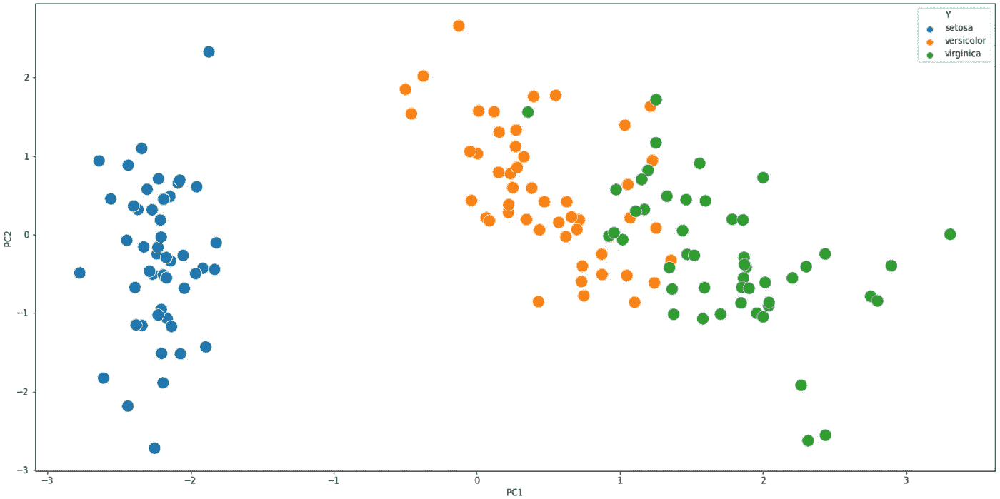

# Python 中从头开始的主成分分析(PCA)

> 原文：<https://towardsdatascience.com/principal-component-analysis-pca-from-scratch-in-python-7f3e2a540c51?source=collection_archive---------1----------------------->

## 以及一些低维空间的可视化。

主成分分析是一种用于降维的数学技术。它的目标是在保留大部分原始信息的同时减少特征的数量。今天我们将使用 pure Numpy 从头开始实现它。


卢卡斯·本杰明在 [Unsplash](https://unsplash.com?utm_source=medium&utm_medium=referral) 上的照片

如果你想知道为什么 PCA 对你的普通机器学习任务有用，这里列出了 3 大好处:

*   **减少训练时间**——由于数据集更小
*   **去除噪音**——只保留相关的内容
*   **使可视化成为可能**——在最多有 3 个主要成分的情况下

最后一个是个大问题——我们今天将看到它的实际应用。

但是这有什么大不了的呢？好问题。假设您有一个包含 10 个要素的数据集，并希望对其进行可视化。但是**如何？** 10 个特征= 10 个物理尺寸。当涉及到可视化 3 维以上的任何东西时，我们人类有点糟糕——因此需要降维技术。

我想在这里做一个重要的说明——**主成分分析不是一个特征选择算法**。我的意思是，主成分分析不会像正向选择那样给出前 N 个特征。相反，它会给出 N 个主成分，其中 N 等于原始特征的数量。

如果这听起来令人困惑，我强烈建议你观看这个视频:

该视频深入理论推理，并解释了一切比我更好的能力。

我们今天的议程如下:

*   加载数据集
*   执行 PCA
*   制作令人惊叹的可视化效果

所以，事不宜迟，让我们开始吧。

# 数据集和导入

我希望这里的一切都超级简单，所以我决定使用众所周知的[虹膜数据集。](https://raw.githubusercontent.com/uiuc-cse/data-fa14/gh-pages/data/iris.csv)它最初只有 4 个特征——仍然无法可视化。我们将在应用 PCA 后解决这个可视化问题。

以下是导入和数据集加载:

```
import numpy as np 
import pandas as pddf = pd.read_csv(‘[https://raw.githubusercontent.com/uiuc-cse/data-fa14/gh-pages/data/iris.csv'](https://raw.githubusercontent.com/uiuc-cse/data-fa14/gh-pages/data/iris.csv'))
df.head()
```

执行上面的代码应该会产生以下数据框:



让我们继续 PCA 本身。

# 逐步 PCA

以下是所需步骤的简短总结:

1.  **缩放数据** —我们不希望由于缩放差异，某些功能被投票认为“更重要”。10m = 10000mm，但是这个算法不知道米和毫米(对不起我们读者)
2.  **计算协方差矩阵** —给出随机向量的每对元素之间的协方差的方阵
3.  **特征分解**——我们会讲到的

所以让我们从第一个(也是最简单的)开始。

## 数据缩放

我已经简要地谈到了我们为什么需要扩展数据的想法，所以我不会在这里重复我自己。把它当作一个必要的先决条件——不仅在这里，对任何机器学习任务都是如此。

为了执行缩放，我们将使用来自 *Scikit-Learn* 的*标准缩放器*:

```
from sklearn.preprocessing import StandardScalerX_scaled = StandardScaler().fit_transform(X)
X_scaled[:5]
```



这部分就这样了。我们继续吧。

## 协方差矩阵

让我们回到这里，理解方差和协方差的区别。方差报告单个随机变量的变化，比如说一个人的体重，协方差报告两个随机变量的变化，比如一个人的体重和身高。

协方差矩阵的对角线上有方差，其他元素是协方差。

我们不要在这里深究数学，因为你有那部分的视频。下面是如何获得 *Numpy* 中的协方差矩阵:

```
features = X_scaled.T
cov_matrix = np.cov(features)
cov_matrix[:5]
```



酷毙了。如你所见，对角线元素是相同的，矩阵是对称的。接下来，特征分解。

## 特征分解

特征分解是将方阵分解为特征向量和特征值的过程。特征向量是简单的单位向量，特征值是给特征向量大小的系数。

到目前为止，我们知道我们的协方差矩阵是对称的。原来，对称矩阵的[特征向量是正交的](https://math.stackexchange.com/questions/82467/eigenvectors-of-real-symmetric-matrices-are-orthogonal)。对于主成分分析，这意味着我们有第一个主成分，它解释了大部分的差异。与之正交的是第二个主成分，它解释了大部分剩余的方差。对 N 个主分量重复这一过程，其中 N 等于原始特征的数量。

这对我们来说很简单——主成分按照解释的方差百分比排序，因为我们可以决定保留多少。例如，如果我们最初有 100 个特征，但是前 3 个主成分解释了 95%的方差，那么只保留这 3 个用于可视化和模型训练是有意义的。

由于这不是关于特征分解的数学讲座，我想接下来是时候做一些实际工作了。请自行探索理论部分。

我们可以通过 *Numpy* 进行特征分解，它返回一个元组，其中第一个元素代表特征值，第二个元素代表特征向量:

```
values, vectors = np.linalg.eig(cov_matrix)
values[:5]
```



```
vectors[:5]
```



由此，我们可以计算每个主成分的**解释方差**的百分比:

```
explained_variances = []
for i in range(len(values)):
    explained_variances.append(values[i] / np.sum(values))

print(np.sum(explained_variances), ‘\n’, explained_variances)
```



第一个值只是解释的方差之和，并且必须等于 1。第二个值是一个数组，表示每个主成分的解释方差百分比。

前两个主成分解释了数据中大约 96%的方差。酷毙了。

现在让我们深入到一些可视化中，从中我们可以清楚地看到应用 PCA 的目的。

# 形象化

以前我们已经得出结论，我们人类看不到任何高于 3 维的东西。Iris 数据集最初有 4 个维度(4 个特征)，但在应用 PCA 后，我们成功地只用 2 个主成分解释了大部分差异。

现在我们将创建一个由这两个组件组成的*熊猫* *DataFrame* 对象，以及目标类。代码如下:

```
projected_1 = X_scaled.dot(vectors.T[0])
projected_2 = X_scaled.dot(vectors.T[1])res = pd.DataFrame(projected_1, columns=[‘PC1’])
res[‘PC2’] = projected_2
res[‘Y’] = y
res.head()
```



好了，现在借助 Python 可视化库的强大功能，让我们首先以一维方式可视化这个数据集——作为一条线。为此，我们需要舍弃第二个主成分。最简单的方法是将 Y 值硬编码为零，因为散点图需要 X 轴和 Y 轴的值:

```
import matplotlib.pyplot as plt
import seaborn as snsplt.figure(figsize=(20, 10))
sns.scatterplot(res[‘PC1’], [0] * len(res), hue=res[‘Y’], s=200)
```



只要看看 *Setosa* 类的可分性就知道了。Virginica 和 *Versicolor* 更难分类，但我们仍然应该只用一个主成分就能得到大多数正确的分类。

现在让我们看看这在 2D 空间中是什么样子:

```
plt.figure(figsize=(20, 10))
sns.scatterplot(res[‘PC1’], [0] * len(res), hue=res[‘Y’], s=100)
```



太棒了。为了好玩，试着包含第三个主成分并绘制一个 3D 散点图。

对于本文来说就是这样。让我们在下一部分总结一下。

# 在你离开之前

到目前为止，我已经看到了关于 PCA 的纯数学或纯基于库的文章。使用 *Scikit-Learn* 很容易做到这一点，但是我想在这里采用一种更加手动的方法，因为缺少这样做的在线文章。

我希望你已经理解了，并且降维的“抽象概念”不再那么抽象了。

感谢阅读。

*喜欢这篇文章吗？成为* [*中等会员*](https://medium.com/@radecicdario/membership) *继续无限制学习。如果你使用下面的链接，我会收到你的一部分会员费，不需要你额外付费。*

[](https://medium.com/@radecicdario/membership) [## 通过我的推荐链接加入 Medium-Dario rade ci

### 作为一个媒体会员，你的会员费的一部分会给你阅读的作家，你可以完全接触到每一个故事…

medium.com](https://medium.com/@radecicdario/membership)