# 主成分分析-可视化

> 原文：<https://towardsdatascience.com/principal-component-analysis-visualized-17701e18f2fa?source=collection_archive---------54----------------------->

## 使用主成分分析(PCA)的数据压缩

约书亚·索蒂诺在 [Unsplash](https://unsplash.com/s/photos/data?utm_source=unsplash&utm_medium=referral&utm_content=creditCopyText) 上拍摄的照片

如果你曾经上过机器学习的在线课程，你一定遇到过用于降维的主成分分析，或者简单地说，用于数据压缩的主成分分析。你猜怎么着，我也上过这样的课程，但我从来没有真正理解 PCA 的图形意义，因为我看到的都是矩阵和方程。我花了相当多的时间从各种来源理解这个概念。所以，我决定在一个地方编译它。

在本文中，我们将采用一种可视化(图形化)的方法来理解 PCA 以及如何使用它来压缩数据。假设有线性代数和矩阵的基础知识。如果你对这个概念不熟悉，就跟着做吧，我已经尽了最大努力让它尽可能简单。

# 介绍

如今，包含大量维度的数据集越来越常见，并且通常很难解释。一个例子可以是一个面部照片数据库，比如说， **1，000，000 人**。如果每张面部照片的尺寸为 **100x100，**，则每张面部的数据为 10000 维(每张面部存储 100x100 = 10,000 个唯一值)。现在，如果需要 1 个字节来存储每个像素的信息，那么需要 10000 个字节来存储 1 张脸。由于数据库中有 1000 张人脸，因此需要 10，000 x 1，000，000 = 10 GB 来存储数据集。

主成分分析(PCA)是一种用于降低这种数据集的维度的技术，利用了这些数据集中的图像具有共同点的事实。例如，在由脸部照片组成的数据集中，每张照片都有像眼睛、鼻子、嘴巴这样的面部特征。我们可以为每种类型的特征制作一个模板，然后将这些模板组合起来，生成数据集中的任何人脸，而不是逐个像素地对这些信息进行编码。在这种方法中，每个模板仍然是 100×100 = 1000 维，但是由于我们将重用这些模板(基函数)来生成数据集中的每个面，因此所需的模板数量将非常少。PCA 正是这样做的。

# PCA 是如何工作的？

这部分会有点技术性，所以请耐心听我说！我将用一个简单的例子来解释 PCA 的工作原理。让我们考虑下面显示的包含 100 个二维点的数据(需要 x & y 坐标来表示每个点)。

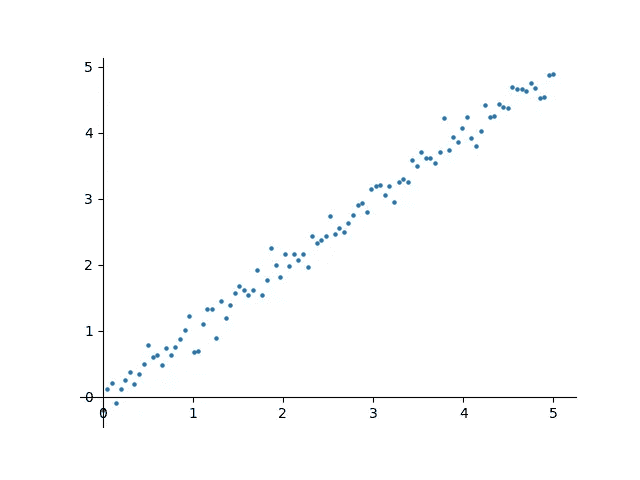

作者图片

目前，我们使用 2 个值来表示每个点。让我们用更专业的方式来解释这种情况。我们目前使用 2 个基函数，
x 为(1，0)，y 为(0，1)。数据集中的每个点都表示为这些基函数的加权和。例如，点(2，3)可以表示为 2(1，0) + 3(0，1) = (2，3)。如果我们忽略这些基函数中的任何一个，我们将无法准确地表示数据集中的点。因此，两个维度都是必要的，我们不能只去掉其中一个来降低存储需求。这组基函数实际上是二维的笛卡尔坐标。

如果我们仔细观察，我们可以很好地看到数据近似于一条线，如下面的红线所示。

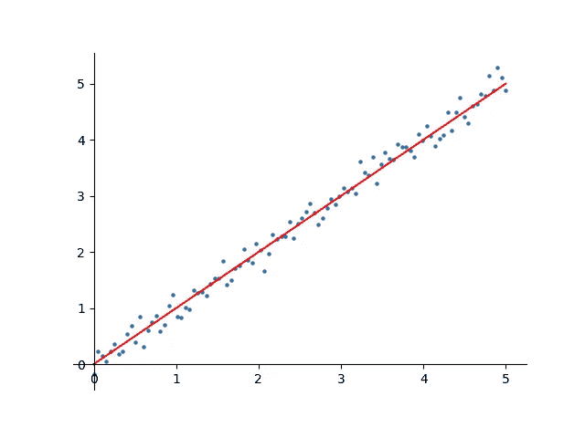

作者图片

现在，让我们旋转坐标系，使 x 轴沿着红线。然后，y 轴(绿线)将垂直于这条红线。让我们把这些新的 x 轴和 y 轴分别称为 **a 轴**和 **b 轴**。如下所示。

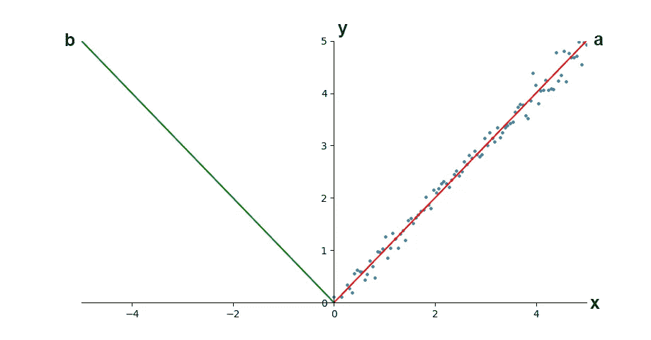

作者图片

现在，如果我们使用 **a** 和 **b** 作为这个数据集的新的集合基函数(而不是使用 **x** 和 **y** )，那么说数据集中的大部分方差沿着 **a 轴**不会错。现在，如果我们去掉 **b 轴，**我们仍然可以使用 **a 轴**非常精确地表示数据集中的点。因此，我们现在只需要一半的存储空间来存储数据集并准确地重建它。这正是 PCA 的工作原理。

**五氯苯甲醚是一个 4 步流程。**从包含 *n* 维的数据集开始(需要表示 *n* 轴):

*   找到一组新的基函数(*n*-轴)，其中一些轴对数据集中的方差贡献最大，而其他轴贡献很小。
*   按照方差贡献的降序排列这些轴。
*   现在，选择要使用的顶部 *k* 轴，放下剩余的 *n-k* 轴。
*   现在，将数据集投影到这些 *k* 轴上。

在这 4 个步骤之后，数据集将从 *n* 维压缩到仅 *k* 维( *k* < *n* )。

# 步伐

为了简单起见，让我们取上面的数据集，并在其上应用主成分分析。所涉及的步骤将是技术和线性代数的基本知识是假设。您可以在此处查看 Colab 笔记本:

 [## 主成分分析

colab.research.google.com](https://colab.research.google.com/drive/1QQcoE501NS9nPBAmlg12zQWHCT1IlI96) 

## 第一步

由于这是一个二维数据集， *n* =2。第一步是找到新的一组基函数( **a** & **b** )。在上面的解释中，我们看到数据集沿着一条线具有最大方差，我们手动选择这条线作为 **a** 轴，垂直于它的线作为 **b** 轴。实际上，我们希望这个步骤是自动化的。

为此，我们可以找到数据集协方差矩阵的特征值和特征向量。由于数据集是二维的，我们将得到 2 个特征值和它们相应的特征向量。然后，2 个特征向量是两个基函数(新轴),两个特征值告诉我们相应特征向量的方差贡献。特征值的大值意味着相应的特征向量(轴)对数据集的总方差的贡献更大。

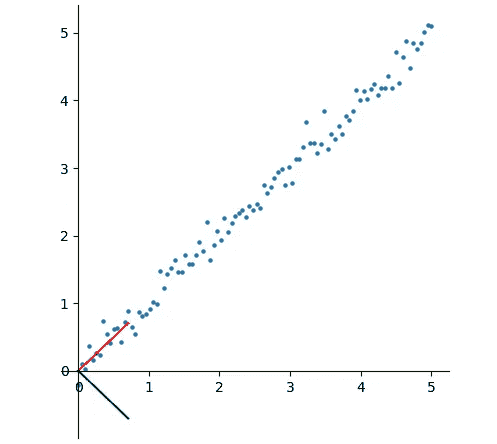

作者图片

## 第二步

现在，按照特征值递减对特征向量(轴)进行排序。这里，我们可以看到 **a 轴**的特征值比
**b 轴**的特征值大得多，这意味着 a 轴对数据集方差的贡献更大。

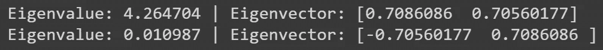

作者图片

每个轴对总数据集方差的百分比贡献可计算如下:

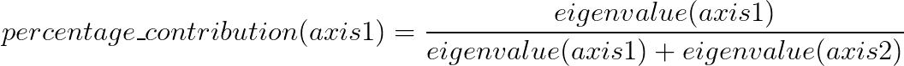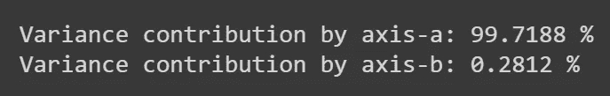

作者图片

上面的数字证明了 **a 轴**对数据集方差的贡献为 99.7%，我们可以去掉 **b 轴**，仅损失 0.28%的方差。

## 第三步

现在，我们将去掉 **b 轴**，只保留 **a 轴。**

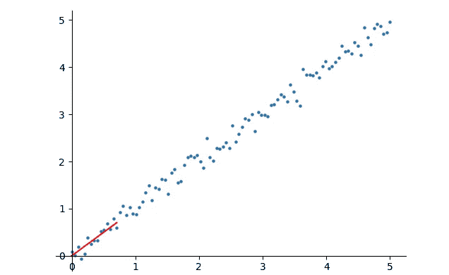

作者图片

## 第四步

现在，将第一个特征向量(a 轴)整形为一个 2x1 的矩阵，称为投影矩阵。它将用于将形状为
(100，2)的原始数据集投影到新的基函数(a 轴)上，从而将其压缩到(100，1)。

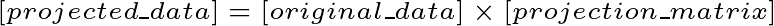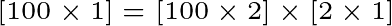

# 重建数据

现在，我们可以使用投影矩阵将数据扩展回其原始大小，当然会有很小的方差损失(0.28%)。

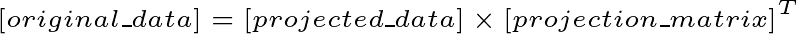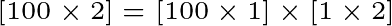

重建的数据如下所示:

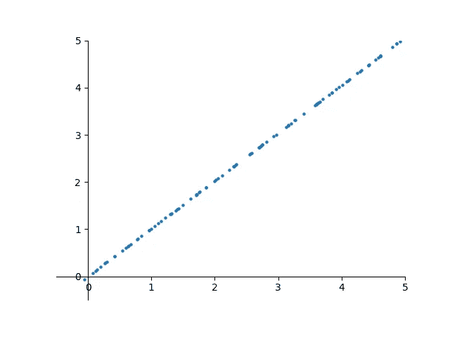

作者图片

请注意，沿 **b 轴**的方差(0.28%)丢失，如上图所示。

# 那都是乡亲们！

如果你成功了，向你致敬！在本文中，我们采用了一种图形化的方法来理解主成分分析是如何工作的，以及如何将其用于数据压缩。在我的下一篇文章中，我将展示如何使用 PCA 来压缩**在野外(LFW)标记的人脸，**由 13233 个人脸图像组成的大规模数据集。

有什么建议请留言评论。我定期写文章，所以你应该考虑关注我，在你的订阅中获得更多这样的文章。

如果你喜欢这篇文章，你可能也会喜欢这些:

 [## 机器学习-可视化

### 理解机器学习的视觉方法

towardsdatascience.com](/machine-learning-visualized-11965ecc645c)  [## 用 Pytorch 检测人脸标志点

### 想知道 Snapchat 或 Instagram 如何将惊人的滤镜应用到你的脸上吗？该软件检测你的关键点…

towardsdatascience.com](/face-landmarks-detection-with-pytorch-4b4852f5e9c4) 

访问我的[网站](http://arkalim.github.io/)了解更多关于我和我的工作。