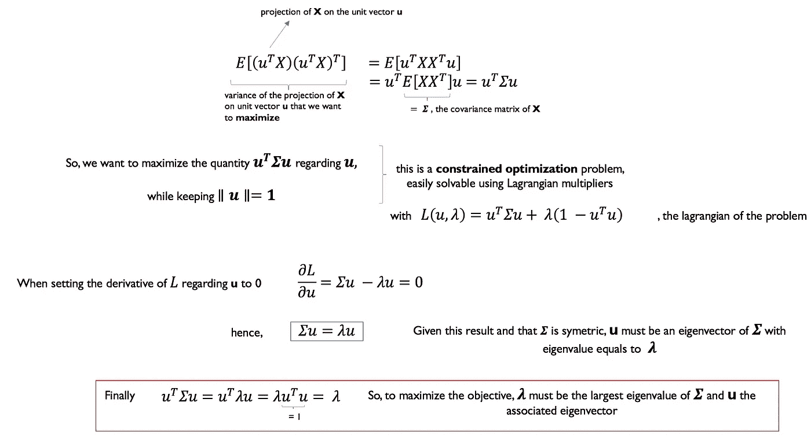
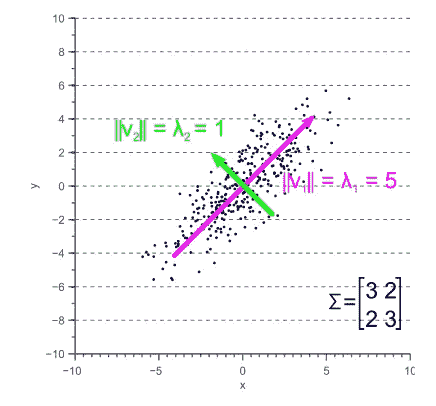
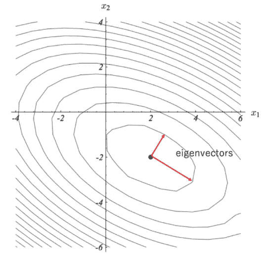

# 主成分分析解释

> 原文：<https://towardsdatascience.com/principal-components-analysis-explained-33e329cec1c4?source=collection_archive---------33----------------------->

## 用一些代数来理解 PCA 的工作原理🔧

蒂姆·莫斯霍尔德在 [Unsplash](https://unsplash.com/s/photos/car-engine?utm_source=unsplash&utm_medium=referral&utm_content=creditCopyText) 上的照片

P 主成分分析(PCA)是机器学习(ML)中最著名的算法之一，它旨在**降低你的数据的维度**或者执行**无监督聚类**。毫无疑问，五氯苯甲醚在世界范围内广泛使用🌍，在从金融到生物学的任何操纵数据的领域。

虽然有许多很好的资源给出了执行 PCA 的方法或对它所做的事情的很好的空间解释，但是很少有资源深入到它背后的数学概念的罩下。

虽然不需要理解数学就可以使用 PCA，但我坚信对算法的深刻理解会让你成为一个更好的用户，能够理解它在任何特定情况下的性能和缺点。此外，数学概念在 ML 中是相互联系的，理解 PCA 可以帮助你理解其他使用代数的 ML 概念(出于好奇，请查看图 3。在帖子末尾的后经文部分)。

这篇文章试图用背后的数学概念来解释不同的步骤。我假设读者已经熟悉代数基础。

首先，让我们回顾一下 PCA 方法，快速回顾一下不同的相关步骤:

1.  规范化你的数据，我们称之为规范化数据集 **X** 。 **X** 有 **N** 行(示例)和 **d** 列(维度)，是一个(N，d)矩阵
2.  计算协方差矩阵**σ**的**X**
    **σ**是一个(d，d)矩阵
3.  计算**σ**的特征向量和特征值
4.  对特征值最大的 k 个特征向量进行排序(这是 k 个主成分)，做 **W** ，这是一个(d，k)矩阵
5.  将原始数据集 **X** 投影到由步骤 4 排序的 k 个特征向量构成的低维空间上，即**W**
    **X’= XW**……**X’**准备就绪👨‍🍳！**X’**现在是一个(N，k)矩阵

鉴于 k**k<d**，我们摆脱了之前袭击我们🗡️的维度诅咒🐉

太酷了！但是，采用协方差矩阵并以某种方式将其与特征向量分解混合，如何能够在低维空间中捕获我们的数据集呢！？

要回答这个问题，是时候把手弄脏，看看 PCA 发动机的引擎盖下到底是怎么回事了！🛠️

**主成分分析的目标是将原始数据集投影到一个低维空间，该低维空间捕获原始数据集的大部分信息。**因此，我们应该问自己的第一个问题是:

> 什么获取了数据集的大部分信息？

PCA 背后的基本关系是，**方差捕获了数据集的大部分信息**。方差(离差)越大，信息就越多。因此，PCA 旨在找到一个保持最大 T4 方差的低维空间。

因此，第一个归一化步骤旨在归一化原始数据集的每个维度的范围，使每个维度的方差具有可比性。这里没有什么太疯狂的🙏🏻

太好了！但是现在我们明白了**最大方差**是在低维空间中保留原始数据集的大部分信息的关键，我们可以问:

> 如何找到一个保持方差最大的低维空间？

为了实现这一点，我们可以简单地从寻找向量 **u** 开始，当我们的数据集被投影到该向量上时，该向量捕获了最大的方差。

图一。具有最大特征值的特征向量指向最大方差的方向

我们刚刚说明了协方差矩阵σ的最大特征值的**特征向量指向最大方差方向**并且这个方向的方差为 **λ** 。

我们现在可以将我们的原始数据集 **X** 投影到 1 轴上，即向量 **u** ，这保留了其原始方差的最大值。但是，也许我们想再找一个轴，或者 k 个轴..？

没关系！我们简单地重复图 1 所示的相同过程。以上 **k 次**，每次增加一个新的约束:先前最大的(关于它们相关的特征值)特征向量必须与新的候选向量**正交**。

在这里，我们已经证明了协方差矩阵的**特征向量指向最大方差方向**，并且它们相关的特征值等于沿着这些方向的方差，正如图 2 所示。说明了它。

图二。协方差矩阵的特征向量指向最大方差方向[ [来源](https://www.visiondummy.com/2014/04/geometric-interpretation-covariance-matrix/)

最后，为什么我们选择具有最高特征值的 k 个特征向量来保留原始数据集的最大方差是显而易见的。

瞧啊！👌

**资源:**

*   有用的[主成分和特征向量的堆叠交换](https://math.stackexchange.com/questions/23596/why-is-the-eigenvector-of-a-covariance-matrix-equal-to-a-principal-component)
*   关于[协方差矩阵的几何解释](https://www.visiondummy.com/2014/04/geometric-interpretation-covariance-matrix/)的帖子不错
*   完成多伦多大学关于拉格朗日乘数和 PCA 用例的[课程](http://www.cs.toronto.edu/~mbrubake/teaching/C11/Handouts/LagrangeMultipliers.pdf)

[**PS**](http://l) :在神经网络优化中，计算损失函数的 **Hessian 矩阵**是有用的，以便帮助梯度下降步骤适应关于其方向的学习速率。简而言之，Hessian 展示了损失函数的梯度在任何方向上的变化有多快。

使用我们在 PCA 中看到的相同代数概念，现在有意义的是，Hessian 矩阵的特征向量指向最大曲率的方向，并且它们相关的特征值表示函数的曲率**在该方向。因此，在梯度下降更新期间，高曲率(高特征值)方向需要较低的学习速率，因为梯度在该方向上变化更快。
反之亦然，低曲率方向的学习率更高。**

图 3。特征向量或 Hessian 矩阵指向最大曲率方向[ [来源](https://mlexplained.com/2018/02/02/an-introduction-to-second-order-optimization-for-deep-learning-practitioners-basic-math-for-deep-learning-part-1/)