# 主成分分析解释

> 原文：<https://towardsdatascience.com/principal-components-analysis-explained-53f0639b2781?source=collection_archive---------21----------------------->

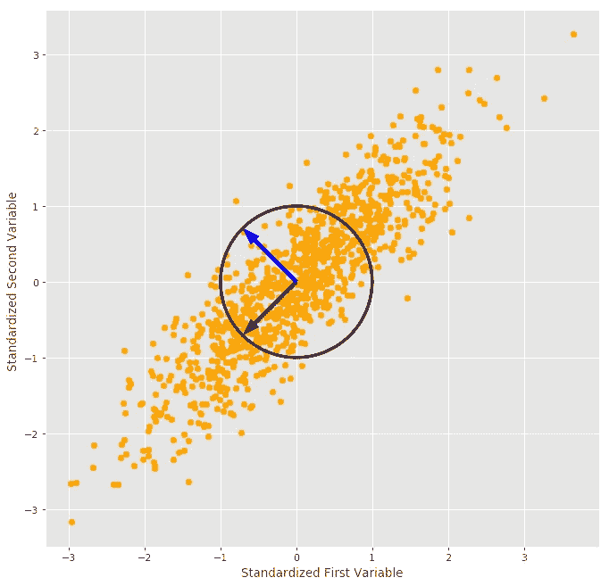

二维主成分分析；所有图片均由作者生成

## 它是什么，为什么有用，以及如何使用它

# 我们为什么需要 PCA？

在真实世界的数据集中，我们的许多变量是不重要的，或者是相互关联的。如果我们正在进行一项有监督的机器学习任务，留下与我们的目标变量无关的变量会降低我们训练数据中的信噪比，从而更难构建一个好的模型。在我们的训练数据中保留相关变量可能会导致多重共线性问题，具体取决于所使用的建模方法。

解决这些问题的一个可能的方法是去除不相关的变量。问题是如何决定一个变量是不相关的。您可以使用类似于通过 [Akaike 信息标准](https://en.wikipedia.org/wiki/Akaike_information_criterion)的[最佳子集选择](/origins-of-automl-best-subset-selection-1c40144d86df)或[递归特征消除](https://machinelearningmastery.com/rfe-feature-selection-in-python/)的技术(但不要使用逐步回归)，但是使用您的训练数据来选择要保留的变量会将偏差引入我们对均方误差和其他重要模型质量估计值的估计中。

解决这个问题的另一种方法是降维；这涉及到寻找数据的低维表示。如果我们可以找到原始数据的子空间，它保留了几乎所有的相关信息，我们就可以更容易地估计模型。如果子空间足够小，它可以使像聚类或依赖于距离度量的模型这样的任务成为可行的选择，因为我们避免了维数灾难。

寻找数据集的较低维度表示的最流行的方法是主成分分析(PCA ),其在训练数据集中寻找变量的线性组合，该线性组合最大化由每个线性组合解释的方差，服从一些约束。我们将在下一节深入探讨。

# 什么是 PCA？

假设我们有一个矩阵，有 n 行(观察值)和 k 列(变量)。让我们称这个矩阵为， **X** 。我们希望找到以下形式的线性组合:

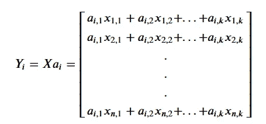

其中 ***𝑎*** *𝑖* 是列向量，i = 1，2，…，k，其解释了 **X** 中的最大变化量，并且每个线性组合与其他线性组合正交(成直角)。我们希望线性组合是相互正交的，这样每个主成分都可以获得不同的信息。

为了找到最大化线性组合方差的 **X** 列的线性组合，我们需要求解:

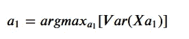

最大化线性组合方差的一种方法是使每列的权重无穷大。为了保持***【𝑎】***1 中的每个元素都不为无穷大，我们需要对***【𝑎】***1 施加一个约束。我们在 PCA 中这样做的方法是强制*1 中的平方元素之和为 1。因此，要找到第一个主成分，我们需要找到:*

*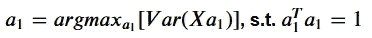*

*为了找到第二个主成分，我们需要附加一个约束条件，即 ***𝑎*** 2 与 ***𝑎*** 1 正交。*

*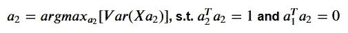*

*对于每个附加分量，直到我们达到 k，我们为所有前面的分量添加正交约束。*

*不需要迭代求解这些约束最大化问题，结果是数据的协方差矩阵的特征向量是主分量，所以我们可以直接求解。我们将样本协方差矩阵的特征向量按其对应的特征值(从大到小)排序，得到有序的主成分。特征值是由它们相应的特征向量解释的方差。*

*我假设你已经学过线性代数课程，所以我不会在这里介绍如何寻找特征向量和特征值，但是你可以在这里找到一个例子来复习如何手工计算。我也强烈推荐 [3Blue1Brown](https://www.youtube.com/channel/UCYO_jab_esuFRV4b17AJtAw) 的[视频](https://www.youtube.com/watch?v=PFDu9oVAE-g)进行图形化解读。如果你的线性代数课像我一样需要大量记忆，我推荐你观看 3Blue1Brown 的整个[线性代数精华系列](https://www.youtube.com/watch?v=fNk_zzaMoSs&list=PLZHQObOWTQDPD3MizzM2xVFitgF8hE_ab)。这些视频中的视觉效果真的帮助我理解了我之前刚刚记住的概念。*

# *我们如何执行 PCA？*

*使用[标准化](https://en.wikipedia.org/wiki/Feature_scaling#Standardization_(Z-score_Normalization))重新缩放 **X** 中的所有列非常重要，这样每个变量都在相同的刻度上。将所有变量放在同一个尺度上可以确保一个变量不会因其测量单位而主导一个主成分。*

*假设我们有一个矩阵， **X** ，有 n 行(观察值)和 k 列(变量)，其中每一列的平均值为 0，标准偏差为 1。*

***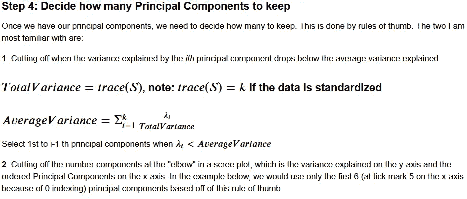**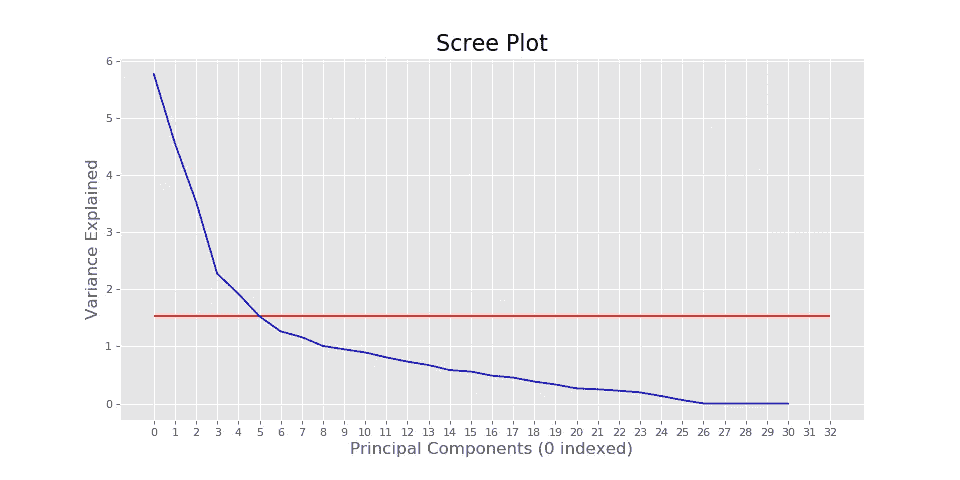*

*肘部有直线的碎石图示例*

**

*我们现在准备使用 **Z** ，一个被称为主成分得分的矩阵，用于聚类、回归或我们对原始数据集所做的任何事情。*

*我在下面构建了一个 Python 类，它能够执行 PCA，设置组件数量，并转换数据。*

*为了帮助可视化 PCA 正在做什么，我生成了一些二维随机数据，其中变量之间存在线性关系。生成数据后，我将其标准化以便绘图，并使 PCA 对象适合数据。然后我绘制了标准化数据和两个主成分。第一个是紫色，第二个是蓝色。如您所见，第一个主成分指向数据中变化最大的方向。第二个与第一个正交，指向数据中第二大变化的方向。我画了一个单位圆来强调每个向量的长度是 1。现在让我们将主成分分析应用于一个实际问题。*

**

*二维主成分分析*

# *我们在实践中如何使用 PCA？*

*为了给出 PCA 的实际例子，我使用了我从另一个项目中得到的一些数据。它包含 2015 年人口普查区域的人口统计数据，汇总到县一级。然后，我添加了希拉里·克林顿和唐纳德·特朗普在每个县的投票份额，并从中计算出谁赢得了该县。如果你想要我用来争论数据的原始数据和代码，给我发消息，我很乐意分享。*

*数据集中的变量包括总人口、性别比例、种族、民族背景、人们如何通勤和通勤持续时间，以及公开、私人、自营或失业人口的比例、各行业的就业比例和人均收入。*

*正如你可能会怀疑的那样，公共就业、私人就业、个体经营和失业的比例总和应该是 1。在这个数据集中有几组其他的变量符合同样的模式，这意味着一些变量是多余的。我们将在 PCA 中看到这一点。如果我们不做 PCA，我们将从每组线性相关列中删除一个变量，但我们将把它们留在这里。*

*我们将比较 K-Nearest Neighbors (K-NN)分类器对未转换数据和转换数据的性能，以预测特朗普或克林顿是否在该县赢得更多选票。这真的不是一个好问题，因为 2016 年美国大选已经结束，永远不会有新的观察结果可以预测。这个数据集将更适合于数据探索和确定什么样的人口特征与给定的选举结果相关联。也就是说，探索人口统计变量和 2016 年美国大选不是本文的重点；如何应用 PCA 是本节的重点。*

*我选择了 K-NN 分类器，因为它依赖于距离来找到离样本外观察值最近的点。随着维数的增加，数据点之间的距离越来越远(参见:[维数灾难](https://en.wikipedia.org/wiki/Curse_of_dimensionality))。出于这个原因，我们应该期望在线性组合捕获有意义的关系的条件下，在少量数据的线性组合上训练的 K-NN 分类器优于在原始数据集上训练的分类器。*

*既然我们已经分离了所有的数据，我们可以对训练人口统计变量执行 PCA。使用碎石图的经验法则，我们将保留数据的前 6 个主要成分。*

*当一个成分解释的方差低于解释的平均方差时停止，将导致我们保留前 9 个主成分。因为数据是标准化的，有 31 个变量，所以总方差是 31。用总方差除以变量数，得到 1。第 10 个主成分解释了总方差 31 中的约 0.9，因此低于该临界值。*

*因为在更高的维度上点之间的距离更远，为了建模的目的，我将使用前 6 个主成分，而不是前 9 个。*

*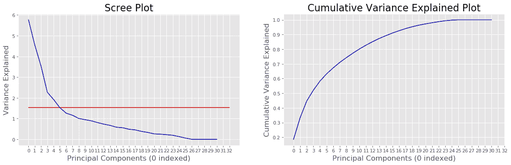*

*解释县人口统计数据的 Scree 图和累积方差*

*我打印出了下面最后 6 个主成分解释的方差，以及解释的总方差的比率和该比率的累积和。上面我说过一些变量是其他变量的固有线性组合。这显示在最后 5 个主成分中。最后 5 个解释了大约 0 的方差，表明有 5 个变量是其他变量的线性组合。*

*这些总计为 1 的变量组包括性别比例、种族和民族背景比例、行业就业比例、主要通勤方式比例和就业状况。所以尽管在未转换的数据中有 31 个变量，实际上只有 26 个。*

*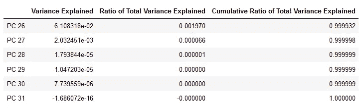*

*由最后 6 个主成分解释的差异*

*现在，让我们只保留前 6 个主成分，并转换测试人口统计变量。*

*虽然我们保留了 6 个主成分，但我们可以将前 3 个可视化，并添加颜色编码标签(蓝色代表克林顿获胜，红色代表特朗普获胜)。通过这样做，我们可以看到克林顿县和特朗普县在前 3 个主成分所跨越的空间中不是完全可分的，但是这些县之间在人口统计学上有明显的差异。*

*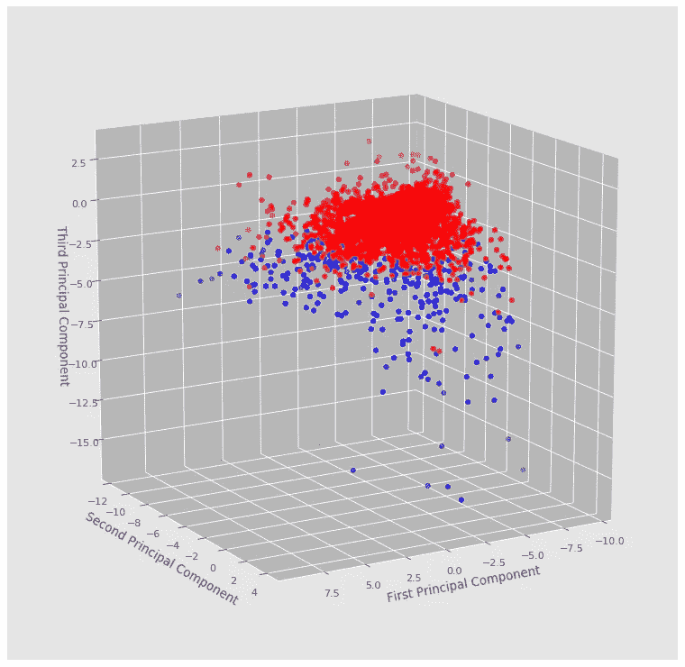*

*前 3 个主成分空间中的县图；红色是特朗普赢得更多选票的县，蓝色是克林顿赢得更多选票的县*

*现在是时候在未转换的数据上训练和测试 K-NN 分类器，并使用 PCA 对数据进行低维表示。*

*这里我们创建了 s [klearn 的 K-NN 分类器](https://scikit-learn.org/stable/modules/generated/sklearn.neighbors.KNeighborsClassifier.html)的一个实例，使用 5 个最近的邻居来分类观察值。点与点之间的距离用[欧几里德距离](https://en.wikipedia.org/wiki/Euclidean_distance#:~:text=In%20mathematics%2C%20the%20Euclidean%20distance,metric%20as%20the%20Pythagorean%20metric.)来衡量。我使用了反向距离加权，而不是均匀距离加权。*

*现在，让我们训练这两个模型，并获得对测试数据的预测。*

*现在让我们在测试集上比较每个模型的准确性。*

*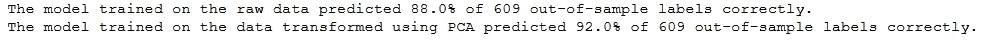*

*这里我们可以看到，在前 6 个主成分转换的数据上训练的 K-NN 分类器具有比在未转换的数据上训练的模型高 4 个百分点的样本外准确度！*

*通过找到变量的一些线性组合，我们能够在数据点更接近的低维空间中捕捉重要信息，从而提高 K-NN 模型的准确性！*

*我希望你现在对 PCA 有一个直观的理解，为什么它有用，如何估计它(如果出于某种原因你不想使用来自像 [scikit-learn](https://scikit-learn.org/stable/modules/generated/sklearn.decomposition.PCA.html) 这样的来源的快速和稳定的实现)，以及如何将它应用到一个实际问题中。感谢阅读到最后！*

*你可以在这里找到用来做这篇文章[的笔记本。](https://github.com/jkclem/PCA-from-Almost-Scratch/)*