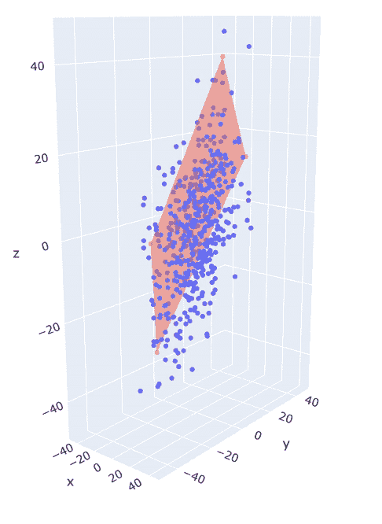
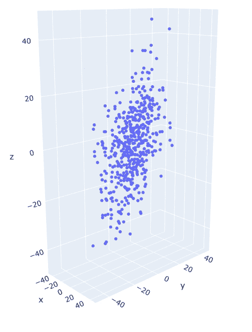
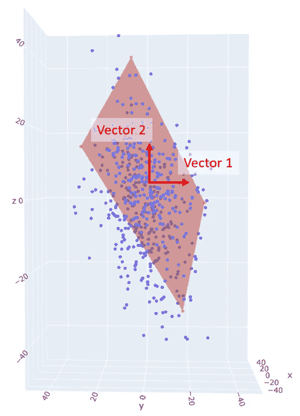
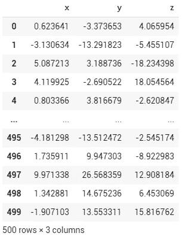
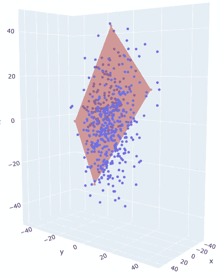
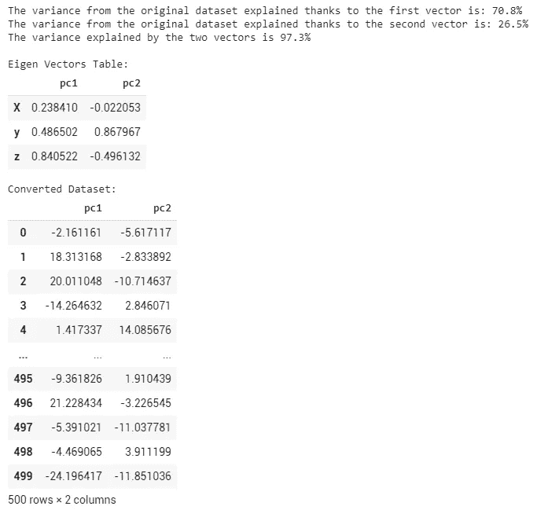
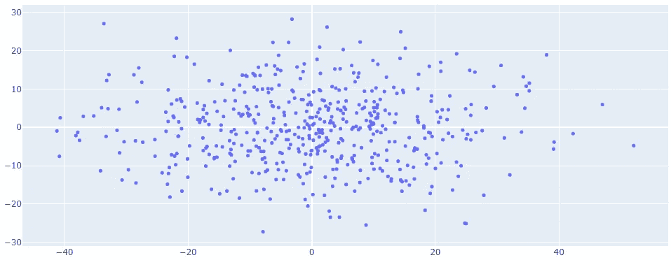
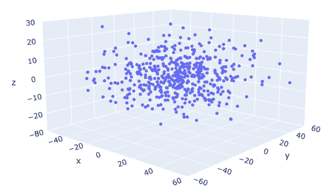
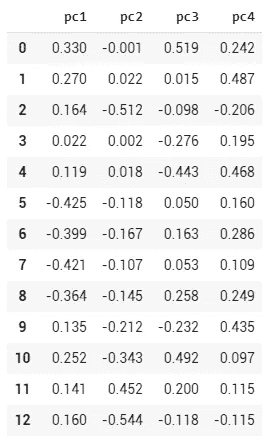
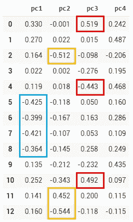

# 主成分分析(PCA)，行业的基本原理、优势和见解

> 原文：<https://towardsdatascience.com/principal-components-analysis-pca-fundamentals-benefits-insights-for-industry-2f03ad18c4d7?source=collection_archive---------40----------------------->

## 了解为什么 PCA 不仅可以减少维度和节省计算时间，还可以避免多重共线性，更好地理解工业过程行为。

具有可能的 2D 缩减计划的三维空间

如果您已经探索数据科学有一段时间了，您可能会遇到使用降维的文章或案例，其最著名的方法是:**主成分分析**(又名 PCA)。

降维通常被视为减少大型数据集中的特征数量而不丧失其重要性(=方差)的一种实用方法。直接的好处是减少建模所需的计算能力和时间。我会在下面解释为什么这个比那个多得多！

如果你还不熟悉(还没有！)用这种方法，这里有一个小介绍让你入行。

# 降维背后的直觉

让我们从一个非常简单的例子开始，其中数据集的 3 个特征(x、y 和 z)显示在下面的 3D 空间中(代码如下):

围绕 x、y 和 z 轴显示的原始数据集。

你可以很容易地注意到，尽管有 3 个维度，散点图主要分布在“y”和“z”周围；围绕“x”轴的变化相当低。

如果我们必须对这个数据集建模，那么与“y”和“z”相比,“x”维度有多重要？大概没那么多吧！

因此，代替使用 3 个坐标[x，y，z]来识别这个 3D 空间中的一个点，[y，z]可能已经是这个点在哪里的良好指示。不是吗？

我们甚至可以更进一步，想象一个 2D 计划，按照这个计划，沿着 x 轴排列点，并用 2 个坐标指定点的位置！可能会是这样的:

带有可能的 2D 缩减计划的原始数据集

由于这个红色 2D 计划和它的两个相应的向量，我们只需要两个坐标来准确地确定每个点的位置。

显然，我们丢失了一些关于每个点根据原始 x 轴的“深度”的信息，但这是我们愿意冒的风险！

如果你对了这个例子，你就知道什么是降维了！

# 让我们深入研究代码并发现特征向量

我们使用 3 种略有不同的正态分布来创建 3 个要素的虚拟数据集:

Plotly Scatter3D 将以互动方式显示我们的数据集:

像往常一样，Scikit-Learn 库提供了一种实现[主成分分析](https://scikit-learn.org/stable/modules/generated/sklearn.decomposition.PCA.html)的实用方法:

> 我们可以注意到，缩减的数据集仍然保留了原始数据集方差的 97%!

让我们以二维和三维显示这个新数据集:

点分布在特征向量 1 和 2 周围

(请注意，这里的 x、y 和 z 轴与原始数据集中的轴无关)

关于**特征向量**，应该认为是原空间到降维空间的转换矩阵。

这个过程的美妙之处在于，出于可视化的目的，我们将这里的示例限制为 3 维，但它可以在 n 维中实现！

# 降维的额外好处是什么？

我们通常使用降维来对抗“维数灾难”，这可以用几个原则来概括:

*   数据集包含的要素越多，模型就越复杂……导致所需的计算时间、功耗和存储空间越大。
*   通过尝试包含数据集的整体复杂性，模型将更有可能过度适应训练示例。
*   随着特征数量的增加，很难获得在整个可能性“宇宙”中均匀分布的代表性样本

# **但是等等，还有更多！**

通常会在数据集中发现冗余特征:例如:年龄、年龄等级、出生年份等。

具有以非常接近的方式变化的特征被称为 [**多重共线性**](https://en.wikipedia.org/wiki/Multicollinearity#Consequences_of_multicollinearity) 并且它可以严重影响线性模型:系数将不能代表它们对目标的真实影响，并且最重要的是，训练数据中的微小变化可以显著改变分配给每个特征的系数的值，有时甚至导致符号转换！

# 为什么降维在工业中很重要？

当然，在对工业过程建模时，上面提到的所有原因仍然成立，但我想补充以下几点:

*   **使用主成分(如果您正在使用 PCA)将防止您创建与物理约束不匹配的模型。**
    举个例子，我们可以假设一个产品的湿度和加热过程温度成反比(加热越多，得到的水分越少！).
    这两个原始特征将在同一个向量上**对齐和相对**，因此，通过从这个减少的维度中学习，您的模型无法推断出原始特征同时增加或减少的行为。
*   **如果您的测量系统不平衡，Principal Components 将使提供给模型的输入合理化。**假设您在过程开始时有 6 个温度传感器，结束时只有 2 个。该模型会在数学上给你的过程的开始分配更多的权重，而它们应该被同等对待。假设上游和下游温度以不同的方式变化，将从这 8 个特征中仅提取两个主成分(上游- > PC1，下游->PC2)；这也将防止引入多重共线性。
*   **它还能使你的过程中潜在的物理、机械或化学现象变得清晰。**让我们拍一个真实的(但经过消毒的！)举例说明这一优势:

我正在处理的原始数据集由 13 个要素 x 5000+行组成。在应用主成分分析后，我发现只有 4 个主成分就足以保持 95%的原始方差！

对应的特征向量描述如下(注意:它们的值在-1 和 1 之间变化。它们离极端值越近，与原始特征的相关性就越强):

原始特征向量

我突出显示了主要组件与 pc1、pc2 和 pc3 上的原始功能紧密关联的坐标，但没有描述原始功能是什么:

我们注意到三组特征:

*   5、6、7 和 8(蓝色)
*   2、11 和 12(橙色)
*   0、4 和 10(红色)

让我们来揭示一下原始特征所对应的内容:

在这里我们可以清楚地看到:

*   **PC1** 对应于过程中的**物理流量**，与储罐填充相关联
*   **PC2** 对应**产品的物理特性**变化。此外，我们注意到湿度与干物质和粘度相反。
*   **PC3** 对应**产品温度**变化。

> 除了上面提到的所有好处之外，降维显然可以带来关于工业过程中发生的现象的透明度，为团队带来有价值的见解！

像往常一样，我希望你喜欢发现什么是降维，它的好处，以及它可以为工业案例带来什么！

值得一提的是，除了 PCA 之外，还有很多降维技术:线性、非线性、自动编码器等。它们有据可查；选择权在你！

敬请期待！

 [## 皮埃尔-路易·贝斯康德关于媒介的文章

### 数据科学、机器学习和创新

pl-bescond.medium.com](https://pl-bescond.medium.com/pierre-louis-besconds-articles-on-medium-f6632a6895ad)