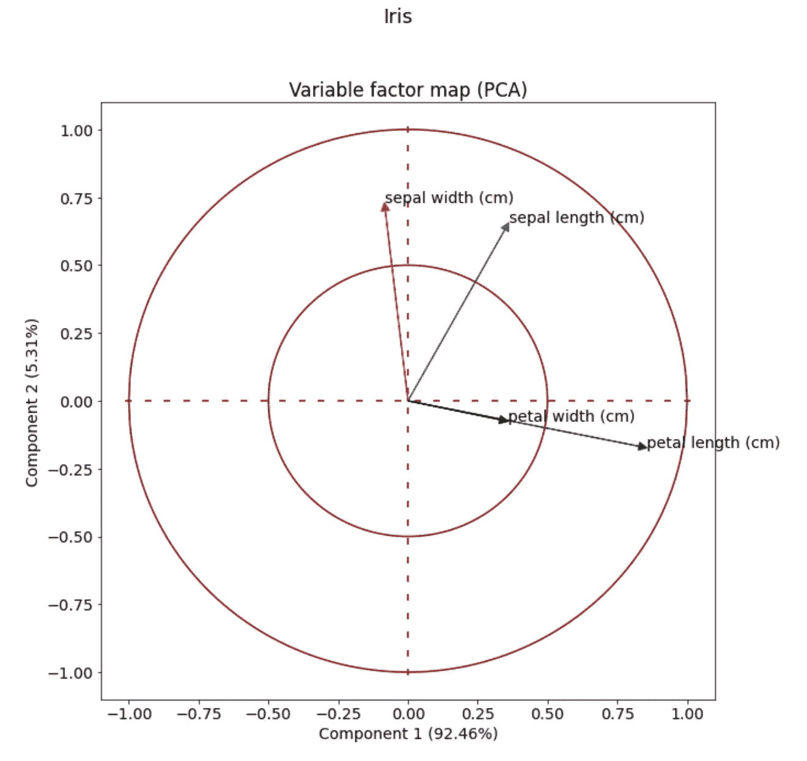
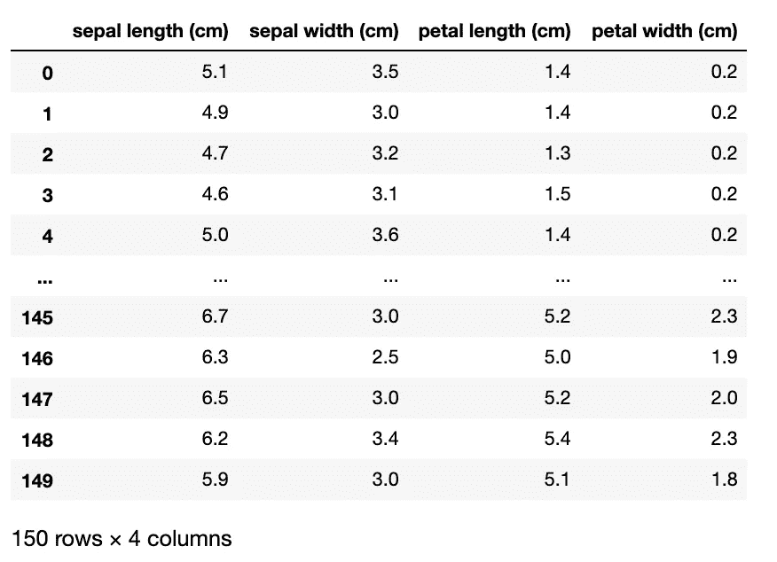
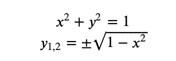
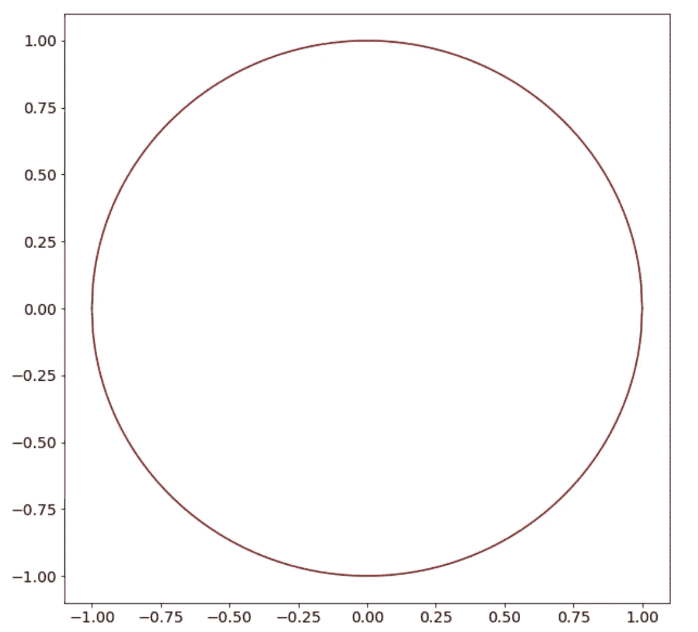
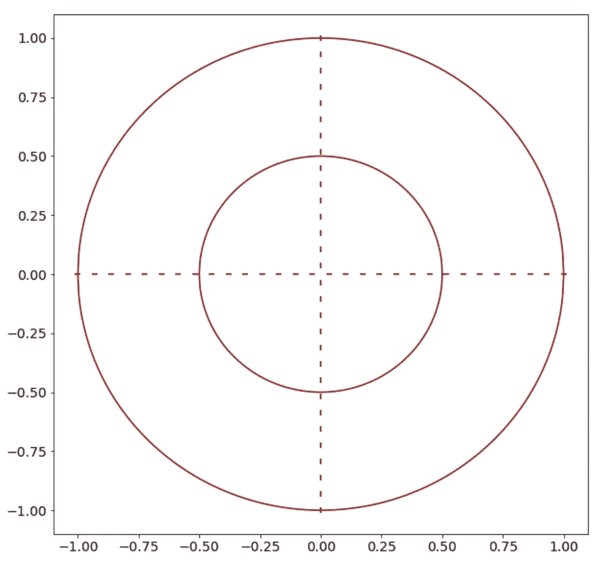
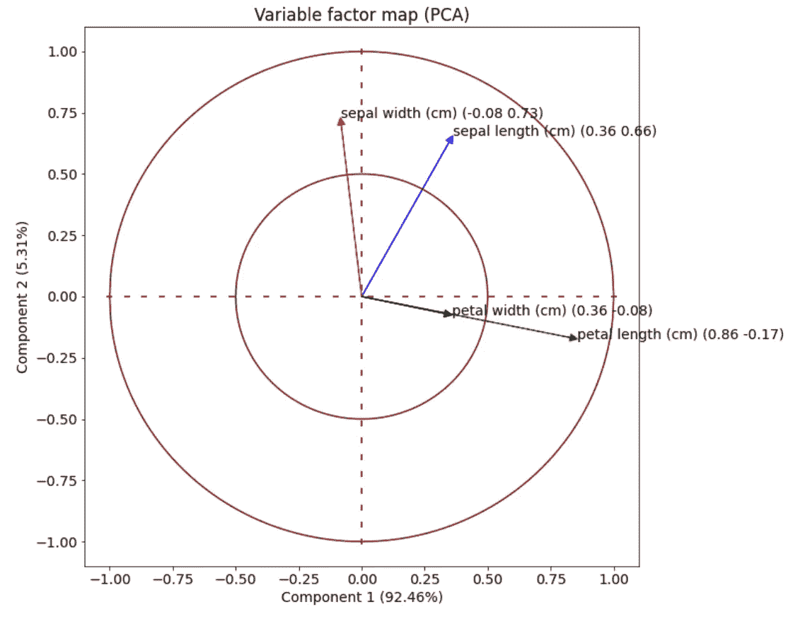

# 使用 Python 创建可变因子图(PCA)图

> 原文：<https://towardsdatascience.com/principal-components-analysis-plot-for-python-311013a33cd9?source=collection_archive---------15----------------------->

## 在本教程中，我将向你展示如何一步一步地使用 matplotlib 创建可变因子图



作者图片

# 一.导言

分析中最有趣的活动之一是使用漂亮的可视化工具。有了**变量因子图**，就可以轻松解释**主成分** **分析**。一张图胜过千言万语

主成分分析(PCA)是一种降维方法，用于降低大型数据集的维数。它将多个要素转换为数量少得多的新要素，同时保留原始数据的大部分信息和可变性。

如果特征的数量是 2，我们可以将它们放入 2D 图中，并想象不同的特征如何影响每个新的组成部分。上图中，来自**虹膜数据集**的**四个特征**(萼片宽度、萼片长度、花瓣宽度、花瓣长度)被压缩成**两个**。它们是**组件 1** (y 轴)和**组件 2** (x 轴)，保持了原始数据集 97.77%的信息。四个向量表示这两个分量如何解释四个原始特征。

# 二。编码

代码是使用 Python 和`matplotlib`的最少知识创建的。我相信简单是所有真正优雅的基调。创建这个情节有三个重要步骤

*   数据准备
*   PCA 分解
*   情节

## 1)数据准备

我们首先从`sklearn`导入虹膜数据集

```
from sklearn import datasets
import pandas as pd
iris = datasets.load_iris()X=pd.DataFrame(data=iris.data,columns=iris.feature_names)
X
```



iris 数据集有 4 个特征，我们希望将这 4 个部分转换为之前讨论过的 2 个部分。

## 2) PCA 分解

`scikit-learn`包使得 PCA 方法变得非常方便，我们需要做的就是从`sklearn`分解库中导入 PCA。

```
from sklearn.decomposition import PCAcolumns=X.columns.values #Store the name of the columns for labeling
pca=PCA(n_components=2)
pca.fit(X)
pca_values=pca.components_
pca.components_
```


我们定义`n_component=2`，用`fit`的方法训练模型，存储 PCA `components_`。这些`components_`代表特征空间中的主轴。这里的两个数组表示 4 个特征的(x，y)坐标。稍后我们将在单位圆上用 4 个向量来画出这些点，这就是有趣的地方。

# 3)情节

## a)圆圈

让我们首先调整字体和大小的阴谋

```
import matplotlib.pyplot as plt

plt.figure(figsize=(10,10))
plt.rcParams.update({'font.size': 14})
```

下一步是画一个圆。我们将使用圆形函数



```
#Plot circle#Create a list of 500 points with equal spacing between -1 and 1import numpy as np
x=np.linspace(start=-1,stop=1,num=500)#Find y1 and y2 for these points
y_positive=lambda x: np.sqrt(1-x**2) 
y_negative=lambda x: -np.sqrt(1-x**2)
plt.plot(x,list(map(y_positive, x)), color='maroon')
plt.plot(x,list(map(y_negative, x)),color='maroon')
```



作者图片

如果你不知道[λ](https://www.w3schools.com/python/python_lambda.asp)或 [map](https://www.w3schools.com/python/ref_func_map.asp) 函数，你应该把这些有用的方法放进你的工具箱

我们将用同样的逻辑画一个更小的圆，只是为了更美观

```
#Plot smaller circle
x=np.linspace(start=-0.5,stop=0.5,num=500)
y_positive=lambda x: np.sqrt(0.5**2-x**2) 
y_negative=lambda x: -np.sqrt(0.5**2-x**2)
plt.plot(x,list(map(y_positive, x)), color='maroon')
plt.plot(x,list(map(y_negative, x)),color='maroon')
```

让我们也添加 x 轴和 y 轴，这也是完全可选的！

```
#Create broken lines
x=np.linspace(start=-1,stop=1,num=30)
plt.scatter(x,[0]*len(x), marker='_',color='maroon')
plt.scatter([0]*len(x), x, marker='|',color='maroon')
```



作者图片

如果你完成了这一步，你就完成了一半。给自己一个鼓励！

## b)矢量

在绘制矢量之前，让我们定义将要使用的颜色。下面的代码为相应的特征定义了 6 种不同的颜色，如果特征多于 6 个，颜色列表将重复其循环。

```
#Define color list
colors = ['blue', 'red', 'green', 'black', 'purple', 'brown']
if len(pca_values[0]) > 6:
    colors=colors*(int(len(pca_values[0])/6)+1)
```

现在让我们画出向量并标记它们

```
add_string=""
for i in range(len(pca_values[0])):
    xi=pca_values[0][i]
    yi=pca_values[1][i]
    plt.arrow(0,0, 
              dx=xi, dy=yi, 
              head_width=0.03, head_length=0.03, 
              color=colors[i], length_includes_head=True) add_string=f" ({round(xi,2)} {round(yi,2)})"
    plt.text(pca_values[0, i], 
             pca_values[1, i] , 
             s=columns[i] + add_string )
```

函数`plt.arrow`取向量的起点和终点。这里，初始点是原点(0，0)，端点是先前从 PCA 分量方法获得的。

最后，我们为剧情添加一些其他的化妆品。

```
plt.xlabel(f"Component 1 ({round(pca.explained_variance_ratio_[0]*100,2)}%)")
plt.ylabel(f"Component 2 ({round(pca.explained_variance_ratio_[1]*100,2)}%)")
plt.title('Variable factor map (PCA)')
plt.show()
```



作者图片

# 三.结论

您也可以通过执行以下操作来导入上述代码

```
pip install -i [https://test.pypi.org/simple/](https://test.pypi.org/simple/) variable-factor-map-Huy-Bui==0.0.3from variable_factor_map import pca_map 
from sklearn import datasets
import pandas as pdiris = datasets.load_iris()
X=pd.DataFrame(data=iris.data,columns=iris.feature_names)pca_map(X, figsize=(10,10), sup="Iris", print_values= False)
```

`pca_map`功能有 4 个输入:

*   **X** :熊猫数据框
*   **figsize** (float，float):输出的宽度和高度。默认值为(10，10)
*   **sup** (字符串):剧情标题。默认值为空字符串
*   **打印值**(布尔):显示矢量值。默认值为 False

也可以访问我的 [GitHub](https://github.com/williamhuybui/PCA_Variable_Factor_Map) 看源代码。玩 Python 玩得开心！