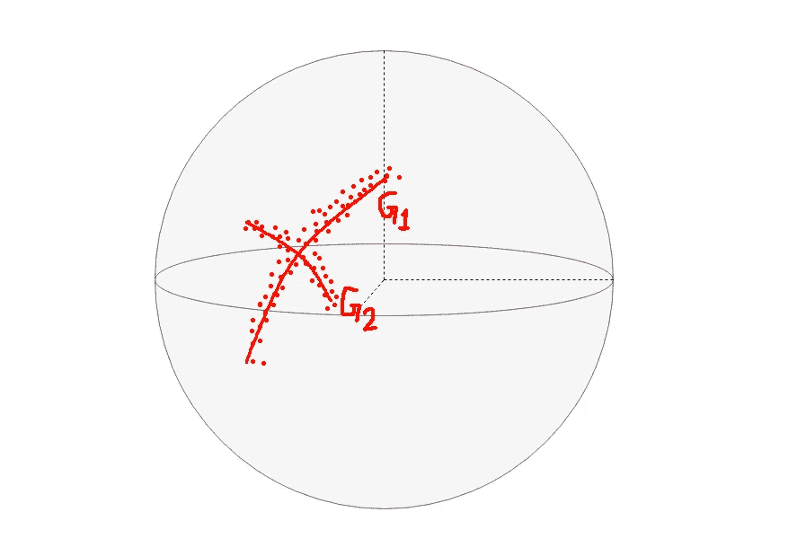
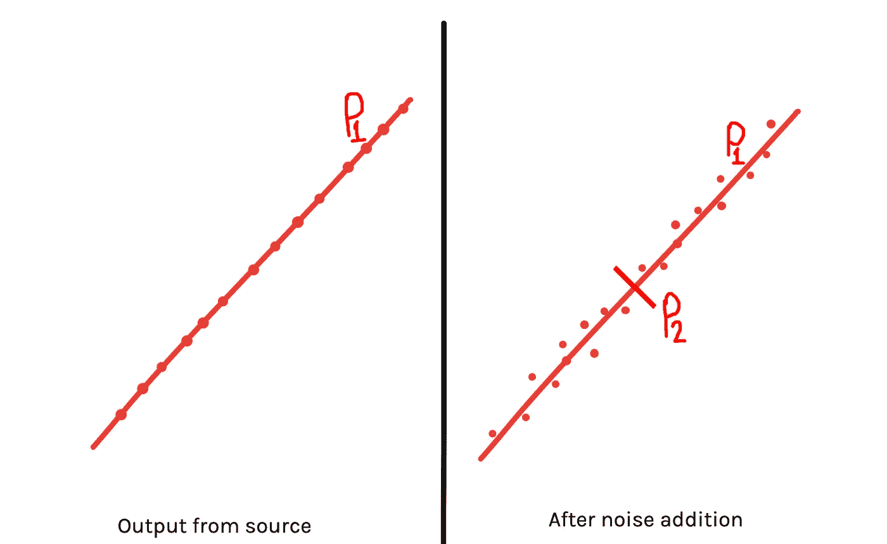
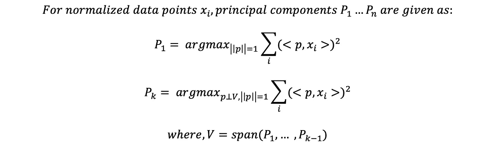
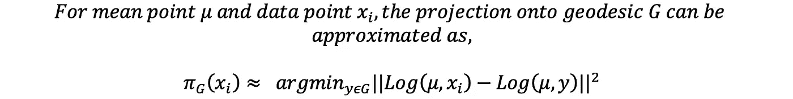
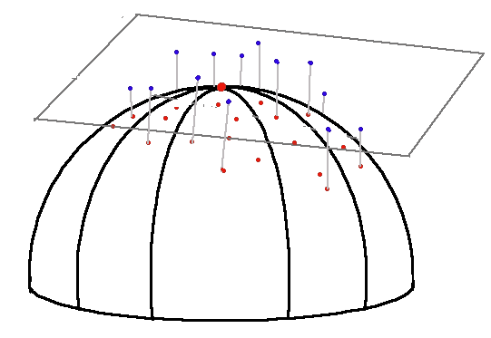
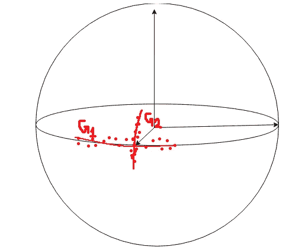

# 主测地线分析

> 原文：<https://towardsdatascience.com/principal-geodesic-analysis-2ec7ad1b2679?source=collection_archive---------24----------------------->

## 机器学习遇上黎曼几何

这是我写的第二篇关于黎曼流形中机器学习的文章。这次是将**主成分分析**推广到黎曼空间。希望读者对 PCA 有所了解。再次回忆一下 PCA，下面这篇文章可以帮助[理解主成分分析](https://heartbeat.fritz.ai/understanding-the-mathematics-behind-principal-component-analysis-efd7c9ff0bb3)背后的数学原理。我还推荐读者阅读我之前关于[测地回归](https://paribeshregmi.medium.com/geodesic-regression-d0334de2d9d8)的文章，其中讨论了黎曼几何中必要的概念。

图 1:主要测地线分析(图片由作者提供)

# PCA 一瞥

PCA 是一种众所周知的数据分析技术，它用数据的主要成分来表示数据。PCA 的两个众所周知的应用是降噪和降维。让我们用一个简单的降噪例子来回顾一下 PCA。

真实世界的数据是嘈杂的。噪声可以由我们收集数据的环境或收集过程本身引入。让我们讨论图 2 中的场景。

图 PCA 降噪(图片由作者提供)

左边的点状数据点是源的输出。正如我们所见，源可以用线 **P1** 完美地模拟，这意味着源的输出本质是一维的。P1 是这个案件中的主要角色。在右边，我们可以看到，当源输出被噪声污染时，仅用 **P1** 并不存在完美的拟合。数据点现在倾向于在垂直于直线的维度上延伸。为了在这里得到完美的拟合，我们需要另一个主分量 **P2** 垂直于 **P1** 。现在，我们可以将噪声数据点表示为 **P1** 和 **P2** 的线性组合。

当我们要通过分析噪声数据来建模一个源时，我们需要找到一种方法来消除噪声的影响，以便更好地建模。常设仲裁院服务于这一目的。当我们将数据投影到主成分中时，我们可以清楚地看到每个成分的重要性。如图 2 所示，分量 **P2** 不如 **P1** 明显，我们可以推断 **P2** 是由噪声引起的，与数据源没有什么关系。在这种情况下， **P2** 可以作为噪声被丢弃，而 **P1** 可以用于对源进行建模。噪声分量不太明显的事实是因为噪声值之间的相关性较小或没有相关性，而源输出是高度相关的。

同样，像图像这样的数据，尽管有成千上万的维度，但大部分信息只包含在它们为数不多的几个主要成分中。因此，当我们对这些数据进行处理时，可以丢弃不重要的成分，只保留少数重要的成分，从而大大降低维度。这将提高数据处理的效率。

计算 PCA 的方法有很多，最有效的一种是计算数据矩阵的**奇异值分解(SVD)** 。从数学上讲，主要主成分是数据点投影方差最大的成分。

# 主测地线分析(PGA)

就像在以前的文章中我们将线性回归扩展到位于黎曼空间中的数据一样，我们现在将扩展 PCA 以寻找位于相同空间中的数据的主成分。这被称为主要测地线分析，我们将找出代表给定数据的主要测地线。

**我们将利用上一篇文章中讨论的数学知识。因此，如果您还没有阅读，我再次建议您在继续阅读本文之前先浏览一遍。**

在进入 PGA 之前，我们先定义一下黎曼空间中的均值概念，我们称之为**内禀均值**。

## **内在均值**

一组数据点的平均值是一个点，所有数据点到该点的距离之和最小。

在欧几里得空间中，这很容易通过将所有数据点的总矢量和除以数据点的数量来计算。但是，在一般流形中，不能保证平均的唯一存在。然而，如果我们有一个很好的本地化的数据集，均值是存在的，并且是唯一的。计算平均值需要求解函数的梯度下降优化:

其中梯度由下式给出:

既然我们已经定义了平均值，我们可以继续定义主测地线。请注意，定义测地线需要定义两个参数:一个点和该点切线空间中的一个向量，测地线由参数计算的指数图给出。

在 PGA 中，主测地线被定义为它们都通过中间点。既然我们已经算出了平均值，现在我们需要算出它的切空间中的一个向量。像在 PCA 中一样，主测地线是一条曲线，它具有数据点投影到其上的最高方差。数学上,(测地线的)矢量参数可定义为:

我们可以归一化 PCA 中的数据点，将它们的平均值转换为零，因为一组数据点在缩放、转换或旋转时携带相似的信息。然而，这样的事情在黎曼流形上是不可能的。上式中的主要挑战是求数据点在测地线 g 上投影的大小，我们来讨论一下投影的计算。

## **投影到测地线:**

显而易见，测地线 ***G*** 中任意一点 ***x*** 的投影定义为:

我们现在将在中点处线性化流形，并在切空间中近似投影。测地线 ***G*** 穿过平均值。把流形线性化是指把流形的一个小空间看成是我们可以进行向量运算的欧氏空间。因此，投影的值可以通过近似 ***Log(x，y)*** 来近似为:

我们可以将投影的对数图表示为:

但是我们这里需要的实际上是平均值的投影长度，因此我们需要对数图的大小。

我们可以看到，在线性化流形时，投影简单地减少到最小化向量距离，并且投影的大小类似于我们在向量空间中所做的。因此，对于这种情况，我们可以将上述最小化的解写成类似于 PCA，即点积:

最后，PGA 问题归结为 PCA 问题:

# PGA 作为 PCA 问题

我们所做的所有近似都是将 PGA 问题转化为 PCA 问题。万一事情变得混乱，我们可以用 3 个步骤来总结一切:

图 3:将数据点映射到切线空间(图片由作者提供)

1.  计算数据点的平均值。
2.  平均实现切空间，通过对数映射将每个数据点映射到切空间。图 3 是一个例子，其中红点是球形流形上的数据点，其平均值是最高点，极点。在极点处绘制切空间，通过对数映射将数据点从流形映射到切平面。映射的点用蓝点标记。

3.计算映射值{ **vi** }的 PCA。图 3 中的蓝点是切空间中的点，因此可以通过欧几里德运算找到 PCA。获得的 PCA 值和平均值的指数图将定义主测地线。

# **在球形流形上实现**

让我们在球面流形上进行一个简单的 PGA 的例子。让我们像在测地线回归中一样定义一些函数:

(作者代码)

现在，我们将生成合成数据并对其进行 PGA。我们将获取位于两条测地线的数据点，切线向量 **v1** 和 **v2** 以点 **p** 为中心，并向它们添加随机噪声以获得我们的数据点。此外，沿第一条测地线有 20 个点，沿第二条测地线有 10 个点。最后，我们将连接数据点以创建数据矩阵 **y** 。

(作者代码)

现在，计算主测地线相当简单。我们将只执行前一节中描述的 3 个步骤。

(作者代码)

我们可以看到，我们得到的两个主要主向量(按照大小递减的顺序)与我们在生成数据点时使用的向量 **v1** 和 **v2** 具有相似的方向，并且平均值也接近于 **p** 。请注意，我们不需要将 **v1** 和 **v2** 的大小与获得的主向量进行比较，因为我们感兴趣的是找出主测地线，重要的只是测地线方向的位置和方向。此外，主向量大小的变化会改变测地线的长度，但这种改变并不显著。

最后，我们可以定义测地线的指数地图的平均和两个主要的主向量获得。图 4 详细描述了示例中的场景:

图 4: PGA(图片由作者提供)

虚线点是沿两条测地线合成的数据点，两条红色曲线是与数据点拟合的测地线 **G1** 和 **G2** 。数据点的交点就是中间点。因此，我们可以清楚地看到，我们已经用两个主测地线表示了数据点。

# 参考

1.  形状非线性统计研究中的主测地线分析。[http://www . cs . jhu . edu/~ misha/reading seminar/Papers/Fletcher 04 . pdf](http://www.cs.jhu.edu/~misha/ReadingSeminar/Papers/Fletcher04.pdf)
2.  流形值统计，精确主测地线分析，以及线性近似的影响。[http://image.diku.dk/hauberg/sommeretal10.pdf](http://image.diku.dk/hauberg/sommeretal10.pdf)