# 非主干专业的主成分分析

> 原文：<https://towardsdatascience.com/principle-component-analysis-for-the-non-stem-major-a6080bb646bd?source=collection_archive---------41----------------------->

## 了解 PCA 背后的直觉

正如您可能已经知道的，数据可视化是一种非常有用的数据分析技术，可以帮助我们识别模式、趋势和群体。无论您是否是可视化学习者，数据可视化都可以在您未来的项目中很好地为您服务。通过这篇文章，我们将看到更高维数据集的局限性，并理解主成分分析(PCA)作为一种解决方案背后的直觉，而无需过于深入数学理论。

数据可能非常多样化，有各种各样的形状和大小，当我们面对一个从未见过的数据时，有时我们可能会感到害怕，尤其是当它的结构有点吓人时。在学校里，我们可能有机会分析用很少变量，也许是两三个变量清晰格式化的数据。在我们第一次看到真实世界时，我们面对的是一个包含 20 个变量的数据集(*现在这很可怕*)！因此，我将解释高维数据出现的问题，以及 PCA 如何解决这样的问题。

# **概念动机**

考虑这种情况，我们有一个有 N 个观察值和单个变量的数据集。**问题是:**

> **我们能够可视化单个变量吗？**

为了可视化 1 维的情况，我们可以用一个线形图来实现，该线形图为每个观察值绘制了一个点，该点对应于沿着数字线的特定变量的相应值。

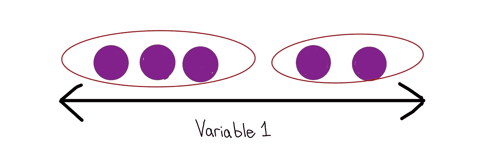

绘制一维图(为简单起见，绘制了 5 个样本)

太好了！当只有一个变量时，我们能够将数据可视化。通过这个一维图，我们能够看到，有些观察结果倾向于低端，而其他观察结果倾向于高端(*数据可视化的威力...我说的对吗？*)

然而，这只是一维的情况。让我们再问一次这个问题:

> 我们能一起想象两个变量吗？

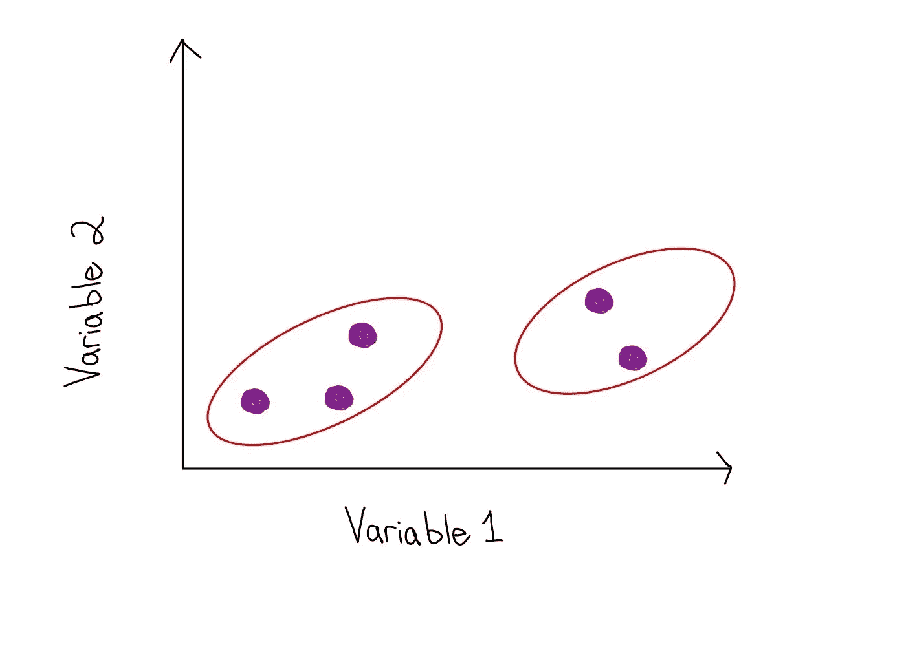

绘制二维图(为简单起见，绘制了 5 个样本)

看起来棒极了！同样，我们能够为 1 维和 2 维情况创建一个数据图。让我们再一次问这个问题:

> 我们能否将三个变量的数据可视化？

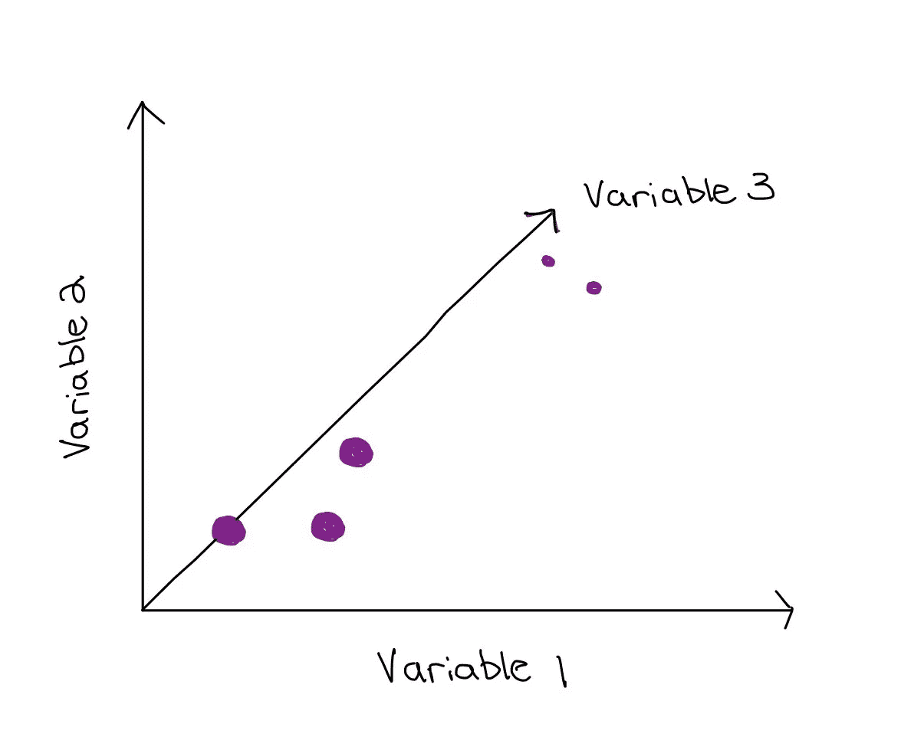

绘制三维图(为简单起见，绘制了 5 个样本)

**那么有什么问题呢？**

现在让我们试着一次可视化 4 个变量(*等等……我们不能这么做*)。然而，可视化 4 维和更高维度的空间实际上是不可能的( *bummer* )。因此，当涉及到高维数据集时，我们可以看到有两个问题:

1.  我们无法想象大于 3 的维度
2.  随着维度数量的增加，这产生了其他的复杂性

如何使用 PCA 来解决这个问题？

提到这个问题，现在我们可以开始看到 PCA 的使用了。在这种情况下，我们可以将这 20 列减少到 2 或 3 个变量。如果我们能以某种方式创建 2 或 3 个变量来很好地总结原始数据集的可变性(即很好地总结数据)，这就可以做到。实际上，我们希望找到的这些变量，就是我们所说的主成分。我们说 PCA 是一种用于降低数据集维度的方法，即**降维技术**。

对于这些主成分的高级表征，它们将是由不同权重的 20 个变量组成的值。这意味着这 20 个变量对每一个组成部分都有不同的重要性。换句话说，我们可以确定哪些变量对于给定的主成分是最重要的。

这样我们就可以找到一些主成分来很好地解释原始数据的总可变性。

因此，一旦我们确定了 2 或 3 个能很好地概括原始数据集的主成分，我们就可以提取这些成分并将数据可视化。

## PCA 是如何工作的？

> 为了这个解释的目的，我将一步一步地解释 PCA。将 PCA 应用于更高维度的数学直觉将类似于将要解释的 1 维和 2 维。

## 第一步:计算平均值

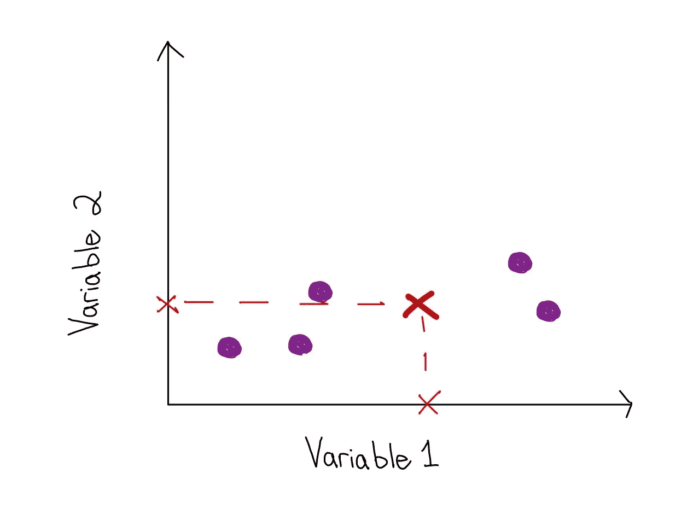

求主成分 1 的第一步是求变量 1 和变量 2 的均值，得到数据的中心。假设我们这样做了，那么我们将确定变量 1 轴上的一个点和变量 2 轴上的一个点，它们都代表该变量所有样本的平均值。

接下来，我们可以画出穿过这两点的假想线。在某一点上，这两条线会有一个交点。这个交叉点是数据的中心。

## 第二步:转移数据

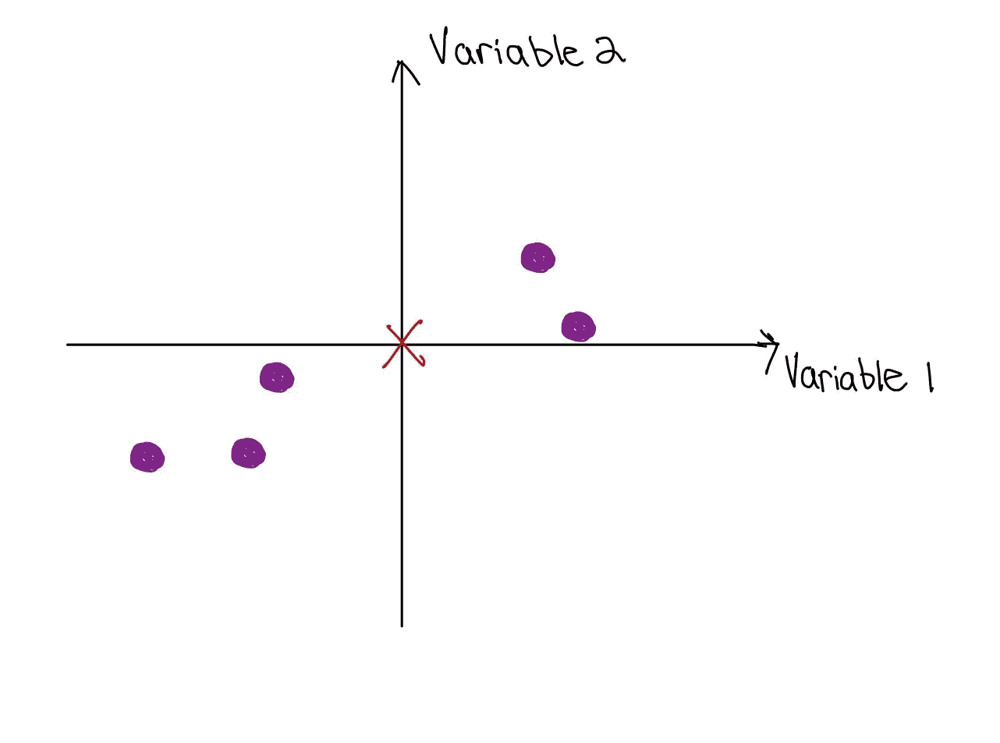

将数据置于原点中心

这里我们将数据集中在原点。请注意，当我们移动数据时，中心会发生变化，但数据点之间的距离保持不变。

## 第三步:找到最符合数据的直线

> 我们首先画一条穿过原点的线。最初，这条线不需要成为“最佳拟合线”这条线必须穿过原点。

这条线最初不需要成为最佳拟合线的原因是，这条线本身只是作为我们的“最佳拟合线”的候选线因此，接下来我们将检查该候选人是否确实是我们要找的人(*是被选中的人吗？)*

> 接下来，我们将原始数据点投影到直线上。

当我说投影时，你可以把它想成是数据点本身被扔在可能的最短路径的线上。而且这条路径永远是在投影点(即橙点)形成直角的路径。

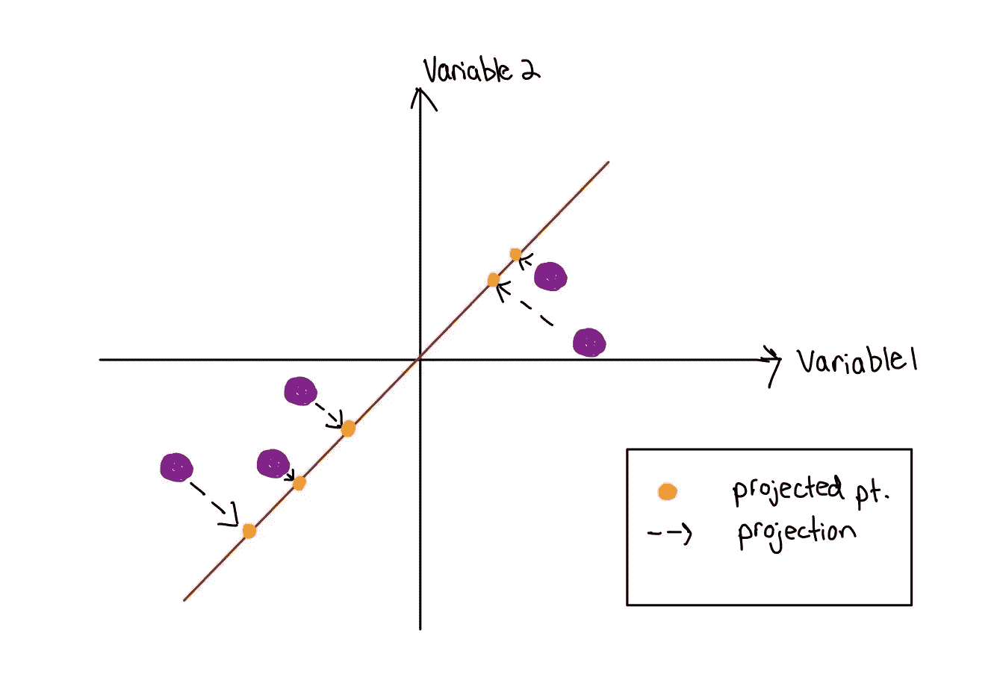

通过原点和投影点画一条线

> 请注意，当我们投影这个点时，形成了一个直角三角形

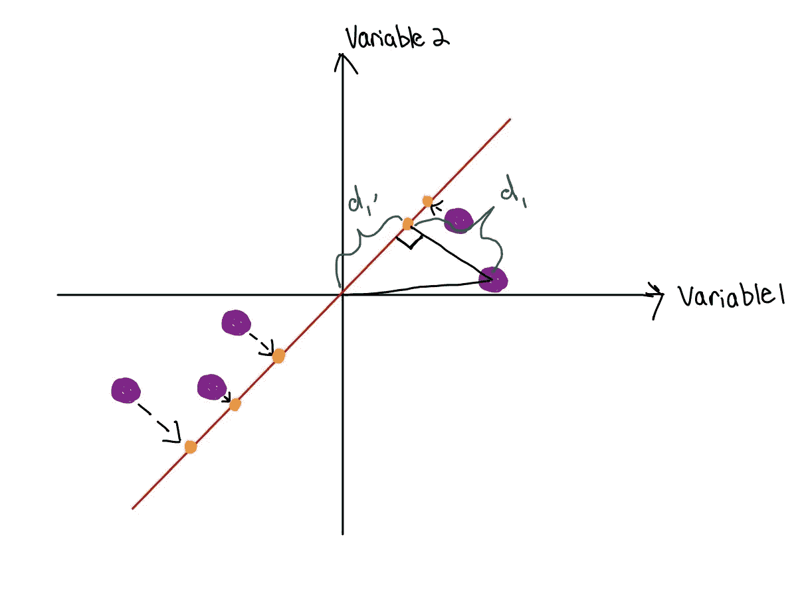

从投影创建的距离

> 现在，我们可以开始确定这条线是否是最佳拟合线！

你可能会想，我们可以最小化 d₁…dₙ距离的平方和来确定它(即，原始紫色数据点到投影橙色点之间的距离)，然后平方，这样负数就不会抵消正数。也许我们可以这样想，因为这类似于我们如何最小化直线和数据点之间的平方距离之和来确定线性回归线的最佳拟合直线。直觉上，这实际上是最容易想象的，也是正确的说法。

然而， **PCA 实际上旨在最大化 d₁'…dn'距离的平方和(即从原点到投影点的距离)。**

> 为什么我们要最大化距离？

直觉上，我们最大化距离以获得最佳拟合线没有太大意义。让我解释一下。

我们确定投影产生一个直角三角形。由于这个概念，我们能够应用勾股定理。

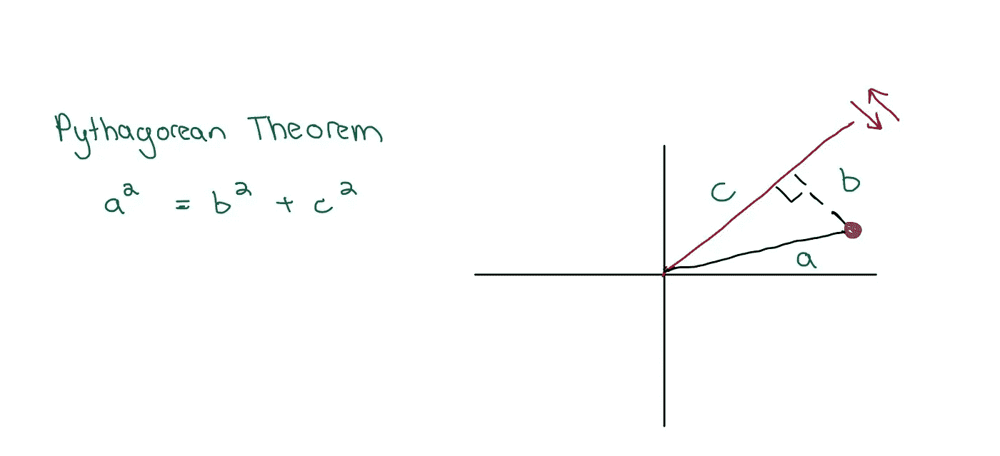

数学直觉

请注意，我之前说过，我们的目标是最小化 d₁…dₙ距离是正确的(在上面的图中，d₁表示为 b)。

现在我们可以说**距离 a 是一个固定值**，因为我们没有移动原始的紫色数据点本身。这意味着勾股定理方程的左边是固定的。我们移动的是穿过原点的红线。因此，如果 **a 是固定值，并且我们正在降低/最小化距离 b，**，那么距离 **c 必须增加/最大化**。所以最大化

我们可以通过等式看出这一点:a 是固定的。如果 b 减少，那么 c 必然增加。

我们可以用图形看到这一点:将直线移近数据点，使 b 最小化，但也使 c 最大化。

因此，可以通过最小化 d₁…dₙ或最大化 d₁'…dₙ'.来确定我们的最佳拟合线 PCA 选择后者，因为后者更容易计算。

> 选择最佳拟合的线检查所有 d₁'…dₙ'的平方距离之和是否最小。所以我们计算 SS(d₁'+d₂'+…+dₙ'的最大值)以获得最佳拟合线。

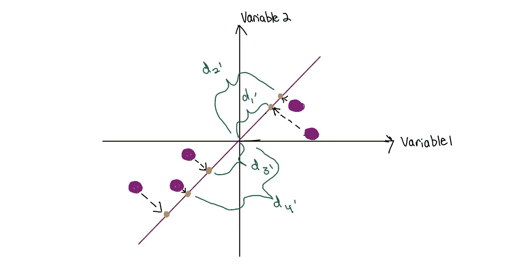

我们认为整个 d₁'+d₂'+…+dₙ'

总之，我们获得了最大 SS(d₁'…dₙ')得到我们的最佳拟合线。由此你实际上了解了什么是主成分 1，什么是主成分 1 的特征值。

> 最佳拟合的红线实际上是我们的主成分 1 或 PC1。
> 
> 2.SS(d₁'…dₙ')实际上是 PC1 的特征值。特征值帮助我们确定在汇总数据时哪些成分是最重要的。

## 步骤 4:检查主成分 1 (PC1)

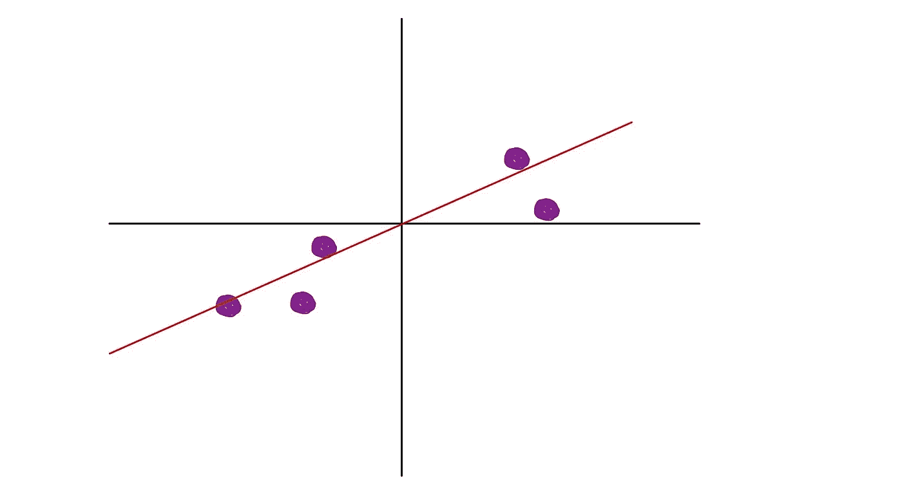

主成分 1

现在我们有了主成分 1，我们可以检查它的一些特征。其中之一是它的斜率。

> 例如，假设主成分 1(如上)的斜率为 0.25。

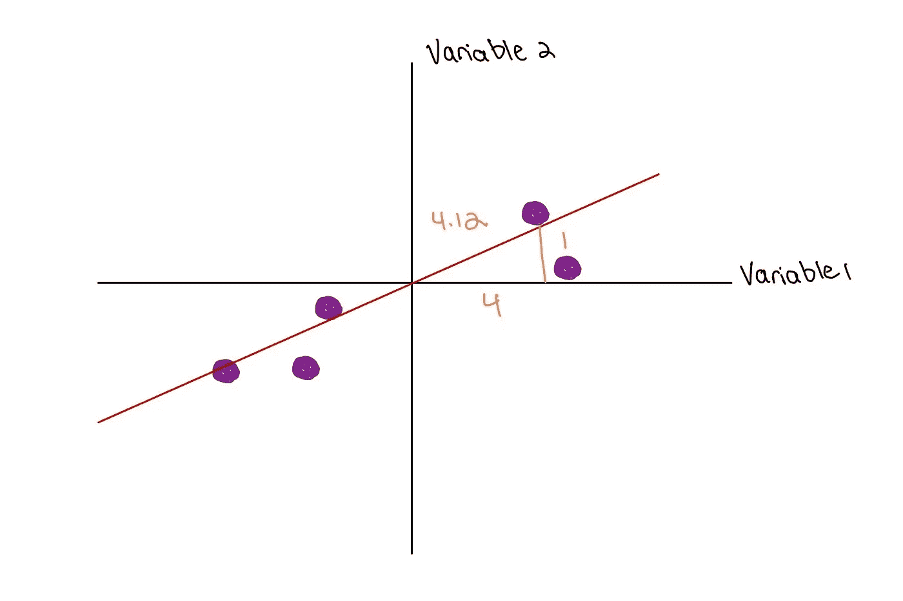

考虑的示例

如果我们考虑到这一点，那么这意味着沿 x 轴(变量 1)增加 4 将使 y 轴值(变量 2)增加 1 个单位。

## 步骤 5:正常化

当我们说“正常化”时这实际上是让斜边的值为 1。

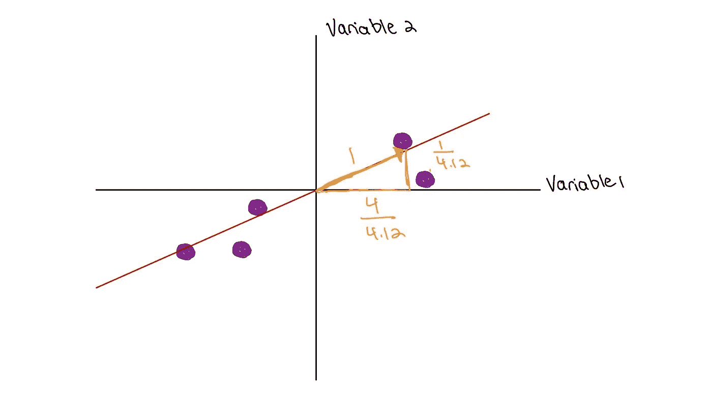

常化

注意，我们现在有一个长度为 1 的向量，它的 x 分量向量的长度为(4/4.12 = 0.97)，它的 y 分量向量的长度为(1/4/12 = 0.242)。

> 这个长度为 1 的“归一化”向量称为本征向量。

## 特征向量有什么重要的？

本征向量给出了两个向量，x 分量向量和 y 分量向量。这两个向量给了我们**加载分数。**在本例中，他们分别取值 0.97 和 0.242。这意味着对 PC1 来说，变量 1 比变量 2 重要 4 倍。

## 第六步:找到主成分 2

> 为了得到 PC 2，我们画一条与 PC 1 正交的线。也就是说我们通过 PC 1 画一条线，形成一个直角。

1.  将点投影到 PC 2 上
2.  然后我们可以得到直线的斜率
3.  归一化向量以获得特征向量
4.  并获得 PC 2 的加载分数

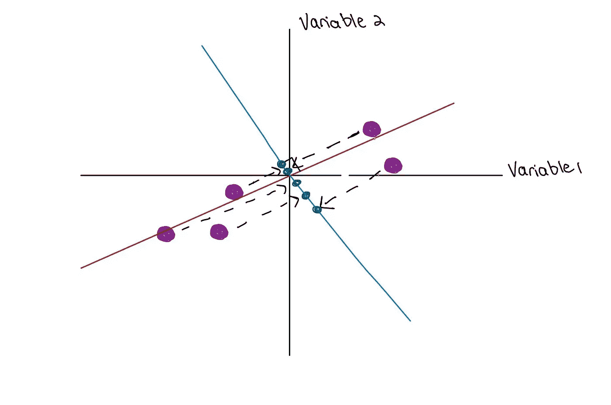

主成分 2

请记住，仍有数据投射到 PC 1 上。所以通过旋转轴，使得 PC 1 是 x 轴，PC 2 是 y 轴。我们得到一个新的坐标系，其中 PC 1 是 x 轴，PC 2 是 y 轴！

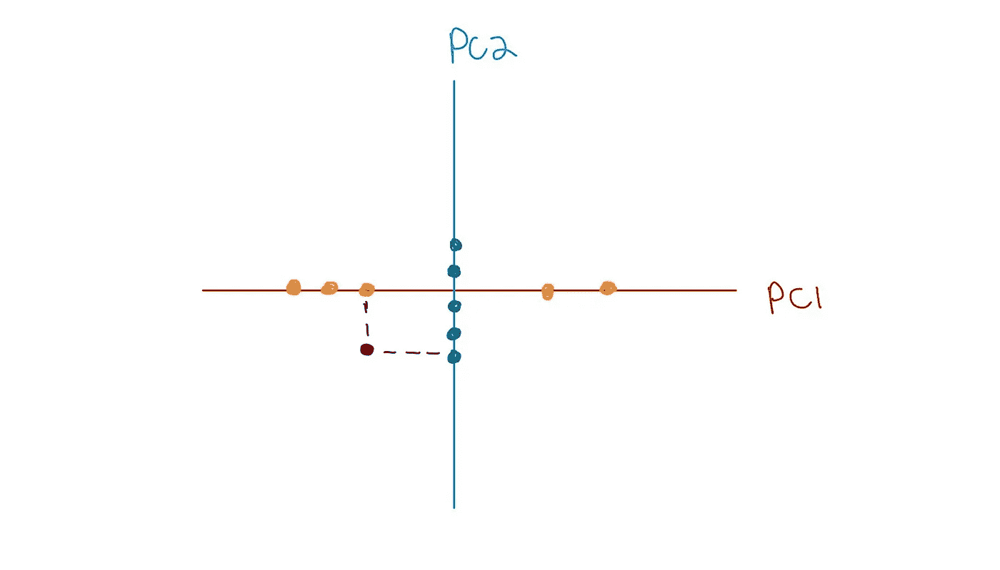

根据主成分创建的新坐标系

我们看到每个数据点都被投影到 PC 1 和 PC 2 上。我们取这两个投影点并获得新点(如上所示)。这给了我们 PC 图。

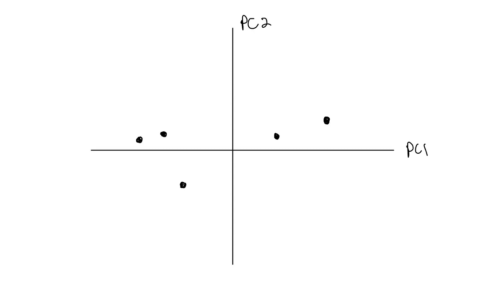

主成分图

## 超越两个变量

我们回顾了两个变量的情况，以便理解 PCA 的幕后发生了什么。如果我们有两个以上的变量。遵循类似的过程，因为后续分量必须与预先存在的主分量正交。

所以当我们有 N 列时，我们可以确定 N 个主成分。但是查看主成分占总变化的多少允许我们选择特定的主成分，直到我们获得令我们满意的总变化捕获阈值。

> 最后提醒

1.  特征值的重要性在于它被用来确定一个主成分占总变化的多少
2.  特征向量的重要性在于允许我们获得负载分数，这有助于我们确定变量相对于特定主成分的重要性

[1]饶彤彤。(2019 年 7 月 20 日)*维度的诅咒*[https://towards data science . com/The-Curse-of-dimensional-50 DC 6 e 49 aa1 e](/the-curse-of-dimensionality-50dc6e49aa1e)