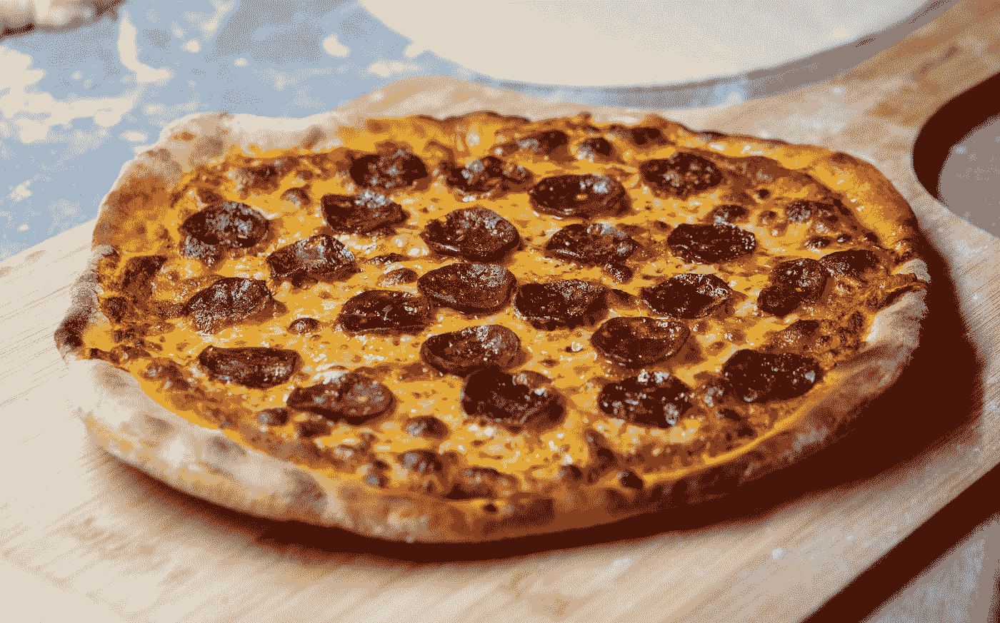
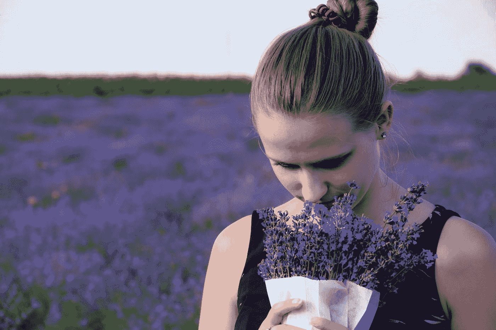
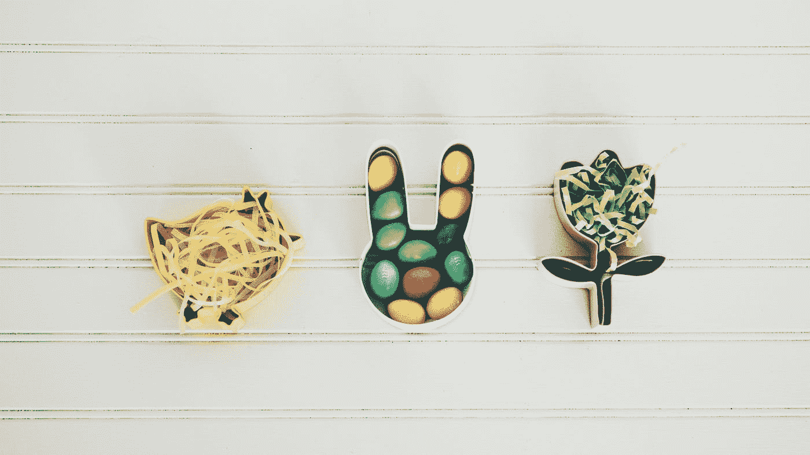
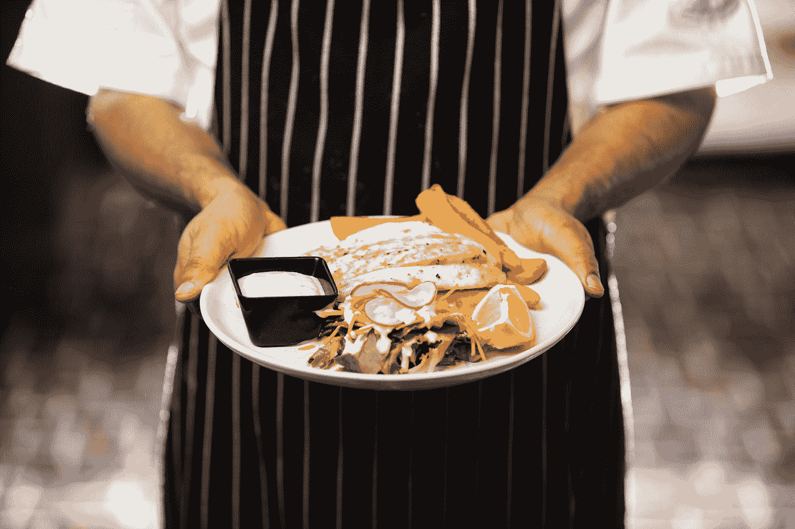

# 打印我的外卖

> 原文：<https://towardsdatascience.com/printing-my-takeout-7abfc28ce415?source=collection_archive---------36----------------------->

## 正如我们所知，3D 打印食品正在改变食品行业！

在 [Unsplash](https://unsplash.com?utm_source=medium&utm_medium=referral) 上由 [amirali mirhashemian](https://unsplash.com/@amir_v_ali?utm_source=medium&utm_medium=referral) 拍摄的照片

这是一个周六的晚上，当你在看你最喜欢的电影时，电视上突然出现了一则美味披萨的广告。面包皮做得非常完美，中间覆盖着一些难以置信的番茄酱。它看起来味道很好，你可以说出一些配料的名字；罗勒、橄榄油和新鲜大蒜均匀分布在这道意大利美食中。最重要的是，人们可以欣赏马苏里拉奶酪在热量的帮助下融化，融合，形成浅棕色的水泡，就像交响乐一样。然后最好的部分是意大利香肠，它比通常的要厚得多，因为它们是直接从他们的祖国意大利进口的。你决定打开电视上的气味扩散器；柴火烤披萨的味道弥漫在房间里，到达你肺部的每一个角落。受够这种折磨了，你想要一个！所以你让 3D 食物打印机给你打印一份，你马上就能品尝到这种美味的食物了。

这听起来可能好得难以置信，但实际上，底层技术已经存在，而且今天就可以买到。今天的技术的唯一问题是它仍然非常粗糙，并且有一些限制，我将在下面解释。因此，我们还需要几年的时间，才能打印出与之前描述的场景类似的美味披萨。

照片由[理查德·艾赛迪](https://unsplash.com/@icsike2?utm_source=medium&utm_medium=referral)在 [Unsplash](https://unsplash.com?utm_source=medium&utm_medium=referral) 拍摄

气味印刷已经存在十多年了。索尼开发了一个系统，该系统使用电子鼻传感器，能够检测和捕捉气味。然后，它使用基于香味的墨水在特殊的明信片大小的照片纸上复制它们。然而，数字气味技术仍然带来许多挑战。我们仍然需要了解哺乳动物的嗅觉，房间里气味的分布是有问题的，合成气味的安全性也是有问题的。

照片由[王思然·哈德森](https://unsplash.com/@hudsoncrafted?utm_source=medium&utm_medium=referral)在 [Unsplash](https://unsplash.com?utm_source=medium&utm_medium=referral) 上拍摄

3D 打印食品是一个完全不同的故事。这些打印机能够使用不同的浆料和材料制作各种菜肴。这份清单包括巧克力、意大利面、糖果等等。使用这种系统的优点很多。

从美学的角度来看，食物可以做成任何想要的复杂形状和形式。事实上，这种打印机为厨师提供了设计的自由，这在传统烹饪技术中是闻所未闻的。食物的美学不仅仅在米其林星级餐厅中很重要。任何有孩子的人都知道，孩子更可能吃恐龙形状的西兰花，而不是传统而乏味的树状西兰花。

健康是另一个关键因素，因为实际食物的成分可以在打印菜肴之前决定。这将有助于人们通过用其他成分替代一些成分来做出更健康的选择，他们也可以插入新的成分来保持类似的味道。这台机器还会记录下生产了什么，并精确记录消耗的卡路里。一些保险公司已经奖励过健康生活方式的人，这种打印机可以为此做出贡献。

但是有些人选择吃特定的食物，而另一些人却没有选择。事实上，面筋的比率和无乳制品的条件(举几个例子)正在上升。有了 3D 打印的食物，对人体有害的成分可以很容易地被排除。这在医院里也是非常重要的，在那里他们每天要做成千上万的饭菜。有了这项技术，膳食可以适应病人的个人营养需求，这将有助于加快恢复。由于一些患者可能会在咀嚼方面遇到困难，因此可以使用更令人愉快的一致性来打印食物，从而提高患者的生活水平。此外，由于这些人中的大多数都在接受药物治疗，将药物融入他们消费的食物中可能更简单，尤其是在与儿童打交道时(他们发现吞咽药物有问题)。

印刷食品也可能有助于我们对抗气候变化。众所周知，大多数食物来源，如肉类、蔬菜等。需要大量的水来生产。正因为如此，我们可以去寻找其他来源，如高蛋白的昆虫，但许多人(尤其是西方人)不愿意尝试。3D 打印机可以迅速将一群蝗虫变成看起来像阿根廷牛排的东西。

食物浪费是这些打印机可能解决的另一个问题。有时，食物仍然适合消费，但只是不够“好”而不能出售。3D 打印将把这些剩菜改造成新的形状，从而使它们更有食欲，并让它们留在食物链中。

彼得·道恩在 [Unsplash](https://unsplash.com?utm_source=medium&utm_medium=referral) 上的照片

正如我们在上面看到的，实验性烹饪的时代正在进入一个全新的不同层次。然而，我们仍然有一些限制。打印效果很好，但食物需要在食用前单独烹饪。最大的挑战很可能是大众接受。3D 打印食品带来了一种新的范式转变，许多人仍然没有为这种行为变化做好准备。对于所使用的成分仍有很多怀疑，在大多数情况下，这些成分并不像天然产品。

这项技术就要问世了，我们在微波炉旁边看到 3D 打印机只是时间问题。一旦我们做到了，只需要下载一份杰米·奥利弗食谱，打印出来，然后在我们最喜欢的电影前吃。

【https://www.businesstoday.com.mt】本文最初发表于**请在下面留下你的想法评论。如果你喜欢这篇文章，请跟我来🐦[推特](https://twitter.com/alexieidingli)，🔗 [LinkedIn](https://www.linkedin.com/in/alexieidingli/) 或者😊[脸书](https://www.facebook.com/alexieidingli/)**

**[**Alexei Dingli**](http://www.dingli.org/)**Prof 是马耳他[大学](https://www.um.edu.mt/)的 AI 教授。二十多年来，他一直在人工智能领域进行研究和工作，协助不同的公司实施人工智能解决方案。他的工作被国际专家评为世界级，并赢得了几个当地和国际奖项(如欧洲航天局、世界知识产权组织和联合国等)。他出版了几本同行评审的出版物，并且是马耳他的一员。由马耳他政府成立的人工智能工作组，旨在使马耳他成为世界上人工智能水平最高的国家之一。****