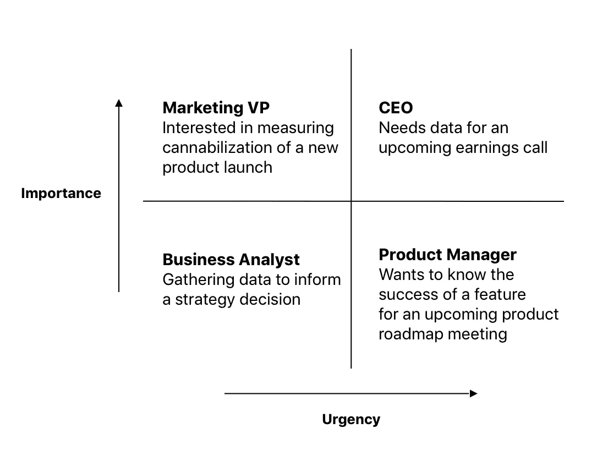
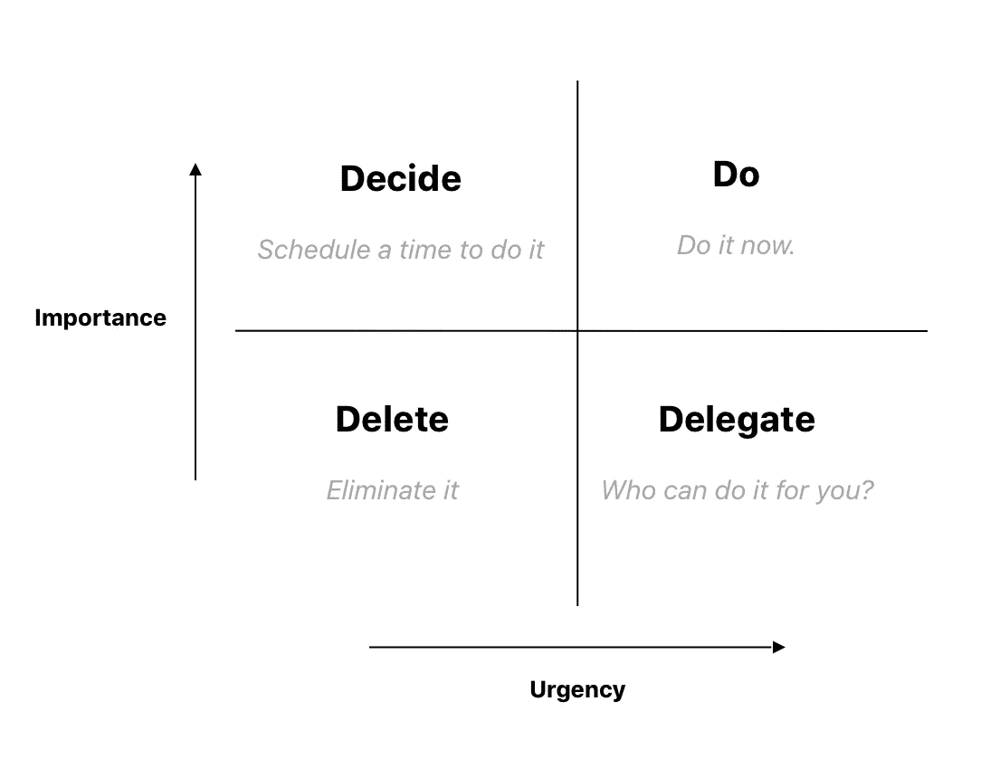

# 使用艾森豪威尔矩阵对请求进行优先级排序

> 原文：<https://towardsdatascience.com/prioritizing-requests-using-the-eisenhower-matrix-2ffc8dba7c8c?source=collection_archive---------31----------------------->

## 数据科学家可以使用艾森豪威尔矩阵来避免简单地接受命令，而是将自己树立为战略顾问

数据科学家必须不断处理短期请求和长期项目之间的紧张关系。忽视长期项目，你可能会受到最小的影响。然而，忽视短期要求，你可能会发现自己失业了。

因此，最好的数据科学家是那些能够在短期需求和长期项目之间有效分配时间的人。在实践中，这可能相当困难，因为利益相关者可能会问很多问题。这些问题中有一些是紧迫而重要的，而另一些则既不重要也不紧迫。

美国前总统德怀特·艾森豪威尔(Dwight Eisenhower)提出了用紧急性和重要性来帮助他确定任务优先级的想法。利用艾森豪威尔矩阵，他能够毫不留情地优先安排自己的一天。

在本文中，我们将探讨这个想法，以及它如何帮助数据科学家专门处理利益相关者的请求。我们将通过有效的策略来处理下面四个象限中的每一个。

1.  **高重要性/高紧迫性**

通常，当您收到这些请求时，其他所有事情都会被搁置。除了对这些类型的请求进行预测和规划之外，这里没有太多的余地。

例如，如果您知道在每个季度末，您负责提取关于业务绩效的数据和评论，您可能会发现自动完成这些工作会有所帮助。发现可自动完成的可重复工作，尤其是具有高度重要性和高度紧迫性的任务，将有助于你树立快速完成目标的信誉。

**2。高重要性/低紧迫性**

当涉及到高重要性和低紧迫性的请求时，你可能会发现自己想要一头扎进去。然而，更谨慎的方法是首先理解你被要求做什么。

通常你可以协商这种类型的要求，并把它们精简到更容易处理的内容。例如，营销主管可能会发送一份详细的数据清单，他们需要这些数据来了解同类相食的影响。现实情况可能是，只需要一两个数据就可以讲述他们想要讲述的故事。

一般来说，对于高重要性和低紧迫性的请求，你应该努力创造一个动态的战略顾问，而不是一个订单接受者。拥有独特的观点并在项目上留下你的印记将确保你在未来的项目中占有一席之地。

由于这是一个低紧急度的请求，您应该使用您的最佳判断来决定是否应该重新安排您当前工作队列的优先级(包括长期项目)。有时，尽管问题很重要，但你可能会发现推迟并设定未来的交付日期会更好。

**3。低重要性/高紧迫性**

仅仅因为事情紧急，并不意味着它很重要。

如果有人在某个日期前需要数据，你不应该为了满足他们的期限而放弃你正在做的一切。特别是当这个请求不重要的时候(与其他请求和你正在努力的长期目标相比较)。

处理这些请求的最好方法是获取更多的信息。有时候，只需要打个 15 分钟的电话，就能意识到提取数据所需的额外工作可能最终只是一张附录幻灯片，永远不会在会议上提出来。在这种情况下，您可以推迟到实际需要数据的时候。

在这种情况下，您可以探索一种轮换模式，在这种模式下，您团队中的每个成员对这些类型的请求“随叫随到”。

**4。低重要性/低紧迫性**

最后，也是最棘手的象限是那些低重要性和低紧急性的请求。在艾森豪威尔模型中，我们将简单地“消除”这些任务。在公司环境中，你必须更加小心地回应这类请求。

推迟这类任务的一个简单方法是让涉众先做一些工作。可能是一些尖锐的问题，要求他们在你开始提取任何数据之前做一些跑腿的工作。这要么会为你赢得时间，要么如果要求一开始就不那么重要，他们可能会失去动力。

你也可以尝试推迟工作的交付，传达你当前的优先事项列表，让利益相关者知道一旦事情稳定下来，他们应该在一两周内与你跟进。关键是永远不要直截了当地说不，而是传达你的优先事项列表，以帮助利益相关者理解此时你回答他们的问题可能会有困难。

从长远来看，这类问题可能会暴露出创建自助服务选项的需求。一个好的经验法则是，每当你被要求三次更新分析，或者提取数据来回答类似的问题时，你应该探索一种仪表板或自动化的解决方案。

*原艾森豪威尔矩阵*

所以下次你在邮件中收到请求时，考虑一下它属于四个象限中的哪一个。这样做之后，您就可以采取相应的措施了。你不可避免地会犯一些错误，但如果你只是做一名订单接受者，试图让所有的利益相关者都满意，那么你作为一名数据科学家的影响力就会减弱。