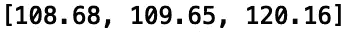
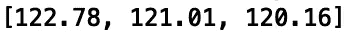
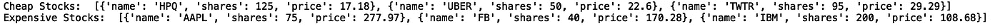
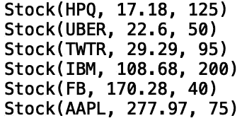

# Python 中的优先级队列

> 原文：<https://towardsdatascience.com/priority-queues-in-python-3baf0bac2097?source=collection_archive---------12----------------------->

## 优先级队列的堆实现


[来源](https://www.pexels.com/photo/person-in-black-sweater-hold-a-grey-road-bike-122477/)

优先级队列是一种类似于普通队列或堆栈的数据结构，但是每个元素都有一个相关的优先级。具有高优先级的元素在较低优先级的元素之前被服务。优先级队列通常使用堆数据结构来实现。

在本帖中，我们将讨论使用堆数据结构在 python 中实现优先级队列。

我们开始吧！

在构建‘priority queue’类之前，有必要熟悉一下 python‘heapq’模块。首先，让我们导入“heapq”模块:

```
import heapq
```

假设我们有一个 IBM 的历史价格列表:

```
ibm_prices = [108.68, 109.65, 121.01, 122.78, 120.16]
```

如果我们想得到 T2 的最低或最高价格，我们可以使用。nsmallest()'和'。nlargest()”方法。要获得三个最低价格，我们可以做以下事情:

```
print(heapq.nsmallest(3, ibm_prices))
```



对于三个最高的价格:

```
print(heapq.nlargest(3, ibm_prices))
```



让事情变得更有趣一点，假设我们有一个科技公司股票的投资组合:

```
portfolio = [
       {'name': 'IBM', 'shares': 200, 'price': 108.68},
       {'name': 'AAPL', 'shares': 75, 'price': 277.97},
       {'name': 'FB', 'shares': 40, 'price': 170.28},
       {'name': 'HPQ', 'shares':125, 'price': 17.18},
       {'name': 'UBER', 'shares': 50, 'price': 22.60},
       {'name': 'TWTR', 'shares': 95, 'price': 29.29}
]
```

我们可以使用。nsmallest()'和'。nlargest()'来分别拉最便宜和最贵的股票:

```
cheap_stocks = heapq.nsmallest(3, portfolio, key=lambda s: s['price'])
expensive_stocks = heapq.nlargest(3, portfolio, key=lambda s: s['price'])
```

让我们打印结果:

```
print("Cheap Stocks: ", cheap_stocks)
print("Expensive Stocks: ", expensive_stocks)
```



这些函数提供了卓越的性能，尤其是当 *N* 元素(最大或最小)的大小与整个集合相比很小时。

现在我们可以构建我们的优先级队列类了。让我们使用“heapq”模块创建一个优先级队列类。首先，我们创建初始化方法:

```
class PriorityQueue:
    def __init__(self):
        self._queue = []
        self._index = 0
```

让我们定义一个方法来检查队列是否为空:

```
class PriorityQueue:
    ...
    def is_empty(self):
        return not self._queue
```

接下来，让我们定义一个方法，允许我们将对象推入我们的优先级队列。我们采用“heappush”方法，该方法将获取优先级和项目值:

```
class PriorityQueue:
    ...
    def push(self, item, priority):
        heapq.heappush(self._queue, (priority, self._index, item))
        self._index += 1
```

最后，我们将添加一个方法，让我们使用“heappop”方法从优先级队列中删除元素:

```
class PriorityQueue:
    ...
    def pop(self):
        return heapq.heappop(self._queue)[-1]
```

接下来让我们定义一个名为 Stock 的类，我们将用它来演示优先级队列类的用法。该类将有一个“__init__”方法，让我们初始化股票价格、股份和报价器的值:

```
class Stock:
    def __init__(self, stock_ticker, stock_price, stock_share):
        self.stock_ticker = stock_ticker
        self.stock_price = stock_price
        self.stock_share = stock_share
```

我们还可以定义一个方法，允许我们打印类属性的表示:

```
class Stock:
    ...
    def __repr__(self):
        return 'Stock({}, {}, {})'.format(self.stock_ticker ,   self.stock_price,  self.stock_share)
```

现在我们准备初始化我们的优先级队列并添加项目:

```
q = PriorityQueue()
```

让我们将初始投资组合中的股票属性添加到优先级队列中。我们将优先考虑便宜的股票:

```
q.push(Stock('IBM', 108.68, 200), 4)
q.push(Stock('HPQ', 17.18, 125), 1)
q.push(Stock('TWTR', 29.29, 95), 3)
q.push(Stock('UBER', 22.6, 50), 2)
q.push(Stock('AAPL', 277.97, 75), 6)
q.push(Stock('FB', 170.28, 40), 5)
```

现在让我们打印优先级队列中的项目:

```
while not q.is_empty():
    print(q.pop())
```



我将在这里停下来，但是您可以随意使用优先级队列的堆实现。此外，您可以尝试使用普通列表或链表来构建优先级队列。您可以在这里找到 python 中其他优先级队列实现的一些例子。我希望你觉得这篇文章有用/有趣。这篇文章的代码可以在 [GitHub](https://github.com/spierre91/medium_data_structures_and_algorithms/upload) 上找到。感谢您的阅读！